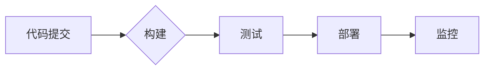

> CI/CD, 自动化测试, 持续集成, 持续交付, DevOps, 构建自动化, 测试自动化, 代码质量, 效率提升

## 1. 背景介绍

在当今软件开发领域，速度和效率至关重要。传统的软件开发流程往往冗长且容易出错，而CI/CD（持续集成和持续交付）模式则为软件开发带来了革命性的改变。CI/CD是一种开发和部署软件的自动化流程，旨在提高软件开发效率、降低错误率和缩短交付周期。

自动化测试是CI/CD流程的核心组成部分。通过自动化测试，我们可以快速、可靠地验证软件代码的质量，确保软件功能正确、稳定可靠。

## 2. 核心概念与联系

**2.1 CI/CD流程概述**

CI/CD流程通常包含以下几个关键步骤：

* **代码提交:** 开发人员将代码提交到版本控制系统（如Git）。
* **构建:** 构建系统自动构建代码，生成可执行文件或软件包。
* **测试:** 自动化测试工具执行各种测试用例，验证代码质量。
* **部署:** 将构建好的软件部署到测试环境、生产环境或其他目标环境。
* **监控:** 持续监控软件运行状态，及时发现和解决问题。

**2.2 CI/CD与自动化测试的关系**

自动化测试是CI/CD流程中不可或缺的一部分。自动化测试可以帮助我们：

* **提高测试覆盖率:** 自动化测试可以执行大量的测试用例，覆盖更广泛的代码范围。
* **缩短测试时间:** 自动化测试可以快速执行测试用例，节省大量时间。
* **提高测试准确性:** 自动化测试可以避免人为错误，提高测试结果的准确性。
* **提供持续反馈:** 自动化测试可以及时反馈测试结果，帮助开发人员快速发现和解决问题。

**2.3 CI/CD流程图**



## 3. 核心算法原理 & 具体操作步骤

**3.1 算法原理概述**

自动化测试的算法原理主要基于以下几个方面：

* **测试用例设计:** 设计测试用例是自动化测试的基础。测试用例需要全面覆盖软件功能，并能够有效验证软件的正确性。
* **测试框架:** 测试框架提供自动化测试的运行环境和工具支持。常见的测试框架包括JUnit、TestNG、Selenium等。
* **测试脚本编写:** 测试脚本是自动化测试的核心，它定义了测试用例的执行步骤和预期结果。
* **测试结果分析:** 测试结果分析是自动化测试的重要环节，它可以帮助我们了解测试结果的质量，并找出需要改进的地方。

**3.2 算法步骤详解**

1. **需求分析:** 首先需要对软件功能进行详细分析，确定需要测试的范围和目标。
2. **测试用例设计:** 根据需求分析结果，设计测试用例，包括测试步骤、预期结果和测试数据。
3. **测试框架选择:** 选择合适的测试框架，根据项目需求和技术环境进行选择。
4. **测试脚本编写:** 使用测试框架的API编写测试脚本，实现测试用例的自动化执行。
5. **测试执行:** 执行测试脚本，收集测试结果。
6. **测试结果分析:** 分析测试结果，找出缺陷和问题，并进行修复。
7. **测试报告生成:** 生成测试报告，记录测试过程和结果。

**3.3 算法优缺点**

**优点:**

* 提高测试效率
* 提高测试覆盖率
* 降低测试成本
* 提高测试准确性

**缺点:**

* 需要一定的开发成本
* 需要维护测试脚本
* 难以测试所有场景

**3.4 算法应用领域**

自动化测试广泛应用于各个软件开发领域，例如：

* Web应用测试
* 移动应用测试
* API测试
* 数据库测试
* 安全测试

## 4. 数学模型和公式 & 详细讲解 & 举例说明

**4.1 数学模型构建**

在自动化测试中，我们可以使用数学模型来描述测试覆盖率、测试效率等指标。例如，我们可以使用以下公式来计算测试覆盖率：

```latex
测试覆盖率 = 被测试代码量 / 总代码量
```

**4.2 公式推导过程**

该公式的推导过程如下：

* 被测试代码量：指通过自动化测试用例执行覆盖到的代码行数。
* 总代码量：指软件项目中所有代码行数。

**4.3 案例分析与讲解**

假设一个软件项目包含1000行代码，通过自动化测试用例执行覆盖了800行代码，则该项目的测试覆盖率为：

```latex
测试覆盖率 = 800 / 1000 = 0.8 = 80%
```

## 5. 项目实践：代码实例和详细解释说明

**5.1 开发环境搭建**

为了进行自动化测试实践，我们需要搭建一个开发环境。开发环境通常包含以下几个组件：

* 操作系统
* JDK
* Maven/Gradle
* 测试框架（如JUnit、TestNG）
* 浏览器驱动程序（如ChromeDriver）

**5.2 源代码详细实现**

以下是一个使用JUnit框架进行自动化测试的代码示例：

```java
import org.junit.Test;
import static org.junit.Assert.*;

public class CalculatorTest {

    @Test
    public void testAdd() {
        Calculator calculator = new Calculator();
        int result = calculator.add(2, 3);
        assertEquals(5, result);
    }

    @Test
    public void testSubtract() {
        Calculator calculator = new Calculator();
        int result = calculator.subtract(5, 2);
        assertEquals(3, result);
    }
}
```

**5.3 代码解读与分析**

这段代码定义了一个名为`CalculatorTest`的测试类，其中包含两个测试方法：`testAdd`和`testSubtract`。

* `@Test`注解标识这是一个测试方法。
* `assertEquals`方法用于断言两个值是否相等。

**5.4 运行结果展示**

运行这段测试代码后，测试框架会执行测试方法，并根据测试结果生成测试报告。如果测试通过，则报告会显示测试通过的信息；如果测试失败，则报告会显示测试失败的原因。

## 6. 实际应用场景

CI/CD和自动化测试在软件开发领域有着广泛的应用场景，例如：

* **电商平台:** 自动化测试可以确保电商平台的稳定性和可靠性，保障用户体验。
* **金融系统:** 金融系统对安全性要求极高，自动化测试可以帮助金融机构发现和修复潜在的安全漏洞。
* **游戏开发:** 游戏开发需要快速迭代和测试，自动化测试可以帮助游戏开发团队提高开发效率。

**6.4 未来应用展望**

随着人工智能和机器学习技术的不断发展，CI/CD和自动化测试将更加智能化和自动化。未来，我们可以期待以下应用场景：

* **智能测试用例生成:** 利用机器学习算法自动生成测试用例，提高测试覆盖率。
* **自愈式测试:** 利用人工智能技术自动修复测试用例中的错误，提高测试稳定性。
* **预测性测试:** 利用机器学习算法预测软件缺陷，提前进行修复。

## 7. 工具和资源推荐

**7.1 学习资源推荐**

* **书籍:**
    * 《Continuous Delivery》 by Jez Humble and David Farley
    * 《The Phoenix Project》 by Gene Kim, Kevin Behr, and George Spafford
* **在线课程:**
    * Udemy: CI/CD with Jenkins
    * Coursera: DevOps Fundamentals

**7.2 开发工具推荐**

* **构建工具:** Maven, Gradle
* **持续集成工具:** Jenkins, GitLab CI, CircleCI
* **持续交付工具:** Docker, Kubernetes
* **测试框架:** JUnit, TestNG, Selenium

**7.3 相关论文推荐**

* **Continuous Integration and Continuous Delivery: A Systematic Mapping Study**
* **DevOps: A Systematic Literature Review**

## 8. 总结：未来发展趋势与挑战

**8.1 研究成果总结**

CI/CD和自动化测试已经成为现代软件开发的必备技术，它可以帮助软件开发团队提高开发效率、降低错误率和缩短交付周期。

**8.2 未来发展趋势**

未来，CI/CD和自动化测试将更加智能化和自动化，并与人工智能、机器学习等新技术深度融合。

**8.3 面临的挑战**

* **技术复杂性:** CI/CD和自动化测试涉及多种技术，需要开发人员具备较高的技术水平。
* **文化转变:** CI/CD需要改变传统的软件开发模式，需要组织内部进行文化转变。
* **安全风险:** 自动化测试可能会引入新的安全风险，需要加强安全防护措施。

**8.4 研究展望**

未来，我们需要继续研究和探索CI/CD和自动化测试的新技术和应用场景，以更好地满足软件开发的需求。

## 9. 附录：常见问题与解答

**9.1 如何选择合适的CI/CD工具？**

选择合适的CI/CD工具需要根据项目的具体需求和技术环境进行选择。

**9.2 如何提高自动化测试的覆盖率？**

可以通过以下方法提高自动化测试的覆盖率：

* 设计更全面的测试用例
* 使用代码覆盖率分析工具
* 编写更灵活的测试脚本

**9.3 如何解决自动化测试遇到的问题？**

遇到自动化测试问题时，可以参考以下方法：

* 查阅测试框架的文档
* 搜索在线论坛
* 寻求技术支持

作者：禅与计算机程序设计艺术 / Zen and the Art of Computer Programming


<end_of_turn>