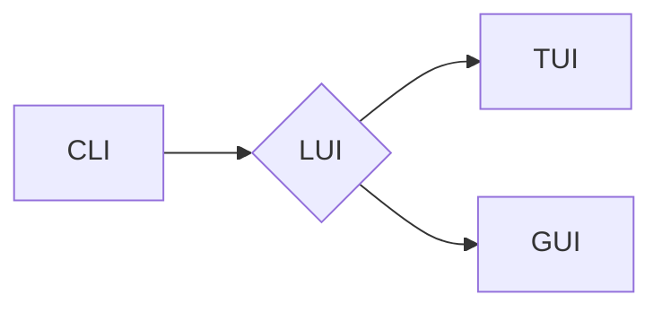

> CUI, LUI, GUI, 人机交互, 用户体验, 软件设计, 界面设计, 历史发展, 未来趋势

## 1. 背景介绍

随着计算机技术的发展，人机交互方式也经历了从命令行界面 (CLI) 到图形用户界面 (GUI) 的演变。在这一过程中，文本用户界面 (TUI) 和语音用户界面 (VUI) 等其他交互方式也逐渐涌现。本文将重点探讨 CUI、LUI 和 GUI 的关系及其对软件设计和用户体验的影响。

## 2. 核心概念与联系

**2.1 CUI (命令行界面)**

CUI 是最早的人机交互方式之一，用户通过输入文本命令来控制计算机。CUI 的优点是简洁高效，对系统资源占用较低，但学习曲线陡峭，操作复杂，难以满足普通用户的需求。

**2.2 LUI (本地用户界面)**

LUI 是指在本地计算机上运行的用户界面，它可以是基于文本的 TUI，也可以是基于图形的 GUI。LUI 的特点是用户体验直接依赖于本地计算机的硬件和软件环境。

**2.3 GUI (图形用户界面)**

GUI 是目前最流行的人机交互方式之一，它使用图形元素，如图标、按钮和菜单，来提供直观易用的操作体验。GUI 的优点是操作简单，易于学习，能够提供丰富的用户体验，但对系统资源占用较高。

**2.4 关系图**



**2.5 联系分析**

CUI 是 LUI 的前身，LUI 包含了 CUI 和 GUI 等多种交互方式。GUI 是 LUI 的一种发展方向，它基于图形化元素，提供更直观易用的操作体验。

## 3. 核心算法原理 & 具体操作步骤

**3.1 算法原理概述**

GUI 的核心算法原理主要包括事件处理、图形渲染和用户交互。

* **事件处理:** GUI 系统会监听用户的操作，如鼠标点击、键盘输入等，并将这些操作转换为事件。事件处理机制负责处理这些事件，并执行相应的操作。
* **图形渲染:** GUI 系统需要将图形元素绘制到屏幕上。图形渲染算法负责将图形数据转换为像素数据，并将其显示在屏幕上。
* **用户交互:** GUI 系统需要提供用户交互机制，以便用户可以与应用程序进行交互。例如，用户可以通过鼠标点击按钮、输入文本框等操作来与应用程序进行交互。

**3.2 算法步骤详解**

1. **事件监听:** GUI 系统会监听用户的操作，如鼠标点击、键盘输入等。
2. **事件处理:** 当用户进行操作时，GUI 系统会将操作转换为事件，并将其传递给相应的事件处理函数。
3. **事件处理函数执行:** 事件处理函数负责处理事件，并执行相应的操作。例如，当用户点击按钮时，事件处理函数会执行按钮对应的操作。
4. **图形渲染:** GUI 系统会根据事件处理结果，更新图形元素的状态，并将其重新绘制到屏幕上。

**3.3 算法优缺点**

* **优点:** 操作简单，易于学习，能够提供丰富的用户体验。
* **缺点:** 对系统资源占用较高，复杂度较高。

**3.4 算法应用领域**

GUI 广泛应用于各种软件应用程序，例如操作系统、办公软件、游戏等。

## 4. 数学模型和公式 & 详细讲解 & 举例说明

**4.1 数学模型构建**

GUI 系统的交互行为可以抽象为一个状态机模型。状态机由状态和转换规则组成。每个状态代表 GUI 系统的当前状态，转换规则描述了在特定事件发生时，GUI 系统如何从一个状态转换到另一个状态。

**4.2 公式推导过程**

状态机的转换规则可以用数学公式来表示。例如，假设 GUI 系统有三个状态：初始状态 (Idle)、鼠标悬停状态 (Hover) 和鼠标点击状态 (Click)。

* 当鼠标悬停在按钮上时，GUI 系统会从初始状态转换到鼠标悬停状态。
* 当用户点击按钮时，GUI 系统会从鼠标悬停状态转换到鼠标点击状态。

这些转换规则可以用数学公式来表示：

```
Idle -> Hover  if mouse_over_button
Hover -> Click if mouse_click
```

**4.3 案例分析与讲解**

例如，在网页浏览器中，当用户点击一个链接时，浏览器会从当前页面状态转换到链接指向的页面状态。

## 5. 项目实践：代码实例和详细解释说明

**5.1 开发环境搭建**

本示例使用 Python 和 Tkinter 库开发一个简单的 GUI 应用。

**5.2 源代码详细实现**

```python
import tkinter as tk

def button_click():
    print("Button clicked!")

root = tk.Tk()
root.title("Simple GUI App")

button = tk.Button(root, text="Click Me", command=button_click)
button.pack()

root.mainloop()
```

**5.3 代码解读与分析**

* `import tkinter as tk`: 导入 Tkinter 库，用于创建 GUI 应用。
* `def button_click():`: 定义一个函数，用于处理按钮点击事件。
* `root = tk.Tk()`: 创建主窗口。
* `root.title("Simple GUI App")`: 设置窗口标题。
* `button = tk.Button(root, text="Click Me", command=button_click)`: 创建一个按钮，文本为 "Click Me"，点击事件绑定到 `button_click` 函数。
* `button.pack()`: 将按钮添加到窗口中。
* `root.mainloop()`: 启动主事件循环，处理用户事件。

**5.4 运行结果展示**

运行代码后，将弹出一个窗口，包含一个按钮。点击按钮，将打印 "Button clicked!" 到控制台。

## 6. 实际应用场景

GUI 应用广泛应用于各种领域，例如：

* **操作系统:** Windows、macOS、Linux 等操作系统都使用 GUI 来提供用户交互界面。
* **办公软件:** Microsoft Office、Google Docs 等办公软件都使用 GUI 来提供用户操作界面。
* **游戏:** 游戏通常使用 GUI 来显示游戏界面、菜单和游戏状态。
* **科学计算:** 科学计算软件也使用 GUI 来提供用户交互界面，例如 MATLAB、Python 的 Jupyter Notebook 等。

## 7. 工具和资源推荐

**7.1 学习资源推荐**

* **书籍:**
    * "Python GUI Programming with Tkinter" by Michael Dawson
    * "GUI Programming with Python" by John Paul Mueller
* **在线课程:**
    * Coursera: "Python for Everybody Specialization"
    * Udemy: "Complete Python Bootcamp: Go from zero to hero in Python 3"

**7.2 开发工具推荐**

* **Tkinter:** Python 的内置 GUI 库。
* **PyQt:** 基于 Qt 框架的 Python GUI 库。
* **Kivy:** 跨平台的 Python GUI 库。

**7.3 相关论文推荐**

* "The Evolution of User Interfaces" by Alan Cooper
* "Designing for Interaction" by Jennifer Tidwell

## 8. 总结：未来发展趋势与挑战

**8.1 研究成果总结**

GUI 技术已经发展到相当成熟的阶段，但仍有许多挑战和机遇。

**8.2 未来发展趋势**

* **更自然的用户交互:** 未来 GUI 将更加注重自然语言处理和语音识别等技术，提供更自然的用户交互体验。
* **增强现实 (AR) 和虚拟现实 (VR) 融合:** AR 和 VR 技术将与 GUI 融合，提供更加沉浸式的用户体验。
* **跨平台和跨设备:** 未来 GUI 将更加注重跨平台和跨设备的兼容性，用户可以在任何设备上获得一致的用户体验。

**8.3 面临的挑战**

* **用户体验设计:** 随着 GUI 技术的不断发展，如何设计出更加人性化、易用且美观的界面仍然是一个挑战。
* **跨平台兼容性:** 不同平台和设备的硬件和软件环境差异较大，如何保证 GUI 的跨平台兼容性是一个难题。
* **安全性:** GUI 系统容易受到攻击，如何保证 GUI 系统的安全性是一个重要的挑战。

**8.4 研究展望**

未来 GUI 研究将更加注重用户体验、自然交互、跨平台兼容性和安全性等方面。


## 9. 附录：常见问题与解答

**9.1 如何选择合适的 GUI 库？**

选择合适的 GUI 库取决于项目的具体需求和开发者的经验。

* **Tkinter:** Python 的内置 GUI 库，简单易用，适合初学者。
* **PyQt:** 基于 Qt 框架的 Python GUI 库，功能强大，适合开发复杂应用程序。
* **Kivy:** 跨平台的 Python GUI 库，支持触摸屏和多点触控，适合开发移动应用程序。

**9.2 如何设计一个好的 GUI？**

设计一个好的 GUI 需要考虑以下因素：

* **用户体验:** GUI 应该易于使用，直观易懂，并提供良好的用户体验。
* **美观:** GUI 应该美观大方，符合用户的审美需求。
* **功能性:** GUI 应该能够满足用户的需求，提供所需的全部功能。
* **可维护性:** GUI 应该易于维护和更新。

**9.3 如何解决 GUI 跨平台兼容性问题？**

可以使用跨平台 GUI 库，例如 Kivy，来解决跨平台兼容性问题。

作者：禅与计算机程序设计艺术 / Zen and the Art of Computer Programming


<end_of_turn>