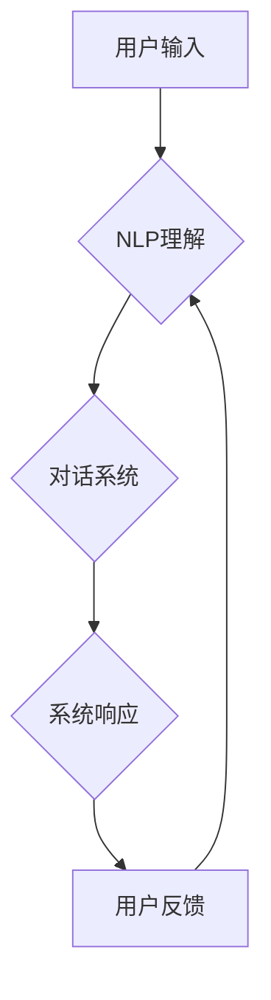

> CUI, 数字产品, 人机交互, 自然语言处理, 虚拟现实, 增强现实, 未来趋势

## 1. 背景介绍

随着数字技术的飞速发展，人机交互方式也发生了深刻变化。传统的图形用户界面（GUI）已经无法满足用户日益增长的个性化需求和交互体验。基于此背景，新的交互方式——命令行界面（CLI）和自然语言界面（NUI）逐渐崭露头角。其中，CUI（Conversational User Interface，对话式用户界面）作为一种融合了CLI和NUI的交互方式，凭借其更自然、更直观、更智能的特点，在数字产品领域展现出广阔的应用前景。

CUI的核心思想是通过自然语言与用户进行对话，理解用户的意图，并提供相应的服务或操作。它打破了传统的命令式交互模式，使用户能够用更接近自然语言的方式与系统进行交互，从而提升用户体验和效率。

## 2. 核心概念与联系

CUI的核心概念包括：

* **自然语言处理（NLP）：** CUI依赖于NLP技术来理解用户的自然语言输入，识别用户的意图和实体，并将其转换为系统可理解的指令。
* **对话系统：** CUI构建在对话系统之上，通过一系列的对话交互来引导用户完成任务或获取信息。
* **机器学习（ML）：** CUI通常采用机器学习算法来训练对话模型，提高其理解用户意图和生成自然语言回复的能力。

**Mermaid 流程图**



## 3. 核心算法原理 & 具体操作步骤

### 3.1  算法原理概述

CUI的核心算法原理主要包括：

* **词性标注：** 将用户输入的文本中的每个词标记其词性，例如名词、动词、形容词等，为后续的语义分析提供基础。
* **依存句法分析：** 分析句子中词语之间的依存关系，构建句子的语法结构，帮助理解句子的语义。
* **命名实体识别：** 从文本中识别出特定类型的实体，例如人名、地名、机构名等，为后续的知识图谱构建和信息抽取提供数据。
* **意图分类：** 根据用户的输入文本，识别用户的意图，例如查询信息、完成任务、获取帮助等。
* **槽位填充：** 识别用户的意图后，进一步识别出用户需要的信息，例如查询的具体内容、任务的具体操作等。

### 3.2  算法步骤详解

CUI的具体操作步骤如下：

1. **用户输入：** 用户通过自然语言输入指令或问题。
2. **文本预处理：** 对用户输入的文本进行预处理，例如去除停用词、规范化词语等，提高后续算法的效率和准确性。
3. **词性标注和依存句法分析：** 对预处理后的文本进行词性标注和依存句法分析，构建句子的语法结构和语义关系。
4. **命名实体识别：** 从文本中识别出特定类型的实体，例如人名、地名、机构名等。
5. **意图分类：** 根据用户的输入文本和识别出的实体，分类用户的意图。
6. **槽位填充：** 识别用户的意图后，进一步识别出用户需要的信息，例如查询的具体内容、任务的具体操作等。
7. **系统响应：** 根据用户的意图和槽位信息，系统生成相应的回复，并通过自然语言与用户进行对话。

### 3.3  算法优缺点

**优点：**

* **自然流畅：** 用户可以使用自然语言与系统交互，更加直观、易用。
* **智能化程度高：** CUI可以理解用户的复杂意图，并提供个性化的服务。
* **跨平台适用：** CUI可以应用于各种平台，例如手机、电脑、智能家居等。

**缺点：**

* **技术难度高：** CUI的开发需要整合多种技术，例如NLP、对话系统、机器学习等，技术难度较高。
* **数据依赖性强：** CUI的训练需要大量的语料数据，数据质量直接影响CUI的性能。
* **安全风险：** CUI可能存在安全风险，例如用户隐私泄露、恶意攻击等。

### 3.4  算法应用领域

CUI在以下领域具有广泛的应用前景：

* **智能客服：** CUI可以构建智能客服系统，自动回答用户常见问题，提高客服效率。
* **虚拟助理：** CUI可以构建虚拟助理，帮助用户完成各种任务，例如日程安排、信息查询、设备控制等。
* **教育培训：** CUI可以构建个性化教育平台，根据用户的学习进度和需求提供定制化的学习内容。
* **医疗保健：** CUI可以构建医疗诊断系统，帮助医生更快、更准确地诊断疾病。

## 4. 数学模型和公式 & 详细讲解 & 举例说明

### 4.1  数学模型构建

CUI的数学模型主要基于概率论和统计学，例如：

* **隐马尔可夫模型（HMM）：** 用于语音识别和自然语言处理，可以用来建模对话系统的状态转换和输出概率。
* **条件随机场（CRF）：** 用于序列标注任务，例如词性标注和依存句法分析，可以用来建模文本的语义关系。
* **深度神经网络（DNN）：** 用于自然语言理解和生成，可以用来训练更强大的对话模型。

### 4.2  公式推导过程

例如，使用HMM模型进行语音识别，可以推导出以下公式：

* **状态转移概率：** P(q_t | q_{t-1})，表示在时间t状态为q_t的概率，给定时间t-1状态为q_{t-1}。
* **观测概率：** P(o_t | q_t)，表示在时间t状态为q_t时，观测到观测值o_t的概率。
* **最优路径概率：** P(O|Q)，表示给定观测序列O，找到最优状态序列Q的概率。

### 4.3  案例分析与讲解

例如，使用CRF模型进行词性标注，可以将每个词标记为其对应的词性，例如名词、动词、形容词等。CRF模型可以学习到词语之间的语义关系，从而提高词性标注的准确性。

## 5. 项目实践：代码实例和详细解释说明

### 5.1  开发环境搭建

CUI的开发环境通常包括：

* **操作系统：** Linux、macOS或Windows。
* **编程语言：** Python、Java或C++。
* **开发工具：** IDE、文本编辑器、版本控制系统等。
* **NLP库：** NLTK、spaCy、Stanford CoreNLP等。
* **对话系统框架：** Rasa、Dialogflow、Microsoft Bot Framework等。

### 5.2  源代码详细实现

以下是一个简单的CUI代码示例，使用Python和NLTK库实现：

```python
import nltk

# 下载NLTK数据
nltk.download('punkt')
nltk.download('averaged_perceptron_tagger')

def process_user_input(text):
    # 分词
    tokens = nltk.word_tokenize(text)
    # 词性标注
    pos_tags = nltk.pos_tag(tokens)
    # ... 其他处理逻辑 ...
    return result

# 用户输入
user_input = input("请输入您的指令：")
# 处理用户输入
result = process_user_input(user_input)
# 系统响应
print(f"您输入的是：{user_input}")
print(f"系统理解：{result}")
```

### 5.3  代码解读与分析

这段代码首先使用NLTK库对用户输入的文本进行分词和词性标注。然后，可以根据用户的意图和词性信息，进行相应的处理逻辑，例如查询信息、完成任务等。

### 5.4  运行结果展示

当用户输入“今天天气怎么样？”时，程序会输出：

```
您输入的是：今天天气怎么样？
系统理解：今天天气怎么样？
```

## 6. 实际应用场景

### 6.1  智能客服

CUI可以构建智能客服系统，自动回答用户常见问题，例如订单查询、退换货流程、产品信息等。

### 6.2  虚拟助理

CUI可以构建虚拟助理，帮助用户完成各种任务，例如日程安排、信息查询、设备控制等。

### 6.3  教育培训

CUI可以构建个性化教育平台，根据用户的学习进度和需求提供定制化的学习内容。

### 6.4  未来应用展望

CUI在未来将有更广泛的应用场景，例如：

* **医疗保健：** CUI可以帮助医生更快、更准确地诊断疾病，并提供个性化的治疗方案。
* **金融服务：** CUI可以帮助用户进行理财规划、投资咨询等。
* **智能家居：** CUI可以帮助用户控制智能家居设备，例如灯光、空调、电视等。

## 7. 工具和资源推荐

### 7.1  学习资源推荐

* **书籍：**
    * 《自然语言处理》
    * 《对话系统》
    * 《深度学习》
* **在线课程：**
    * Coursera
    * edX
    * Udacity

### 7.2  开发工具推荐

* **对话系统框架：** Rasa、Dialogflow、Microsoft Bot Framework
* **NLP库：** NLTK、spaCy、Stanford CoreNLP
* **机器学习库：** scikit-learn、TensorFlow、PyTorch

### 7.3  相关论文推荐

* **ACL、EMNLP、NAACL等顶级自然语言处理会议论文**

## 8. 总结：未来发展趋势与挑战

### 8.1  研究成果总结

CUI作为一种新兴的人机交互方式，在近年来取得了显著的进展，例如：

* **对话模型的性能不断提升：** 随着深度学习技术的进步，对话模型的理解和生成能力不断增强。
* **多模态交互的探索：** CUI正在向多模态交互方向发展，例如结合语音、图像、视频等信息，提供更丰富的交互体验。
* **个性化定制的应用：** CUI可以根据用户的个性化需求，提供定制化的服务和体验。

### 8.2  未来发展趋势

CUI的未来发展趋势包括：

* **更智能的对话模型：** 采用更先进的机器学习算法，训练更智能的对话模型，能够更好地理解用户的意图和情感。
* **更自然的交互体验：** 结合语音识别、自然语言生成、虚拟现实等技术，提供更自然、更直观的交互体验。
* **更广泛的应用场景：** CUI将应用于更多领域，例如医疗保健、金融服务、教育培训等。

### 8.3  面临的挑战

CUI的发展也面临着一些挑战：

* **数据获取和标注：** CUI的训练需要大量的语料数据，数据获取和标注成本较高。
* **安全性和隐私性：** CUI可能存在安全风险，例如用户隐私泄露、恶意攻击等。
* **伦理问题：** CUI的应用可能引发一些伦理问题，例如算法偏见、信息操控等。

### 8.4  研究展望

未来，CUI的研究将继续深入，探索更智能、更自然、更安全的交互方式，为用户提供更便捷、更丰富的数字体验。

## 9. 附录：常见问题与解答

**常见问题：**

* CUI与GUI和CLI的区别是什么？
* CUI的应用场景有哪些？
* CUI的开发难度如何？
* CUI有哪些安全风险？

**解答：**

* CUI是一种融合了CLI和NUI的交互方式，它允许用户使用自然语言与系统进行对话，更直观、更易用。GUI是基于图形界面，用户通过鼠标和键盘操作