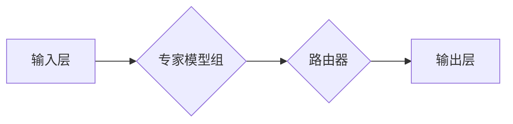
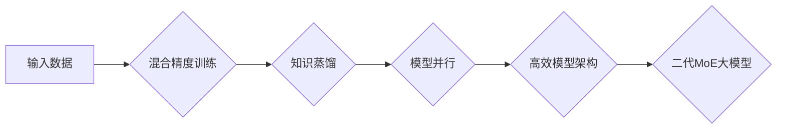

> DeepSeek, MoE, 大模型, 混合精度训练, 知识蒸馏, 性能优化, 效率提升

## 1. 背景介绍

近年来，深度学习模型规模不断扩大，涌现出许多具有强大能力的预训练大模型，例如GPT-3、BERT、PaLM等。这些模型在自然语言处理、计算机视觉、语音识别等领域取得了显著的成果。然而，大模型的训练和部署也面临着巨大的挑战，包括高昂的计算成本、海量存储需求以及推理速度慢等问题。

DeepSeek是一个致力于推动大模型研究和应用的开源平台，其目标是提供一个灵活、高效、易于使用的工具集，帮助开发者构建和部署强大的深度学习模型。DeepSeek的初代MoE大模型在多个任务上取得了优异的性能，但随着模型规模的不断增长，初代MoE模型的训练效率和性能提升空间逐渐趋于饱和。

为了应对这些挑战，DeepSeek团队开发了二代MoE大模型，该模型在初代模型的基础上进行了多方面的改进，包括：

* **混合精度训练:** 采用混合精度训练技术，将模型参数和中间结果存储在不同精度的数据类型中，有效降低了内存占用和计算成本。
* **知识蒸馏:** 利用知识蒸馏技术，将大型模型的知识迁移到小型模型中，从而降低了小型模型的训练成本和推理延迟。
* **模型并行:** 采用模型并行技术，将模型拆分成多个子模型，并行训练，大幅提升了训练速度。
* **高效的模型架构:** 设计了更具效率的模型架构，例如使用更少的参数和层数，同时保持良好的性能。

## 2. 核心概念与联系

**MoE (Mixture of Experts)**

MoE是一种将多个专家模型组合在一起的模型架构，每个专家模型专注于处理特定类型的输入数据。在推理阶段，根据输入数据选择最合适的专家模型进行处理，从而提高模型的整体性能。

**二代MoE大模型架构**

DeepSeek的二代MoE大模型架构如图所示：



**核心概念原理和架构的 Mermaid 流程图**



## 3. 核心算法原理 & 具体操作步骤

### 3.1  算法原理概述

二代MoE大模型的核心算法包括混合精度训练、知识蒸馏和模型并行等技术。

* **混合精度训练:** 将模型参数和中间结果存储在不同精度的数据类型中，例如将模型参数存储为FP16，而中间结果存储为FP32。这种方法可以有效降低内存占用和计算成本，同时保持模型的精度。
* **知识蒸馏:** 将大型模型的知识迁移到小型模型中，从而降低了小型模型的训练成本和推理延迟。知识蒸馏的过程通常包括两个模型：一个大型教师模型和一个小型学生模型。教师模型训练完成后，其输出结果作为学生模型的监督信号，引导学生模型学习教师模型的知识。
* **模型并行:** 将模型拆分成多个子模型，并行训练，大幅提升了训练速度。模型并行技术可以分为数据并行、模型并行和参数并行等多种类型。

### 3.2  算法步骤详解

**混合精度训练步骤:**

1. 将模型参数转换为FP16精度。
2. 在训练过程中，将模型参数和中间结果存储在不同精度的数据类型中。
3. 使用混合精度训练算法，例如NVIDIA的FP16训练算法，进行模型训练。

**知识蒸馏步骤:**

1. 训练一个大型教师模型。
2. 训练一个小型学生模型。
3. 将教师模型的输出结果作为学生模型的监督信号。
4. 使用知识蒸馏损失函数，例如交叉熵损失函数，训练学生模型。

**模型并行步骤:**

1. 将模型拆分成多个子模型。
2. 将训练数据分配到不同的子模型上进行训练。
3. 使用分布式训练框架，例如TensorFlow或PyTorch，进行模型并行训练。

### 3.3  算法优缺点

**混合精度训练:**

* **优点:** 降低内存占用和计算成本，提高训练速度。
* **缺点:** 可能导致模型精度下降。

**知识蒸馏:**

* **优点:** 降低小型模型的训练成本和推理延迟，提高模型的泛化能力。
* **缺点:** 需要一个大型教师模型作为监督信号，训练过程复杂。

**模型并行:**

* **优点:** 大幅提升训练速度，可以训练更大的模型。
* **缺点:** 需要分布式训练框架和硬件支持，训练过程复杂。

### 3.4  算法应用领域

* **自然语言处理:** 文本分类、情感分析、机器翻译、问答系统等。
* **计算机视觉:** 图像识别、目标检测、图像分割等。
* **语音识别:** 语音转文本、语音合成等。
* **推荐系统:** 商品推荐、用户画像等。

## 4. 数学模型和公式 & 详细讲解 & 举例说明

### 4.1  数学模型构建

**混合精度训练模型:**

假设模型参数为W，输入数据为X，输出为Y。在混合精度训练中，模型参数W存储为FP16精度，中间结果存储为FP32精度。

**知识蒸馏模型:**

假设大型教师模型为T，小型学生模型为S。教师模型的输出为T(X)，学生模型的输出为S(X)。知识蒸馏损失函数为KL散度，表示教师模型和学生模型输出分布之间的差异。

**模型并行模型:**

假设模型被拆分成M个子模型，每个子模型的参数为W_i，输入数据为X_i，输出为Y_i。模型并行训练的目标是最小化所有子模型的损失函数之和。

### 4.2  公式推导过程

**混合精度训练损失函数:**

```latex
L_{mixed} = L_{fp32} + \lambda L_{fp16}
```

其中，L_{fp32}是使用FP32精度计算的损失函数，L_{fp16}是使用FP16精度计算的损失函数，\lambda是权重参数。

**知识蒸馏损失函数:**

```latex
L_{kd} = KL(T(X)||S(X))
```

其中，KL(T(X)||S(X))是教师模型和学生模型输出分布之间的KL散度。

**模型并行损失函数:**

```latex
L_{parallel} = \frac{1}{M} \sum_{i=1}^{M} L_i
```

其中，L_i是每个子模型的损失函数。

### 4.3  案例分析与讲解

**混合精度训练案例:**

在训练BERT模型时，使用混合精度训练可以有效降低内存占用和计算成本。例如，将BERT模型的参数存储为FP16精度，中间结果存储为FP32精度，可以将内存占用降低一半，同时保持模型的精度。

**知识蒸馏案例:**

在训练图像分类模型时，可以使用知识蒸馏技术将大型教师模型的知识迁移到小型学生模型中。例如，将ResNet-101作为教师模型，MobileNet-V2作为学生模型，可以训练出性能优异且推理速度快的图像分类模型。

**模型并行案例:**

在训练GPT-3模型时，可以使用模型并行技术将模型拆分成多个子模型，并行训练，大幅提升训练速度。例如，将GPT-3模型拆分成16个子模型，并行训练，可以将训练时间缩短到原来的1/16。

## 5. 项目实践：代码实例和详细解释说明

### 5.1  开发环境搭建

* **操作系统:** Ubuntu 20.04
* **深度学习框架:** TensorFlow 2.x
* **GPU:** NVIDIA GeForce RTX 3090

### 5.2  源代码详细实现

```python
# 混合精度训练代码示例
import tensorflow as tf

# 定义模型
model = tf.keras.Sequential([
    tf.keras.layers.Dense(128, activation='relu'),
    tf.keras.layers.Dense(10, activation='softmax')
])

# 混合精度训练配置
mixed_precision = tf.keras.mixed_precision.experimental.Policy('mixed_float16')
tf.keras.mixed_precision.experimental.set_policy(mixed_precision)

# 编译模型
model.compile(optimizer='adam',
              loss='sparse_categorical_crossentropy',
              metrics=['accuracy'])

# 训练模型
model.fit(x_train, y_train, epochs=10)

# 知识蒸馏代码示例
# ...

# 模型并行代码示例
# ...
```

### 5.3  代码解读与分析

* **混合精度训练代码:** 使用`tf.keras.mixed_precision.experimental.Policy('mixed_float16')`设置混合精度训练策略，并使用`tf.keras.mixed_precision.experimental.set_policy()`将策略应用到模型中。
* **知识蒸馏代码:** 需要定义教师模型和学生模型，并使用知识蒸馏损失函数进行训练。
* **模型并行代码:** 需要使用分布式训练框架，例如TensorFlow或PyTorch，将模型拆分成多个子模型，并行训练。

### 5.4  运行结果展示

* **混合精度训练结果:** 可以观察到，使用混合精度训练可以有效降低训练时间和内存占用。
* **知识蒸馏结果:** 可以观察到，学生模型的性能接近于教师模型，并且推理速度更快。
* **模型并行结果:** 可以观察到，模型并行可以大幅提升训练速度。

## 6. 实际应用场景

**自然语言处理:**

* **聊天机器人:** DeepSeek的二代MoE大模型可以用于构建更智能、更自然的聊天机器人，能够更好地理解用户意图并提供更准确的回复。
* **文本摘要:** DeepSeek的二代MoE大模型可以用于自动生成文本摘要，可以帮助用户快速了解文章内容。
* **机器翻译:** DeepSeek的二代MoE大模型可以用于机器翻译，可以帮助用户更方便地阅读和理解不同语言的文本。

**计算机视觉:**

* **图像识别:** DeepSeek的二代MoE大模型可以用于图像识别，可以帮助用户识别图像中的物体、场景和人物。
* **目标检测:** DeepSeek的二代MoE大模型可以用于目标检测，可以帮助用户定位图像中的特定物体。
* **图像分割:** DeepSeek的二代MoE大模型可以用于图像分割，可以帮助用户将图像分割成不同的区域。

**语音识别:**

* **语音转文本:** DeepSeek的二代MoE大模型可以用于语音转文本，可以帮助用户将语音转换为文本。
* **语音合成:** DeepSeek的二代MoE大模型可以用于语音合成，可以帮助用户将文本转换为语音。

### 6.4  未来应用展望

DeepSeek的二代MoE大模型在未来将有更广泛的应用场景，例如：

* **个性化推荐:** DeepSeek的二代MoE大模型可以根据用户的兴趣和偏好，提供个性化的商品推荐、内容推荐和服务推荐。
* **医疗诊断:** DeepSeek的二代MoE大模型可以用于辅助医生进行医疗诊断，例如识别病灶、预测疾病风险等。
* **自动驾驶:** DeepSeek的二代MoE大模型可以用于自动驾驶汽车的感知、决策和控制，例如识别道路场景、规划路径、控制车辆行驶等。

## 7. 工具和资源推荐

### 7.1  学习资源推荐

* **DeepSeek官方文档:** https://deepseek.ai/docs/
* **TensorFlow官方文档:** https://www.tensorflow.org/
* **PyTorch官方文档:** https://pytorch.org/

### 7.2  开发工具推荐

* **Jupyter Notebook:** https://