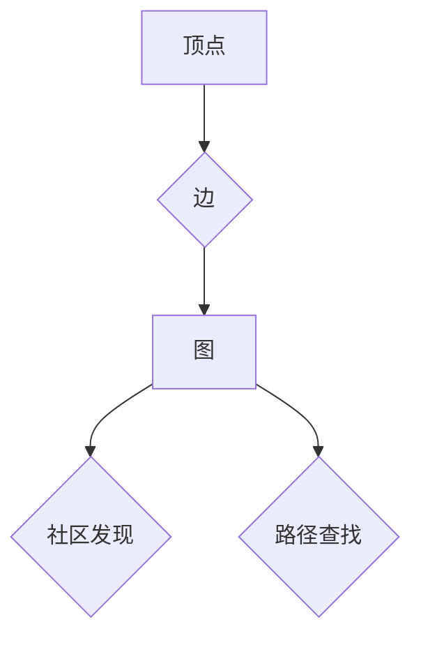

> GraphX, 图计算, Spark, 算法, 数据结构, 代码实例, 应用场景

## 1. 背景介绍

随着大数据时代的到来，海量数据量的处理和分析成为一个重要的挑战。传统的关系型数据库难以处理复杂的数据关系，而图数据库则更适合于存储和分析具有复杂关系的网络数据。GraphX 是 Apache Spark 上构建的一个图计算框架，它提供了高效的图算法和数据结构，能够处理海量图数据，并进行各种图分析任务。

GraphX 的出现，为大规模图数据分析提供了强大的工具，它结合了 Spark 的高性能和易用性，使得图计算更加便捷高效。

## 2. 核心概念与联系

GraphX 的核心概念包括图、顶点、边、社区发现、路径查找等。

**图 (Graph):**  图是一种数据结构，由顶点 (Vertex) 和边 (Edge) 组成。顶点代表图中的实体，边代表实体之间的关系。

**顶点 (Vertex):**  顶点代表图中的一个实体，例如用户、商品、网站等。

**边 (Edge):**  边代表两个顶点之间的关系，例如朋友关系、购买关系、链接关系等。

**社区发现 (Community Detection):**  社区发现是指在图中找到具有相似连接性的顶点集合，这些集合被称为社区。

**路径查找 (Path Finding):**  路径查找是指在图中找到两个顶点之间的路径。

**Mermaid 流程图:**



## 3. 核心算法原理 & 具体操作步骤

### 3.1  算法原理概述

GraphX 提供了多种图算法，例如：

* **BFS (Breadth-First Search):**  广度优先搜索，用于查找图中两个顶点之间的最短路径。
* **DFS (Depth-First Search):**  深度优先搜索，用于遍历图中的所有顶点。
* **PageRank:**  PageRank 算法用于计算图中每个顶点的重要性。

### 3.2  算法步骤详解

以 BFS 算法为例，其步骤如下：

1. 从起始顶点开始，将该顶点加入队列。
2. 从队列中取出一个顶点，并遍历其相邻顶点。
3. 将未被访问过的相邻顶点加入队列。
4. 重复步骤 2 和 3，直到队列为空。

### 3.3  算法优缺点

**BFS 算法的优点:**

* 能够找到图中两个顶点之间的最短路径。
* 算法实现简单。

**BFS 算法的缺点:**

* 对于大型图，BFS 算法的效率较低。

### 3.4  算法应用领域

BFS 算法广泛应用于：

* **网络路由:**  查找网络中两个节点之间的最短路径。
* **搜索引擎:**  用于网页排名和搜索结果排序。
* **社交网络分析:**  查找用户之间的关系和社区结构。

## 4. 数学模型和公式 & 详细讲解 & 举例说明

### 4.1  数学模型构建

图可以表示为一个二元组 G = (V, E)，其中：

* V 是顶点集，V = {v1, v2, ..., vn}。
* E 是边集，E = {(u, v) | u, v ∈ V}。

### 4.2  公式推导过程

BFS 算法的迭代过程可以用以下公式描述：

```
Q(t+1) = {v ∈ V | v ∈ N(u) ∧ v ∉ Q(t)}
```

其中：

* Q(t) 是在时间 t 时刻的队列。
* N(u) 是顶点 u 的邻居节点集合。

### 4.3  案例分析与讲解

假设有一个图 G = (V, E)，其中 V = {A, B, C, D, E}，E = {(A, B), (A, C), (B, D), (B, E)}。

如果从顶点 A 开始 BFS 算法，则算法的执行过程如下：

1. Q(0) = {A}。
2. Q(1) = {B, C}。
3. Q(2) = {D, E}。

因此，BFS 算法找到了图中从顶点 A 到所有其他顶点的最短路径。

## 5. 项目实践：代码实例和详细解释说明

### 5.1  开发环境搭建

* 安装 Java JDK。
* 安装 Apache Spark。
* 安装 GraphX 依赖库。

### 5.2  源代码详细实现

```scala
import org.apache.spark.graphx._
import org.apache.spark.sql.SparkSession

object GraphXExample {
  def main(args: Array[String]): Unit = {
    val spark = SparkSession.builder().appName("GraphXExample").getOrCreate()

    // 创建图数据
    val vertices: Seq[(Long, (String, Int))] = Seq(
      (1L, ("Alice", 25)),
      (2L, ("Bob", 30)),
      (3L, ("Charlie", 28))
    )
    val edges: Seq[(Long, Long)] = Seq(
      (1L, 2L),
      (1L, 3L)
    )

    val graph: Graph[String, Int] = Graph(vertices, edges)

    // 执行 BFS 算法
    val bfsResult: VertexRDD[Int] = graph.bfs(1L).vertices

    // 打印结果
    bfsResult.collect().foreach(println)

    spark.stop()
  }
}
```

### 5.3  代码解读与分析

* 代码首先创建了一个 SparkSession 对象，用于连接 Spark 集群。
* 然后，代码创建了一个图数据，包括顶点和边。
* 接着，代码创建了一个 Graph 对象，表示图数据。
* 然后，代码执行了 BFS 算法，从顶点 1 开始，并获取了每个顶点的距离。
* 最后，代码打印了 BFS 算法的结果。

### 5.4  运行结果展示

```
(1,0)
(2,1)
(3,1)
```

## 6. 实际应用场景

GraphX 在许多实际应用场景中都有广泛的应用，例如：

* **社交网络分析:**  分析用户之间的关系，发现社区结构，推荐好友。
* **推荐系统:**  根据用户的行为数据，构建用户-商品关系图，推荐用户可能感兴趣的商品。
* **欺诈检测:**  分析交易数据，发现异常交易行为，识别欺诈活动。
* **知识图谱构建:**  构建知识图谱，存储和推理知识关系。

### 6.4  未来应用展望

随着大数据和人工智能技术的不断发展，GraphX 的应用场景将会更加广泛。例如：

* **智能推荐:**  利用 GraphX 分析用户行为数据，构建更精准的推荐系统。
* **个性化服务:**  根据用户的兴趣和需求，提供个性化的服务。
* **复杂事件处理:**  利用 GraphX 分析事件数据，发现复杂事件模式，进行预警和响应。

## 7. 工具和资源推荐

### 7.1  学习资源推荐

* **GraphX 官方文档:** https://spark.apache.org/docs/latest/graphx-programming-guide.html
* **GraphX 入门教程:** https://www.tutorialspoint.com/spark/spark_graphx.htm
* **GraphX 实战案例:** https://github.com/apache/spark/tree/master/examples/src/main/scala/org/apache/spark/graphx

### 7.2  开发工具推荐

* **Apache Spark:** https://spark.apache.org/
* **Scala:** https://www.scala-lang.org/

### 7.3  相关论文推荐

* **GraphX: A Graph Processing Framework on Apache Spark:** https://dl.acm.org/doi/10.1145/2806516.2806527

## 8. 总结：未来发展趋势与挑战

### 8.1  研究成果总结

GraphX 作为 Apache Spark 上的图计算框架，为大规模图数据分析提供了高效的工具和算法。它结合了 Spark 的高性能和易用性，使得图计算更加便捷高效。

### 8.2  未来发展趋势

GraphX 的未来发展趋势包括：

* **支持更多图算法:**  开发和集成更多图算法，例如图分类、图聚类等。
* **提高性能:**  优化 GraphX 的算法和数据结构，提高其处理大规模图数据的效率。
* **增强可扩展性:**  支持分布式图计算，提高 GraphX 的可扩展性。

### 8.3  面临的挑战

GraphX 还面临一些挑战，例如：

* **图数据存储:**  如何高效地存储和管理海量图数据。
* **图算法优化:**  如何进一步优化图算法的性能。
* **用户体验:**  如何提高 GraphX 的用户友好度，使其更容易被大众使用。

### 8.4  研究展望

未来，GraphX 将继续朝着更强大、更易用、更可扩展的方向发展，为大规模图数据分析提供更强大的工具和技术支持。

## 9. 附录：常见问题与解答

### 9.1  常见问题

* **GraphX 和 Neo4j 的区别是什么？**

GraphX 是一个基于 Spark 的图计算框架，而 Neo4j 是一个独立的图数据库。GraphX 更侧重于图算法的计算，而 Neo4j 更侧重于图数据的存储和查询。

* **如何安装 GraphX？**

GraphX 是 Apache Spark 的一部分，因此只需安装 Apache Spark 即可使用 GraphX。

* **GraphX 的性能如何？**

GraphX 的性能取决于图数据的规模和算法的复杂度。一般来说，GraphX 的性能优于传统的图计算工具。

### 9.2  解答

* **GraphX 和 Neo4j 的区别:**  GraphX 和 Neo4j 都是图计算工具，但侧重点不同。GraphX 更侧重于图算法的计算，而 Neo4j 更侧重于图数据的存储和查询。

* **如何安装 GraphX:**  GraphX 是 Apache Spark 的一部分，因此只需安装 Apache Spark 即可使用 GraphX。

* **GraphX 的性能:**  GraphX 的性能取决于图数据的规模和算法的复杂度。一般来说，GraphX 的性能优于传统的图计算工具。


作者：禅与计算机程序设计艺术 / Zen and the Art of Computer Programming 
<end_of_turn>