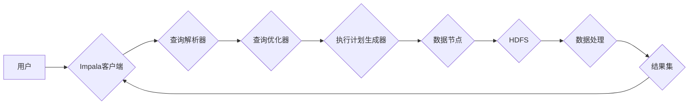

> Impala,MPP,Hadoop,Hive,SQL,数据仓库,分布式计算,数据分析

## 1. 背景介绍

在海量数据时代，高效地处理和分析数据成为企业发展的重要驱动力。传统的关系型数据库在面对海量数据时，往往表现出瓶颈，无法满足实时分析的需求。为了解决这一问题，Apache Impala应运而生。

Impala是一个开源的分布式SQL查询引擎，它基于Hadoop生态系统，能够快速高效地查询HDFS上的数据。Impala采用MPP（Massively Parallel Processing）架构，将查询任务分解成多个子任务，并并行执行，从而大幅提升查询速度。

## 2. 核心概念与联系

Impala的核心概念包括：

* **MPP架构:** Impala采用MPP架构，将查询任务分解成多个子任务，并行执行，充分利用集群的计算资源。
* **Columnar存储:** Impala采用列式存储格式，将数据按列存储，有利于数据压缩和并行查询。
* **内存计算:** Impala将数据加载到内存中进行计算，减少磁盘IO，提升查询速度。
* **查询优化:** Impala拥有强大的查询优化器，能够分析查询语句，并生成最优的执行计划。

**Impala架构图:**

## 3. 核心算法原理 & 具体操作步骤

### 3.1  算法原理概述

Impala的核心算法原理包括：

* **查询解析和优化:** Impala首先解析用户提交的SQL语句，然后利用查询优化器生成最优的执行计划。
* **数据分片和并行处理:** Impala将数据分片到不同的数据节点，并行执行查询任务，充分利用集群的计算资源。
* **列式扫描和数据压缩:** Impala采用列式存储格式，并利用数据压缩技术，减少数据传输量，提升查询速度。
* **内存计算和缓存:** Impala将数据加载到内存中进行计算，并利用缓存机制，减少磁盘IO，提升查询速度。

### 3.2  算法步骤详解

1. **用户提交SQL语句:** 用户通过Impala客户端提交SQL语句。
2. **查询解析:** Impala客户端将SQL语句解析成抽象语法树（AST）。
3. **查询优化:** 查询优化器分析AST，生成最优的执行计划。
4. **执行计划生成:** 执行计划生成器根据优化后的执行计划，分配任务给不同的数据节点。
5. **数据分片和并行处理:** 数据节点根据执行计划，从HDFS中读取数据，并行执行查询任务。
6. **列式扫描和数据压缩:** 数据节点采用列式扫描和数据压缩技术，减少数据传输量，提升查询速度。
7. **内存计算和缓存:** 数据节点将数据加载到内存中进行计算，并利用缓存机制，减少磁盘IO，提升查询速度。
8. **结果集返回:** 数据节点将查询结果集返回给Impala客户端。

### 3.3  算法优缺点

**优点:**

* **高性能:** Impala采用MPP架构和内存计算，能够快速高效地查询海量数据。
* **SQL支持:** Impala支持标准SQL语法，方便用户使用。
* **开源免费:** Impala是一个开源项目，免费使用。
* **易于部署:** Impala部署简单，易于维护。

**缺点:**

* **数据更新效率:** Impala的数据更新效率相对较低，不适合频繁更新的数据。
* **数据一致性:** Impala的数据一致性需要通过其他机制保证。

### 3.4  算法应用领域

Impala广泛应用于以下领域：

* **数据仓库:** Impala可以用于构建数据仓库，快速高效地查询历史数据。
* **实时分析:** Impala可以用于实时分析，例如用户行为分析、市场趋势分析等。
* **机器学习:** Impala可以用于机器学习，例如数据预处理、模型训练等。

## 4. 数学模型和公式 & 详细讲解 & 举例说明

### 4.1  数学模型构建

Impala的查询优化器基于一个数学模型，该模型将查询语句转换为一个图结构，其中节点代表查询操作，边代表数据依赖关系。

### 4.2  公式推导过程

查询优化器利用图论算法，例如Dijkstra算法，计算从输入数据到输出结果的路径长度，并选择最短路径作为最优执行计划。

### 4.3  案例分析与讲解

例如，一个查询语句查询所有用户的信息，可以被转换为一个图结构，其中节点代表用户表、订单表等，边代表用户和订单之间的关系。查询优化器可以利用Dijkstra算法计算从用户表到输出结果的路径长度，并选择最短路径作为最优执行计划。

## 5. 项目实践：代码实例和详细解释说明

### 5.1  开发环境搭建

Impala的开发环境搭建需要以下软件：

* Hadoop
* Impala
* Spark

### 5.2  源代码详细实现

Impala的源代码主要位于Apache Impala的GitHub仓库中。

### 5.3  代码解读与分析

Impala的源代码主要包含以下模块：

* **查询解析器:** 解析用户提交的SQL语句。
* **查询优化器:** 生成最优的执行计划。
* **执行引擎:** 执行查询任务。
* **数据存储:** 管理数据存储。

### 5.4  运行结果展示

Impala的运行结果可以以表格、图表等形式展示。

## 6. 实际应用场景

Impala在实际应用场景中，例如电商平台、金融机构等，被广泛用于以下场景：

* **用户行为分析:** 分析用户浏览、购买、评论等行为，了解用户需求和偏好。
* **市场趋势分析:** 分析市场数据，例如产品销量、价格趋势等，预测市场趋势。
* **风险控制:** 分析金融数据，例如交易记录、客户信息等，识别风险和异常行为。

### 6.4  未来应用展望

Impala在未来将继续发展，并应用于更多领域，例如：

* **物联网数据分析:** 分析物联网设备产生的海量数据，例如传感器数据、设备状态等。
* **人工智能:** Impala可以作为人工智能训练和推理的平台，加速人工智能应用的开发。

## 7. 工具和资源推荐

### 7.1  学习资源推荐

* Apache Impala官方文档: https://impala.apache.org/docs/
* Impala社区论坛: https://community.cloudera.com/t5/Impala/bd-p/Impala

### 7.2  开发工具推荐

* Cloudera Impala: https://www.cloudera.com/products/impala.html
* Hortonworks Data Platform: https://hortonworks.com/products/hortonworks-data-platform/

### 7.3  相关论文推荐

* Impala: A Modern, Distributed SQL Query Engine for Hadoop
* Columnar Storage for Fast Data Analysis

## 8. 总结：未来发展趋势与挑战

### 8.1  研究成果总结

Impala作为一款开源的分布式SQL查询引擎，在数据分析领域取得了显著的成果，为海量数据处理和分析提供了高效的解决方案。

### 8.2  未来发展趋势

Impala未来将继续发展，主要趋势包括：

* **性能提升:** Impala将继续优化查询算法和数据存储格式，提升查询速度和效率。
* **功能扩展:** Impala将继续扩展功能，支持更多数据类型和查询操作。
* **生态系统建设:** Impala将继续加强与其他开源项目的集成，构建更加完善的生态系统。

### 8.3  面临的挑战

Impala也面临一些挑战，例如：

* **数据一致性:** Impala的数据一致性需要通过其他机制保证。
* **数据更新效率:** Impala的数据更新效率相对较低。
* **复杂性:** Impala的架构和功能比较复杂，需要专业的技术人员进行维护和管理。

### 8.4  研究展望

未来，研究者将继续探索新的算法和技术，提升Impala的性能、功能和易用性，使其更好地服务于海量数据分析需求。

## 9. 附录：常见问题与解答

**常见问题:**

* Impala如何保证数据一致性？
* Impala的数据更新效率如何？
* Impala如何部署和维护？

**解答:**

* Impala的数据一致性需要通过其他机制保证，例如使用分布式事务管理系统。
* Impala的数据更新效率相对较低，不适合频繁更新的数据。
* Impala的部署和维护需要专业的技术人员进行操作。

作者：禅与计算机程序设计艺术 / Zen and the Art of Computer Programming 
<end_of_turn>