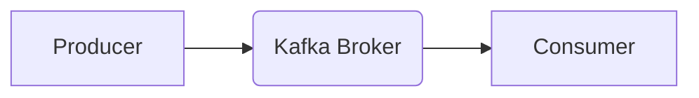
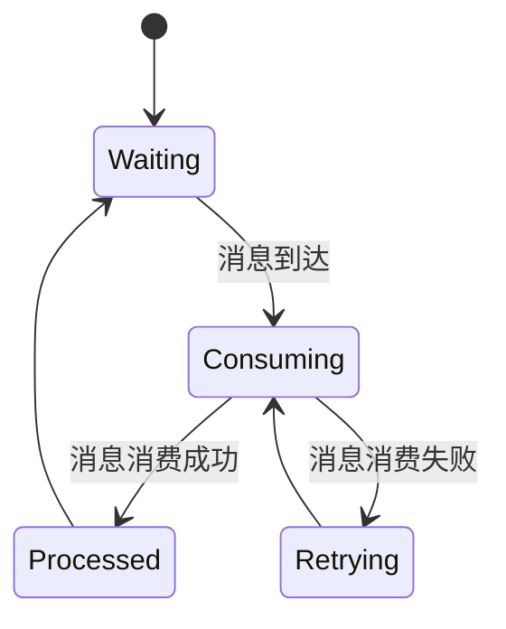

> Kafka, Consumer, 消息队列, 分区, 订阅, 消费, 重试机制, 偏移量, 性能优化

## 1. 背景介绍

在现代分布式系统中，消息队列扮演着至关重要的角色，它能够有效地解耦服务，提高系统的可靠性和可扩展性。Apache Kafka作为一款高性能、分布式、可扩展的消息队列系统，凭借其强大的功能和灵活的架构，在海量数据处理、实时数据流分析等领域得到了广泛应用。

Kafka Consumer是Kafka生态系统中重要的组件之一，它负责从Kafka主题中消费消息，并根据业务逻辑进行处理。理解Kafka Consumer的原理和工作机制对于开发基于Kafka的消息驱动应用程序至关重要。

## 2. 核心概念与联系

Kafka Consumer的核心概念包括主题、分区、订阅、偏移量、消费组等。

**主题 (Topic):**  Kafka中的主题类似于消息的容器，用于组织和存储消息。

**分区 (Partition):** 主题可以被划分为多个分区，每个分区都是一个独立的消息队列，可以并行消费。

**订阅 (Subscription):** Consumer通过订阅主题来获取消息。

**偏移量 (Offset):**  每个Consumer维护一个偏移量，记录其消费到消息的最新位置。

**消费组 (Consumer Group):**  多个Consumer可以组成一个消费组，共同消费主题中的消息，并实现消息的负载均衡和容错机制。

**Kafka Consumer与Producer的关系:**



## 3. 核心算法原理 & 具体操作步骤

### 3.1  算法原理概述

Kafka Consumer的消费机制基于以下核心算法：

* **分区分配算法:** Kafka Broker根据消费组的成员数量和主题的分区数量，将主题的分区分配给不同的Consumer。
* **消息消费算法:** Consumer从分配到的分区中消费消息，并根据偏移量记录消费进度。
* **重试机制:** 当Consumer消费消息时，如果出现异常，Kafka会将消息重新发送给Consumer进行重试。
* **偏移量提交机制:** Consumer在消费消息后，需要将消费进度提交给Kafka Broker，以便保证消息的可靠消费。

### 3.2  算法步骤详解

1. **连接Kafka Broker:** Consumer首先需要连接到Kafka Broker，并注册到消费组。
2. **获取分区分配:** Kafka Broker根据消费组的配置，将主题的分区分配给不同的Consumer。
3. **消费消息:** Consumer从分配到的分区中消费消息，并根据业务逻辑进行处理。
4. **提交偏移量:** Consumer在消费消息后，需要将消费进度提交给Kafka Broker，以便保证消息的可靠消费。
5. **重试机制:** 如果Consumer消费消息时出现异常，Kafka会将消息重新发送给Consumer进行重试。

### 3.3  算法优缺点

**优点:**

* **高性能:** Kafka Consumer能够并行消费消息，提高消息处理效率。
* **高可靠性:** Kafka的重试机制和偏移量提交机制保证了消息的可靠消费。
* **可扩展性:** Kafka Consumer可以轻松扩展，以满足不断增长的消息处理需求。

**缺点:**

* **复杂性:** Kafka Consumer的架构和机制相对复杂，需要一定的学习成本。
* **资源消耗:** Kafka Consumer需要消耗一定的系统资源，例如内存和CPU。

### 3.4  算法应用领域

Kafka Consumer广泛应用于以下领域:

* **实时数据流分析:**  Kafka Consumer可以实时消费数据流，并进行分析和处理。
* **事件驱动架构:** Kafka Consumer可以作为事件驱动架构中的消息消费者，处理各种事件消息。
* **日志收集和分析:** Kafka Consumer可以收集和分析应用程序的日志信息。
* **消息队列:** Kafka Consumer可以作为消息队列的消费者，接收和处理消息。

## 4. 数学模型和公式 & 详细讲解 & 举例说明

### 4.1  数学模型构建

Kafka Consumer的消费机制可以抽象为一个状态机模型，其中状态代表Consumer的消费状态，事件代表消息的到达和消费完成等操作。

**状态机模型:**



**状态定义:**

* **Waiting:** Consumer处于等待状态，等待消息到达。
* **Consuming:** Consumer正在消费消息。
* **Processed:** Consumer成功消费消息。
* **Retrying:** Consumer消费消息失败，正在重试。

### 4.2  公式推导过程

Kafka Consumer的消费进度可以通过以下公式计算:

```
Offset = InitialOffset + NumberOfMessagesConsumed
```

其中:

* **Offset:** 消费到的消息偏移量。
* **InitialOffset:** Consumer初始的偏移量。
* **NumberOfMessagesConsumed:** 已经消费的消息数量。

### 4.3  案例分析与讲解

假设一个主题有100条消息，Consumer初始偏移量为0，消费了50条消息，则消费进度为:

```
Offset = 0 + 50 = 50
```

## 5. 项目实践：代码实例和详细解释说明

### 5.1  开发环境搭建

* Java Development Kit (JDK) 8 或更高版本
* Apache Kafka 
* Maven 或 Gradle

### 5.2  源代码详细实现

```java
import org.apache.kafka.clients.consumer.ConsumerConfig;
import org.apache.kafka.clients.consumer.ConsumerRecord;
import org.apache.kafka.clients.consumer.ConsumerRecords;
import org.apache.kafka.clients.consumer.KafkaConsumer;
import org.apache.kafka.common.serialization.StringDeserializer;
import java.time.Duration;
import java.util.Collections;
import java.util.Properties;

public class KafkaConsumerExample {

    public static void main(String[] args) {
        // Kafka配置
        Properties props = new Properties();
        props.put(ConsumerConfig.BOOTSTRAP_SERVERS_CONFIG, "localhost:9092");
        props.put(ConsumerConfig.GROUP_ID_CONFIG, "my-group");
        props.put(ConsumerConfig.KEY_DESERIALIZER_CLASS_CONFIG, StringDeserializer.class.getName());
        props.put(ConsumerConfig.VALUE_DESERIALIZER_CLASS_CONFIG, StringDeserializer.class.getName());

        // 创建Kafka Consumer
        KafkaConsumer<String, String> consumer = new KafkaConsumer<>(props);

        // 订阅主题
        consumer.subscribe(Collections.singletonList("my-topic"));

        // 消费消息
        while (true) {
            ConsumerRecords<String, String> records = consumer.poll(Duration.ofMillis(100));
            for (ConsumerRecord<String, String> record : records) {
                System.out.println("Received message: " + record.value());
            }
        }
    }
}
```

### 5.3  代码解读与分析

* **Kafka配置:**  配置了Kafka Broker地址、消费组ID、key和value的序列化器。
* **创建Kafka Consumer:**  使用配置信息创建Kafka Consumer实例。
* **订阅主题:**  订阅指定的主题，以便接收该主题的消息。
* **消费消息:**  使用`poll()`方法从Kafka Broker拉取消息，并处理消息内容。

### 5.4  运行结果展示

当代码运行后，会从主题`my-topic`中消费消息，并将消息内容打印到控制台。

## 6. 实际应用场景

### 6.1  电商平台订单处理

电商平台可以利用Kafka Consumer实时消费订单消息，并进行订单处理、库存更新、支付处理等操作。

### 6.2  日志收集和分析

Kafka Consumer可以收集应用程序的日志信息，并进行分析和监控，帮助开发人员快速定位问题。

### 6.3  实时数据流分析

Kafka Consumer可以实时消费数据流，并进行分析和处理，例如实时监控网站流量、用户行为等。

### 6.4  未来应用展望

随着大数据和云计算技术的不断发展，Kafka Consumer的应用场景将会更加广泛，例如：

* **物联网数据处理:**  Kafka Consumer可以处理来自物联网设备的大量数据，并进行分析和决策。
* **金融交易系统:**  Kafka Consumer可以处理金融交易数据，并进行风险控制和交易匹配。
* **医疗数据分析:**  Kafka Consumer可以处理医疗数据，并进行疾病诊断和医疗决策支持。

## 7. 工具和资源推荐

### 7.1  学习资源推荐

* **Apache Kafka官方文档:** https://kafka.apache.org/documentation/
* **Kafka学习指南:** https://www.confluent.io/learn/kafka/
* **Kafka实战教程:** https://www.packtpub.com/product/kafka-in-action/9781789959729

### 7.2  开发工具推荐

* **Kafka Manager:** https://kafka-manager.github.io/
* **Confluent Control Center:** https://www.confluent.io/products/control-center/

### 7.3  相关论文推荐

* **Kafka: A Distributed Streaming Platform:** https://static.confluent.io/downloads/white-papers/Kafka-Whitepaper.pdf

## 8. 总结：未来发展趋势与挑战

### 8.1  研究成果总结

Kafka Consumer作为Kafka生态系统的重要组成部分，在消息消费、数据处理、实时分析等领域取得了显著的成果。

### 8.2  未来发展趋势

* **更强大的消费能力:**  Kafka Consumer将继续提升消费能力，支持更高吞吐量和更低延迟的消息处理。
* **更智能的消费策略:**  Kafka Consumer将引入更智能的消费策略，例如自动分区、负载均衡、容错机制等。
* **更丰富的应用场景:**  Kafka Consumer的应用场景将更加广泛，例如物联网、金融、医疗等领域。

### 8.3  面临的挑战

* **复杂性:**  Kafka Consumer的架构和机制相对复杂，需要不断优化和简化。
* **性能优化:**  随着消息量的增加，Kafka Consumer的性能需要不断提升。
* **安全保障:**  Kafka Consumer需要加强安全保障，防止消息泄露和数据篡改。

### 8.4  研究展望

未来，我们将继续研究Kafka Consumer的性能优化、安全保障、智能消费策略等方面，推动Kafka Consumer技术的发展和应用。

## 9. 附录：常见问题与解答

### 9.1  问题:  Kafka Consumer如何保证消息的可靠消费？

### 9.2  答案:  Kafka Consumer通过以下机制保证消息的可靠消费:

* **偏移量提交机制:**  Consumer在消费消息后，需要将消费进度提交给Kafka Broker，以便保证消息的可靠消费。
* **重试机制:**  当Consumer消费消息时，如果出现异常，Kafka会将消息重新发送给Consumer进行重试。

### 9.3  问题:  Kafka Consumer如何实现消息的负载均衡？

### 9.4  答案:  Kafka Consumer可以通过消费组来实现消息的负载均衡。

* 消费组中的Consumer会共同消费主题中的消息，并根据消费组的配置，将主题的分区分配给不同的Consumer。

### 9.5  问题:  Kafka Consumer如何处理消息的延迟？

### 9.6  答案:  Kafka Consumer可以通过以下方式处理消息的延迟:

* **设置消费超时时间:**  Consumer可以设置消费超时时间，如果消息消费超时，则会抛出异常。
* **使用消息重试机制:**  Kafka Consumer可以设置消息重试次数，如果消息消费失败，则会进行重试。


作者：禅与计算机程序设计艺术 / Zen and the Art of Computer Programming 
<end_of_turn>