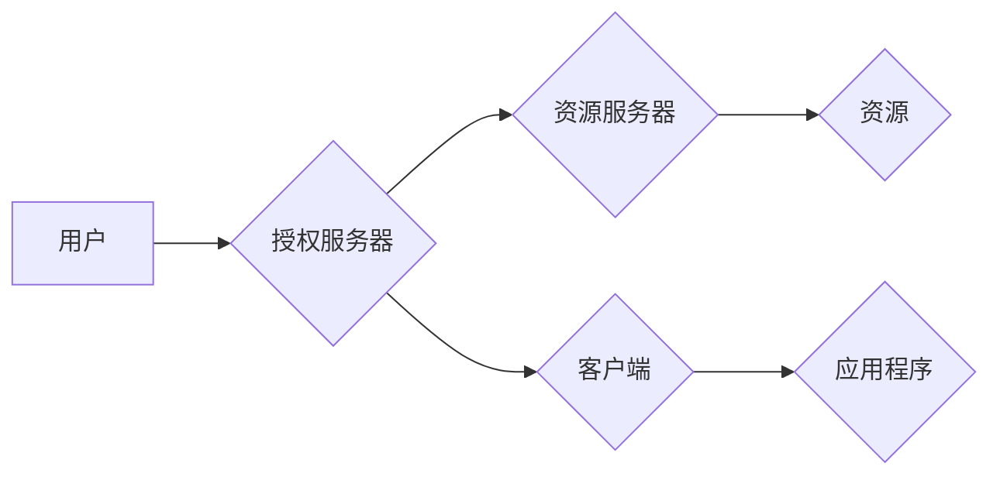

> OAuth 2.0, 单点登录, 安全认证, 授权流程, API, 应用程序

## 1. 背景介绍

在当今互联网时代，用户需要在多个应用程序和服务之间进行身份验证和授权。传统的密码验证方式存在着安全性和用户体验方面的缺陷。OAuth 2.0 协议应运而生，它提供了一种安全、灵活和用户友好的身份验证和授权机制，使得用户可以授权应用程序访问其在线资源，而无需直接共享其凭据。

单点登录 (Single Sign-On, SSO) 是 OAuth 2.0 的一个重要应用场景。SSO 允许用户使用一次凭据登录多个应用程序和服务，从而简化了用户登录体验，提高了安全性。

## 2. 核心概念与联系

OAuth 2.0 协议的核心概念包括：

* **资源所有者 (Resource Owner):** 拥有资源的用户，例如网站用户。
* **客户端 (Client):** 需要访问资源的应用程序，例如社交媒体应用。
* **资源服务器 (Resource Server):** 存储和管理资源的服务器，例如网站服务器。
* **授权服务器 (Authorization Server):** 负责管理用户授权和颁发访问令牌的服务器。

OAuth 2.0 的授权流程可以概括为以下步骤：

1. 客户端向授权服务器发起授权请求，请求访问资源所有者的资源。
2. 授权服务器重定向用户到资源所有者的授权页面。
3. 用户在授权页面确认授权请求，并登录资源所有者的账户。
4. 授权服务器颁发访问令牌给客户端，该令牌允许客户端访问资源所有者的资源。
5. 客户端使用访问令牌向资源服务器请求资源。

**Mermaid 流程图:**



## 3. 核心算法原理 & 具体操作步骤

### 3.1  算法原理概述

OAuth 2.0 协议的核心算法是基于哈希函数和数字签名。哈希函数用于生成唯一的访问令牌，数字签名用于验证访问令牌的合法性。

### 3.2  算法步骤详解

1. **令牌生成:** 授权服务器使用哈希函数将客户端 ID、用户 ID、资源类型和过期时间等信息组合在一起，生成唯一的访问令牌。
2. **令牌签名:** 授权服务器使用私钥对访问令牌进行数字签名，生成签名串。
3. **令牌颁发:** 授权服务器将访问令牌和签名串发送给客户端。
4. **令牌验证:** 客户端使用授权服务器的公钥对访问令牌的签名串进行验证，确保访问令牌的合法性。

### 3.3  算法优缺点

**优点:**

* 安全性高：哈希函数和数字签名机制确保了访问令牌的安全性。
* 灵活性强：OAuth 2.0 协议支持多种授权模式，可以满足不同的应用场景。
* 用户体验好：用户无需重复输入密码，可以简化登录体验。

**缺点:**

* 复杂性高：OAuth 2.0 协议的实现较为复杂，需要对安全认证机制有深入了解。
* 依赖第三方服务：OAuth 2.0 协议依赖于授权服务器，如果授权服务器出现问题，可能会影响应用程序的正常运行。

### 3.4  算法应用领域

OAuth 2.0 协议广泛应用于以下领域：

* 社交媒体登录
* 云存储服务
* 在线支付平台
* 企业内部应用

## 4. 数学模型和公式 & 详细讲解 & 举例说明

### 4.1  数学模型构建

OAuth 2.0 协议的数学模型可以抽象为一个三元组 (R, C, A)，其中：

* R 代表资源服务器，它存储和管理资源。
* C 代表客户端，它需要访问资源。
* A 代表授权服务器，它负责管理用户授权和颁发访问令牌。

### 4.2  公式推导过程

OAuth 2.0 协议的授权流程可以表示为以下公式：

```
授权流程 = f(R, C, A, 用户, 授权请求)
```

其中：

* f() 代表授权流程函数。
* 用户 代表资源所有者。
* 授权请求 代表客户端向授权服务器提交的授权请求。

### 4.3  案例分析与讲解

假设用户 Alice 想要使用她的 Google 账户登录到第三方应用程序 Bob。

1. 应用程序 Bob 向 Google 授权服务器发送授权请求，请求访问 Alice 的 Google 账户资源。
2. Google 授权服务器重定向 Alice 到 Google 登录页面。
3. Alice 在 Google 登录页面输入她的用户名和密码，并确认授权请求。
4. Google 授权服务器颁发一个访问令牌给应用程序 Bob，该令牌允许 Bob 访问 Alice 的 Google 账户资源。
5. 应用程序 Bob 使用访问令牌向 Google 资源服务器请求 Alice 的资源，例如她的电子邮件地址。

## 5. 项目实践：代码实例和详细解释说明

### 5.1  开发环境搭建

* 操作系统：Ubuntu 20.04
* 编程语言：Python 3.8
* 框架：Flask

### 5.2  源代码详细实现

```python
from flask import Flask, request, redirect, url_for
from flask_oauthlib.client import OAuth

app = Flask(__name__)

oauth = OAuth(app)

google = oauth.remote_app(
    'google',
    consumer_key='YOUR_GOOGLE_CONSUMER_KEY',
    consumer_secret='YOUR_GOOGLE_CONSUMER_SECRET',
    request_token_url='https://accounts.google.com/o/oauth2/token',
    access_token_url='https://accounts.google.com/o/oauth2/token',
    authorize_url='https://accounts.google.com/o/oauth2/auth',
)

@app.route('/')
def index():
    return 'Hello, World!'

@app.route('/login')
def login():
    return google.authorize(callback=url_for('authorized', _external=True))

@app.route('/authorized')
def authorized():
    resp = google.authorized_response()
    if resp is None:
        return 'Access denied: %s' % request.args['error']
    return 'You have successfully logged in!'

if __name__ == '__main__':
    app.run(debug=True)
```

### 5.3  代码解读与分析

* 首先，我们使用 Flask 框架创建了一个简单的 Web 应用程序。
* 然后，我们使用 Flask-OAuthlib 库集成 Google OAuth 2.0 授权机制。
* 在 `/login` 路由中，我们使用 `google.authorize()` 方法重定向用户到 Google 登录页面。
* 当用户完成登录后，Google 会重定向用户到 `/authorized` 路由，并携带授权码。
* 在 `/authorized` 路由中，我们使用 `google.authorized_response()` 方法获取授权令牌。
* 最后，我们使用授权令牌访问 Google 资源服务器，获取用户资源。

### 5.4  运行结果展示

运行上述代码后，访问 `http://127.0.0.1:5000/`，然后点击 `/login` 链接，即可完成 Google OAuth 2.0 登录流程。

## 6. 实际应用场景

### 6.1  社交媒体登录

用户可以使用他们的 Facebook、Twitter 或 Google 账户登录到第三方应用程序，无需注册新的账户。

### 6.2  云存储服务

用户可以使用他们的 Google Drive 或 Dropbox 账户访问云存储服务，无需输入密码。

### 6.3  在线支付平台

用户可以使用他们的 PayPal 或 Alipay 账户进行在线支付，无需输入信用卡信息。

### 6.4  未来应用展望

随着互联网的不断发展，OAuth 2.0 协议的应用场景将会更加广泛。例如，它可以用于物联网设备的认证和授权，以及区块链技术的应用。

## 7. 工具和资源推荐

### 7.1  学习资源推荐

* OAuth 2.0 规范：https://oauth.net/2/
* OAuth 2.0 权威指南：https://oauth.net/2/guide/

### 7.2  开发工具推荐

* Flask-OAuthlib：https://flask-oauthlib.readthedocs.io/en/latest/
* Passport.js：https://www.passportjs.org/

### 7.3  相关论文推荐

* OAuth 2.0: An Authorization Framework for the Web
* OAuth 2.0: A Comprehensive Guide

## 8. 总结：未来发展趋势与挑战

### 8.1  研究成果总结

OAuth 2.0 协议已经成为互联网上广泛使用的身份验证和授权机制，它为用户提供了安全、灵活和便捷的登录体验。

### 8.2  未来发展趋势

* OAuth 2.0 协议将会更加安全和可靠，例如支持多因素身份验证和零信任架构。
* OAuth 2.0 协议将会更加灵活和可定制，例如支持新的授权模式和自定义令牌类型。
* OAuth 2.0 协议将会更加广泛地应用于新的领域，例如物联网和区块链技术。

### 8.3  面临的挑战

* OAuth 2.0 协议的实现较为复杂，需要对安全认证机制有深入了解。
* OAuth 2.0 协议依赖于第三方服务，如果授权服务器出现问题，可能会影响应用程序的正常运行。
* OAuth 2.0 协议需要不断更新和改进，以应对新的安全威胁和技术挑战。

### 8.4  研究展望

未来，我们需要继续研究和改进 OAuth 2.0 协议，使其更加安全、可靠、灵活和可定制，以满足互联网发展的需求。

## 9. 附录：常见问题与解答

### 9.1  常见问题

* OAuth 2.0 和 OpenID Connect (OIDC) 的区别是什么？
* OAuth 2.0 的授权模式有哪些？
* 如何实现 OAuth 2.0 的单点登录？

### 9.2  解答

* OAuth 2.0 是一种身份验证和授权协议，而 OIDC 是基于 OAuth 2.0 的身份验证协议，它提供了一种标准化的方式来获取用户身份信息。
* OAuth 2.0 支持多种授权模式，例如授权码模式、资源所有者密码模式、客户端凭证模式和隐式模式。
* 实现 OAuth 2.0 的单点登录需要使用授权服务器和资源服务器，并配置相应的应用程序和用户。


作者：禅与计算机程序设计艺术 / Zen and the Art of Computer Programming 
<end_of_turn>