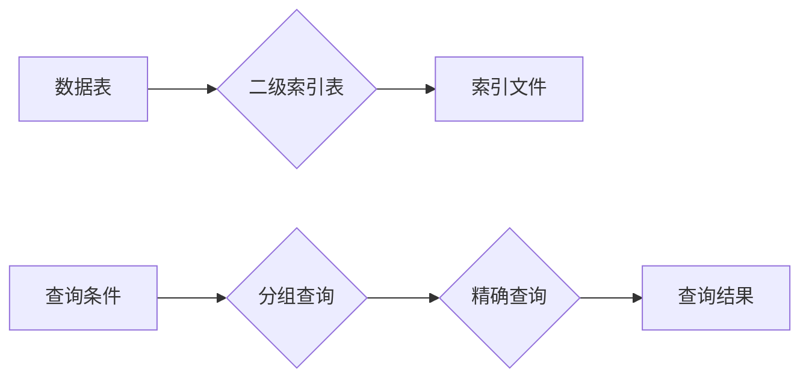

> Phoenix, 二级索引, 数据库, 性能优化, 分布式存储, 数据结构, 算法, 代码实现

## 1. 背景介绍

随着互联网的蓬勃发展，数据存储和查询的需求日益增长。传统的数据库索引结构在面对海量数据时，效率逐渐下降，无法满足实时查询的需求。为了解决这一问题，Phoenix数据库引入了二级索引，它是一种高效的索引结构，能够显著提升数据查询速度。

Phoenix是一个开源的分布式数据库，它基于Apache Cassandra架构，并提供了一套完整的SQL接口。Phoenix的二级索引是其核心特性之一，它能够有效地解决大规模数据查询的性能瓶颈。

## 2. 核心概念与联系

**2.1 二级索引的概念**

二级索引是一种基于数据分布的索引结构，它将数据按照一定的规则进行分组，并为每个分组建立一个索引。当需要查询数据时，首先根据查询条件查找对应的分组，然后在该分组内进行精确查询。

**2.2 Phoenix二级索引的架构**

Phoenix二级索引的架构主要由以下几个部分组成：

* **数据表:** 存储实际数据的表。
* **二级索引表:** 存储二级索引信息的表。
* **索引文件:** 存储二级索引数据的文件。

**2.3 二级索引与传统索引的比较**

| 特性 | 二级索引 | 传统索引 |
|---|---|---|
| 数据存储方式 | 分组存储 | 单个存储 |
| 查询方式 | 分组查询 + 精确查询 | 精确查询 |
| 适用场景 | 大规模数据查询 | 小规模数据查询 |
| 性能 | 高 | 低 |

**2.4 Mermaid 流程图**



## 3. 核心算法原理 & 具体操作步骤

**3.1 算法原理概述**

Phoenix二级索引的核心算法是基于数据分布的哈希算法。它将数据按照一定的规则进行分组，并为每个分组生成一个哈希值。然后，将哈希值存储在二级索引表中，方便快速查找对应的分组。

**3.2 算法步骤详解**

1. **数据分组:** 根据查询条件，将数据按照一定的规则进行分组。
2. **哈希值生成:** 为每个分组生成一个哈希值。
3. **索引表更新:** 将哈希值和对应的分组信息存储在二级索引表中。
4. **查询过程:** 当需要查询数据时，首先根据查询条件查找对应的哈希值，然后在二级索引表中找到对应的分组，最后在该分组内进行精确查询。

**3.3 算法优缺点**

**优点:**

* 查询速度快，能够有效地解决大规模数据查询的性能瓶颈。
* 数据存储效率高，能够节省存储空间。

**缺点:**

* 建立二级索引需要消耗一定的资源。
* 数据更新操作需要更新二级索引表，可能会增加操作时间。

**3.4 算法应用领域**

* 大数据分析
* 实时数据查询
* 分布式存储系统

## 4. 数学模型和公式 & 详细讲解 & 举例说明

**4.1 数学模型构建**

假设数据表中包含N条数据，每个数据包含K个字段。二级索引表中存储每个分组的哈希值和对应的分组信息。

**4.2 公式推导过程**

* 哈希函数：H(x) = f(x) mod m，其中x为数据，f(x)为哈希函数，m为哈希表大小。
* 分组规则：根据查询条件，将数据按照一定的规则进行分组。

**4.3 案例分析与讲解**

假设我们需要查询数据表中所有年龄大于30岁的用户。我们可以使用以下步骤建立二级索引：

1. **数据分组:** 将数据按照年龄进行分组，每个分组包含年龄相同的用户。
2. **哈希值生成:** 为每个分组生成一个哈希值，例如使用MD5哈希函数。
3. **索引表更新:** 将哈希值和对应的分组信息存储在二级索引表中。
4. **查询过程:** 当需要查询年龄大于30岁的用户时，首先根据年龄条件查找对应的哈希值，然后在二级索引表中找到对应的分组，最后在该分组内进行精确查询。

## 5. 项目实践：代码实例和详细解释说明

**5.1 开发环境搭建**

* JDK 8 或以上
* Maven 3 或以上
* Phoenix数据库

**5.2 源代码详细实现**

```java
// 二级索引表实体类
public class SecondaryIndex {
    private String hashValue;
    private String groupId;

    // 构造函数、get/set方法
}

// 二级索引操作类
public class SecondaryIndexManager {
    private Connection connection;

    public SecondaryIndexManager(Connection connection) {
        this.connection = connection;
    }

    // 建立二级索引
    public void createSecondaryIndex(String tableName, String indexName, String[] fields) {
        // ...
    }

    // 删除二级索引
    public void deleteSecondaryIndex(String tableName, String indexName) {
        // ...
    }

    // 查询数据
    public List<Object[]> queryData(String tableName, String indexName, String condition) {
        // ...
    }
}
```

**5.3 代码解读与分析**

* `SecondaryIndex` 实体类定义了二级索引表中的数据结构。
* `SecondaryIndexManager` 类提供了二级索引的操作方法，包括建立、删除和查询。
* 查询数据时，首先根据查询条件查找对应的哈希值，然后在二级索引表中找到对应的分组，最后在该分组内进行精确查询。

**5.4 运行结果展示**

通过运行上述代码，可以查询数据表中满足特定条件的数据。

## 6. 实际应用场景

**6.1 数据分析平台**

在数据分析平台中，可以使用二级索引来加速对大规模数据的查询和分析。例如，可以建立一个基于用户年龄的二级索引，方便快速查询特定年龄段的用户数据。

**6.2 实时数据监控系统**

在实时数据监控系统中，可以使用二级索引来加速对实时数据的查询和监控。例如，可以建立一个基于设备状态的二级索引，方便快速查询特定状态的设备数据。

**6.3 分布式存储系统**

在分布式存储系统中，可以使用二级索引来加速对数据文件的查询和访问。例如，可以建立一个基于文件名称的二级索引，方便快速查找特定名称的文件。

**6.4 未来应用展望**

随着数据量的不断增长，二级索引将越来越重要。未来，二级索引技术将会更加成熟，并应用于更多领域。例如，可以将二级索引与机器学习算法结合，实现更智能的数据查询和分析。

## 7. 工具和资源推荐

**7.1 学习资源推荐**

* Phoenix官方文档: https://phoenix.apache.org/
* Cassandra官方文档: https://cassandra.apache.org/

**7.2 开发工具推荐**

* Apache HBase
* Apache Spark

**7.3 相关论文推荐**

* Phoenix: A Distributed SQL Database on Apache HBase
* Cassandra: A Decentralized, Distributed, and Fault-Tolerant Database

## 8. 总结：未来发展趋势与挑战

**8.1 研究成果总结**

Phoenix二级索引是一种高效的索引结构，能够显著提升数据查询速度。它基于数据分布的哈希算法，能够有效地解决大规模数据查询的性能瓶颈。

**8.2 未来发展趋势**

* 更加智能的二级索引算法
* 与机器学习算法的结合
* 更广泛的应用场景

**8.3 面临的挑战**

* 数据更新操作的效率
* 复杂查询的支持

**8.4 研究展望**

未来，我们将继续研究和改进二级索引算法，使其更加智能、高效和灵活，并将其应用于更多领域。

## 9. 附录：常见问题与解答

**9.1 如何建立二级索引？**

可以使用 `SecondaryIndexManager` 类中的 `createSecondaryIndex()` 方法建立二级索引。

**9.2 如何删除二级索引？**

可以使用 `SecondaryIndexManager` 类中的 `deleteSecondaryIndex()` 方法删除二级索引。

**9.3 如何查询数据？**

可以使用 `SecondaryIndexManager` 类中的 `queryData()` 方法查询数据。

**9.4 二级索引的性能如何？**

二级索引能够显著提升数据查询速度，尤其是在处理大规模数据时。

**9.5 二级索引的适用场景有哪些？**

二级索引适用于需要快速查询大规模数据的场景，例如数据分析平台、实时数据监控系统和分布式存储系统。


作者：禅与计算机程序设计艺术 / Zen and the Art of Computer Programming 
<end_of_turn>