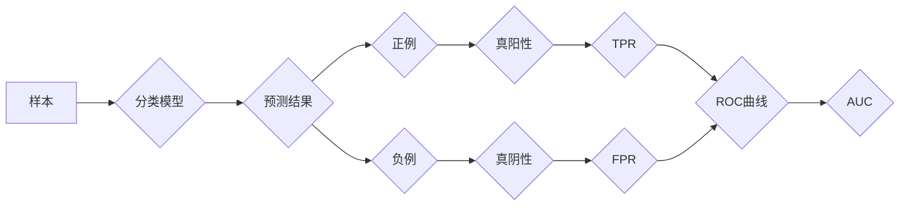

> ROC曲线，AUC，分类模型，性能评估，机器学习，Python，scikit-learn

## 1. 背景介绍

在机器学习领域，分类模型的性能评估是至关重要的。如何准确地衡量模型的分类能力，并选择最优模型，是机器学习 practitioners 面临的挑战之一。传统的准确率指标，虽然简单易懂，但对于样本类别不平衡的数据集，其表现往往不够可靠。

ROC曲线（Receiver Operating Characteristic Curve）和AUC（Area Under the Curve）指标应运而生，它们能够更全面地评估分类模型的性能，尤其是在样本类别不平衡的情况下。

## 2. 核心概念与联系

ROC曲线是将模型的真阳性率（TPR，True Positive Rate）与假阳性率（FPR，False Positive Rate）绘制成曲线图。

**TPR**，也称为灵敏度（Sensitivity），表示模型正确识别正例样本的比例。

**FPR**，也称为1-Specificity，表示模型错误识别负例样本为正例样本的比例。

ROC曲线通过改变模型的分类阈值，绘制出不同阈值下的TPR和FPR的组合关系。

**AUC**（Area Under the Curve）是ROC曲线下的面积，它反映了模型整体的分类能力。AUC值越大，模型的分类能力越强。


**Mermaid 流程图:**



## 3. 核心算法原理 & 具体操作步骤

### 3.1  算法原理概述

ROC曲线和AUC的计算过程并不复杂，主要步骤如下：

1. 设定不同的分类阈值。
2. 对于每个阈值，计算TPR和FPR。
3. 将TPR和FPR绘制成曲线图。
4. 计算ROC曲线下的面积，即AUC值。

### 3.2  算法步骤详解

1. **数据准备:** 首先需要准备一个包含样本特征和标签的数据集。
2. **模型训练:** 使用机器学习算法对数据集进行训练，得到一个分类模型。
3. **阈值设定:** 设定一系列不同的分类阈值，这些阈值决定了模型将样本分类为正例或负例的标准。
4. **计算TPR和FPR:** 对于每个阈值，计算模型在该阈值下的TPR和FPR。
5. **绘制ROC曲线:** 将TPR和FPR绘制成曲线图，得到ROC曲线。
6. **计算AUC:** 计算ROC曲线下的面积，即AUC值。

### 3.3  算法优缺点

**优点:**

* ROC曲线能够直观地展示模型在不同阈值下的性能，方便选择最佳阈值。
* AUC指标能够全面地评估模型的分类能力，不受样本类别不平衡的影响。

**缺点:**

* ROC曲线和AUC指标只关注模型的分类能力，不考虑模型的解释性和鲁棒性。

### 3.4  算法应用领域

ROC曲线和AUC指标广泛应用于各种机器学习领域，例如：

* 医学诊断
* 欺诈检测
* 异常检测
* 自然语言处理

## 4. 数学模型和公式 & 详细讲解 & 举例说明

### 4.1  数学模型构建

ROC曲线和AUC的数学模型如下：

* **TPR (Sensitivity):**  TP / (TP + FN)
* **FPR (1-Specificity):** FP / (FP + TN)
* **AUC:** ∫<sub>0</sub><sup>1</sup> TPR(FPR) dFPR

其中：

* TP: 真阳性
* FP: 假阳性
* TN: 真阴性
* FN: 假阴性

### 4.2  公式推导过程

AUC的计算公式可以理解为ROC曲线下面积的积分。

ROC曲线上的每个点代表了模型在某个阈值下的TPR和FPR。

AUC值越大，表示模型在所有可能的阈值下，其TPR都高于FPR，即模型的分类能力越强。

### 4.3  案例分析与讲解

假设我们有一个二分类模型，其ROC曲线如下所示：


从ROC曲线可以看出，该模型的AUC值为0.85，说明该模型的分类能力较强。

## 5. 项目实践：代码实例和详细解释说明

### 5.1  开发环境搭建

本示例使用Python语言和scikit-learn库进行实现。

需要安装以下软件包：

* Python 3.x
* scikit-learn

可以使用pip命令进行安装：

```bash
pip install scikit-learn
```

### 5.2  源代码详细实现

```python
import numpy as np
from sklearn.datasets import make_classification
from sklearn.model_selection import train_test_split
from sklearn.linear_model import LogisticRegression
from sklearn.metrics import roc_curve, auc
import matplotlib.pyplot as plt

# 生成样本数据
X, y = make_classification(n_samples=1000, n_features=20, random_state=42)

# 将数据划分为训练集和测试集
X_train, X_test, y_train, y_test = train_test_split(X, y, test_size=0.2, random_state=42)

# 训练逻辑回归模型
model = LogisticRegression()
model.fit(X_train, y_train)

# 计算ROC曲线和AUC值
y_score = model.predict_proba(X_test)[:, 1]
fpr, tpr, thresholds = roc_curve(y_test, y_score)
roc_auc = auc(fpr, tpr)

# 绘制ROC曲线
plt.figure()
plt.plot(fpr, tpr, color='darkorange', lw=2, label='ROC curve (area = %0.2f)' % roc_auc)
plt.plot([0, 1], [0, 1], color='navy', lw=2, linestyle='--')
plt.xlim([0.0, 1.0])
plt.ylim([0.0, 1.05])
plt.xlabel('False Positive Rate')
plt.ylabel('True Positive Rate')
plt.title('Receiver Operating Characteristic')
plt.legend(loc="lower right")
plt.show()
```

### 5.3  代码解读与分析

1. **数据生成:** 使用`make_classification`函数生成一个包含1000个样本和20个特征的二分类数据集。
2. **数据划分:** 将数据划分为训练集和测试集，训练集用于模型训练，测试集用于模型评估。
3. **模型训练:** 使用`LogisticRegression`模型对训练集进行训练。
4. **ROC曲线计算:** 使用`roc_curve`函数计算ROC曲线，并使用`auc`函数计算AUC值。
5. **ROC曲线绘制:** 使用`matplotlib`库绘制ROC曲线。

### 5.4  运行结果展示

运行代码后，会生成一个ROC曲线图，并显示AUC值。

## 6. 实际应用场景

ROC曲线和AUC指标在实际应用场景中广泛应用，例如：

* **医学诊断:** 评估疾病诊断模型的性能，例如癌症检测、心血管疾病预测等。
* **欺诈检测:** 识别欺诈交易，例如信用卡欺诈、网络钓鱼攻击等。
* **异常检测:** 发现异常数据，例如网络入侵检测、设备故障预测等。
* **自然语言处理:** 评估文本分类模型的性能，例如情感分析、垃圾邮件过滤等。

### 6.4  未来应用展望

随着机器学习技术的不断发展，ROC曲线和AUC指标将在更多领域得到应用，例如：

* **个性化推荐:** 评估推荐系统的性能，例如商品推荐、内容推荐等。
* **自动驾驶:** 评估自动驾驶系统的性能，例如目标检测、路径规划等。
* **生物信息学:** 评估生物信息学模型的性能，例如基因预测、蛋白质结构预测等。

## 7. 工具和资源推荐

### 7.1  学习资源推荐

* **书籍:**
    * 《Introduction to Machine Learning》 by Ethem Alpaydin
    * 《The Elements of Statistical Learning》 by Trevor Hastie, Robert Tibshirani, and Jerome Friedman
* **在线课程:**
    * Coursera: Machine Learning by Andrew Ng
    * edX: Introduction to Machine Learning by Columbia University

### 7.2  开发工具推荐

* **Python:** 
    * scikit-learn: 机器学习库
    * matplotlib: 数据可视化库
    * pandas: 数据处理库
* **R:** 
    * caret: 机器学习库
    * ggplot2: 数据可视化库

### 7.3  相关论文推荐

* **ROC curves and AUC:**
    * Fawcett, T. (2006). An introduction to ROC analysis. Pattern Recognition Letters, 27(8), 861-874.
* **AUC optimization:**
    * Provost, F., & Fawcett, T. (2013). Analysis of AUC: A practical guide. In Proceedings of the 20th ACM SIGKDD International Conference on Knowledge Discovery and Data Mining (pp. 127-136). ACM.

## 8. 总结：未来发展趋势与挑战

### 8.1  研究成果总结

ROC曲线和AUC指标已经成为机器学习领域中评估分类模型性能的重要工具。

它们能够直观地展示模型在不同阈值下的性能，并提供一个综合的性能指标，不受样本类别不平衡的影响。

### 8.2  未来发展趋势

未来，ROC曲线和AUC指标的研究将朝着以下方向发展：

* **更有效的AUC优化方法:** 探索更有效的AUC优化方法，提高模型的分类性能。
* **多指标评估:** 将ROC曲线和AUC指标与其他性能指标结合，进行多指标评估，更全面地评估模型的性能。
* **解释性模型:** 研究如何将ROC曲线和AUC指标应用于解释性模型，提高模型的可解释性。

### 8.3  面临的挑战

ROC曲线和AUC指标也面临一些挑战：

* **数据质量:** ROC曲线和AUC指标的准确性依赖于数据质量，数据不完整或存在噪声会影响模型的性能评估。
* **模型选择:** ROC曲线和AUC指标只能评估模型的分类能力，不能直接指导模型的选择。
* **阈值设定:** ROC曲线上的每个点代表了模型在某个阈值下的性能，选择最佳阈值需要根据实际应用场景进行调整。

### 8.4  研究展望

未来，ROC曲线和AUC指标的研究将继续深入，为机器学习领域提供更有效的评估方法，推动机器学习技术的进步。

## 9. 附录：常见问题与解答

**1. ROC曲线和AUC值有什么区别？**

ROC曲线是将模型的TPR和FPR绘制成曲线图，AUC值是ROC曲线下的面积。AUC值反映了模型整体的分类能力，而ROC曲线则展示了模型在不同阈值下的性能。

**2. 如何选择最佳阈值？**

最佳阈值取决于实际应用场景的需求。

例如，在医学诊断中，可能希望提高对正例的识别率，即使牺牲一些负例的识别率。

**3. ROC曲线和AUC值适用于哪些场景？**

ROC曲线和AUC值适用于所有二分类问题，尤其是在样本类别不平衡的情况下。

**4. ROC曲线和AUC值有什么局限性？**

ROC曲线和AUC值只能评估模型的分类能力，不能直接指导模型的选择，也不能反映模型的解释性和鲁棒性。

**5. 如何提高AUC值？**

可以通过以下方法提高