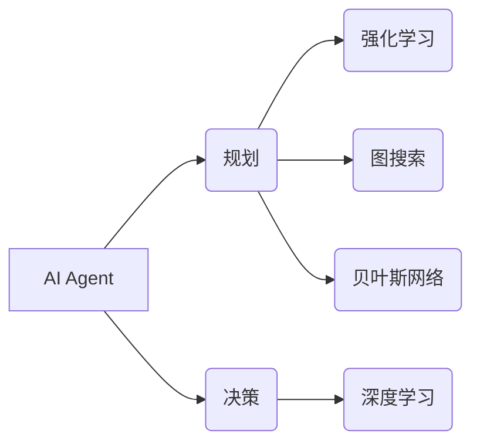

> 大模型、AI Agent、规划、决策、强化学习、图搜索、贝叶斯网络、深度学习

## 1. 背景介绍

在人工智能领域，大模型的蓬勃发展为构建智能代理（AI Agent）提供了强大的工具。AI Agent是指能够感知环境、做出决策并采取行动以实现特定目标的智能体。 规划和决策是AI Agent的核心能力，决定了其在复杂环境中的表现和效率。

传统的AI Agent通常依赖于规则或专家知识，但随着环境复杂度的增加，这种方法变得越来越难以维护和扩展。大模型的出现为AI Agent的规划和决策能力带来了新的突破。大模型能够学习从海量数据中提取的模式和规律，从而实现更灵活、更智能的决策。

## 2. 核心概念与联系

**2.1 AI Agent**

AI Agent是一个能够感知环境、做出决策并采取行动以实现特定目标的智能体。

**2.2 规划**

规划是指在给定目标和环境约束条件下，设计出一系列步骤以实现目标的过程。

**2.3 决策**

决策是指在多个可选行动中选择最优行动的过程。

**2.4 强化学习**

强化学习是一种机器学习方法，通过奖励和惩罚机制，训练AI Agent在环境中学习最优策略。

**2.5 图搜索**

图搜索是一种用于解决规划问题的算法，将问题表示为图结构，并通过搜索算法找到从初始状态到目标状态的路径。

**2.6 贝叶斯网络**

贝叶斯网络是一种概率图模型，用于表示变量之间的依赖关系，并进行概率推理。

**2.7 深度学习**

深度学习是一种机器学习方法，利用多层神经网络学习复杂数据模式。

**2.8 核心概念关系图**



## 3. 核心算法原理 & 具体操作步骤

### 3.1  算法原理概述

AI Agent的规划和决策能力通常基于以下核心算法：

* **强化学习:** 通过奖励和惩罚机制，训练AI Agent在环境中学习最优策略。
* **图搜索:** 将问题表示为图结构，并通过搜索算法找到从初始状态到目标状态的路径。
* **贝叶斯网络:** 用于表示变量之间的依赖关系，并进行概率推理，帮助AI Agent做出更合理的决策。
* **深度学习:** 利用多层神经网络学习复杂数据模式，提高AI Agent的规划和决策能力。

### 3.2  算法步骤详解

**3.2.1 强化学习**

1. **环境建模:** 建立一个模拟真实世界的环境模型。
2. **状态定义:** 定义环境中可能的状态。
3. **动作空间:** 定义AI Agent可以采取的行动。
4. **奖励函数:** 定义奖励函数，用于评估AI Agent的行为。
5. **策略学习:** 使用强化学习算法，例如Q学习或深度强化学习，训练AI Agent学习最优策略。

**3.2.2 图搜索**

1. **状态空间表示:** 将问题表示为图结构，其中节点代表状态，边代表动作。
2. **搜索算法:** 使用搜索算法，例如广度优先搜索或深度优先搜索，找到从初始状态到目标状态的路径。
3. **路径评估:** 对搜索到的路径进行评估，选择最优路径。

**3.2.3 贝叶斯网络**

1. **网络结构构建:** 根据问题领域知识，构建贝叶斯网络结构。
2. **参数学习:** 使用贝叶斯推理算法，学习网络参数。
3. **概率推理:** 使用贝叶斯网络进行概率推理，预测事件发生概率或决策结果。

**3.2.4 深度学习**

1. **数据预处理:** 对规划和决策相关的原始数据进行预处理。
2. **模型构建:** 使用深度学习框架，例如TensorFlow或PyTorch，构建深度神经网络模型。
3. **模型训练:** 使用训练数据训练深度神经网络模型。
4. **模型评估:** 使用测试数据评估模型性能。

### 3.3  算法优缺点

| 算法 | 优点 | 缺点 |
|---|---|---|
| 强化学习 | 可以学习复杂策略，适应动态环境 | 需要大量数据和计算资源，训练时间长 |
| 图搜索 | 适用于离散状态空间，易于理解和实现 | 效率低，难以处理大规模问题 |
| 贝叶斯网络 | 可以处理不确定性，并进行概率推理 | 需要专家知识构建网络结构，参数学习复杂 |
| 深度学习 | 可以学习复杂数据模式，性能优异 | 需要大量数据和计算资源，解释性差 |

### 3.4  算法应用领域

* **机器人控制:** 规划机器人运动路径、控制机器人行为。
* **游戏AI:** 训练游戏AI代理，使其能够做出智能决策。
* **自动驾驶:** 规划车辆行驶路线、做出避障决策。
* **医疗诊断:** 辅助医生诊断疾病、制定治疗方案。
* **金融投资:** 预测市场趋势、进行投资决策。

## 4. 数学模型和公式 & 详细讲解 & 举例说明

### 4.1  数学模型构建

**4.1.1 强化学习模型**

强化学习模型通常由以下几个组成部分构成：

* **状态空间 (S):** 环境中所有可能的状态集合。
* **动作空间 (A):** AI Agent可以采取的所有动作集合。
* **奖励函数 (R):** 评估AI Agent行为的函数，奖励好的行为，惩罚坏的行为。
* **策略 (π):** AI Agent根据当前状态选择动作的策略。

**4.1.2 图搜索模型**

图搜索模型将问题表示为图结构，其中节点代表状态，边代表动作。

* **状态节点 (S):** 表示环境中的一个状态。
* **动作边 (A):** 连接两个状态节点，表示从一个状态到另一个状态的动作。
* **路径 (P):** 从初始状态到目标状态的一系列动作。

**4.1.3 贝叶斯网络模型**

贝叶斯网络模型使用概率图表示变量之间的依赖关系。

* **节点 (N):** 表示一个随机变量。
* **边 (E):** 表示两个节点之间的依赖关系。
* **概率分布 (P):** 描述每个节点的概率分布。

### 4.2  公式推导过程

**4.2.1 强化学习公式**

* **Q值更新公式:**

$$Q(s,a) = Q(s,a) + \alpha [r + \gamma \max_{a'} Q(s',a') - Q(s,a)]$$

其中：

* $Q(s,a)$ 是状态 $s$ 下采取动作 $a$ 的价值函数。
* $\alpha$ 是学习率。
* $r$ 是奖励。
* $\gamma$ 是折扣因子。
* $s'$ 是下一个状态。
* $a'$ 是下一个状态下采取的动作。

**4.2.2 图搜索公式**

* **广度优先搜索 (BFS):**

$$
\text{队列} = \{ \text{初始状态} \}
$$

循环：

* 从队列中取出第一个状态 $s$。
* 如果 $s$ 是目标状态，则返回路径。
* 否则，将 $s$ 的所有邻居状态添加到队列中。

* **深度优先搜索 (DFS):**

$$
\text{栈} = \{ \text{初始状态} \}
$$

循环：

* 从栈中取出第一个状态 $s$。
* 如果 $s$ 是目标状态，则返回路径。
* 否则，将 $s$ 的所有邻居状态压入栈中。

**4.2.3 贝叶斯网络公式**

* **条件概率:**

$$P(A|B) = \frac{P(A \cap B)}{P(B)}$$

其中：

* $P(A|B)$ 是在事件 $B$ 发生的情况下，事件 $A$ 发生的条件概率。
* $P(A \cap B)$ 是事件 $A$ 和 $B$ 同时发生的概率。
* $P(B)$ 是事件 $B$ 发生的概率。

### 4.3  案例分析与讲解

**4.3.1 强化学习案例**

例如，训练一个AI Agent玩游戏，目标是获得尽可能高的分数。

* 状态空间：游戏中的所有可能状态，例如棋盘上的棋子位置。
* 动作空间：AI Agent可以采取的所有动作，例如移动棋子、攻击对手。
* 奖励函数：根据游戏规则，奖励获得分数的行为，惩罚失去分数的行为。
* 策略：AI Agent根据当前状态选择动作的策略，例如使用Q学习算法学习最优策略。

**4.3.2 图搜索案例**

例如，规划机器人从起点到终点的路径。

* 状态空间：机器人可以到达的所有位置。
* 动作空间：机器人可以采取的动作，例如向前移动、向后移动、转弯。
* 路径：从起点到终点的机器人运动轨迹。

可以使用广度优先搜索或深度优先搜索算法找到最优路径。

**4.3.3 贝叶斯网络案例**

例如，根据患者的症状和病史，预测患者患某种疾病的概率。

* 节点：患者的症状、病史、疾病等变量。
* 边：变量之间的依赖关系，例如症状与疾病之间的关系。
* 概率分布：每个变量的概率分布，例如患者患某种疾病的概率。

使用贝叶斯网络进行概率推理，可以预测患者患某种疾病的概率。

## 5. 项目实践：代码实例和详细解释说明

### 5.1  开发环境搭建

* Python 3.x
* TensorFlow 或 PyTorch
* NumPy
* Matplotlib

### 5.2  源代码详细实现

```python
# 强化学习示例代码

import numpy as np
from tensorflow.keras.models import Sequential
from tensorflow.keras.layers import Dense

# 定义状态空间、动作空间、奖励函数等
# ...

# 创建深度神经网络模型
model = Sequential()
model.add(Dense(64, activation='relu', input_shape=(state_size,)))
model.add(Dense(32, activation='relu'))
model.add(Dense(action_size))

# 编译模型
model.compile(loss='mse', optimizer='adam')

# 训练模型
for episode in range(num_episodes):
    # ...
    # 执行强化学习算法，更新模型参数
    # ...

# 保存模型
model.save('agent_model.h5')
```

### 5.3  代码解读与分析

* 代码首先定义了强化学习环境中的状态空间、动作空间、奖励函数等。
* 然后创建了一个深度神经网络模型，用于学习AI Agent的策略。
* 接着使用强化学习算法，例如Q学习，训练模型参数。
* 最后保存训练好的模型。

### 5.4  运行结果展示

* 训练好的模型可以用于控制AI Agent在环境中进行交互，并观察其行为。
* 可以通过评估指标，例如奖励总和、成功率等，评估模型的性能。

## 6. 实际应用场景

**6.1  机器人控制**

* **工业机器人:** 规划机器人运动路径，提高生产效率。
* **服务机器人:** 控制机器人行为，例如导航、物体抓取、人机交互。

**6.2  游戏AI**

* **策略游戏:** 训练AI代理，例如围棋、象棋、Go，与人类玩家进行比赛。
* **动作游戏:** 控制游戏角色，完成游戏目标。

**6.3  自动驾驶**

* **路径规划:** 规划车辆行驶路线，避开障碍物。
* **决策控制:** 控制车辆加速、减速、转向等行为。

**6.4  未来应用展望**