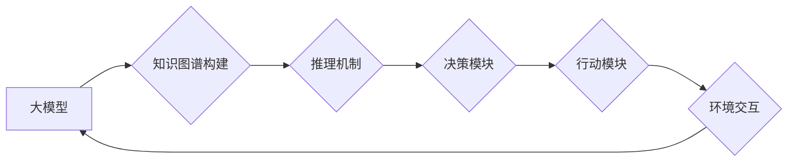

> 大模型、AI Agent、认知框架、知识图谱、推理机制、对话系统、应用场景

## 1. 背景介绍

近年来，大模型技术取得了飞速发展，其强大的泛化能力和知识表示能力为构建智能代理（AI Agent）提供了强大的基础。AI Agent是指能够感知环境、做出决策并与环境交互的智能实体。 

传统的AI Agent通常依赖于规则或模板驱动的行为模式，难以应对复杂、动态的环境变化。而大模型的出现，为AI Agent的认知能力带来了革命性的提升。大模型可以学习海量数据，构建丰富的知识表示，并通过推理机制进行决策和行动，从而实现更智能、更灵活的交互行为。

## 2. 核心概念与联系

### 2.1 大模型

大模型是指参数规模庞大、训练数据海量的人工智能模型。它们通常基于Transformer架构，能够学习语言、图像、音频等多种模态的数据表示，并进行复杂的文本生成、图像识别、语音理解等任务。

### 2.2 AI Agent

AI Agent是指能够感知环境、做出决策并与环境交互的智能实体。它通常由以下几个核心组件组成：

* **感知模块:** 用于获取环境信息，例如传感器数据、文本输入、图像数据等。
* **推理模块:** 用于分析环境信息，做出决策和规划行动。
* **行动模块:** 用于执行决策，与环境进行交互。

### 2.3 认知框架

认知框架是指AI Agent理解和交互世界的结构化表示。它可以帮助AI Agent组织知识、进行推理和决策，并实现更智能的交互行为。

**Mermaid 流程图**



## 3. 核心算法原理 & 具体操作步骤

### 3.1 算法原理概述

大模型应用于AI Agent的认知框架主要基于以下核心算法：

* **知识图谱构建:** 利用大模型的文本理解和知识抽取能力，从海量文本数据中构建知识图谱，表示世界知识和事物之间的关系。
* **推理机制:** 基于知识图谱，利用逻辑推理、规则推理等方法，从已知知识中推导出新的知识或预测未来事件。
* **决策算法:** 根据推理结果和环境信息，利用强化学习、决策树等算法，选择最优的行动策略。

### 3.2 算法步骤详解

1. **数据预处理:** 收集海量文本数据，进行清洗、标注和格式化处理。
2. **知识图谱构建:** 利用大模型进行文本理解和知识抽取，构建知识图谱，表示世界知识和事物之间的关系。
3. **推理机制设计:** 根据任务需求，设计合适的推理机制，例如逻辑推理、规则推理、概率推理等。
4. **决策算法训练:** 利用强化学习、决策树等算法，训练决策模型，使其能够根据推理结果和环境信息做出最优决策。
5. **AI Agent部署:** 将训练好的模型部署到目标环境中，实现AI Agent的感知、决策和行动。

### 3.3 算法优缺点

**优点:**

* 能够学习和理解复杂的知识关系。
* 能够进行推理和决策，做出更智能的行动。
* 能够适应动态变化的环境。

**缺点:**

* 训练成本高，需要海量数据和计算资源。
* 知识图谱构建和推理机制设计需要专业知识和经验。
* 存在知识偏差和逻辑错误的风险。

### 3.4 算法应用领域

* **对话系统:** 构建更智能、更自然的对话系统，例如聊天机器人、虚拟助手等。
* **智能客服:** 自动处理客户咨询，提高服务效率。
* **个性化推荐:** 根据用户的兴趣和行为，提供个性化的产品或服务推荐。
* **医疗诊断:** 辅助医生进行诊断，提高诊断准确率。

## 4. 数学模型和公式 & 详细讲解 & 举例说明

### 4.1 数学模型构建

知识图谱可以表示为一个三元组的集合，其中每个三元组由一个主语、谓语和宾语组成。

* 主语：实体，例如“张三”
* 谓语：关系，例如“工作于”
* 宾语：实体，例如“百度”

知识图谱可以用图论模型表示，其中实体为节点，关系为边。

### 4.2 公式推导过程

推理机制通常基于逻辑推理、规则推理或概率推理。

**逻辑推理:**

* **蕴含关系:** 如果A蕴含B，则当A为真时，B也必须为真。

**规则推理:**

* **IF-THEN规则:** 如果A为真，则B为真。

**概率推理:**

* **贝叶斯定理:** 用于计算事件A发生的概率，已知事件B发生的条件下。

### 4.3 案例分析与讲解

**案例:**

知识图谱中包含以下三元组：

* 张三 工作于 百度
* 百度 是 搜索引擎

**推理:**

根据以上知识，我们可以推导出张三 工作于 搜索引擎。

**解释:**

* 规则推理: 如果A工作于B，并且B是搜索引擎，则A工作于搜索引擎。

## 5. 项目实践：代码实例和详细解释说明

### 5.1 开发环境搭建

* Python 3.7+
* TensorFlow/PyTorch
* NLTK/SpaCy
* Graph Database (Neo4j/Dgraph)

### 5.2 源代码详细实现

```python
# 知识图谱构建
from nltk.corpus import wordnet

def build_knowledge_graph(text):
    # 使用WordNet进行词义分析，提取实体和关系
    # ...

# 推理机制
def infer_knowledge(knowledge_graph, query):
    # 使用逻辑推理或规则推理进行知识推断
    # ...

# 决策算法
from tensorflow.keras.models import Sequential
from tensorflow.keras.layers import Dense

def train_decision_model(knowledge_graph, actions, rewards):
    # 使用强化学习或决策树训练决策模型
    # ...

# AI Agent
class Agent:
    def __init__(self, knowledge_graph, decision_model):
        self.knowledge_graph = knowledge_graph
        self.decision_model = decision_model

    def perceive(self, environment):
        # 获取环境信息
        # ...

    def decide(self, state):
        # 使用决策模型选择行动
        # ...

    def act(self, action):
        # 执行行动
        # ...
```

### 5.3 代码解读与分析

* 知识图谱构建模块使用WordNet进行词义分析，提取实体和关系，构建知识图谱。
* 推理机制模块使用逻辑推理或规则推理进行知识推断，根据知识图谱和查询语句，推导出新的知识。
* 决策算法模块使用强化学习或决策树训练决策模型，使其能够根据推理结果和环境信息做出最优决策。
* AI Agent类封装了感知、决策和行动模块，实现AI Agent的完整交互行为。

### 5.4 运行结果展示

* 通过测试用例，验证AI Agent的感知、决策和行动能力。
* 使用指标评估AI Agent的性能，例如准确率、召回率、F1-score等。

## 6. 实际应用场景

### 6.1 智能客服

AI Agent可以接入企业客服系统，自动处理客户咨询，例如常见问题解答、订单查询、售后服务等。

### 6.2 个性化推荐

AI Agent可以根据用户的兴趣和行为，推荐个性化的产品或服务，例如电商平台的商品推荐、音乐平台的歌曲推荐等。

### 6.3 医疗诊断辅助

AI Agent可以辅助医生进行诊断，例如分析患者症状、检查结果，并提供可能的诊断建议。

### 6.4 未来应用展望

* **更智能的对话系统:** AI Agent能够进行更自然、更流畅的对话，并理解更复杂的语义。
* **更个性化的服务:** AI Agent能够根据用户的个性化需求，提供更精准、更有效的服务。
* **更安全的智能家居:** AI Agent能够监控家居环境，并及时提醒用户潜在的安全隐患。

## 7. 工具和资源推荐

### 7.1 学习资源推荐

* **书籍:**
    * 《深度学习》
    * 《自然语言处理》
    * 《人工智能》
* **在线课程:**
    * Coursera
    * edX
    * Udacity

### 7.2 开发工具推荐

* **Python:** 
* **TensorFlow/PyTorch:** 深度学习框架
* **NLTK/SpaCy:** 自然语言处理库
* **Graph Database (Neo4j/Dgraph):** 图数据库

### 7.3 相关论文推荐

* **BERT:** Pre-training of Deep Bidirectional Transformers for Language Understanding
* **GPT-3:** Language Models are Few-Shot Learners
* **DALL-E:** Creating Images from Text

## 8. 总结：未来发展趋势与挑战

### 8.1 研究成果总结

大模型技术为AI Agent的认知框架带来了革命性的提升，使得AI Agent能够学习、推理和决策，实现更智能、更灵活的交互行为。

### 8.2 未来发展趋势

* **更强大的大模型:** 参数规模更大、训练数据更多、能力更强的模型将不断涌现。
* **更智能的推理机制:** 基于深度学习和知识图谱的推理机制将更加智能、高效。
* **更广泛的应用场景:** AI Agent将应用于更多领域，例如医疗、教育、金融等。

### 8.3 面临的挑战

* **数据安全和隐私保护:** 大模型训练需要海量数据，如何保证数据安全和隐私保护是一个重要挑战。
* **模型可解释性和信任度:** 大模型的决策过程往往难以解释，如何提高模型的可解释性和信任度是一个关键问题。
* **伦理和社会影响:** AI Agent的应用可能会带来伦理和社会影响，需要进行深入的思考和研究。

### 8.4 研究展望

未来，我们将继续致力于大模型技术的研究和应用，推动AI Agent的认知能力和应用场景的不断拓展，为人类社会创造更多价值。

## 9. 附录：常见问题与解答

* **Q1: 如何构建知识图谱？**

* **A1:** 可以使用自然语言处理技术，从文本数据中提取实体和关系，构建知识图谱。

* **Q2: 如何训练决策模型？**

* **A2:** 可以使用强化学习或决策树等算法，训练决策模型，使其能够根据推理结果和环境信息做出最优决策。

* **Q3: 如何保证AI Agent的安全性？**

* **A3:** 需要进行严格的安全测试和评估，并采取相应的安全措施，例如数据加密、权限控制等。


作者：禅与计算机程序设计艺术 / Zen and the Art of Computer Programming 
<end_of_turn>