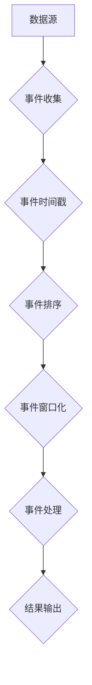

> 事件时间, 事件流, 事件驱动, 时间序列, 数据处理, 实时分析, 编程实践

## 1. 背景介绍

在当今数据爆炸的时代，海量数据以惊人的速度涌入各种系统。如何有效地处理、分析和利用这些数据成为了一个至关重要的挑战。传统的数据库模型难以应对实时数据流的处理需求，而事件时间作为一种新的数据处理 paradigm，为解决这一问题提供了新的思路。

事件时间是一种基于事件发生的顺序和时间戳来组织和处理数据的模型。它强调事件的发生时间，并将其作为数据处理的核心要素。与传统的基于时间戳的模型不同，事件时间模型更加关注事件的因果关系和时间依赖性。

## 2. 核心概念与联系

事件时间模型的核心概念包括：

* **事件:** 事件是发生在特定时间点的某个特定动作或状态变化。
* **事件时间戳:** 事件时间戳记录了事件发生的精确时间。
* **事件流:** 事件流是指一系列按时间顺序排列的事件。
* **事件时间窗口:** 事件时间窗口是指在特定时间范围内的事件集合。

**事件时间处理流程图:**



## 3. 核心算法原理 & 具体操作步骤

### 3.1  算法原理概述

事件时间处理的核心算法通常基于以下原理：

* **事件排序:** 根据事件时间戳将事件按时间顺序排列。
* **事件窗口化:** 将事件流划分为不同的时间窗口，以便对特定时间范围内的事件进行处理。
* **事件聚合:** 对每个时间窗口内的事件进行聚合，例如计算总和、平均值、最大值等。

### 3.2  算法步骤详解

1. **数据收集:** 从各种数据源收集事件数据。
2. **事件时间戳:** 为每个事件添加时间戳，记录其发生时间。
3. **事件排序:** 根据时间戳将事件按时间顺序排列。
4. **事件窗口化:** 将事件流划分为不同的时间窗口，例如滑动窗口、固定窗口等。
5. **事件聚合:** 对每个时间窗口内的事件进行聚合，例如计算总和、平均值、最大值等。
6. **结果输出:** 将聚合结果输出到目标系统。

### 3.3  算法优缺点

**优点:**

* **实时性:** 事件时间处理能够实时地处理事件流，并及时生成结果。
* **灵活性和可扩展性:** 事件时间模型能够灵活地处理各种类型的事件和数据流，并可根据需要进行扩展。
* **因果关系分析:** 事件时间模型能够帮助我们理解事件之间的因果关系，并进行更深入的分析。

**缺点:**

* **复杂性:** 事件时间处理的算法和架构相对复杂，需要一定的技术积累。
* **数据存储和处理成本:** 处理海量事件数据需要较大的存储和处理能力。

### 3.4  算法应用领域

事件时间处理技术广泛应用于以下领域:

* **实时监控和告警:** 监控系统日志、网络流量等数据，及时发现异常情况并发出告警。
* **用户行为分析:** 分析用户行为数据，了解用户偏好和行为模式。
* **金融交易分析:** 分析金融交易数据，识别欺诈行为和风险。
* **物联网数据处理:** 处理来自物联网设备的实时数据，进行设备监控、故障诊断等。

## 4. 数学模型和公式 & 详细讲解 & 举例说明

### 4.1  数学模型构建

事件时间处理可以抽象为一个时间序列模型，其中每个事件被视为一个数据点，其时间戳作为该数据点的坐标。

**事件时间序列模型:**

```
T = {t1, t2, ..., tn}
```

其中，T 表示事件时间序列，t1, t2, ..., tn 分别表示事件的时间戳。

### 4.2  公式推导过程

事件时间窗口化可以利用滑动窗口或固定窗口等方法实现。

**滑动窗口:**

```
W(t) = {t' | t - w <= t' <= t}
```

其中，W(t) 表示在时间 t 的滑动窗口内包含的事件集合，w 表示窗口大小。

**固定窗口:**

```
W(t) = {t' | t_start <= t' <= t_end}
```

其中，W(t) 表示在时间范围 [t_start, t_end] 内包含的事件集合。

### 4.3  案例分析与讲解

**案例:** 假设我们有一个监控系统，需要实时监控服务器的 CPU 使用率。我们可以使用滑动窗口来处理 CPU 使用率数据，并计算每个时间窗口内的平均 CPU 使用率。

**代码示例:**

```python
import pandas as pd

# 假设 CPU 使用率数据为一个时间序列
cpu_usage = pd.Series([70, 80, 90, 85, 75, 80, 90, 85, 75], index=pd.date_range('2023-03-01 00:00:00', periods=9, freq='H'))

# 计算每个小时的平均 CPU 使用率
average_cpu_usage = cpu_usage.rolling(window=1).mean()

# 打印结果
print(average_cpu_usage)
```

## 5. 项目实践：代码实例和详细解释说明

### 5.1  开发环境搭建

* Python 3.x
* pandas 库
* matplotlib 库

### 5.2  源代码详细实现

```python
import pandas as pd
import matplotlib.pyplot as plt

# 假设 CPU 使用率数据为一个时间序列
cpu_usage = pd.Series([70, 80, 90, 85, 75, 80, 90, 85, 75], index=pd.date_range('2023-03-01 00:00:00', periods=9, freq='H'))

# 计算每个小时的平均 CPU 使用率
average_cpu_usage = cpu_usage.rolling(window=1).mean()

# 绘制 CPU 使用率曲线图
plt.plot(cpu_usage)
plt.plot(average_cpu_usage, color='red')
plt.xlabel('时间')
plt.ylabel('CPU 使用率')
plt.title('CPU 使用率曲线图')
plt.legend(['原始数据', '平均 CPU 使用率'])
plt.show()
```

### 5.3  代码解读与分析

* 使用 pandas 库创建时间序列数据，并设置时间索引。
* 使用 `rolling()` 方法计算每个小时的平均 CPU 使用率。
* 使用 matplotlib 库绘制 CPU 使用率曲线图，并区分原始数据和平均 CPU 使用率。

### 5.4  运行结果展示

代码运行后，将生成一个包含原始 CPU 使用率数据和平均 CPU 使用率的曲线图。

## 6. 实际应用场景

事件时间处理技术在各种实际应用场景中发挥着重要作用。

### 6.1  实时监控和告警

* 监控网络流量，识别异常流量并发出告警。
* 监控服务器性能，及时发现性能瓶颈并采取措施。
* 监控用户行为，识别恶意行为并进行防范。

### 6.2  用户行为分析

* 分析用户点击行为，了解用户兴趣和偏好。
* 分析用户购买行为，预测用户购买意愿。
* 分析用户反馈，改进产品和服务。

### 6.3  金融交易分析

* 分析股票交易数据，识别交易模式和风险。
* 分析信用卡交易数据，识别欺诈交易。
* 分析投资组合数据，优化投资策略。

### 6.4  未来应用展望

随着数据量的不断增长和计算能力的提升，事件时间处理技术将有更广泛的应用前景。

* **更精准的预测:** 利用事件时间模型，可以更精准地预测未来事件的发生。
* **更智能的自动化:** 事件时间处理可以帮助构建更智能的自动化系统，例如自动驾驶汽车、智能家居等。
* **更深入的分析:** 事件时间处理可以帮助我们更深入地分析数据，发现隐藏的模式和关系。

## 7. 工具和资源推荐

### 7.1  学习资源推荐

* **书籍:**
    * "Designing Data-Intensive Applications" by Martin Kleppmann
    * "Stream Processing with Apache Flink" by Kostas Tzoumas
* **在线课程:**
    * Coursera: "Data Engineering with Apache Beam"
    * Udacity: "Data Engineering Nanodegree"

### 7.2  开发工具推荐

* **Apache Flink:** 一个开源的流式数据处理框架。
* **Apache Kafka:** 一个开源的消息队列系统。
* **Apache Spark Streaming:** 一个基于 Spark 的流式数据处理框架。

### 7.3  相关论文推荐

* "The Lambda Architecture" by Nathan Marz
* "Stream Processing with Apache Flink" by Kostas Tzoumas
* "Data Stream Management Systems" by  Tamer Özsu and Patrick Valduriez

## 8. 总结：未来发展趋势与挑战

### 8.1  研究成果总结

事件时间处理技术已经取得了显著的进展，并广泛应用于各种领域。

### 8.2  未来发展趋势

* **更强大的计算能力:** 随着计算能力的提升，事件时间处理技术将能够处理更大的数据量和更复杂的事件流。
* **更智能的算法:** 研究人员将继续开发更智能的事件时间处理算法，例如基于机器学习的算法。
* **更广泛的应用场景:** 事件时间处理技术将应用于更多领域，例如自动驾驶、医疗保健、金融等。

### 8.3  面临的挑战

* **数据质量:** 事件时间处理技术对数据质量要求很高，需要确保事件时间戳的准确性和一致性。
* **数据存储和处理成本:** 处理海量事件数据需要较大的存储和处理能力，这会带来一定的成本压力。
* **系统复杂性:** 事件时间处理系统通常比较复杂，需要专业的技术人员进行开发和维护。

### 8.4  研究展望

未来，事件时间处理技术将继续朝着更智能、更高效、更广泛的方向发展。

## 9. 附录：常见问题与解答

* **什么是事件时间戳？**

事件时间戳是指记录事件发生的精确时间。

* **什么是事件时间窗口？**

事件时间窗口是指在特定时间范围内的事件集合。

* **如何选择合适的事件时间窗口大小？**

事件时间窗口大小的选择取决于具体的应用场景和数据特点。

* **如何处理事件时间戳不准确的情况？**

可以采用一些方法来处理事件时间戳不准确的情况，例如使用时间戳校准算法或丢弃不准确的事件。


作者：禅与计算机程序设计艺术 / Zen and the Art of Computer Programming 
<end_of_turn>