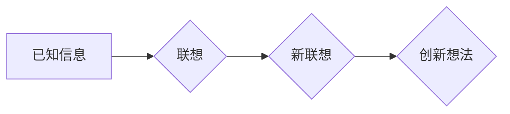

> 人类认知模式，联想，创造力，人工智能，算法，神经网络，深度学习

## 1. 背景介绍

人类的创造力一直是人们探索和追寻的终极目标。从史前人类的绘画到现代科技的突破，创造力始终是推动社会进步的强大引擎。然而，创造力的本质是什么？它是如何产生的？这些问题一直困扰着哲学家、心理学家和科学家们。

近年来，随着人工智能技术的飞速发展，人们对人类认知机制的理解不断深入。研究表明，人类的认知过程并非单一的线性模式，而是由多种相互关联的模式共同构成。其中，联想驱动的模式在创造力中扮演着至关重要的角色。

## 2. 核心概念与联系

联想是一种认知机制，它允许我们根据已有的知识和经验，从一个概念或事物联想到另一个相关概念或事物。这种联想过程是人类思维的基石，它帮助我们理解世界、解决问题和产生新的想法。

**联想驱动的创造模式**是指通过联想，将看似无关的概念或事物联系起来，从而产生新的、创新的想法。这种模式的核心在于打破常规思维，跳出固有的框架，从不同的角度看待问题。

**Mermaid 流程图：**



## 3. 核心算法原理 & 具体操作步骤

### 3.1  算法原理概述

联想驱动的创造模式可以被抽象为一种算法，其核心原理是基于神经网络的联想记忆机制。

神经网络是一种模仿人脑结构和功能的计算模型。它由大量的节点（神经元）组成，这些节点通过连接和权重相互连接。当输入信息进入神经网络时，它会沿着连接路径传递，并经过每个节点的处理，最终输出结果。

联想记忆机制是指神经网络能够根据输入信息，从其内部记忆中提取相关联的信息。这种机制类似于人类的联想过程，它允许我们根据已有的知识和经验，快速回忆和理解新的信息。

### 3.2  算法步骤详解

1. **数据收集和预处理:** 首先需要收集大量相关数据，并进行预处理，例如文本清洗、特征提取等。
2. **神经网络构建:** 根据任务需求，构建相应的深度学习模型，例如循环神经网络（RNN）、长短期记忆网络（LSTM）等。
3. **模型训练:** 使用训练数据训练神经网络模型，使其能够学习到数据中的模式和关系。
4. **联想生成:** 将新的输入信息输入到训练好的神经网络模型中，模型会根据其内部记忆，生成与输入信息相关的联想结果。
5. **结果筛选和评估:** 对生成的联想结果进行筛选和评估，选择最相关的和最有创意的结果。

### 3.3  算法优缺点

**优点:**

* 能够捕捉复杂的数据关系，生成更具创造性的结果。
* 能够学习和适应新的数据，不断提升其创造力。

**缺点:**

* 需要大量的训练数据和计算资源。
* 难以解释模型的决策过程，缺乏可解释性。

### 3.4  算法应用领域

联想驱动的创造模式在多个领域都有广泛的应用，例如：

* **创意写作:** 生成诗歌、小说、剧本等创意文本。
* **艺术创作:** 生成绘画、音乐、舞蹈等艺术作品。
* **产品设计:** 探索新的产品概念和设计方案。
* **科学研究:** 发现新的科学规律和理论。

## 4. 数学模型和公式 & 详细讲解 & 举例说明

### 4.1  数学模型构建

联想驱动的创造模式可以被建模为一个概率图模型，其中节点代表概念或事物，边代表它们之间的关联关系。每个节点的概率分布可以表示其在特定语境下的激活程度。

### 4.2  公式推导过程

可以使用贝叶斯网络或马尔可夫随机场等概率图模型的算法，推导节点之间的概率关系，并计算给定输入信息下，不同节点被激活的概率。

### 4.3  案例分析与讲解

例如，假设我们想要生成一个关于“猫”的联想词。我们可以构建一个概率图模型，其中节点包括“猫”、“毛茸茸”、“喵喵叫”、“抓老鼠”等概念。通过训练数据，我们可以学习到这些节点之间的概率关系，例如，“猫”与“毛茸茸”的关联概率较高。

当我们输入“猫”这个词时，模型会根据其内部记忆，计算出其他节点被激活的概率。例如，“毛茸茸”的激活概率会比较高，因此“毛茸茸”就成为了“猫”的联想词。

## 5. 项目实践：代码实例和详细解释说明

### 5.1  开发环境搭建

可以使用Python语言和相关的深度学习框架，例如TensorFlow或PyTorch，搭建开发环境。

### 5.2  源代码详细实现

```python
# 导入必要的库
import tensorflow as tf

# 定义神经网络模型
model = tf.keras.Sequential([
    tf.keras.layers.Embedding(input_dim=vocab_size, output_dim=embedding_dim),
    tf.keras.layers.LSTM(units=hidden_units),
    tf.keras.layers.Dense(units=vocab_size, activation='softmax')
])

# 编译模型
model.compile(optimizer='adam', loss='sparse_categorical_crossentropy', metrics=['accuracy'])

# 训练模型
model.fit(train_data, train_labels, epochs=epochs)

# 生成联想词
input_word = '猫'
predicted_word = model.predict(input_word)
```

### 5.3  代码解读与分析

这段代码实现了基于LSTM神经网络的联想词生成模型。

* `Embedding`层将单词转换为稠密的向量表示。
* `LSTM`层捕捉单词之间的上下文关系。
* `Dense`层将向量表示转换为单词概率分布。

### 5.4  运行结果展示

模型训练完成后，可以输入一个单词，模型会输出其最相关的联想词。例如，输入“猫”，模型可能会输出“毛茸茸”、“喵喵叫”等词。

## 6. 实际应用场景

### 6.1  创意写作

联想驱动的创造模式可以帮助作家克服写作瓶颈，激发新的创意。例如，可以使用它生成诗歌、小说、剧本等创意文本。

### 6.2  艺术创作

艺术家可以使用它探索新的艺术形式和表达方式。例如，可以使用它生成绘画、音乐、舞蹈等艺术作品。

### 6.3  产品设计

设计师可以使用它探索新的产品概念和设计方案。例如，可以使用它生成新的家具、服装、电子产品等设计方案。

### 6.4  未来应用展望

随着人工智能技术的不断发展，联想驱动的创造模式将有更广泛的应用场景。例如，它可以用于教育、医疗、金融等领域，帮助人们解决问题、提高效率、创造价值。

## 7. 工具和资源推荐

### 7.1  学习资源推荐

* **书籍:**
    * 《深度学习》
    * 《神经网络与深度学习》
* **在线课程:**
    * Coursera: 深度学习
    * Udacity: 
    * fast.ai: 深度学习课程

### 7.2  开发工具推荐

* **TensorFlow:** 开源深度学习框架
* **PyTorch:** 开源深度学习框架
* **Keras:** 高级深度学习API

### 7.3  相关论文推荐

* **Attention Is All You Need:** https://arxiv.org/abs/1706.03762
* **BERT: Pre-training of Deep Bidirectional Transformers for Language Understanding:** https://arxiv.org/abs/1810.04805

## 8. 总结：未来发展趋势与挑战

### 8.1  研究成果总结

联想驱动的创造模式是人工智能领域的一个重要研究方向，它为我们理解和模拟人类创造力提供了新的思路。

### 8.2  未来发展趋势

未来，联想驱动的创造模式将朝着以下方向发展：

* **更强大的模型:** 开发更强大的神经网络模型，能够捕捉更复杂的数据关系，生成更具创造性的结果。
* **更强的可解释性:** 研究如何提高模型的可解释性，使人类能够更好地理解模型的决策过程。
* **更广泛的应用:** 将联想驱动的创造模式应用到更多领域，例如教育、医疗、金融等。

### 8.3  面临的挑战

联想驱动的创造模式也面临着一些挑战：

* **数据依赖:** 这些模型需要大量的训练数据，而高质量的数据往往难以获取。
* **伦理问题:** 人工智能的创造力可能会带来伦理问题，例如版权问题、偏见问题等。

### 8.4  研究展望

未来，我们需要继续深入研究联想驱动的创造模式，克服其面临的挑战，并将其应用于更多领域，为人类社会创造更多价值。

## 9. 附录：常见问题与解答

**Q1: 联想驱动的创造模式和传统的人工智能算法有什么区别？**

**A1:** 传统的人工智能算法通常是基于规则或逻辑的，而联想驱动的创造模式则更像人类的思维方式，它能够捕捉复杂的数据关系，并生成更具创造性的结果。

**Q2: 如何评估联想驱动的创造模式的性能？**

**A2:** 评估联想驱动的创造模式的性能是一个复杂的问题，需要考虑多个因素，例如生成的文本的质量、创意程度、相关性等。

**Q3: 联想驱动的创造模式会取代人类的创造力吗？**

**A3:** 不，联想驱动的创造模式是工具，它可以帮助人类提高创造力，但它不会取代人类的创造力。人类的创造力来自于对世界的理解、情感、体验等多方面因素，而这些因素是机器无法替代的。


作者：禅与计算机程序设计艺术 / Zen and the Art of Computer Programming 
<end_of_turn>