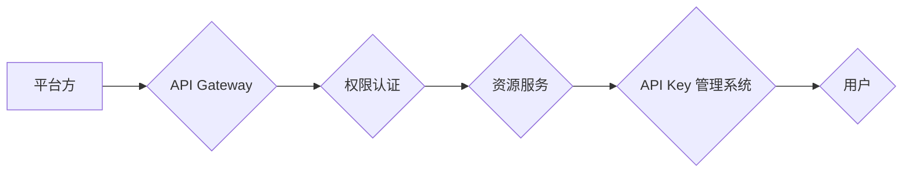

> API Key, 分级管理, 安全, 权限控制, 策略配置, 审计追踪, 身份验证, 访问控制

## 1. 背景介绍

在当今以 API 为核心的软件架构中，API Key 作为一种身份验证和访问控制机制，扮演着至关重要的角色。它允许开发者安全地访问应用程序的资源和功能，同时为平台方提供了精细化的权限管理和安全控制。然而，随着 API 的广泛应用和规模的不断扩大，传统的单一 API Key 管理模式面临着越来越多的挑战。

传统的单一 API Key 管理模式存在以下问题：

* **安全性不足:** 单一 API Key 的泄露将导致对整个应用程序的全面访问，极易造成安全漏洞。
* **权限控制不够精细:** 单一 API Key 无法实现对不同资源和功能的细粒度权限控制，导致资源滥用和安全风险。
* **审计追踪困难:** 单一 API Key 的使用情况难以追踪，难以进行安全事件的调查和分析。

为了解决这些问题，分级 API Key 管理模式应运而生。

## 2. 核心概念与联系

分级 API Key 管理模式的核心思想是将 API Key 分为不同的等级，并为每个等级赋予不同的权限和访问范围。通过这种方式，可以实现对 API 的更精细化的权限控制，提高安全性，并方便进行审计追踪。

**分级 API Key 管理模式的架构:**



**核心概念:**

* **API Gateway:** 负责接收 API 请求，并进行身份验证和权限控制。
* **权限认证:** 根据 API Key 的等级和用户权限，决定是否允许访问资源。
* **资源服务:** 提供 API 接口的应用程序或服务。
* **API Key 管理系统:** 用于创建、管理和审计 API Key 的系统。
* **用户:** 申请和使用 API Key 的开发者或应用程序。

## 3. 核心算法原理 & 具体操作步骤

### 3.1  算法原理概述

分级 API Key 管理模式的核心算法是基于角色和权限的访问控制模型。该模型将用户分为不同的角色，每个角色拥有特定的权限集。API Key 的等级与角色的权限等级相对应，用户使用特定等级的 API Key 才能访问相应的资源和功能。

### 3.2  算法步骤详解

1. **角色定义:** 平台方根据应用程序的功能和需求，定义不同的角色，例如管理员、开发者、普通用户等。
2. **权限分配:** 为每个角色分配相应的权限集，例如访问特定资源、执行特定操作等。
3. **API Key等级划分:** 将 API Key 分为不同的等级，每个等级对应一个角色的权限集。
4. **用户注册:** 用户注册时选择相应的角色，并获得对应的 API Key。
5. **API 请求:** 用户使用 API Key 发送 API 请求时，API Gateway 会根据 API Key 的等级和用户权限，决定是否允许访问资源。

### 3.3  算法优缺点

**优点:**

* **安全性高:** 分级 API Key 管理模式可以有效防止 API Key 的泄露导致的安全风险。
* **权限控制精细:** 可以根据用户角色和权限，对不同资源和功能进行细粒度控制。
* **审计追踪方便:** 可以记录每个 API Key 的使用情况，方便进行安全事件的调查和分析。

**缺点:**

* **管理复杂度高:** 需要维护多个 API Key 和权限规则，管理起来相对复杂。
* **开发成本较高:** 需要对应用程序进行相应的改造，才能支持分级 API Key 管理模式。

### 3.4  算法应用领域

分级 API Key 管理模式广泛应用于以下领域:

* **云计算平台:** 为不同用户提供不同的服务和资源访问权限。
* **移动应用开发:** 为不同用户提供不同的功能和权限。
* **金融服务:** 为不同用户提供不同的金融产品和服务访问权限。
* **物联网:** 为不同设备提供不同的数据访问和控制权限。

## 4. 数学模型和公式 & 详细讲解 & 举例说明

### 4.1  数学模型构建

我们可以用集合论来描述分级 API Key 管理模式的数学模型。

* **U:** 用户集合
* **R:** 资源集合
* **P:** 权限集合
* **K:** API Key 集合
* **f:** 用户到 API Key 的映射函数
* **g:** API Key 到权限集合的映射函数

其中，每个用户 u ∈ U 对应一个 API Key k ∈ K，每个 API Key k ∈ K 对应一个权限集合 P(k) ∈ P。

### 4.2  公式推导过程

我们可以用以下公式来描述用户 u 对资源 r 的访问权限：

```latex
u \in U, r \in R, k \in K, P(k) \in P
Access(u, r) = g(f(u)) ∩ P(r)
```

其中，Access(u, r) 表示用户 u 对资源 r 的访问权限。

* 如果 g(f(u)) ∩ P(r) ≠ ∅，则用户 u 拥有访问资源 r 的权限。
* 否则，用户 u 没有访问资源 r 的权限。

### 4.3  案例分析与讲解

假设我们有一个云计算平台，用户可以申请不同的 API Key，访问不同的资源。

* 用户 A 申请了管理员 API Key，拥有访问所有资源的权限。
* 用户 B 申请了开发者 API Key，拥有访问特定资源的权限。
* 用户 C 申请了普通用户 API Key，只能访问公共资源。

根据上述公式，我们可以推断出：

* 用户 A 可以访问所有资源。
* 用户 B 可以访问特定资源。
* 用户 C 只能访问公共资源。

## 5. 项目实践：代码实例和详细解释说明

### 5.1  开发环境搭建

* 操作系统: Ubuntu 20.04
* 编程语言: Python 3.8
* 框架: Flask

### 5.2  源代码详细实现

```python
from flask import Flask, request, jsonify

app = Flask(__name__)

# API Key 管理字典
api_keys = {
    "admin": {"permissions": ["read", "write", "delete"]},
    "developer": {"permissions": ["read", "write"]},
    "user": {"permissions": ["read"]}
}

@app.route('/api/resource', methods=['GET'])
def get_resource():
    api_key = request.headers.get('Authorization')
    if api_key in api_keys:
        permissions = api_keys[api_key]["permissions"]
        if "read" in permissions:
            # 返回资源数据
            return jsonify({"data": "Resource data"})
        else:
            return jsonify({"error": "Permission denied"}), 403
    else:
        return jsonify({"error": "Invalid API key"}), 401

if __name__ == '__main__':
    app.run(debug=True)
```

### 5.3  代码解读与分析

* **API Key 管理字典:** `api_keys` 字典存储了每个 API Key 的权限信息。
* **API 请求处理:** `get_resource` 函数处理 `/api/resource` 路径的 GET 请求。
* **权限验证:** 函数首先从请求头中获取 API Key，然后根据 API Key 从 `api_keys` 字典中获取对应的权限信息。
* **资源访问控制:** 如果请求包含 "read" 权限，则返回资源数据；否则，返回 "Permission denied" 错误。

### 5.4  运行结果展示

当使用管理员 API Key 发送 GET 请求时，会返回资源数据。当使用开发者 API Key 发送 GET 请求时，也会返回资源数据。当使用普通用户 API Key 发送 GET 请求时，会返回 "Permission denied" 错误。

## 6. 实际应用场景

分级 API Key 管理模式在实际应用场景中具有广泛的应用价值。

### 6.1  云计算平台

云计算平台可以根据用户的不同需求，提供不同的 API Key 和权限等级，例如：

* **管理员 API Key:** 拥有对所有资源的访问和管理权限。
* **开发者 API Key:** 拥有对特定资源的访问和管理权限，例如创建和删除虚拟机、配置网络等。
* **普通用户 API Key:** 只能访问预设的公共资源，例如存储空间、数据库等。

### 6.2  移动应用开发

移动应用开发可以利用分级 API Key 管理模式，为不同用户提供不同的功能和权限，例如：

* **付费用户 API Key:** 拥有所有功能的访问权限。
* **免费用户 API Key:** 只能访问部分功能，例如基础功能、广告等。

### 6.3  金融服务

金融服务可以利用分级 API Key 管理模式，为不同用户提供不同的金融产品和服务访问权限，例如：

* **个人用户 API Key:** 只能访问个人账户信息、交易记录等。
* **企业用户 API Key:** 拥有对企业账户信息的访问和管理权限，例如创建账户、设置权限等。

### 6.4  未来应用展望

随着 API 的不断发展和应用场景的扩展，分级 API Key 管理模式将发挥越来越重要的作用。未来，我们可以期待以下方面的应用：

* **更精细化的权限控制:** 基于机器学习和人工智能技术，实现对 API 的更精细化的权限控制，例如根据用户的行为和上下文进行动态权限授权。
* **更安全的 API 管理:** 利用区块链技术，实现 API Key 的不可篡改性和安全性，防止 API Key 的盗用和伪造。
* **更便捷的 API 管理平台:** 开发更便捷、更易用的 API 管理平台，方便开发者管理和使用 API Key。

## 7. 工具和资源推荐

### 7.1  学习资源推荐

* **API Gateway 文档:** https://docs.aws.amazon.com/apigateway/latest/developerguide/
* **OAuth 2.0 规范:** https://oauth.net/2/

### 7.2  开发工具推荐

* **Flask:** https://flask.palletsprojects.com/en/2.2.x/
* **FastAPI:** https://fastapi.tiangolo.com/

### 7.3  相关论文推荐

* **Fine-grained Access Control for Cloud Computing:** https://ieeexplore.ieee.org/document/6809708
* **A Survey on API Security:** https://dl.acm.org/doi/10.1145/3397271.3401200

## 8. 总结：未来发展趋势与挑战

### 8.1  研究成果总结

分级 API Key 管理模式为 API 的安全性和权限控制提供了有效的解决方案。通过将 API Key 分为不同的等级，可以实现对 API 的更精细化的权限控制，提高安全性，并方便进行审计追踪。

### 8.2  未来发展趋势

未来，分级 API Key 管理模式将朝着以下方向发展：

* **更精细化的权限控制:** 基于机器学习和人工智能技术，实现对 API 的更精细化的权限控制，例如根据用户的行为和上下文进行动态权限授权。
* **更安全的 API 管理:** 利用区块链技术，实现 API Key 的不可篡改性和安全性，防止 API Key 的盗用和伪造。
* **更便捷的 API 管理平台:** 开发更便捷、更易用的 API 管理平台，方便开发者管理和使用 API Key。

### 8.3  面临的挑战

分级 API Key 管理模式也面临着一些挑战：

* **管理复杂度高:** 需要维护多个 API Key 和权限规则，管理起来相对复杂。
* **开发成本较高:** 需要对应用程序进行相应的改造，才能支持分级 API Key 管理模式。
* **安全风险仍然存在:** 即使采用了分级 API Key 管理模式，也无法完全消除安全风险，例如 API Key 的泄露、攻击等。

### 8.4  研究展望

未来，我们需要继续研究和探索分级 API Key 管理模式的更有效、更安全的解决方案，以应对不断变化的 API 安全需求。


## 9. 附录：常见问题与