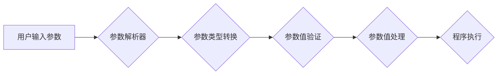

> 参数解析器, ArgParser, 命令行参数, Python, 脚本自动化, 配置文件, 灵活解析, 数据类型转换, 错误处理

## 1. 背景介绍

在软件开发过程中，命令行参数和配置文件是程序与用户交互的重要方式。参数解析器（ArgParser）模块作为处理这些参数的桥梁，扮演着至关重要的角色。它能够解析用户输入的命令行参数和配置文件内容，并将它们转换为程序可理解的数据类型，从而实现脚本自动化、配置灵活和程序可扩展性。

随着软件复杂度的不断提高，参数解析的需求也日益增长。传统的硬编码参数方式难以满足现代软件的灵活性和可维护性要求。因此，参数解析器模块应运而生，为程序员提供了高效、灵活、易于维护的解决方案。

## 2. 核心概念与联系

参数解析器模块的核心概念是将用户输入的字符串参数转换为程序可理解的数据类型，并根据预定义的规则进行处理。

**参数解析流程:**



**核心概念:**

* **命令行参数:** 用户在运行程序时通过命令行输入的参数，通常以 `-` 或 `--` 开头，例如 `-h` 表示帮助选项。
* **配置文件:** 程序的配置信息存储在配置文件中，例如 `config.ini` 或 `settings.json`，程序在运行时读取配置文件中的参数。
* **参数类型:** 参数可以是字符串、整数、浮点数、布尔值等不同类型。
* **参数值验证:** 参数解析器可以对参数值进行验证，确保其符合预期的格式和范围。
* **参数值处理:** 参数解析器可以将参数值转换为程序可理解的数据类型，并进行必要的处理，例如将字符串参数转换为整数。

## 3. 核心算法原理 & 具体操作步骤

### 3.1  算法原理概述

参数解析器的核心算法原理是基于正则表达式和词法分析的。

* **正则表达式:** 用于匹配和提取参数的名称和值。
* **词法分析:** 将参数字符串分解成一个个独立的词语，例如参数名称、参数值和分隔符。

通过正则表达式和词法分析，参数解析器可以识别出不同类型的参数，并将其转换为程序可理解的数据类型。

### 3.2  算法步骤详解

1. **接收用户输入:** 参数解析器首先接收用户输入的命令行参数或配置文件内容。
2. **词法分析:** 对用户输入进行词法分析，将参数字符串分解成一个个独立的词语。
3. **参数识别:** 使用正则表达式匹配每个词语，识别出参数名称和参数值。
4. **类型转换:** 将参数值转换为程序可理解的数据类型，例如将字符串参数转换为整数。
5. **参数验证:** 对参数值进行验证，确保其符合预期的格式和范围。
6. **参数处理:** 根据预定义的规则处理参数值，例如将参数值存储到字典或列表中。
7. **返回结果:** 返回解析后的参数信息，供程序使用。

### 3.3  算法优缺点

**优点:**

* **灵活解析:** 可以解析各种格式的命令行参数和配置文件内容。
* **数据类型转换:** 可以将参数值转换为程序可理解的数据类型。
* **错误处理:** 可以对参数值进行验证，并处理错误情况。
* **可扩展性:** 可以通过添加新的规则和处理逻辑来扩展参数解析功能。

**缺点:**

* **复杂度:** 参数解析器的实现可能会比较复杂，需要对正则表达式和词法分析有一定的了解。
* **可读性:** 参数解析器的代码可能会比较难以阅读和理解。

### 3.4  算法应用领域

参数解析器模块广泛应用于以下领域:

* **脚本自动化:** 自动化执行重复性任务，例如备份文件、清理磁盘空间等。
* **命令行工具:** 提供命令行接口，方便用户交互和操作程序。
* **配置文件管理:** 读取和处理程序的配置文件，配置程序的行为和参数。
* **数据分析:** 解析数据文件，提取和处理数据信息。

## 4. 数学模型和公式 & 详细讲解 & 举例说明

参数解析器模块的实现涉及到一些数学模型和公式，例如正则表达式匹配和字符串处理。

### 4.1  数学模型构建

正则表达式可以看作是一种特殊的字符串匹配模型，它使用特定的符号和规则来描述匹配模式。

### 4.2  公式推导过程

正则表达式匹配的过程可以看作是一个状态机转换的过程。状态机根据输入的字符，从一个状态转换到另一个状态，直到匹配成功或匹配失败。

### 4.3  案例分析与讲解

例如，以下正则表达式 `\d+` 可以匹配一个或多个数字：

* `\d`: 表示一个数字字符。
* `+`: 表示一个或多个。

当输入字符串为 `12345` 时，正则表达式 `\d+` 会匹配整个字符串，因为字符串包含一个或多个数字字符。

## 5. 项目实践：代码实例和详细解释说明

### 5.1  开发环境搭建

* Python 3.x 环境
* 文本编辑器或 IDE

### 5.2  源代码详细实现

```python
import argparse

def main():
    parser = argparse.ArgumentParser(description='这是一个参数解析器示例')
    parser.add_argument('-n', '--name', type=str, help='输入你的名字')
    parser.add_argument('-a', '--age', type=int, help='输入你的年龄')
    args = parser.parse_args()

    print(f'你的名字是: {args.name}')
    print(f'你的年龄是: {args.age}')

if __name__ == '__main__':
    main()
```

### 5.3  代码解读与分析

* `argparse.ArgumentParser()` 创建一个参数解析器对象。
* `parser.add_argument()` 添加一个参数选项，指定参数名称、类型和帮助信息。
* `parser.parse_args()` 解析用户输入的参数，并将它们存储到 `args` 对象中。
* `args.name` 和 `args.age` 访问解析后的参数值。

### 5.4  运行结果展示

```
python argparser_example.py -n "禅与计算机程序设计艺术" -a 30
你的名字是: 禅与计算机程序设计艺术
你的年龄是: 30
```

## 6. 实际应用场景

参数解析器模块在实际应用场景中非常广泛，例如:

* **自动化脚本:** 可以使用参数解析器模块来创建自动化脚本，例如备份文件、清理磁盘空间等。
* **命令行工具:** 可以使用参数解析器模块来创建命令行工具，例如文本编辑器、文件压缩工具等。
* **配置文件管理:** 可以使用参数解析器模块来读取和处理程序的配置文件，配置程序的行为和参数。

### 6.4  未来应用展望

随着人工智能和机器学习的发展，参数解析器模块的应用场景将会更加广泛。例如，可以利用机器学习算法来自动识别和解析复杂的参数结构，提高参数解析的准确性和效率。

## 7. 工具和资源推荐

### 7.1  学习资源推荐

* Python 官方文档: https://docs.python.org/3/library/argparse.html
* Real Python: https://realpython.com/python-argparse/

### 7.2  开发工具推荐

* Python 3.x 环境
* VS Code, PyCharm 等 IDE

### 7.3  相关论文推荐

* Argument Parsing for Python: https://arxiv.org/abs/1904.01877

## 8. 总结：未来发展趋势与挑战

参数解析器模块作为软件开发中不可或缺的一部分，其未来发展趋势将更加智能化、自动化和可扩展。

### 8.1  研究成果总结

* 正则表达式匹配算法的优化和改进
* 基于机器学习的自动参数解析
* 参数解析器的可视化和交互式设计

### 8.2  未来发展趋势

* 更智能的参数解析，能够理解用户意图，自动识别和解析复杂的参数结构。
* 更自动化和可扩展的参数解析，能够根据不同的场景和需求自动生成参数解析器代码。
* 更友好的用户体验，提供更直观和易于使用的参数解析界面。

### 8.3  面临的挑战

* 复杂参数结构的解析
* 参数类型和格式的兼容性
* 参数解析的安全性

### 8.4  研究展望

* 研究更先进的参数解析算法，例如基于深度学习的参数解析。
* 开发更灵活和可扩展的参数解析框架，支持多种编程语言和平台。
* 研究参数解析的安全性问题，防止恶意参数攻击。

## 9. 附录：常见问题与解答

* **如何处理可选参数？**

可以使用 `-h` 或 `--help` 选项来显示帮助信息，并说明可选参数的用法。

* **如何处理多个参数值？**

可以使用 `-a` 或 `--age` 选项来指定多个年龄值，例如 `python argparser_example.py -a 20 -a 30`。

* **如何处理参数的默认值？**

可以使用 `default` 参数来指定参数的默认值，例如 `parser.add_argument('-n', '--name', type=str, default='未知')`。


作者：禅与计算机程序设计艺术 / Zen and the Art of Computer Programming 
<end_of_turn>