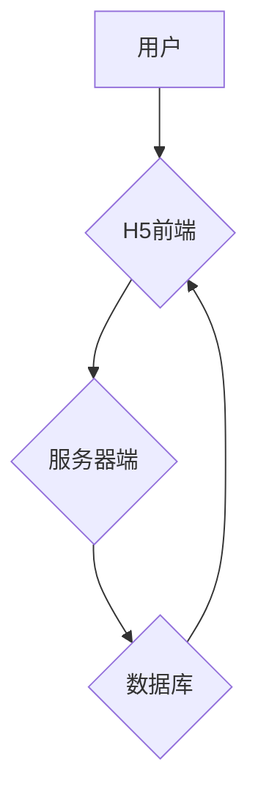

> 自律APP, H5前端, 跨平台,  用户体验,  数据驱动,  人工智能

## 1. 背景介绍

随着移动互联网的快速发展，智能手机已成为人们生活中不可或缺的一部分。APP作为移动互联网的核心应用，其设计和开发也日益受到重视。近年来，随着人工智能技术的不断进步，自律APP应运而生，它能够根据用户的行为习惯和需求，自动完成各种任务，提升用户的效率和生活品质。

传统APP的设计往往依赖于用户手动操作，而自律APP则更加注重用户体验和智能化。它能够通过数据分析和机器学习，预测用户的需求，并主动提供相应的服务。例如，自律健身APP可以根据用户的运动数据和目标，制定个性化的训练计划；自律学习APP可以根据用户的学习进度和知识点，推荐合适的学习资源。

然而，传统的APP开发模式往往需要针对不同的平台进行单独开发，成本高、效率低。而H5前端开发技术则提供了一种跨平台、快速开发的解决方案。H5前端技术基于HTML5、CSS3和JavaScript等标准技术，能够在各种设备上运行，无需安装单独的APP，用户可以通过浏览器访问。

## 2. 核心概念与联系

**2.1 自律APP**

自律APP是指能够根据用户行为和需求，自动完成任务，提升用户体验的智能化应用。其核心特点包括：

* **数据驱动:** 自律APP依赖于大量用户数据，通过数据分析和机器学习，了解用户的行为习惯和需求。
* **智能化:** 自律APP能够根据数据分析结果，自动完成任务，例如推荐内容、制定计划、提醒用户等。
* **个性化:** 自律APP能够根据用户的个人特征和需求，提供个性化的服务和体验。

**2.2 H5前端开发**

H5前端开发是指利用HTML5、CSS3和JavaScript等标准技术，开发跨平台的Web应用。其核心特点包括：

* **跨平台:** H5应用能够在各种设备上运行，包括手机、平板电脑、电脑等。
* **快速开发:** H5开发效率高，无需针对不同的平台进行单独开发。
* **成本低:** H5开发成本相对较低，无需进行复杂的平台适配。

**2.3 核心概念联系**

H5前端开发技术为自律APP的设计和实现提供了强大的支持。

* **跨平台部署:** H5前端技术能够使自律APP在各种设备上运行，无需用户安装单独的APP，提升用户体验。
* **快速迭代:** H5开发效率高，能够快速迭代更新自律APP的功能和内容，满足用户的不断变化的需求。
* **成本控制:** H5开发成本相对较低，能够帮助开发者降低开发成本，提高开发效率。

**2.4 架构图**



## 3. 核心算法原理 & 具体操作步骤

**3.1 算法原理概述**

自律APP的核心算法通常包括以下几个方面：

* **用户行为分析:** 通过分析用户的行为数据，例如浏览记录、点击行为、停留时间等，了解用户的兴趣爱好、需求和习惯。
* **需求预测:** 基于用户行为分析结果，预测用户的未来需求，例如用户可能感兴趣的内容、用户可能需要完成的任务等。
* **个性化推荐:** 根据用户的需求和偏好，推荐个性化的内容和服务。
* **任务自动化:** 自动完成用户的任务，例如提醒用户完成任务、自动回复用户消息等。

**3.2 算法步骤详解**

1. **数据收集:** 收集用户的行为数据，例如浏览记录、点击行为、停留时间等。
2. **数据预处理:** 对收集到的数据进行清洗、转换和格式化，以便于后续的分析和处理。
3. **特征提取:** 从用户行为数据中提取特征，例如用户喜欢的主题、用户经常访问的页面等。
4. **模型训练:** 使用机器学习算法，训练模型，以便于预测用户的需求和行为。
5. **需求预测:** 基于训练好的模型，预测用户的未来需求，例如用户可能感兴趣的内容、用户可能需要完成的任务等。
6. **个性化推荐:** 根据用户的需求和偏好，推荐个性化的内容和服务。
7. **任务自动化:** 自动完成用户的任务，例如提醒用户完成任务、自动回复用户消息等。

**3.3 算法优缺点**

**优点:**

* **智能化:** 自律APP能够根据用户的需求，自动完成任务，提升用户体验。
* **个性化:** 自律APP能够根据用户的个人特征和需求，提供个性化的服务和体验。
* **数据驱动:** 自律APP依赖于数据分析和机器学习，能够不断优化和改进服务。

**缺点:**

* **数据依赖:** 自律APP需要大量用户数据才能有效运行，数据安全和隐私保护是一个重要问题。
* **算法复杂:** 自律APP的算法通常比较复杂，需要专业的技术人员进行开发和维护。
* **用户信任:** 用户需要信任自律APP的算法和决策，否则可能会导致用户使用体验下降。

**3.4 算法应用领域**

自律APP的应用领域非常广泛，例如：

* **健康医疗:** 自律健身APP、自律健康管理APP
* **教育学习:** 自律学习APP、自律在线教育平台
* **生活服务:** 自律购物APP、自律出行规划APP
* **金融理财:** 自律投资理财APP、自律财务管理APP

## 4. 数学模型和公式 & 详细讲解 & 举例说明

**4.1 数学模型构建**

自律APP的算法通常基于数学模型，例如推荐系统、预测模型等。

**推荐系统:**

推荐系统通常使用协同过滤算法或内容过滤算法。

* **协同过滤算法:** 基于用户的历史行为数据，预测用户可能感兴趣的内容。
* **内容过滤算法:** 基于内容的特征信息，推荐与用户兴趣相符的内容。

**预测模型:**

预测模型通常使用时间序列分析或机器学习算法，预测用户的未来行为。

* **时间序列分析:** 分析历史数据中的趋势和模式，预测未来的值。
* **机器学习算法:** 使用训练数据，学习用户的行为模式，预测未来的行为。

**4.2 公式推导过程**

协同过滤算法的公式推导过程比较复杂，这里只列举一个简单的例子：

**用户-物品评分矩阵:**

```
用户 | 物品1 | 物品2 | 物品3
------- | -------- | -------- | --------
用户1 | 5 | 3 | 4
用户2 | 4 | 5 | 2
用户3 | 3 | 4 | 5
```

**相似度计算:**

```
相似度(用户1, 用户2) = ∑(用户1对物品i的评分 * 用户2对物品i的评分) / (√(∑(用户1对物品i的评分)^2) * √(∑(用户2对物品i的评分)^2))
```

**4.3 案例分析与讲解**

假设有一个自律学习APP，它需要根据用户的学习进度和知识点，推荐合适的学习资源。

* **数据收集:** APP收集用户的学习记录，例如学习时间、学习内容、学习成绩等。
* **特征提取:** 从学习记录中提取特征，例如用户的学习速度、学习偏好、知识点掌握情况等。
* **模型训练:** 使用机器学习算法，训练模型，预测用户可能需要学习的知识点和合适的学习资源。
* **个性化推荐:** 根据用户的学习进度和知识点，推荐个性化的学习资源。

## 5. 项目实践：代码实例和详细解释说明

**5.1 开发环境搭建**

* **操作系统:** Windows/macOS/Linux
* **浏览器:** Chrome/Firefox/Safari
* **代码编辑器:** VS Code/Sublime Text/Atom
* **前端框架:** React/Vue/Angular

**5.2 源代码详细实现**

```javascript
// 使用React框架实现自律学习APP的推荐组件
import React, { useState, useEffect } from 'react';

function RecommendationComponent() {
  const [recommendations, setRecommendations] = useState([]);

  useEffect(() => {
    // 从服务器端获取推荐资源
    fetch('/api/recommendations')
      .then(response => response.json())
      .then(data => setRecommendations(data));
  }, []);

  return (
    <div>
      <h2>推荐学习资源</h2>
      <ul>
        {recommendations.map(recommendation => (
          <li key={recommendation.id}>
            <h3>{recommendation.title}</h3>
            <p>{recommendation.description}</p>
          </li>
        ))}
      </ul>
    </div>
  );
}

export default RecommendationComponent;
```

**5.3 代码解读与分析**

* 该代码使用React框架实现了一个推荐组件。
* 组件使用`useEffect`钩子函数，在组件挂载时从服务器端获取推荐资源。
* 组件使用`map`方法，将推荐资源渲染成列表。

**5.4 运行结果展示**

运行该代码后，用户将看到一个推荐学习资源的列表，列表中包含了推荐资源的标题和描述。

## 6. 实际应用场景

**6.1 自律健身APP**

自律健身APP可以根据用户的运动数据和目标，制定个性化的训练计划，并提供实时指导和反馈。例如，如果用户目标是减脂，APP可以推荐相应的运动计划和饮食建议，并根据用户的运动数据调整计划，提高训练效率。

**6.2 自律学习APP**

自律学习APP可以根据用户的学习进度和知识点，推荐合适的学习资源，并提供个性化的学习计划和提醒。例如，如果用户在数学方面有困难，APP可以推荐相关的学习视频和练习题，并提醒用户按时完成学习任务。

**6.3 自律生活服务APP**

自律生活服务APP可以帮助用户管理日常事务，例如预约医生、订餐、出行规划等。例如，如果用户需要预约医生，APP可以根据用户的症状和时间安排，推荐合适的医生和预约时间。

**6.4 未来应用展望**

随着人工智能技术的不断发展，自律APP的应用场景将更加广泛，例如：

* **个性化医疗:** 自律医疗APP可以根据用户的健康状况，提供个性化的医疗建议和服务。
* **智能教育:** 自律教育平台可以根据学生的学习进度和能力，提供个性化的学习内容和辅导。
* **智慧城市:** 自律城市APP可以帮助用户管理城市生活，例如交通出行、公共服务等。

## 7. 工具和资源推荐

**7.1 学习资源推荐**

* **在线课程:** Coursera、edX、Udacity
* **书籍:** 《深度学习》、《机器学习》、《自然语言处理》
* **博客:** Towards Data Science、Machine Learning Mastery

**7.2 开发工具推荐**

* **代码编辑器:** VS Code、Sublime Text、Atom
* **前端框架:** React、Vue、Angular
* **服务器端框架:** Node.js、Python Flask、Django

**7.3 相关论文推荐**

* **推荐系统:** 《Collaborative Filtering for Implicit Feedback Datasets》
* **机器学习:** 《Deep Learning》
* **自然语言处理:** 《BERT: Pre-training of Deep Bidirectional Transformers for Language Understanding》

## 8. 总结：未来发展趋势与挑战

**8.1 研究成果总结**

基于H5前端开发的自律APP技术取得了显著进展，能够提供更加智能化、个性化和便捷的用户体验。

**8.2 未来发展趋势**

* **更强大的AI算法:** 未来自律APP将更加依赖于更强大的AI算法，例如深度学习、强化学习等，能够提供更加精准的预测和推荐。
* **更丰富的交互方式:** 未来自律APP将支持更多元的交互方式，例如语音交互、图像识别等，更加贴近用户的自然交互习惯。
* **更安全的隐私保护:** 未来自律APP将更加注重用户隐私保护，采用更加安全的加密和数据处理技术，保障用户的个人信息安全。

**8.3 面临的挑战**

* **数据安全和隐私保护:** 自律APP依赖于大量用户数据，如何保障数据的安全和隐私是重要的挑战。
* **算法透明度和可解释性:** 许多AI算法的决策过程比较复杂，难以解释