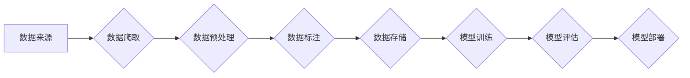

> 大规模语言模型，数据收集，数据预处理，数据清洗，数据标注，数据质量，数据安全，数据隐私

## 1. 背景介绍

大规模语言模型（Large Language Models，LLMs）近年来在自然语言处理领域取得了显著的进展，展现出强大的文本生成、翻译、摘要、问答等能力。这些模型的成功离不开海量数据的训练和支持。数据是LLMs发展的基石，高质量的数据是构建高性能模型的关键。本文将深入探讨大规模语言模型数据收集的各个环节，从数据来源、预处理、清洗、标注到数据质量评估等方面进行详细阐述，并分析数据安全和隐私保护等重要问题。

## 2. 核心概念与联系

**2.1 数据类型**

LLMs的数据类型主要包括：

* **文本数据:** 包括书籍、文章、网站内容、代码等各种形式的文本。
* **结构化数据:** 包括数据库、表格等结构化的数据，可以为模型提供语义理解和知识推理的帮助。
* **多模态数据:** 包括文本、图像、音频、视频等多种类型的数据，可以丰富模型的感知能力和表达能力。

**2.2 数据流程**

数据收集是一个复杂的过程，通常包括以下几个步骤：

* **数据来源确定:** 根据模型的应用场景和需求，确定合适的文本数据来源。
* **数据爬取:** 使用爬虫工具从网络或其他数据源中获取数据。
* **数据预处理:** 对收集到的数据进行清洗、格式化、编码等处理，使其符合模型的输入要求。
* **数据标注:** 为部分数据添加标签或标注，例如情感分类、实体识别等，用于训练监督学习模型。
* **数据存储:** 将处理后的数据存储在合适的数据库或文件系统中。

**2.3 数据质量**

数据质量是LLMs训练的关键因素，高质量的数据可以提高模型的性能和鲁棒性。数据质量包括以下几个方面：

* **准确性:** 数据内容准确无误。
* **完整性:** 数据涵盖了所有必要的方面。
* **一致性:** 数据格式和内容保持一致。
* **时效性:** 数据是最新且有效的。

**2.4 数据安全与隐私**

在收集和使用数据时，需要特别注意数据安全和隐私保护。

* **数据加密:** 对敏感数据进行加密，防止未经授权的访问。
* **数据匿名化:** 对个人身份信息进行匿名化处理，保护用户隐私。
* **数据访问控制:** 对数据访问进行严格控制，确保只有授权人员可以访问数据。

**2.5 Mermaid 流程图**



## 3. 核心算法原理 & 具体操作步骤

### 3.1 算法原理概述

数据收集的核心算法原理主要包括：

* **爬虫算法:** 用于从网络上抓取数据，常见的爬虫算法包括深度优先搜索算法和广度优先搜索算法。
* **数据清洗算法:** 用于去除数据中的噪声、重复数据和错误数据，常见的清洗算法包括正则表达式匹配、数据类型转换和数据去重等。
* **数据标注算法:** 用于为数据添加标签或标注，常见的标注算法包括规则匹配、机器学习和人工标注等。

### 3.2 算法步骤详解

**3.2.1 数据爬取**

1. **目标网站分析:** 分析目标网站的结构、内容和爬取规则。
2. **爬虫程序设计:** 使用爬虫框架或工具编写爬虫程序，定义爬取规则和数据提取方式。
3. **数据抓取:** 使用爬虫程序从目标网站抓取数据，并保存到本地文件或数据库中。

**3.2.2 数据清洗**

1. **数据格式转换:** 将不同格式的数据转换为统一格式，例如将文本数据转换为CSV格式。
2. **数据去重:** 去除重复的数据记录，确保数据唯一性。
3. **数据缺失处理:** 处理数据中的缺失值，例如使用平均值、中位数或其他填充方法。
4. **数据异常值处理:** 识别和处理异常值，例如使用箱线图或其他方法进行异常值检测。

**3.2.3 数据标注**

1. **标注任务定义:** 明确标注任务的目标和规则，例如情感分类、实体识别等。
2. **标注工具选择:** 选择合适的标注工具，例如Brat、Prodigy等。
3. **标注数据:** 人工标注数据，并确保标注的准确性和一致性。

### 3.3 算法优缺点

**优点:**

* **自动化程度高:** 爬虫算法和数据清洗算法可以自动化执行，提高效率。
* **数据量大:** 可以收集和处理海量数据。
* **成本低:** 相比人工收集数据，自动化数据收集成本更低。

**缺点:**

* **数据质量问题:** 自动化收集的数据可能存在噪声、重复数据和错误数据。
* **数据安全问题:** 爬虫程序可能被恶意利用，导致数据泄露。
* **法律法规限制:** 爬虫抓取数据需要遵守相关法律法规，例如网站的robots.txt文件。

### 3.4 算法应用领域

* **自然语言处理:** 用于训练语言模型、文本分类、情感分析等。
* **机器学习:** 用于训练机器学习模型，例如图像识别、语音识别等。
* **数据挖掘:** 用于挖掘数据中的隐藏模式和规律。
* **搜索引擎:** 用于收集网页数据，构建搜索索引。

## 4. 数学模型和公式 & 详细讲解 & 举例说明

### 4.1 数学模型构建

数据收集过程可以抽象为一个数学模型，其中数据源可以看作是一个集合，爬虫算法可以看作是一个映射函数，将数据源中的数据映射到目标数据集合中。

### 4.2 公式推导过程

假设数据源为集合D，目标数据集合为T，爬虫算法为函数f，则数据收集过程可以表示为：

```
T = f(D)
```

其中，f(D)表示使用爬虫算法f对数据源D进行处理，得到目标数据集合T。

### 4.3 案例分析与讲解

例如，假设我们想要收集所有关于人工智能的新闻文章，我们可以使用爬虫算法从网络上抓取相关网站的数据，然后对数据进行清洗和格式化，最终得到一个包含所有人工智能新闻文章的目标数据集合。

## 5. 项目实践：代码实例和详细解释说明

### 5.1 开发环境搭建

* 操作系统: Ubuntu 20.04
* Python 版本: 3.8
* 必要的库: requests, beautifulsoup4, pandas, numpy

### 5.2 源代码详细实现

```python
import requests
from bs4 import BeautifulSoup
import pandas as pd

def crawl_news(url):
    response = requests.get(url)
    response.raise_for_status()  # 检查请求是否成功

    soup = BeautifulSoup(response.content, 'html.parser')
    news_items = soup.find_all('article', class_='news-item')

    data = []
    for item in news_items:
        title = item.find('h2').text.strip()
        link = item.find('a')['href']
        content = item.find('p').text.strip()
        data.append({'title': title, 'link': link, 'content': content})

    return pd.DataFrame(data)

if __name__ == '__main__':
    url = 'https://www.example.com/news'  # 替换为目标网站的新闻页面URL
    df = crawl_news(url)
    print(df.head())
```

### 5.3 代码解读与分析

* 该代码首先使用requests库发送HTTP请求获取目标网页内容。
* 使用BeautifulSoup库解析网页HTML结构，找到包含新闻信息的元素。
* 提取新闻标题、链接和内容，并存储到列表中。
* 使用pandas库将列表转换为DataFrame格式，方便后续处理和分析。

### 5.4 运行结果展示

运行代码后，将输出目标网站新闻页面的前几条新闻信息，包括标题、链接和内容。

## 6. 实际应用场景

### 6.1 数据收集与训练

大规模语言模型的训练需要海量文本数据，数据收集是训练过程的第一步。

### 6.2 情感分析与舆情监测

收集社交媒体、新闻网站等平台上的文本数据，进行情感分析和舆情监测，了解公众对特定事件或产品的态度。

### 6.3 文本摘要与信息提取

收集大量文档，使用文本摘要和信息提取技术，快速获取关键信息。

### 6.4 机器翻译与跨语言理解

收集不同语言的文本数据，训练机器翻译模型，实现跨语言理解。

### 6.5 代码生成与软件开发

收集开源代码和代码文档，训练代码生成模型，辅助软件开发。

## 7. 工具和资源推荐

### 7.1 学习资源推荐

* **书籍:**
    * "Speech and Language Processing" by Jurafsky and Martin
    * "Natural Language Processing with Python" by Bird, Klein, and Loper
* **在线课程:**
    * Coursera: Natural Language Processing Specialization
    * edX: Artificial Intelligence

### 7.2 开发工具推荐

* **爬虫框架:** Scrapy, Selenium
* **数据处理工具:** Pandas, NumPy
* **数据标注工具:** Brat, Prodigy

### 7.3 相关论文推荐

* "BERT: Pre-training of Deep Bidirectional Transformers for Language Understanding"
* "GPT-3: Language Models are Few-Shot Learners"
* "T5: Text-to-Text Transfer Transformer"

## 8. 总结：未来发展趋势与挑战

### 8.1 研究成果总结

大规模语言模型数据收集技术取得了显著进展，自动化程度不断提高，数据质量也得到提升。

### 8.2 未来发展趋势

* **数据多样化:** 收集更多类型的数据，例如多模态数据、结构化数据等。
* **数据质量提升:** 开发更先进的数据清洗和标注算法，提高数据质量。
* **数据安全与隐私保护:** 加强数据安全和隐私保护措施，确保数据安全和合规性。

### 8.3 面临的挑战

* **数据获取成本:** 收集高质量数据成本高昂。
* **数据标注难度:** 数据标注工作耗时费力，需要大量人工参与。
* **数据偏见问题:** 数据可能存在偏见，影响模型的公平性和准确性。

### 8.4 研究展望

未来研究将重点关注数据收集的效率、质量和安全性，探索更智能、更可靠的数据收集方法，为大规模语言模型的发展提供高质量的数据支持。

## 9. 附录：常见问题与解答

**Q1: 如何选择合适的爬虫算法？**

**A1:** 选择爬虫算法需要根据目标网站的结构、内容和爬取规则进行分析。深度优先搜索算法适合爬取树状结构的网站，广度优先搜索算法适合爬取层级结构的网站。

**Q2: 如何处理爬虫抓取到的数据？**

**A2:** 爬虫抓取到的数据需要进行清洗、格式化和标注等处理，使其符合模型的输入要求。

**Q3: 如何保证数据安全和隐私？**

**A3:** 在收集和使用数据时，需要采取措施保护数据安全和隐私，例如数据加密、数据匿名化和数据访问控制。


作者：禅与计算机程序设计艺术 / Zen and the Art of Computer Programming 
<end_of_turn>