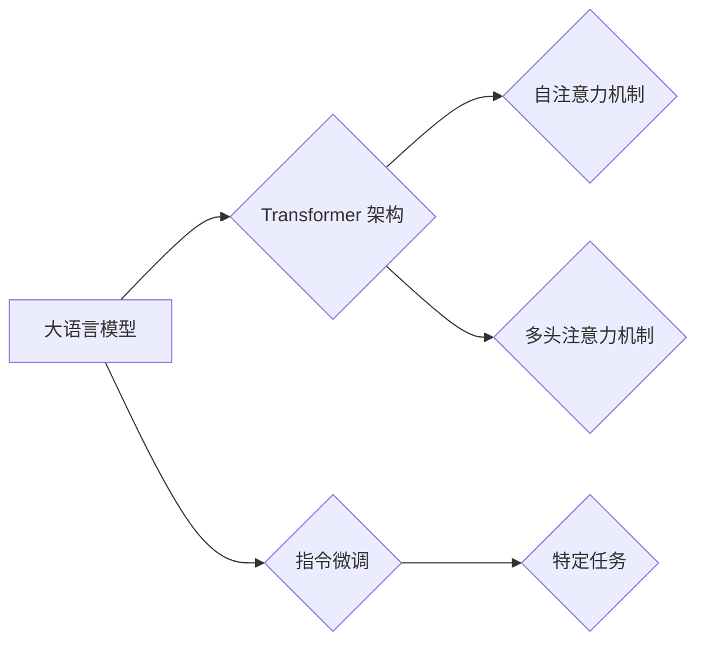

> 大语言模型、指令微调、7B 模型、深度学习、Transformer、自然语言处理

## 1. 背景介绍

近年来，深度学习技术取得了飞速发展，特别是 Transformer 架构的出现，为自然语言处理 (NLP) 领域带来了革命性的变革。大语言模型 (LLM) 作为深度学习在 NLP 领域的顶尖成果，展现出强大的文本生成、理解、翻译等能力。这些模型通常拥有数十亿甚至千亿的参数，通过海量文本数据的训练，能够学习到复杂的语言规律和知识。

然而，训练如此庞大的模型需要巨大的计算资源和时间成本，对于个人开发者和小型团队来说，难以负担。因此，如何高效地训练和部署 LLM 成为一个重要的研究方向。指令微调 (Instruction Tuning) 作为一种新的训练方法，通过在少量指令数据上进行微调，可以有效提升 LLM 在特定任务上的性能，降低训练成本和时间。

本篇文章将深入探讨大语言模型的原理和工程实践，并以 7B 大语言模型为例，手把手教你进行指令微调，帮助你快速入门 LLM 的训练和应用。

## 2. 核心概念与联系

### 2.1 大语言模型 (LLM)

大语言模型 (LLM) 是指参数量在数十亿甚至千亿级别的神经网络模型，通过学习海量文本数据，能够理解和生成人类语言。

### 2.2 Transformer 架构

Transformer 架构是 LLM 的核心技术之一，它通过自注意力机制 (Self-Attention) 和多头注意力机制 (Multi-Head Attention) 能够捕捉文本序列中的长距离依赖关系，有效提升了模型的表达能力。

### 2.3 指令微调 (Instruction Tuning)

指令微调是一种针对特定任务进行模型微调的方法，通过在少量指令数据上进行训练，可以提升模型在该任务上的性能。

**核心概念与联系流程图:**



## 3. 核心算法原理 & 具体操作步骤

### 3.1 算法原理概述

指令微调的核心思想是通过在少量指令数据上进行训练，让模型学习到指令的格式和语义，从而能够更好地理解和执行用户的指令。

具体来说，指令微调的过程可以分为以下几个步骤：

1. **准备指令数据集:** 收集包含指令和对应输出的文本数据。
2. **加载预训练模型:** 使用预训练好的 LLM 模型作为基础。
3. **微调模型参数:** 在指令数据集上进行训练，更新模型的参数。
4. **评估模型性能:** 使用测试数据集评估模型在特定任务上的性能。

### 3.2 算法步骤详解

1. **准备指令数据集:** 指令数据集需要包含多种类型的指令，例如问答、文本生成、翻译等。每个指令都应该包含一个明确的指令和一个对应的输出。

2. **加载预训练模型:** 选择一个预训练好的 LLM 模型作为基础，例如 GPT-3、BERT 等。

3. **微调模型参数:** 使用梯度下降算法在指令数据集上进行训练，更新模型的参数。

4. **评估模型性能:** 使用测试数据集评估模型在特定任务上的性能，例如准确率、BLEU 分数等。

### 3.3 算法优缺点

**优点:**

* 训练成本低: 相比于从头训练 LLM，指令微调只需要微调少量参数，因此训练成本更低。
* 效率高: 指令微调的训练时间也比从头训练 LLM 短很多。
* 性能提升: 指令微调可以有效提升模型在特定任务上的性能。

**缺点:**

* 数据依赖: 指令微调需要高质量的指令数据集，否则模型性能会受到影响。
* 任务局限性: 指令微调的效果主要体现在特定任务上，对于其他任务的性能提升可能有限。

### 3.4 算法应用领域

指令微调在许多 NLP 任务中都有广泛的应用，例如:

* **问答系统:** 指令微调可以训练出能够理解用户问题并给出准确答案的问答系统。
* **文本生成:** 指令微调可以训练出能够根据用户指令生成不同风格和类型的文本的模型。
* **机器翻译:** 指令微调可以提升机器翻译模型的准确性和流畅度。
* **代码生成:** 指令微调可以训练出能够根据用户指令生成代码的模型。

## 4. 数学模型和公式 & 详细讲解 & 举例说明

### 4.1 数学模型构建

指令微调的核心是使用 Transformer 架构的 LLM 模型，并通过在指令数据上进行微调来提升模型的性能。

**模型结构:**

Transformer 模型通常由以下几个部分组成:

* **输入层:** 将输入文本序列转换为词嵌入向量。
* **编码器:** 使用多层 Transformer 块对输入文本序列进行编码，提取文本的语义信息。
* **解码器:** 使用多层 Transformer 块对编码后的文本序列进行解码，生成输出文本序列。
* **输出层:** 将解码器的输出转换为最终的预测结果。

### 4.2 公式推导过程

Transformer 模型的核心是自注意力机制和多头注意力机制。

**自注意力机制:**

```latex
Attention(Q, K, V) = softmax(Q K^T / sqrt(d_k)) V
```

其中:

* Q: 查询矩阵
* K: 键矩阵
* V: 值矩阵
* d_k: 键向量的维度

**多头注意力机制:**

```latex
MultiHeadAttention(Q, K, V) = Concat(head_1, head_2, ..., head_h) * WO
```

其中:

* head_i: 第 i 个注意力头的输出
* h: 多头数量
* WO: 全连接层的权重矩阵

### 4.3 案例分析与讲解

假设我们有一个指令数据集，包含以下指令和输出对:

* 指令: "翻译 'Hello world' 到西班牙语"
* 输出: "Hola mundo"

使用指令微调方法，我们可以训练一个 LLM 模型，使其能够理解这个指令，并生成正确的输出。

## 5. 项目实践：代码实例和详细解释说明

### 5.1 开发环境搭建

为了进行 7B 大语言模型的指令微调，我们需要搭建一个合适的开发环境。

**硬件要求:**

* GPU: 至少拥有 16GB 显存的 GPU

**软件环境:**

* Python 3.7+
* PyTorch 1.7+
* Transformers 4.0+

### 5.2 源代码详细实现

```python
from transformers import AutoModelForSeq2SeqLM, AutoTokenizer

# 加载预训练模型和词典
model_name = "facebook/bart-large-cnn"
model = AutoModelForSeq2SeqLM.from_pretrained(model_name)
tokenizer = AutoTokenizer.from_pretrained(model_name)

# 定义训练数据
train_dataset = [
    ("翻译 'Hello world' 到西班牙语", "Hola mundo"),
    # ... 其他指令数据
]

# 定义训练参数
batch_size = 16
learning_rate = 2e-5
epochs = 3

# 训练模型
optimizer = torch.optim.AdamW(model.parameters(), lr=learning_rate)
for epoch in range(epochs):
    for batch in train_dataset:
        input_ids = tokenizer(batch[0], return_tensors="pt").input_ids
        labels = tokenizer(batch[1], return_tensors="pt").input_ids
        outputs = model(input_ids=input_ids, labels=labels)
        loss = outputs.loss
        optimizer.zero_grad()
        loss.backward()
        optimizer.step()

# 保存模型
model.save_pretrained("my_instruction_tuned_model")
```

### 5.3 代码解读与分析

这段代码实现了 7B 大语言模型的指令微调过程。

1. **加载预训练模型和词典:** 使用 `transformers` 库加载预训练好的 BART 模型和词典。
2. **定义训练数据:** 创建一个包含指令和输出对的训练数据集。
3. **定义训练参数:** 设置训练参数，例如 batch_size、learning_rate 和 epochs。
4. **训练模型:** 使用 AdamW 优化器对模型进行训练，并计算损失函数。
5. **保存模型:** 将训练好的模型保存到本地。

### 5.4 运行结果展示

训练完成后，我们可以使用训练好的模型进行指令微调后的性能评估。

## 6. 实际应用场景

### 6.1 指令微调的应用场景

指令微调在许多实际应用场景中都有广泛的应用，例如:

* **智能客服:** 指令微调可以训练出能够理解用户问题并提供准确答案的智能客服机器人。
* **个性化教育:** 指令微调可以训练出能够根据学生的学习进度和需求提供个性化学习内容的教育系统。
* **代码辅助:** 指令微调可以训练出能够根据用户的代码需求生成代码片段的代码辅助工具。

### 6.2 未来应用展望

随着大语言模型技术的不断发展，指令微调的应用场景将会更加广泛。

* **多模态指令理解:** 指令微调可以扩展到多模态数据，例如文本、图像、音频等，实现更全面的指令理解。
* **实时指令响应:** 指令微调可以用于训练能够实时响应用户指令的模型，例如智能家居设备、自动驾驶系统等。
* **跨语言指令理解:** 指令微调可以训练出能够理解不同语言的指令的模型，实现跨语言的指令交互。

## 7. 工具和资源推荐

### 7.1 学习资源推荐

* **Hugging Face Transformers:** https://huggingface.co/docs/transformers/index
* **OpenAI API:** https://beta.openai.com/docs/api-reference/introduction
* **DeepLearning.AI:** https://www.deeplearning.ai/

### 7.2 开发工具推荐

* **PyTorch:** https://pytorch.org/
* **TensorFlow:** https://www.tensorflow.org/
* **Jupyter Notebook:** https://jupyter.org/

### 7.3 相关论文推荐

* **BERT: Pre-training of Deep Bidirectional Transformers for Language Understanding:** https://arxiv.org/abs/1810.04805
* **GPT-3: Language Models are Few-Shot Learners:** https://arxiv.org/abs/2005.14165
* **Instruction Tuning for Text Generation:** https://arxiv.org/abs/2105.00611

## 8. 总结：未来发展趋势与挑战

### 8.1 研究成果总结

近年来，大语言模型和指令微调技术取得了显著的进展，在许多 NLP 任务中取得了优异的性能。

### 8.2 未来发展趋势

未来，大语言模型和指令微调技术将会朝着以下几个方向发展:

* **模型规模的进一步扩大:** 随着计算资源的不断提升，大语言模型的规模将会进一步扩大，模型的能力将会得到进一步提升。
* **多模态指令理解:** 指令微调将会扩展到多模态数据，实现更全面的指令理解。
* **个性化指令微调:** 指令微调将会更加个性化，能够根据用户的需求和偏好进行定制。

### 8.3 面临的挑战

大语言模型和指令微调技术也面临着一些挑战:

* **数据获取和标注:** 大规模高质量的指令数据集的获取和标注仍然是一个难题。
* **模型训练成本:** 训练大型语言模型需要大量的计算资源，成本较高。
* **模型安全性:** 大语言模型可能存在一些安全风险，例如生成有害内容、进行恶意攻击等。

### 8.4 研究