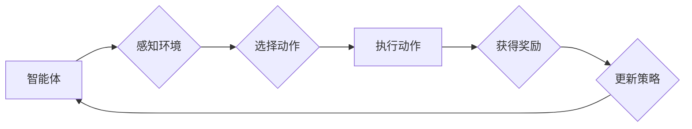

> 强化学习，游戏AI，深度强化学习，Q学习，DQN，游戏策略，智能体，奖励机制

## 1. 背景介绍

游戏作为一种娱乐和休闲活动，也逐渐成为人工智能研究的重要应用领域。游戏AI的目标是让游戏中的虚拟角色能够表现出智能的行为，与人类玩家进行交互，并提供更具挑战性和趣味性的游戏体验。传统的基于规则的游戏AI通常难以应对复杂的游戏环境和玩家行为，而强化学习（Reinforcement Learning，RL）作为一种机器学习方法，能够有效地解决这一问题。

强化学习的核心思想是通过奖励机制来训练智能体，使其在环境中采取最优的行动。智能体通过与环境的交互，获得奖励或惩罚，并根据这些反馈信息不断调整自己的策略，最终学习到最优的游戏策略。

## 2. 核心概念与联系

**2.1 强化学习核心概念**

* **智能体 (Agent):**  在游戏环境中做出决策的实体。
* **环境 (Environment):** 智能体所处的世界，包括游戏规则、游戏状态和玩家行为等。
* **状态 (State):** 环境在某个时刻的描述，例如游戏地图、玩家位置、游戏资源等。
* **动作 (Action):** 智能体可以采取的行动，例如移动、攻击、使用道具等。
* **奖励 (Reward):** 智能体采取行动后获得的反馈，可以是正向奖励（例如获得积分）或负向奖励（例如损失生命值）。
* **策略 (Policy):** 智能体根据当前状态选择动作的规则。

**2.2 强化学习与游戏AI的联系**

强化学习为游戏AI提供了强大的学习能力，使其能够：

* **学习复杂的游戏策略:** RL算法可以学习到复杂的策略，即使游戏规则非常复杂，玩家行为也难以预测。
* **适应动态变化的游戏环境:** RL算法可以根据环境的变化不断调整策略，适应不断变化的游戏环境。
* **提高游戏体验:** RL算法可以使游戏AI更加智能和富有挑战性，从而提高玩家的游戏体验。

**2.3 强化学习流程图**



## 3. 核心算法原理 & 具体操作步骤

### 3.1 算法原理概述

Q学习是强化学习中的一种经典算法，它通过学习一个Q表来评估每个状态-动作对的价值，并根据Q表选择最优的动作。Q表是一个表格，其中每个单元格存储了在特定状态下执行特定动作的期望回报。

### 3.2 算法步骤详解

1. **初始化Q表:** 将Q表中的所有单元格初始化为0。
2. **选择初始状态:** 从环境中随机选择一个初始状态。
3. **选择动作:** 根据当前状态和Q表，选择一个动作。可以使用ε-贪婪策略，即以概率ε随机选择一个动作，否则选择Q表中最大值的动作。
4. **执行动作:** 在环境中执行选择的动作。
5. **获得奖励:** 从环境中获得奖励。
6. **更新Q表:** 使用Bellman方程更新Q表中的值：

```
Q(s, a) = Q(s, a) + α * [r + γ * max(Q(s', a')) - Q(s, a)]
```

其中：

* Q(s, a) 是在状态s下执行动作a的期望回报。
* α 是学习率，控制着学习速度。
* r 是获得的奖励。
* γ 是折扣因子，控制着未来奖励的权重。
* s' 是执行动作a后进入的下一个状态。
* max(Q(s', a')) 是在下一个状态s'下所有动作的期望回报的最大值。

7. **重复步骤3-6:** 直到达到终止条件，例如游戏结束或训练次数达到上限。

### 3.3 算法优缺点

**优点:**

* 算法简单易懂，易于实现。
* 可以应用于离散状态和动作空间的游戏。

**缺点:**

* 随着状态空间的增大，Q表的规模会指数级增长，导致存储和计算成本增加。
* 难以处理连续状态和动作空间的游戏。

### 3.4 算法应用领域

Q学习广泛应用于各种游戏AI领域，例如：

* **策略游戏:** 围棋、象棋、Go等。
* **动作游戏:** 平台跳跃、射击、格斗等。
* **角色扮演游戏:** 探索、战斗、对话等。

## 4. 数学模型和公式 & 详细讲解 & 举例说明

### 4.1 数学模型构建

强化学习的数学模型可以概括为一个马尔可夫决策过程 (MDP)，它由以下四个要素组成：

* **状态空间 S:** 所有可能的系统状态的集合。
* **动作空间 A:** 在每个状态下可执行的动作集合。
* **转移概率 P(s', r | s, a):** 从状态s执行动作a后转移到状态s'并获得奖励r的概率。
* **奖励函数 R(s, a):** 在状态s执行动作a获得的奖励。

### 4.2 公式推导过程

Q学习算法的核心是Bellman方程，它描述了在状态s下执行动作a的期望回报与后续状态和动作的期望回报之间的关系：

```
Q(s, a) = E[R(s, a) + γ * max(Q(s', a'))]
```

其中：

* E[] 表示期望值。
* γ 是折扣因子，控制着未来奖励的权重。
* s' 是执行动作a后进入的下一个状态。
* max(Q(s', a')) 是在下一个状态s'下所有动作的期望回报的最大值。

### 4.3 案例分析与讲解

假设我们有一个简单的游戏，状态空间为{“开始”，“游戏结束”}, 动作空间为{“前进”，“后退”}, 转移概率和奖励函数如下：

* P(s' = "游戏结束", r = 10 | s = "开始", a = "前进") = 1
* P(s' = "开始", r = 0 | s = "开始", a = "后退") = 1

初始Q表为：

| 状态 | 动作 | Q值 |
|---|---|---|
| 开始 | 前进 | 0 |
| 开始 | 后退 | 0 |

根据Bellman方程，我们可以更新Q表：

* Q("开始", "前进") = 10
* Q("开始", "后退") = 0

因此，智能体在“开始”状态下应该选择“前进”动作，因为这将获得最大的奖励。

## 5. 项目实践：代码实例和详细解释说明

### 5.1 开发环境搭建

* Python 3.x
* TensorFlow 或 PyTorch

### 5.2 源代码详细实现

```python
import numpy as np

# 定义状态空间和动作空间
states = ["开始", "游戏结束"]
actions = ["前进", "后退"]

# 定义转移概率和奖励函数
transition_probabilities = {
    ("开始", "前进"): 1.0,
    ("开始", "后退"): 1.0,
}
rewards = {
    ("开始", "前进"): 10,
    ("开始", "后退"): 0,
}

# 定义Q表
q_table = np.zeros((len(states), len(actions)))

# 定义学习参数
alpha = 0.1
gamma = 0.9

# 训练过程
for episode in range(1000):
    current_state = "开始"
    while current_state != "游戏结束":
        # 选择动作
        action = np.argmax(q_table[states.index(current_state)])

        # 执行动作
        next_state, reward = transition_probabilities[(current_state, action)], rewards[(current_state, action)]

        # 更新Q表
        q_table[states.index(current_state), actions.index(action)] = q_table[states.index(current_state), actions.index(action)] + alpha * (reward + gamma * np.max(q_table[states.index(next_state)]) - q_table[states.index(current_state), actions.index(action)])

        # 更新当前状态
        current_state = next_state

# 打印最终的Q表
print(q_table)
```

### 5.3 代码解读与分析

* 代码首先定义了状态空间、动作空间、转移概率和奖励函数。
* 然后初始化Q表，并定义学习参数。
* 训练过程是一个循环，每次循环模拟一个游戏回合。
* 在每个回合中，智能体根据Q表选择动作，执行动作，并根据奖励更新Q表。
* 训练结束后，打印最终的Q表，可以看出智能体已经学会了在不同状态下选择最优的动作。

### 5.4 运行结果展示

运行代码后，输出的Q表会显示出智能体在不同状态下选择不同动作的期望回报。例如，在“开始”状态下，选择“前进”动作的期望回报会比选择“后退”动作的期望回报高得多。

## 6. 实际应用场景

### 6.1 游戏AI开发

强化学习在游戏AI开发中应用广泛，例如：

* **策略游戏:** 围棋、象棋、Go等。
* **动作游戏:** 平台跳跃、射击、格斗等。
* **角色扮演游戏:** 探索、战斗、对话等。

### 6.2 机器人控制

强化学习可以用于训练机器人控制算法，使机器人能够在复杂环境中自主导航和执行任务。

### 6.3 自动驾驶

强化学习可以用于训练自动驾驶算法，使车辆能够在复杂交通环境中安全行驶。

### 6.4 其他应用场景

强化学习还可以应用于其他领域，例如推荐系统、医疗诊断、金融交易等。

### 6.4 未来应用展望

随着人工智能技术的不断发展，强化学习在游戏AI领域的应用将会更加广泛和深入。未来，我们可能会看到：

* 更智能、更具挑战性的游戏AI。
* 基于强化学习的个性化游戏体验。
* 强化学习与其他人工智能技术的融合，例如深度学习、自然语言处理等。

## 7. 工具和资源推荐

### 7.1 学习资源推荐

* **书籍:**
    * Reinforcement Learning: An Introduction by Richard S. Sutton and Andrew G. Barto
    * Deep Reinforcement Learning Hands-On by Maxim Lapan
* **在线课程:**
    * Coursera: Reinforcement Learning Specialization by David Silver
    * Udacity: Deep Reinforcement Learning Nanodegree

### 7.2 开发工具推荐

* **TensorFlow:** 开源深度学习框架，支持强化学习算法的实现。
* **PyTorch:** 开源深度学习框架，也支持强化学习算法的实现。
* **OpenAI Gym:** 强化学习环境库，提供各种标准游戏环境。

### 7.3 相关论文推荐

* Deep Q-Network (DQN)
* Proximal Policy Optimization (PPO)
* Asynchronous Advantage Actor-Critic (A3C)

## 8. 总结：未来发展趋势与挑战

### 8.1 研究成果总结

强化学习在游戏AI领域取得了显著的成果，例如AlphaGo、AlphaStar等。这些成果证明了强化学习的强大能力，并推动了人工智能技术的进步。

### 8.2 未来发展趋势

未来，强化学习在游戏AI领域的发展趋势包括：

* **更强大的算法:** 研究更强大的强化学习算法，例如基于深度学习的强化学习算法，以提高游戏AI的智能水平。
* **更复杂的场景:** 将强化学习应用于更复杂的场景，例如开放世界游戏、多人游戏等。
* **更个性化的体验:** 基于强化学习提供更个性