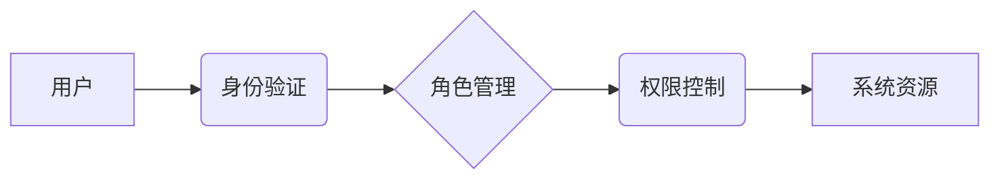

> 授权、最小权限、安全、访问控制、权限管理、身份验证、数据保护、云计算、DevOps

## 1. 背景介绍

在当今数字化时代，数据安全和隐私保护日益受到重视。随着云计算、移动互联网和物联网等技术的快速发展，数据存储和处理方式发生了巨大变化，也带来了新的安全挑战。传统的授权机制往往过于宽松，容易导致数据泄露和滥用。因此，遵循最小权限原则，即只授予用户或应用程序在完成特定任务所需的最小权限，成为保障数据安全和隐私的关键策略。

## 2. 核心概念与联系

**2.1 最小权限原则**

最小权限原则（Principle of Least Privilege，简称PoLP）是信息安全领域的基本原则之一。它规定，任何用户或应用程序都只能访问和使用其完成工作所需的最小权限。

**2.2 授权机制**

授权机制是指控制用户或应用程序访问系统资源的机制。它通常包括以下几个关键要素：

* **身份验证:** 确认用户的身份，确保只有授权的用户才能访问系统资源。
* **角色管理:** 将用户分组为不同的角色，并为每个角色分配相应的权限。
* **权限控制:** 对系统资源进行细粒度控制，规定每个用户或角色可以执行哪些操作。

**2.3 关系图**



**2.4 核心概念联系**

最小权限原则贯穿于整个授权机制的各个环节。身份验证确保只有授权的用户才能参与授权过程，角色管理将用户分组并分配相应的权限，权限控制则根据最小权限原则，只授予用户或应用程序完成特定任务所需的最小权限。

## 3. 核心算法原理 & 具体操作步骤

**3.1 算法原理概述**

最小权限原则的实现通常依赖于以下算法和技术：

* **属性基元模型:** 将用户、角色和资源的权限信息表示为属性基元，并使用规则引擎进行权限决策。
* **细粒度权限控制:** 对系统资源进行细粒度控制，例如对文件或数据库表进行读写权限的控制。
* **动态权限管理:** 根据用户行为和环境变化动态调整权限，确保用户始终只拥有必要的权限。

**3.2 算法步骤详解**

1. **定义权限模型:** 首先需要定义一个权限模型，明确用户、角色、资源以及相应的权限。
2. **分配角色:** 将用户分配到不同的角色中，每个角色对应特定的权限集。
3. **授权资源:** 为每个资源分配相应的权限，例如读、写、执行等。
4. **权限决策:** 当用户请求访问资源时，系统会根据用户的角色和资源的权限信息进行决策，判断用户是否具有访问权限。

**3.3 算法优缺点**

* **优点:**
    * 提高了数据安全性和隐私保护。
    * 降低了系统攻击面。
    * 增强了系统可管理性和可维护性。
* **缺点:**
    * 权限管理复杂度较高。
    * 需要对用户和资源进行细粒度管理。
    * 可能导致用户体验下降。

**3.4 算法应用领域**

最小权限原则广泛应用于各种领域，例如：

* **云计算:** 控制用户对云资源的访问权限。
* **移动互联网:** 保护用户隐私和数据安全。
* **物联网:** 控制设备之间的通信和数据访问。
* **企业内部网络:** 控制员工对敏感数据的访问权限。

## 4. 数学模型和公式 & 详细讲解 & 举例说明

**4.1 数学模型构建**

我们可以用集合论来构建最小权限原则的数学模型。

* **U:** 用户集合
* **R:** 资源集合
* **P:** 权限集合
* **A(u, r):** 用户u对资源r拥有权限的二元关系

**4.2 公式推导过程**

最小权限原则可以表述为以下公式：

```latex
\forall u \in U, \forall r \in R, A(u, r) \Rightarrow \exists p \in P, p \subseteq A(u, r)
```

该公式表示，如果用户u对资源r拥有权限，则存在一个权限集p，该权限集包含了用户u对资源r的所有权限。

**4.3 案例分析与讲解**

假设我们有一个系统，包含用户集合U = {Alice, Bob, Charlie}, 资源集合R = {文件A, 文件B, 文件C} 和权限集合P = {读, 写, 执行}。

根据最小权限原则，如果Alice对文件A拥有读权限，则存在一个权限集p，其中p包含了Alice对文件A的读权限，即A(Alice, 文件A) => p = {读}。

## 5. 项目实践：代码实例和详细解释说明

**5.1 开发环境搭建**

本示例使用Python语言和Flask框架进行开发。

* 安装Python环境
* 安装Flask框架：pip install Flask

**5.2 源代码详细实现**

```python
from flask import Flask, request, jsonify

app = Flask(__name__)

# 用户角色和权限信息
users = {
    'Alice': {'role': 'editor', 'permissions': ['read', 'write']},
    'Bob': {'role': 'viewer', 'permissions': ['read']},
}

# 资源权限信息
resources = {
    'fileA': {'permissions': ['read', 'write', 'execute']},
    'fileB': {'permissions': ['read', 'write']},
}

@app.route('/access', methods=['POST'])
def access():
    data = request.get_json()
    user = data['user']
    resource = data['resource']

    # 检查用户是否存在
    if user not in users:
        return jsonify({'error': 'User not found'}), 404

    # 检查用户权限
    if resource not in resources:
        return jsonify({'error': 'Resource not found'}), 404

    user_permissions = users[user]['permissions']
    resource_permissions = resources[resource]['permissions']

    # 检查用户是否具有访问权限
    if any(permission in user_permissions for permission in resource_permissions):
        return jsonify({'message': 'Access granted'}), 200
    else:
        return jsonify({'error': 'Access denied'}), 403

if __name__ == '__main__':
    app.run(debug=True)
```

**5.3 代码解读与分析**

* 该代码实现了一个简单的授权系统，用户需要通过POST请求发送包含用户和资源信息的JSON数据。
* 系统会根据用户的角色和权限信息，以及资源的权限信息，判断用户是否具有访问权限。
* 如果用户具有访问权限，则返回成功消息；否则，返回拒绝访问消息。

**5.4 运行结果展示**

运行代码后，可以使用Postman等工具发送请求测试授权系统。

## 6. 实际应用场景

**6.1 云计算平台**

在云计算平台中，最小权限原则可以用于控制用户对云资源的访问权限。例如，用户可以根据不同的角色，例如开发人员、测试人员和运维人员，分配不同的权限，例如访问特定虚拟机、存储空间或数据库。

**6.2 移动应用程序**

在移动应用程序中，最小权限原则可以用于保护用户隐私和数据安全。例如，应用程序可以只请求用户必要的权限，例如访问位置信息或摄像头，而不是请求所有权限。

**6.3 企业内部网络**

在企业内部网络中，最小权限原则可以用于控制员工对敏感数据的访问权限。例如，员工可以根据不同的职位和职责，分配不同的权限，例如访问财务数据、人力资源数据或客户数据。

**6.4 未来应用展望**

随着人工智能、物联网和区块链等技术的快速发展，最小权限原则将在更多领域得到应用。例如，在人工智能领域，最小权限原则可以用于控制人工智能模型对数据的访问权限，防止数据泄露和滥用。在物联网领域，最小权限原则可以用于控制设备之间的通信和数据访问，提高网络安全性和可靠性。

## 7. 工具和资源推荐

**7.1 学习资源推荐**

* **书籍:**
    * 《The Practice of Security Engineering》
    * 《Applied Cryptography》
* **在线课程:**
    * Coursera: Security Engineering
    * Udemy: The Complete Ethical Hacking Course

**7.2 开发工具推荐**

* **身份验证和授权框架:**
    * OAuth 2.0
    * OpenID Connect
* **权限管理系统:**
    * Keycloak
    * Auth0

**7.3 相关论文推荐**

* **最小权限原则的应用研究:**
    * "The Principle of Least Privilege: A Survey"
    * "A Survey of Access Control Models"

## 8. 总结：未来发展趋势与挑战

**8.1 研究成果总结**

最小权限原则是一种重要的信息安全原则，它可以有效地提高数据安全性和隐私保护。近年来，随着技术的进步，最小权限原则的实现方式也越来越完善，例如属性基元模型、细粒度权限控制和动态权限管理等。

**8.2 未来发展趋势**

未来，最小权限原则的发展趋势包括：

* **更加细粒度的权限控制:** 将权限控制细化到更小的粒度，例如对单个数据元素进行权限控制。
* **更加动态的权限管理:** 根据用户行为和环境变化动态调整权限，确保用户始终只拥有必要的权限。
* **更加智能的权限决策:** 利用人工智能技术，自动分析用户行为和环境信息，智能地进行权限决策。

**8.3 面临的挑战**

最小权限原则的实施也面临一些挑战：

* **权限管理复杂度:** 细粒度权限控制和动态权限管理会增加权限管理的复杂度。
* **用户体验:** 过于严格的权限控制可能会影响用户体验。
* **技术实现:** 实现更加细粒度和动态的权限控制需要新的技术和算法。

**8.4 研究展望**

未来，需要进一步研究如何解决最小权限原则的实施挑战，例如开发更加高效的权限管理工具和算法，以及探索如何平衡数据安全和用户体验。


## 9. 附录：常见问题与解答

**9.1 如何实现细粒度权限控制？**

细粒度权限控制可以通过以下几种方式实现：

* **基于属性的访问控制:** 将用户、角色和资源的权限信息表示为属性，并使用规则引擎进行权限决策。
* **基于角色的访问控制:** 将用户分组为不同的角色，并为每个角色分配相应的权限。
* **基于策略的访问控制:** 使用策略语言定义权限规则，并根据规则进行权限决策。

**9.2 如何平衡数据安全和用户体验？**

在实现最小权限原则时，需要平衡数据安全和用户体验。可以采用以下策略：

* **提供用户友好的权限管理界面:** 使用户能够方便地查看和管理自己的权限。
* **使用动态权限管理:** 根据用户行为和环境变化动态调整权限，避免过度限制用户访问。
* **提供必要的帮助和支持:** 为用户提供关于权限管理的帮助和支持，帮助他们理解和使用权限机制。


作者：禅与计算机程序设计艺术 / Zen and the Art of Computer Programming 
<end_of_turn>