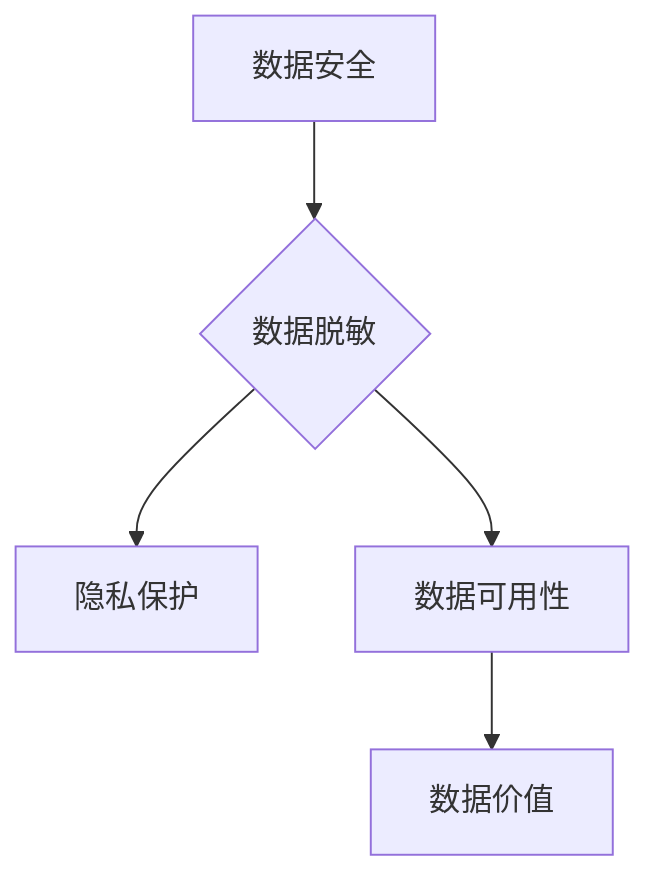

> 数据脱敏，数据安全，隐私保护，数据加密，正则表达式，代码实战，Python

## 1. 背景介绍

随着数字化转型和数据经济的蓬勃发展，数据已成为企业和组织的核心资产。然而，数据也面临着越来越多的安全威胁，例如数据泄露、数据滥用和数据隐私侵犯。为了保护数据安全和用户隐私，数据脱敏技术应运而生。

数据脱敏是指对敏感数据进行处理，使其无法直接识别个人身份或其他敏感信息，而保留数据本身的价值和可用性。数据脱敏技术广泛应用于各个领域，例如金融、医疗、教育、政府等，帮助企业和组织遵守数据隐私法规，降低数据安全风险。

## 2. 核心概念与联系

数据脱敏的核心概念包括：

* **敏感数据：** 能够识别个人身份或其他敏感信息的数据，例如姓名、身份证号码、地址、电话号码、银行卡号等。
* **脱敏技术：** 用于处理敏感数据的技术，例如数据加密、数据模糊化、数据替换等。
* **隐私保护：** 通过数据脱敏技术保护个人隐私，防止数据滥用和泄露。

数据脱敏与数据安全密切相关，两者共同构成了数据安全防护体系。数据脱敏技术可以帮助企业和组织降低数据安全风险，而数据安全技术可以帮助企业和组织保护数据免受攻击和破坏。



## 3. 核心算法原理 & 具体操作步骤

### 3.1  算法原理概述

数据脱敏算法主要分为以下几种类型：

* **数据加密：** 使用加密算法将敏感数据转换为不可读的形式，只有拥有解密密钥的人才能解密数据。
* **数据模糊化：** 对敏感数据进行处理，使其无法直接识别个人身份，例如将姓名替换为“先生/女士”，将电话号码替换为“XXXX-XXXX”。
* **数据替换：** 将敏感数据替换为随机值或其他非敏感值。

### 3.2  算法步骤详解

以数据模糊化为例，其具体操作步骤如下：

1. **识别敏感数据：** 首先需要识别出需要脱敏的数据字段，例如姓名、地址、电话号码等。
2. **选择脱敏方法：** 根据数据类型和脱敏需求，选择合适的脱敏方法，例如姓名模糊化可以使用“先生/女士”替换，地址模糊化可以使用“XXXX区XXXX路”替换。
3. **执行脱敏操作：** 使用编程语言或工具对敏感数据进行脱敏操作，将敏感数据替换为非敏感值。
4. **验证脱敏结果：** 验证脱敏后的数据是否满足脱敏需求，例如是否能够有效保护个人隐私。

### 3.3  算法优缺点

**数据加密：**

* **优点：** 安全性高，能够有效保护数据免受未授权访问。
* **缺点：** 复杂度高，需要管理密钥，解密过程可能需要消耗大量资源。

**数据模糊化：**

* **优点：** 简单易用，操作成本低，能够保留数据的可用性。
* **缺点：** 安全性相对较低，部分敏感信息可能仍然可以被识别。

**数据替换：**

* **优点：** 操作简单，能够快速完成脱敏操作。
* **缺点：** 安全性相对较低，数据可用性可能受到影响。

### 3.4  算法应用领域

数据脱敏算法广泛应用于各个领域，例如：

* **金融：** 脱敏客户信息，保护客户隐私。
* **医疗：** 脱敏患者信息，保护患者隐私。
* **教育：** 脱敏学生信息，保护学生隐私。
* **政府：** 脱敏公民信息，保护公民隐私。

## 4. 数学模型和公式 & 详细讲解 & 举例说明

### 4.1  数学模型构建

数据脱敏算法的数学模型通常基于概率论和信息论。例如，数据模糊化算法可以使用概率分布模型来生成模糊化后的数据，确保模糊化后的数据符合真实数据分布。

### 4.2  公式推导过程

数据加密算法通常使用数学函数进行加密和解密，例如AES算法使用置换、置换逆、S盒等数学函数进行加密和解密。

### 4.3  案例分析与讲解

例如，可以使用贝叶斯定理来分析数据脱敏的效果。假设我们有一个包含敏感信息的数据库，我们使用数据脱敏技术对数据库进行脱敏处理。我们可以使用贝叶斯定理来计算脱敏后数据库中敏感信息的泄露概率。

## 5. 项目实践：代码实例和详细解释说明

### 5.1  开发环境搭建

本项目使用Python语言进行开发，需要安装以下软件：

* Python 3.x
* Pandas
* NumPy
* Scikit-learn

### 5.2  源代码详细实现

```python
import pandas as pd
from sklearn.preprocessing import LabelEncoder

# 读取数据
data = pd.read_csv('data.csv')

# 识别敏感数据
sensitive_cols = ['姓名', '身份证号码', '地址']

# 数据脱敏
for col in sensitive_cols:
    # 使用LabelEncoder进行数据编码
    encoder = LabelEncoder()
    data[col] = encoder.fit_transform(data[col])

# 保存脱敏后的数据
data.to_csv('de_sensitized_data.csv', index=False)
```

### 5.3  代码解读与分析

* 使用Pandas库读取数据，并识别需要脱敏的敏感数据字段。
* 使用Scikit-learn库中的LabelEncoder进行数据编码，将敏感数据转换为数字形式。
* 将脱敏后的数据保存到新的CSV文件。

### 5.4  运行结果展示

运行代码后，将生成一个新的CSV文件，其中敏感数据已被脱敏。

## 6. 实际应用场景

数据脱敏技术在各个领域都有广泛的应用场景，例如：

* **金融行业：** 脱敏客户信息，用于数据分析和风险管理，同时保护客户隐私。
* **医疗行业：** 脱敏患者信息，用于医疗研究和疾病预防，同时保护患者隐私。
* **教育行业：** 脱敏学生信息，用于教育数据分析和教学改进，同时保护学生隐私。

### 6.4  未来应用展望

随着数据量的不断增长和数据安全意识的提高，数据脱敏技术将迎来更广泛的应用。未来，数据脱敏技术将更加智能化、自动化和个性化，能够更好地满足不同场景的数据脱敏需求。

## 7. 工具和资源推荐

### 7.1  学习资源推荐

* **书籍：**
    * 《数据脱敏与隐私保护》
    * 《数据安全与隐私保护》
* **在线课程：**
    * Coursera：数据隐私与安全
    * Udemy：数据脱敏与隐私保护

### 7.2  开发工具推荐

* **Python：** 
    * Pandas
    * Scikit-learn
    * TensorFlow
* **Java：** 
    * Apache Spark
    * Hadoop

### 7.3  相关论文推荐

* **论文：**
    * 《数据脱敏技术综述》
    * 《基于深度学习的数据脱敏方法》

## 8. 总结：未来发展趋势与挑战

### 8.1  研究成果总结

数据脱敏技术已经取得了显著的成果，能够有效保护数据隐私和安全。

### 8.2  未来发展趋势

未来，数据脱敏技术将朝着以下方向发展：

* **智能化：** 利用人工智能技术，实现自动化的数据脱敏。
* **自动化：** 将数据脱敏流程自动化，提高效率和准确性。
* **个性化：** 根据不同的数据类型和脱敏需求，定制化数据脱敏方案。

### 8.3  面临的挑战

数据脱敏技术也面临着一些挑战，例如：

* **技术复杂性：** 数据脱敏技术涉及多个领域，技术复杂度较高。
* **数据量大：** 随着数据量的不断增长，数据脱敏的效率和成本也随之增加。
* **隐私保护：** 如何平衡数据脱敏和数据可用性，是需要不断探索的问题。

### 8.4  研究展望

未来，需要继续加强数据脱敏技术的研发和应用，探索更安全、更有效的数据脱敏方法，为数据安全和隐私保护提供更强大的保障。

## 9. 附录：常见问题与解答

**常见问题：**

* 数据脱敏是否会影响数据的可用性？
* 数据脱敏技术是否能够完全保护数据隐私？
* 如何选择合适的脱敏方法？

**解答：**

* 数据脱敏技术会对数据的可用性产生一定的影响，但可以通过选择合适的脱敏方法和技术参数来尽量减少影响。
* 数据脱敏技术能够有效降低数据泄露风险，但不能完全保证数据隐私的绝对安全。
* 选择合适的脱敏方法需要根据数据的类型、脱敏需求和应用场景进行综合考虑。


作者：禅与计算机程序设计艺术 / Zen and the Art of Computer Programming 
<end_of_turn>