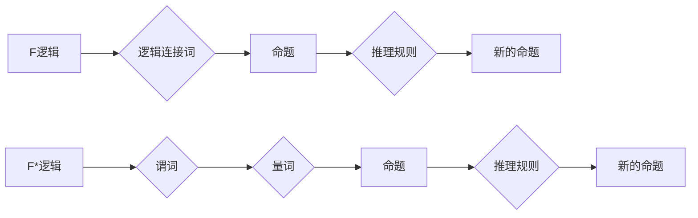

> 数理逻辑, F逻辑, F*逻辑, 推理规则, 形式化推理, 计算机科学, 知识表示, 自动推理

## 1. 背景介绍

数理逻辑作为计算机科学的基础理论之一，为人工智能、知识表示和自动推理等领域提供了坚实的理论基础。其中，F逻辑和F*逻辑作为两种重要的形式逻辑系统，在形式化推理和知识表示方面具有独特的优势。

F逻辑是一种经典的命题逻辑系统，它以命题和逻辑连接词（如“与”、“或”、“非”等）为基本元素，通过一系列的推理规则来推导新的命题。F*逻辑则是在F逻辑的基础上扩展而来，它引入了谓词和量词，使得能够表达更复杂的知识和关系。

## 2. 核心概念与联系

**2.1 F逻辑**

F逻辑的基本概念包括：

* **命题:**  表示一个陈述或一个事实，用大写字母表示，例如P、Q、R等。
* **逻辑连接词:** 用于连接命题，常见的逻辑连接词包括：
    * **与（∧）:**  如果两个命题都为真，则整个命题为真。
    * **或（∨）:** 如果至少有一个命题为真，则整个命题为真。
    * **非（¬）:**  如果一个命题为真，则其非为假，反之亦然。
    * **当且仅当（↔）:**  两个命题具有相同的真值。

**2.2 F*逻辑**

F*逻辑在F逻辑的基础上引入了以下概念：

* **谓词:**  表示一个属性或关系，用小写字母表示，例如P(x)、Q(y)等。
* **量词:** 用于量化变量，常见的量词包括：
    * **全称量词（∀）:**  表示对所有变量都成立。
    * **存在量词（∃）:**  表示至少存在一个变量满足条件。

**2.3 F和F*逻辑的联系**

F*逻辑可以看作是F逻辑的推广，F逻辑可以看作是F*逻辑的特例。F*逻辑的推理规则可以用于推导F逻辑的命题，但反之则不然。

**2.4 Mermaid 流程图**



## 3. 核心算法原理 & 具体操作步骤

**3.1 算法原理概述**

F和F*逻辑的推理规则是基于逻辑的真值表和推理步骤的。这些规则允许我们从已知的命题出发，通过一系列的逻辑操作，推导出新的命题。

**3.2 算法步骤详解**

1. **识别命题和逻辑连接词:**  首先，我们需要识别出文本中的命题和逻辑连接词。
2. **构建逻辑表达式:**  将命题和逻辑连接词组合成一个逻辑表达式。
3. **应用推理规则:**  根据F或F*逻辑的推理规则，对逻辑表达式进行推理，推导出新的命题。
4. **验证推理结果:**  验证推理结果是否符合逻辑规则和语义。

**3.3 算法优缺点**

**优点:**

* **形式化:**  F和F*逻辑提供了一种形式化的推理方法，可以避免人类的认知偏差和推理错误。
* **可自动化:**  F和F*逻辑的推理规则可以被计算机程序自动执行，从而实现自动推理。
* **广泛应用:**  F和F*逻辑在人工智能、知识表示、自动推理等领域有着广泛的应用。

**缺点:**

* **复杂性:**  F和F*逻辑的推理规则比较复杂，需要一定的逻辑学基础才能理解和应用。
* **表达能力有限:**  F和F*逻辑的表达能力有限，无法表达所有类型的知识和关系。

**3.4 算法应用领域**

* **人工智能:**  用于知识表示、推理、规划和决策等方面。
* **自然语言处理:**  用于文本分析、机器翻译和问答系统等方面。
* **数据库系统:**  用于查询优化和数据挖掘等方面。
* **软件工程:**  用于软件验证和模型检查等方面。

## 4. 数学模型和公式 & 详细讲解 & 举例说明

**4.1 数学模型构建**

F和F*逻辑的数学模型基于布尔代数和谓词逻辑。

* **布尔代数:**  用于表示命题和逻辑连接词之间的关系。
* **谓词逻辑:**  用于表示谓词、量词和命题之间的关系。

**4.2 公式推导过程**

F和F*逻辑的推理规则可以被形式化地表示为逻辑公式。这些公式可以用来推导新的命题。

**4.3 案例分析与讲解**

**例题:**

证明命题 P ∧ Q ⇒ R 蕴涵着命题 ¬R ⇒ ¬(P ∧ Q)。

**证明过程:**

1. 假设 P ∧ Q 为真。
2. 根据 P ∧ Q ⇒ R，可知 R 为真。
3. 假设 ¬R 为真。
4. 根据 ¬R 为真，可知 R 为假。
5. 与步骤 2 矛盾，因此 ¬R ⇒ ¬(P ∧ Q) 为真。

**4.4 数学公式**

* **布尔代数:**

    * ∧ (合取):  a ∧ b = 1 当且仅当 a = 1 且 b = 1。
    * ∨ (析取):  a ∨ b = 1 当且仅当 a = 1 或 b = 1。
    * ¬ (非):  ¬a = 1 当且仅当 a = 0。

* **谓词逻辑:**

    * ∀x P(x):  对所有 x，P(x) 都成立。
    * ∃x P(x):  至少存在一个 x，P(x) 成立。

## 5. 项目实践：代码实例和详细解释说明

**5.1 开发环境搭建**

可以使用 Python 和相关库来实现F和F*逻辑的推理。

**5.2 源代码详细实现**

```python
# F逻辑推理规则
def modus_ponens(antecedent, consequent):
    if antecedent and consequent:
        return consequent

# F*逻辑推理规则
def universal_instantiation(formula, variable):
    # ...

# ... 其他推理规则的实现

# 使用示例
antecedent = True
consequent = False
result = modus_ponens(antecedent, consequent)
print(result)  # 输出 False
```

**5.3 代码解读与分析**

* `modus_ponens` 函数实现 F逻辑中的 Modus Ponens 推理规则。
* `universal_instantiation` 函数实现 F*逻辑中的 Universal Instantiation 推理规则。

**5.4 运行结果展示**

运行代码后，可以得到相应的推理结果。

## 6. 实际应用场景

**6.1 知识表示和推理**

F和F*逻辑可以用于表示知识和关系，并进行推理。例如，在医疗诊断系统中，可以使用F*逻辑表示疾病症状和诊断规则，并进行推理来诊断疾病。

**6.2 自动推理系统**

F和F*逻辑可以用于构建自动推理系统，例如自动 theorem prover 和自动 reasoning engine。

**6.3 程序验证**

F和F*逻辑可以用于程序验证，例如使用模型检查来验证程序的正确性。

**6.4 未来应用展望**

随着人工智能和机器学习的发展，F和F*逻辑在未来将有更广泛的应用，例如：

* **自然语言理解:**  用于理解和解释自然语言文本。
* **机器人控制:**  用于控制和规划机器人的行为。
* **决策支持系统:**  用于帮助人类做出更好的决策。

## 7. 工具和资源推荐

**7.1 学习资源推荐**

* **《数学逻辑》:**  由 Herbert Enderton 撰写的经典数学逻辑教材。
* **《人工智能：现代方法》:**  由 Stuart Russell 和 Peter Norvig 撰写的经典人工智能教材。
* **在线课程:**  Coursera、edX 等平台提供许多关于逻辑和人工智能的在线课程。

**7.2 开发工具推荐**

* **Prover9:**  一个用于自动 theorem proving 的工具。
* **Vampire:**  另一个用于自动 theorem proving 的工具。
* **SMT Solvers:**  例如 Z3、Yices 等，用于解决符号数学问题。

**7.3 相关论文推荐**

* **《A Proof of Gödel's Incompleteness Theorems》:**  由 Kurt Gödel 撰写的经典论文。
* **《Resolution Theorem Proving》:**  由 John Alan Robinson 撰写的经典论文。
* **《Satisfiability Checking》:**  由 David E. Knuth 撰写的经典论文。

## 8. 总结：未来发展趋势与挑战

**8.1 研究成果总结**

F和F*逻辑在形式化推理和知识表示方面取得了显著的成果，为人工智能和计算机科学的发展做出了重要贡献。

**8.2 未来发展趋势**

* **更强大的推理能力:**  研究更强大的推理规则和算法，提高自动推理的效率和准确性。
* **更灵活的知识表示:**  开发更灵活的知识表示方法，能够表达更复杂的知识和关系。
* **更广泛的应用场景:**  将F和F*逻辑应用于更多领域，例如自然语言理解、机器人控制和决策支持系统。

**8.3 面临的挑战**

* **表达能力的局限性:**  F和F*逻辑的表达能力有限，无法表达所有类型的知识和关系。
* **推理复杂度的挑战:**  F和F*逻辑的推理过程可能非常复杂，需要大量的计算资源。
* **知识的获取和更新:**  如何有效地获取和更新知识库是一个重要的挑战。

**8.4 研究展望**

未来研究将继续探索F和F*逻辑的理论基础和应用潜力，并致力于克服其面临的挑战，推动人工智能和计算机科学的发展。

## 9. 附录：常见问题与解答

**9.1 什么是 F逻辑？**

F逻辑是一种经典的命题逻辑系统，它以命题和逻辑连接词为基本元素，通过一系列的推理规则来推导新的命题。

**9.2 什么是 F*逻辑？**

F*逻辑是在F逻辑的基础上扩展而来，它引入了谓词和量词，使得能够表达更复杂的知识和关系。

**9.3 F和F*逻辑有什么区别？**

F*逻辑可以看作是F逻辑的推广，F逻辑可以看作是F*逻辑的特例。F*逻辑的推理规则可以用于推导F逻辑的命题，但反之则不然。

**9.4 F和F*逻辑有什么应用？**

F和F*逻辑在人工智能、知识表示、自动推理等领域有着广泛的应用。


作者：禅与计算机程序设计艺术 / Zen and the Art of Computer Programming 
<end_of_turn>