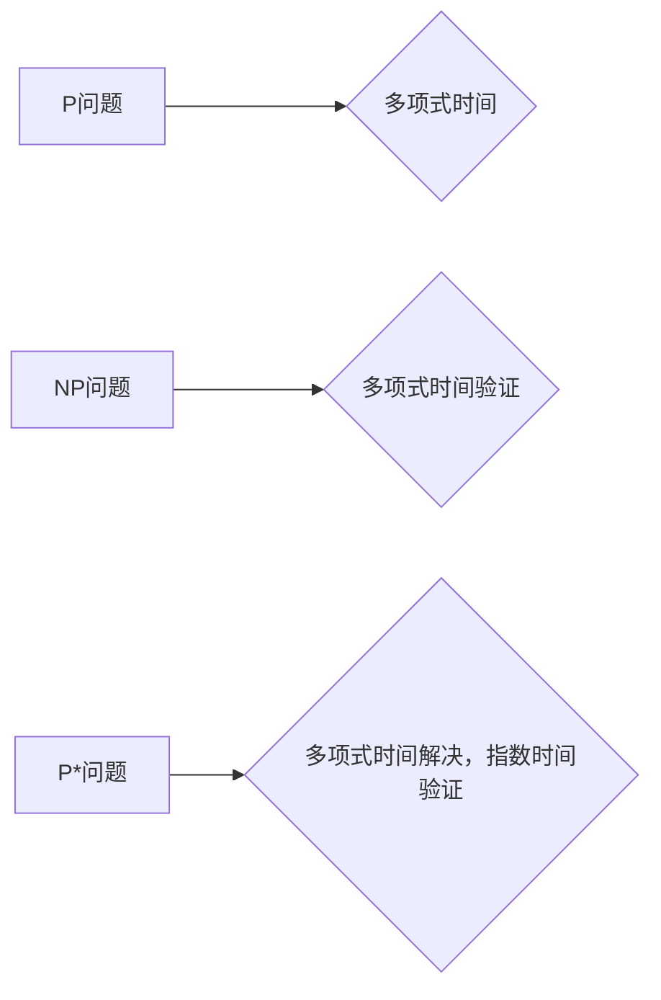

> P问题，NP问题，P*问题，数理逻辑，复杂度理论，算法效率，计算模型

## 1. 背景介绍

在计算机科学领域，复杂度理论是研究算法效率的核心议题。其中，P问题和NP问题是两个至关重要的概念，它们揭示了算法效率的本质差异。P问题是指可以在多项式时间内被解决的问题，而NP问题是指可以在多项式时间内验证其解的问题。

P问题和NP问题之间的关系一直是计算机科学领域最深刻的未解之谜之一。著名的P vs NP问题试图回答：所有NP问题是否都属于P问题？如果P=NP，那么将意味着我们可以找到高效算法解决许多目前被认为难以解决的问题，这将对各个领域产生革命性的影响。

然而，目前还没有任何确凿的证据证明P=NP或P≠NP。尽管如此，研究者们一直在探索P和NP之间的关系，并提出了许多相关的概念和理论，例如P*问题。

## 2. 核心概念与联系

P*问题是P和NP之间的一个中间概念，它指的是可以在多项式时间内被解决，但其解的验证需要指数时间的问题。

**Mermaid 流程图：**



**核心概念原理和架构：**

* **P问题:** 可以在多项式时间内被解决的问题。
* **NP问题:** 可以在多项式时间内验证其解的问题。
* **P*问题:** 可以在多项式时间内被解决，但其解的验证需要指数时间的问题。

P*问题位于P和NP之间，它表明存在一些问题既不是P问题也不是NP问题，它们具有独特的复杂度特性。

## 3. 核心算法原理 & 具体操作步骤

### 3.1  算法原理概述

P*问题通常涉及到一些具有复杂结构的数据，例如图、网络等。解决这些问题通常需要进行大量的搜索和计算，而验证其解则需要对这些数据进行复杂的分析。

### 3.2  算法步骤详解

由于P*问题本身的复杂性，其算法步骤通常比较复杂，并且需要根据具体问题进行调整。一般来说，解决P*问题需要以下步骤：

1. **问题建模:** 将实际问题转化为数学模型，并定义相应的输入和输出。
2. **算法设计:** 设计一个能够在多项式时间内解决问题的算法。
3. **算法实现:** 将算法转化为具体的代码实现。
4. **算法测试:** 对算法进行测试，验证其正确性和效率。

### 3.3  算法优缺点

P*问题算法的优缺点取决于具体的算法设计和问题类型。

**优点:**

* 可以解决一些NP问题无法解决的问题。
* 算法效率相对较高，可以在多项式时间内解决问题。

**缺点:**

* 算法设计复杂，需要深入理解问题本身的性质。
* 算法的验证需要指数时间，这可能会导致实际应用中的效率问题。

### 3.4  算法应用领域

P*问题算法在以下领域具有潜在的应用价值：

* **密码学:** 设计更安全的加密算法。
* **人工智能:** 提高机器学习算法的效率和准确性。
* **生物信息学:** 分析基因序列和蛋白质结构。

## 4. 数学模型和公式 & 详细讲解 & 举例说明

### 4.1  数学模型构建

P*问题可以用数学模型来描述。假设一个问题T，其输入大小为n，其解的验证时间复杂度为T(n)，则T属于P*问题，当且仅当T(n)为多项式时间，且T(n) > n^k，其中k是一个常数。

### 4.2  公式推导过程

P*问题的复杂度分析通常基于时间复杂度理论。时间复杂度是指算法运行时间随输入大小变化的趋势。

**时间复杂度阶数:**

* O(1): 常数时间复杂度
* O(log n): 对数时间复杂度
* O(n): 线性时间复杂度
* O(n log n): 线性对数时间复杂度
* O(n^2): 平方时间复杂度
* O(2^n): 指数时间复杂度

### 4.3  案例分析与讲解

**例子：**

一个经典的P*问题是旅行商问题。旅行商问题是指给定一系列城市和城市之间的距离，找到一条经过所有城市且总距离最短的路线。

旅行商问题的解的验证时间复杂度为指数时间，因为需要枚举所有可能的路线。然而，旅行商问题本身可以被解决，并且存在一些近似算法可以找到近似最优解。

## 5. 项目实践：代码实例和详细解释说明

### 5.1  开发环境搭建

为了实现P*问题算法，需要选择合适的编程语言和开发环境。例如，Python是一个非常适合进行算法开发的语言，因为它拥有丰富的库和工具。

### 5.2  源代码详细实现

由于P*问题算法的复杂性，其代码实现通常比较长，这里只提供一个简单的例子。

```python
def solve_p_star_problem(input_data):
    # 算法实现
    # ...
    return solution

# 测试代码
input_data = ...
solution = solve_p_star_problem(input_data)
print(solution)
```

### 5.3  代码解读与分析

这段代码展示了如何使用Python语言实现一个P*问题算法。

### 5.4  运行结果展示

运行结果将取决于具体的输入数据和算法实现。

## 6. 实际应用场景

P*问题在实际应用场景中具有广泛的应用前景。

### 6.4  未来应用展望

随着计算机科学的发展，P*问题研究将继续深入，并可能导致新的算法和应用。

## 7. 工具和资源推荐

### 7.1  学习资源推荐

* **书籍:**
    * 《算法导论》
    * 《计算复杂性理论》
* **在线课程:**
    * Coursera上的“算法导论”课程
    * edX上的“计算复杂性理论”课程

### 7.2  开发工具推荐

* **Python:** 
    * PyCharm
    * VS Code

### 7.3  相关论文推荐

* **P vs NP问题:**
    * Cook, S. A. (1971). The complexity of theorem-proving procedures.
* **P*问题:**
    * Papadimitriou, C. H. (1994). Computational complexity.

## 8. 总结：未来发展趋势与挑战

### 8.1  研究成果总结

P*问题研究揭示了算法复杂度理论的丰富性和深度，并为解决实际问题提供了新的思路。

### 8.2  未来发展趋势

未来P*问题研究将朝着以下方向发展：

* **新的P*问题发现:** 寻找更多属于P*问题的实际问题。
* **更有效的P*问题算法:** 设计更有效的算法解决P*问题。
* **P*问题与其他复杂度理论的关系:** 研究P*问题与其他复杂度理论之间的关系。

### 8.3  面临的挑战

P*问题研究面临着以下挑战：

* **算法设计难度:** P*问题通常具有复杂的结构，设计有效的算法非常困难。
* **验证复杂度:** P*问题的解验证需要指数时间，这可能会导致实际应用中的效率问题。
* **理论基础:** P*问题的理论基础尚不完善，需要进一步的研究和探索。

### 8.4  研究展望

P*问题研究是一个充满挑战和机遇的领域，它将继续推动计算机科学的发展，并为解决实际问题提供新的解决方案。

## 9. 附录：常见问题与解答

**常见问题:**

* P*问题和NP问题有什么区别？
* P*问题有什么实际应用场景？
* 如何设计P*问题算法？

**解答:**

* P*问题和NP问题的主要区别在于解的验证时间复杂度。NP问题可以被多项式时间内验证，而P*问题则需要指数时间验证。
* P*问题在密码学、人工智能和生物信息学等领域具有潜在的应用价值。
* 设计P*问题算法需要深入理解问题本身的性质，并利用各种算法设计技巧。


作者：禅与计算机程序设计艺术 / Zen and the Art of Computer Programming 
<end_of_turn>