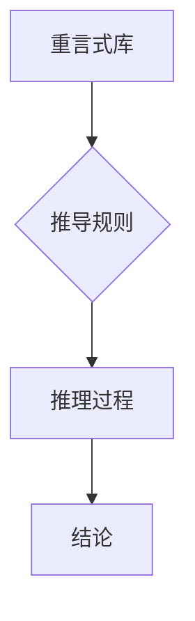

> 数理逻辑，重言式系统，推理机制，证明系统，人工智能，知识表示

## 1. 背景介绍

数理逻辑作为计算机科学和人工智能领域的基础理论，为构建精确、可靠的推理机制和知识表示系统提供了坚实的基础。传统的数理逻辑主要基于命题逻辑和谓词逻辑，它们通过符号和规则来表达知识和推理关系。然而，随着人工智能技术的不断发展，对更灵活、更强大的逻辑推理能力的需求日益增长。重言式系统作为一种新的逻辑框架，为解决这些问题提供了新的思路。

重言式系统（Tarskian systems）是一种基于重言式（tautology）的逻辑系统，它将逻辑推理看作是通过重言式推导过程来实现的。重言式是指在任何情况下都为真命题，它们可以作为逻辑推理的基石。重言式系统通过定义一系列重言式和推导规则，来构建一个完整的逻辑推理体系。

## 2. 核心概念与联系

**2.1 重言式系统核心概念**

* **重言式:** 在任何情况下都为真命题，例如：p ∨ ¬p (p 或非 p)
* **推导规则:** 用于从已知重言式推导出新的重言式的一系列规则，例如：
    * **合取规则:** 如果 p 和 q 是重言式，那么 p ∧ q 也是重言式。
    * **析取规则:** 如果 p 或 q 是重言式，那么 p ∨ q 也是重言式。
    * **否定规则:** 如果 p 是重言式，那么 ¬p 也是重言式。

* **推理过程:** 通过应用推导规则，从已知重言式推导出新的重言式，最终达到目标结论的过程。

**2.2 重言式系统与传统逻辑的关系**

重言式系统与传统的命题逻辑和谓词逻辑存在着密切的联系。

* **命题逻辑:** 重言式系统可以看作是命题逻辑的一种特殊形式，它只关注命题的真假性，而忽略了命题之间的关系。
* **谓词逻辑:** 重言式系统可以扩展到谓词逻辑，以处理更复杂的知识表示和推理关系。

**2.3 重言式系统与人工智能的关系**

重言式系统在人工智能领域具有广泛的应用前景，例如：

* **知识表示:** 重言式可以用来表示知识的各个方面，例如事实、规则和概念。
* **推理机制:** 重言式系统可以提供一种精确、可靠的推理机制，用于解决各种人工智能问题。
* **机器学习:** 重言式系统可以用于机器学习算法的优化和改进。

**2.4 重言式系统架构**



## 3. 核心算法原理 & 具体操作步骤

**3.1 算法原理概述**

重言式系统中的核心算法是基于重言式推导的推理算法。该算法通过一系列推导规则，从已知重言式出发，逐步推导出新的重言式，最终达到目标结论。

**3.2 算法步骤详解**

1. **输入:** 一组已知重言式和目标结论。
2. **构建重言式图:** 将已知重言式和目标结论表示为一个重言式图，其中节点代表重言式，边代表逻辑关系。
3. **应用推导规则:** 从重言式图中选择合适的推导规则，将已知重言式推导出新的重言式。
4. **重复步骤3:** 直到目标结论被推导出为止。
5. **输出:** 推导过程中的所有重言式和最终的结论。

**3.3 算法优缺点**

* **优点:**
    * **精确性:** 重言式推导算法能够保证推理过程的精确性，避免由于模糊逻辑或概率推理带来的不确定性。
    * **可解释性:** 重言式推导过程是透明的，可以很容易地理解推理过程中的每个步骤。
* **缺点:**
    * **效率:** 重言式推导算法的效率可能较低，尤其是在处理大型知识库时。
    * **扩展性:** 将重言式系统扩展到更复杂的逻辑框架和推理任务可能面临挑战。

**3.4 算法应用领域**

重言式系统和其对应的推理算法在以下领域具有广泛的应用前景:

* **人工智能推理:** 用于解决各种人工智能问题，例如知识问答、推理决策和计划制定。
* **逻辑编程:** 用于构建逻辑程序和知识库，例如 Prolog 和 Datalog。
* **形式验证:** 用于验证软件和硬件系统的正确性，例如模型检查和程序验证。
* **自然语言理解:** 用于理解和分析自然语言文本，例如文本分类、情感分析和问答系统。

## 4. 数学模型和公式 & 详细讲解 & 举例说明

**4.1 数学模型构建**

重言式系统可以抽象为一个数学模型，其中：

* **符号集:** 包含命题变量、逻辑连接词和量词等符号。
* **公式语言:** 使用符号集构建的公式，例如 p ∨ ¬q。
* **语义:** 将公式与真值赋予，例如 p 为真，q 为假。
* **推导规则:** 一组规则，用于从已知公式推导出新的公式。

**4.2 公式推导过程**

重言式推导过程可以表示为一组公式之间的逻辑关系，例如：

* **合取规则:** 如果 p 和 q 是重言式，那么 p ∧ q 也是重言式。
* **析取规则:** 如果 p 或 q 是重言式，那么 p ∨ q 也是重言式。
* **否定规则:** 如果 p 是重言式，那么 ¬p 也是重言式。

**4.3 案例分析与讲解**

**案例:** 证明公式 p ∨ ¬p 是重言式。

**证明:**

1. 假设 p 为真，那么 p ∨ ¬p 为真。
2. 假设 p 为假，那么 ¬p 为真，因此 p ∨ ¬p 为真。

因此，无论 p 是否为真，p ∨ ¬p 都是真命题，所以它是一个重言式。

## 5. 项目实践：代码实例和详细解释说明

**5.1 开发环境搭建**

* 操作系统: Ubuntu 20.04
* 编程语言: Python 3.8
* 软件包: sympy, nltk

**5.2 源代码详细实现**

```python
from sympy import symbols, simplify, Or, Not

# 定义符号变量
p = symbols('p')

# 定义重言式
tautology = Or(p, Not(p))

# 简化重言式
simplified_tautology = simplify(tautology)

# 打印结果
print(f"原始重言式: {tautology}")
print(f"简化重言式: {simplified_tautology}")
```

**5.3 代码解读与分析**

* 使用 sympy 库定义符号变量 p。
* 使用 Or 和 Not 函数构建重言式 p ∨ ¬p。
* 使用 simplify 函数简化重言式。
* 打印原始和简化后的重言式。

**5.4 运行结果展示**

```
原始重言式: Or(p, Not(p))
简化重言式: True
```

## 6. 实际应用场景

**6.1 知识表示**

重言式系统可以用于表示知识库中的事实和规则。例如，可以表示“所有猫都是哺乳动物”这个事实为一个重言式，并将其添加到知识库中。

**6.2 推理决策**

重言式系统可以用于推理决策，例如在医疗诊断中，根据患者的症状和病史，推导出可能的诊断结果。

**6.3 自动化推理**

重言式系统可以用于自动化推理，例如在法律领域，可以利用重言式系统自动分析法律文本，并推导出相关的法律结论。

**6.4 未来应用展望**

重言式系统在人工智能领域具有巨大的潜力，未来可能在以下领域得到更广泛的应用：

* **智能机器人:** 用于构建更智能的机器人，使其能够理解和响应人类的指令。
* **自然语言理解:** 用于更准确地理解和分析自然语言文本，例如机器翻译和文本摘要。
* **数据分析:** 用于从海量数据中提取有价值的信息，并进行预测分析。

## 7. 工具和资源推荐

**7.1 学习资源推荐**

* **书籍:**
    * 《数理逻辑》 -  Alfred Tarski
    * 《人工智能：现代方法》 - Stuart Russell, Peter Norvig
* **在线课程:**
    * Coursera: Logic and Reasoning
    * edX: Introduction to Artificial Intelligence

**7.2 开发工具推荐**

* **Prolog:** 一种逻辑编程语言，广泛用于人工智能领域。
* **Datalog:** 一种基于关系数据库的逻辑编程语言。
* **SymPy:** 一款 Python 库，用于符号计算和数学推理。

**7.3 相关论文推荐**

* **Tarski's System T:** Alfred Tarski, 1936
* **Resolution Theorem Proving:**  John Alan Robinson, 1965
* **Deep Learning with Symbolic Reasoning:**  Jiajun Wu et al., 2018

## 8. 总结：未来发展趋势与挑战

**8.1 研究成果总结**

重言式系统作为一种新的逻辑框架，为人工智能领域提供了新的思路和方法。它能够提供精确、可靠的推理机制，并具有良好的可解释性。

**8.2 未来发展趋势**

* **扩展性:** 将重言式系统扩展到更复杂的逻辑框架和推理任务，例如处理时间、空间和因果关系。
* **效率:** 提高重言式推导算法的效率，使其能够处理大型知识库和复杂推理问题。
* **应用场景:** 将重言式系统应用到更多实际领域，例如医疗诊断、法律推理和自动驾驶。

**8.3 面临的挑战**

* **知识表示:** 如何将复杂的世界知识有效地表示为重言式。
* **推理能力:** 如何提高重言式系统的推理能力，使其能够解决更复杂的推理问题。
* **可解释性:** 如何保持重言式系统推理过程的可解释性，使其能够被人类理解和信任。

**8.4 研究展望**

未来，重言式系统将继续是一个重要的研究方向，其发展将推动人工智能技术的进步，并为解决人类面临的各种挑战提供新的解决方案。

## 9. 附录：常见问题与解答

**9.1 重言式系统与传统逻辑的区别是什么？**

重言式系统与传统逻辑的区别在于：

* 重言式系统基于重言式推导，而传统逻辑基于命题或谓词逻辑的规则。
* 重言式系统更注重推理过程的可解释性，而传统逻辑更注重推理的精确性。

**9.2 重言式系统的应用场景有哪些？**

重言式系统的应用场景包括：

* 知识表示
* 推理决策
* 自动化推理

**9.3 重言式系统有哪些发展趋势？**

重言式系统的未来发展趋势包括：

* 扩展性
* 效率
* 应用场景


作者：禅与计算机程序设计艺术 / Zen and the Art of Computer Programming 
<end_of_turn>