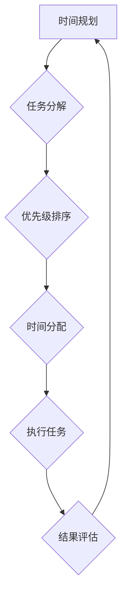

> 时间管理, 效率提升, 工作流程, 任务优先级, 时间规划, 认知科学, 编程技巧, 产品开发

## 1. 背景介绍

在当今快节奏的社会，时间已成为最宝贵的资源之一。对于IT从业者而言，时间管理尤为重要。高效利用时间，才能完成更多工作，提升个人价值，并获得更大的成就感。然而，时间管理并非易事，它需要我们不断学习和实践，找到适合自己的方法。

## 2. 核心概念与联系

时间管理的核心概念是**时间规划**和**效率提升**。

* **时间规划**是指合理安排时间，制定工作计划，并按计划执行。
* **效率提升**是指在有限的时间内完成尽可能多的工作，并提高工作质量。

这两个概念相互关联，时间规划是效率提升的基础，而效率提升则可以帮助我们更好地实现时间规划的目标。

**Mermaid 流程图**



## 3. 核心算法原理 & 具体操作步骤

### 3.1  算法原理概述

时间管理的核心算法可以看作是一个循环过程，包括以下步骤：

1. **任务分解:** 将大任务分解成小任务，方便管理和执行。
2. **优先级排序:** 根据任务的重要性、紧急程度和时间限制等因素，对任务进行排序。
3. **时间分配:** 为每个任务分配合理的执行时间。
4. **执行任务:** 按优先级顺序执行任务，并及时调整计划。
5. **结果评估:** 评估任务执行结果，并根据经验调整后续计划。

### 3.2  算法步骤详解

**1. 任务分解:**

* 将大任务分解成更小的、可管理的任务。
* 每个子任务应该具有明确的目标和可衡量的成果。
* 使用工具如Trello、Asana等可以帮助进行任务分解和管理。

**2. 优先级排序:**

* 使用**艾森豪威尔矩阵** (Eisenhower Matrix) 等方法对任务进行分类和排序。
* 将任务分为四个象限：
    * **紧急且重要:** 立即处理。
    * **重要但不紧急:** 预留时间处理。
    * **紧急但不重要:** 委派或简化处理。
    * **不紧急也不重要:** 忽略或删除。

**3. 时间分配:**

* 使用番茄工作法 (Pomodoro Technique) 等方法，将时间划分为多个间隔，并专注于完成一个任务。
* 避免过度安排，留出一些缓冲时间应对突发事件。
* 使用时间跟踪工具，记录时间使用情况，并分析时间浪费的原因。

**4. 执行任务:**

* 集中注意力，避免分心。
* 使用合适的工具和技术，提高工作效率。
* 定期回顾计划，并根据实际情况进行调整。

**5. 结果评估:**

* 完成任务后，评估结果是否符合预期。
* 分析工作过程，找出改进空间。
* 将经验总结为教训，用于下次计划和执行。

### 3.3  算法优缺点

**优点:**

* 提高工作效率，完成更多工作。
* 减少压力，提高工作质量。
* 增强时间意识，更好地规划生活。

**缺点:**

* 需要花费时间学习和实践。
* 需要不断调整和优化计划。
* 可能导致过度计划和压力过大。

### 3.4  算法应用领域

时间管理算法广泛应用于各个领域，包括：

* **软件开发:** 提高开发效率，按时交付项目。
* **项目管理:** 规划项目进度，协调团队工作。
* **个人生活:** 提高生活效率，平衡工作与生活。

## 4. 数学模型和公式 & 详细讲解 & 举例说明

### 4.1  数学模型构建

时间管理可以抽象为一个数学模型，其中：

* **T:** 总时间
* **N:** 任务数量
* **Ti:** 第i个任务所需时间
* **Pi:** 第i个任务优先级

**目标函数:**

最大化完成的任务数量，即最大化 ∑Pi

**约束条件:**

∑Ti ≤ T

### 4.2  公式推导过程

根据目标函数和约束条件，可以使用线性规划算法求解最优时间分配方案。

### 4.3  案例分析与讲解

假设一个程序员有24小时的时间，需要完成5个任务，每个任务所需时间和优先级如下：

| 任务 | 所需时间 (小时) | 优先级 |
|---|---|---|
| A | 5 | 3 |
| B | 3 | 2 |
| C | 8 | 1 |
| D | 2 | 2 |
| E | 4 | 3 |

使用线性规划算法，可以得到最优时间分配方案，例如：

* 任务A: 5小时
* 任务C: 8小时
* 任务E: 4小时
* 任务B: 3小时
* 任务D: 2小时

## 5. 项目实践：代码实例和详细解释说明

### 5.1  开发环境搭建

* 操作系统: Windows/macOS/Linux
* 编程语言: Python
* 开发工具: VS Code/Atom/Sublime Text

### 5.2  源代码详细实现

```python
import datetime

class Task:
    def __init__(self, name, duration, priority):
        self.name = name
        self.duration = duration
        self.priority = priority

    def __str__(self):
        return f"{self.name} ({self.duration}小时, 优先级: {self.priority})"

class TimeManager:
    def __init__(self):
        self.tasks = []
        self.available_time = datetime.timedelta(hours=24)

    def add_task(self, task):
        self.tasks.append(task)

    def schedule_tasks(self):
        # 按照优先级排序任务
        self.tasks.sort(key=lambda x: x.priority, reverse=True)

        # 计算剩余时间
        remaining_time = self.available_time

        # 依次安排任务
        for task in self.tasks:
            if remaining_time >= datetime.timedelta(hours=task.duration):
                print(f"安排任务: {task}")
                remaining_time -= datetime.timedelta(hours=task.duration)
            else:
                print(f"剩余时间不足，无法安排任务: {task}")
                break

# 示例代码
manager = TimeManager()
manager.add_task(Task("写代码", 5, 3))
manager.add_task(Task("测试代码", 3, 2))
manager.add_task(Task("阅读文档", 8, 1))
manager.add_task(Task("开会", 2, 2))
manager.add_task(Task("写报告", 4, 3))
manager.schedule_tasks()
```

### 5.3  代码解读与分析

* **Task类:** 定义任务的属性，包括名称、所需时间和优先级。
* **TimeManager类:** 管理任务的类，提供添加任务、安排任务等功能。
* **schedule_tasks()方法:** 按照优先级排序任务，并依次安排任务，直到剩余时间不足。

### 5.4  运行结果展示

运行代码后，会输出安排任务的顺序，以及剩余时间信息。

## 6. 实际应用场景

### 6.1  软件开发

* **项目规划:** 使用时间管理算法规划项目进度，分配任务，并跟踪执行情况。
* **代码编写:** 使用番茄工作法等方法提高代码编写效率，避免过度疲劳。
* **代码测试:** 规划测试时间，并根据优先级安排测试用例执行。

### 6.2  项目管理

* **任务分配:** 根据任务重要性和紧急程度，合理分配任务给团队成员。
* **进度跟踪:** 定期跟踪项目进度，并及时调整计划。
* **风险管理:** 识别潜在风险，并制定应对措施。

### 6.3  个人生活

* **时间规划:** 规划每天、每周、每月的时间，安排工作、学习、娱乐等活动。
* **目标设定:** 设置短期和长期目标，并制定实现目标的计划。
* **效率提升:** 提高学习效率、工作效率、生活效率。

### 6.4  未来应用展望

随着人工智能技术的不断发展，时间管理算法将更加智能化和个性化。未来，我们可以期待：

* **智能时间规划:** 基于个人习惯、工作内容和目标，自动生成个性化的时间规划方案。
* **自动任务分配:** 基于任务优先级和团队成员能力，自动分配任务给合适的人员。
* **实时提醒和提醒:** 根据任务截止时间和个人日程安排，及时提醒用户完成任务。

## 7. 工具和资源推荐

### 7.1  学习资源推荐

* **书籍:**
    * 《Getting Things Done: The Art of Stress-Free Productivity》
    * 《Deep Work: Rules for Focused Success in a Distracted World》
    * 《Atomic Habits: An Easy & Proven Way to Build Good Habits & Break Bad Ones》
* **网站:**
    * https://www.zenhabits.net/
    * https://www.lifehacker.com/
    * https://www.mindtools.com/

### 7.2  开发工具推荐

* **任务管理工具:** Trello, Asana, Todoist
* **时间跟踪工具:** Toggl, RescueTime, Clockify
* **番茄工作法工具:** Focus Keeper, Forest, TomatoTimer

### 7.3  相关论文推荐

* **时间管理算法研究:**
    * "A Survey of Time Management Techniques"
    * "An Empirical Study of Time Management Strategies"
* **人工智能在时间管理中的应用:**
    * "Personalized Time Management with Machine Learning"
    * "Automated Task Scheduling with Deep Reinforcement Learning"

## 8. 总结：未来发展趋势与挑战

### 8.1  研究成果总结

时间管理算法的研究取得了显著成果，为提高工作效率、平衡生活提供了有效方法。

### 8.2  未来发展趋势

未来，时间管理算法将更加智能化、个性化和自动化。

### 8.3  面临的挑战

* **数据隐私:** 时间管理算法需要收集大量个人数据，如何保护数据隐私是一个重要挑战。
* **算法公平性:** 算法需要确保公平公正，避免歧视或偏见。
* **用户接受度:** 用户需要接受和信任算法的建议，才能有效利用时间管理工具。

### 8.4  研究展望

未来研究方向包括：

* 开发更智能、更个性化的时间管理算法。
* 研究时间管理算法的伦理和社会影响。
* 探索时间管理算法在不同领域应用的可能性。

## 9. 附录：常见问题与解答

**Q1: 如何制定合理的计划？**

A1: 使用艾森豪威尔矩阵对任务进行分类和排序，并根据时间限制和优先级分配时间。

**Q2: 如何避免分心？**

A2: 使用番茄工作法等方法，集中注意力完成一个任务，并定期休息。

**Q3: 如何评估时间管理效果？**

A3: 记录时间使用情况，分析时间浪费原因，并根据经验调整计划。

作者：禅与计算机程序设计艺术 / Zen and the Art of Computer Programming


<end_of_turn>