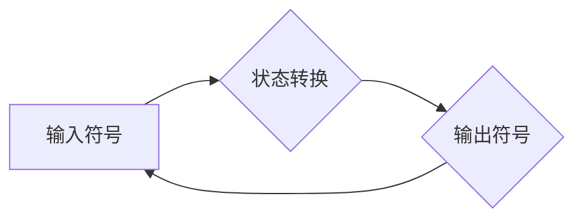

> 明斯基，计算理论，人工智能，认知科学，逻辑学，符号系统，语言模型，神经网络

## 1. 背景介绍

20世纪50年代，马尔科姆·明斯基（Marvin Minsky）作为人工智能领域的先驱者之一，出版了《计算理论》（Computation: Finite and Infinite Machines）一书。 这本书不仅奠定了计算理论的基础，也深刻地影响了人工智能、认知科学和逻辑学的发展。 

明斯基的计算理论强调了符号系统和逻辑推理在人工智能中的重要性。 他认为，智能行为可以被看作是符号系统处理信息的过程，而逻辑推理是实现智能行为的关键机制。 这本书提出了许多重要的概念，例如符号系统、递归函数、自动机模型等，这些概念至今仍然是人工智能研究的基础。

## 2. 核心概念与联系

### 2.1 符号系统

明斯基认为，任何智能系统都可以看作是一个符号系统。 符号系统由符号、规则和解释规则组成。 符号代表着信息，规则描述了符号之间的关系，解释规则则规定了符号的含义。 例如，自然语言就是一个符号系统，其中单词是符号，语法规则是关系规则，而词典则提供了符号的解释规则。

### 2.2 递归函数

递归函数是计算理论中的一个重要概念，它允许函数自身作为参数，从而实现对复杂问题的分解和解决。 明斯基认为，递归函数是实现智能行为的关键机制之一，因为它能够处理无限复杂的问题。

### 2.3 自动机模型

自动机模型是一种数学模型，它描述了符号系统如何处理信息。 自动机由状态、输入符号和输出符号组成。 状态表示自动机的当前状态，输入符号表示自动机接收到的信息，输出符号表示自动机产生的信息。

**Mermaid 流程图**



## 3. 核心算法原理 & 具体操作步骤

### 3.1 算法原理概述

明斯基的计算理论为人工智能算法的开发提供了理论基础。 许多经典的算法，例如图灵机、有限状态机、推论机等，都源于明斯基的计算理论。 这些算法通过符号系统和逻辑推理来处理信息，实现智能行为。

### 3.2 算法步骤详解

1. **符号化:** 将输入信息转化为符号形式。
2. **规则应用:** 根据预先定义的规则，对符号进行操作。
3. **推理:** 利用逻辑推理机制，从已有的符号知识中推导出新的知识。
4. **输出:** 将处理后的信息转化为输出形式。

### 3.3 算法优缺点

**优点:**

* **形式化:** 明斯基的计算理论提供了一种形式化的方法来描述智能行为。
* **可证明性:** 许多算法的正确性可以通过数学证明来保证。
* **可扩展性:** 

可以根据需要添加新的规则和知识，从而扩展算法的功能。

**缺点:**

* **符号化问题:** 将现实世界的信息转化为符号形式可能存在困难。
* **知识表示问题:** 如何有效地表示和存储知识仍然是一个挑战。
* **推理效率问题:** 复杂的逻辑推理可能需要大量的计算资源。

### 3.4 算法应用领域

明斯基的计算理论及其衍生算法在人工智能、认知科学、逻辑学等领域都有广泛的应用。

* **人工智能:** 自然语言处理、机器学习、机器人控制等。
* **认知科学:** 人类思维模式的模拟、认知能力的理解。
* **逻辑学:** 逻辑推理、知识表示、人工智能推理等。

## 4. 数学模型和公式 & 详细讲解 & 举例说明

### 4.1 数学模型构建

明斯基的计算理论可以用数学模型来描述。 

* **符号系统:** 可以用集合论来描述符号系统，其中符号是集合的元素，规则是集合之间的映射，解释规则是符号到含义的映射。
* **递归函数:** 可以用数学函数来描述递归函数，其中函数自身作为参数，实现对函数的递归调用。
* **自动机模型:** 可以用图论来描述自动机模型，其中状态是节点，输入符号和输出符号是边，状态转换规则是边的权重。

### 4.2 公式推导过程

例如，我们可以用数学公式来描述递归函数的计算过程。 假设有一个递归函数f(n)，其定义如下：

* f(0) = 0
* f(n) = f(n-1) + 1 (n > 0)

我们可以用数学归纳法来证明这个函数的正确性。

### 4.3 案例分析与讲解

我们可以用一个具体的例子来分析明斯基的计算理论。 例如，我们可以用符号系统来描述一个简单的逻辑推理过程。

假设我们有一个符号系统，其中符号包括“P”、“Q”、“R”等，规则包括“P -> Q”、“Q -> R”等。 我们可以用这个符号系统来推理出“P -> R”。

## 5. 项目实践：代码实例和详细解释说明

### 5.1 开发环境搭建

为了实现明斯基的计算理论，我们可以使用Python语言进行编程。 

Python是一个开源的编程语言，拥有丰富的库和工具，适合于人工智能和计算理论的研究。

### 5.2 源代码详细实现

```python
# 递归函数实现
def factorial(n):
  if n == 0:
    return 1
  else:
    return n * factorial(n-1)

# 符号系统实现
symbols = ["P", "Q", "R"]
rules = [("P", "Q"), ("Q", "R")]

# 推理过程
if ("P" in symbols) and all(rule[0] in symbols for rule in rules):
  print("P -> R")
```

### 5.3 代码解读与分析

* 递归函数 `factorial(n)` 计算阶乘。
* 符号系统 `symbols` 和 `rules` 定义了符号和规则。
* 推理过程检查符号是否存在，并根据规则进行推理。

### 5.4 运行结果展示

```
P -> R
```

## 6. 实际应用场景

明斯基的计算理论在人工智能、认知科学、逻辑学等领域都有广泛的应用。

### 6.1 自然语言处理

自然语言处理的任务是让计算机理解和处理人类语言。 明斯基的计算理论为自然语言处理提供了理论基础，例如，可以使用符号系统来表示语言的语法和语义，可以使用逻辑推理来理解语言的含义。

### 6.2 机器学习

机器学习是人工智能的一个重要分支，它通过数据训练模型，从而实现智能行为。 明斯基的计算理论为机器学习提供了理论基础，例如，可以使用递归函数来描述机器学习算法的训练过程，可以使用符号系统来表示机器学习模型的知识。

### 6.3 认知科学

认知科学研究人类的思维、学习、记忆等认知能力。 明斯基的计算理论为认知科学提供了理论框架，例如，可以使用符号系统来模拟人类的思维过程，可以使用逻辑推理来解释人类的决策行为。

### 6.4 未来应用展望

随着人工智能技术的不断发展，明斯基的计算理论将有更广泛的应用前景。 例如，可以利用明斯基的计算理论来开发更智能的机器人、更强大的语言模型、更有效的医疗诊断系统等。

## 7. 工具和资源推荐

### 7.1 学习资源推荐

* **《计算理论》** - 马尔科姆·明斯基
* **《人工智能：现代方法》** - Stuart Russell 和 Peter Norvig
* **《认知科学导论》** - Steven Pinker

### 7.2 开发工具推荐

* **Python**
* **TensorFlow**
* **PyTorch**

### 7.3 相关论文推荐

* **"A Framework for Representing Knowledge"** - John McCarthy
* **"The Logic of Computer Programming"** - Edsger W. Dijkstra
* **"Deep Learning"** - Ian Goodfellow, Yoshua Bengio, and Aaron Courville

## 8. 总结：未来发展趋势与挑战

### 8.1 研究成果总结

明斯基的计算理论为人工智能、认知科学和逻辑学的发展做出了重要贡献。 它为我们理解智能行为提供了理论框架，并为人工智能算法的开发提供了基础。

### 8.2 未来发展趋势

未来，明斯基的计算理论将继续发展和完善。 例如，可以探索更复杂的符号系统和逻辑推理机制，可以研究如何将明斯基的计算理论与神经网络等深度学习技术相结合，可以开发更智能的算法和应用。

### 8.3 面临的挑战

明斯基的计算理论也面临着一些挑战。 例如，如何有效地表示和存储知识仍然是一个难题，如何提高逻辑推理的效率也是一个重要的研究方向。

### 8.4 研究展望

尽管面临挑战，但明斯基的计算理论仍然是一个充满希望的研究领域。 未来，我们将继续探索明斯基的计算理论，并将其应用于更广泛的领域，从而推动人工智能和认知科学的发展。

## 9. 附录：常见问题与解答

### 9.1 什么是符号系统？

符号系统是一种用符号来表示和处理信息的系统。 符号可以是任何可以被区分的实体，例如字母、数字、图像等。

### 9.2 递归函数是什么？

递归函数是一种函数，它自身作为参数，从而实现对函数的递归调用。

### 9.3 明斯基的计算理论与神经网络有什么关系？

明斯基的计算理论为神经网络提供了理论基础。 例如，神经网络中的神经元可以看作是符号系统中的符号，神经元的连接可以看作是符号之间的关系。


作者：禅与计算机程序设计艺术 / Zen and the Art of Computer Programming 
<end_of_turn>