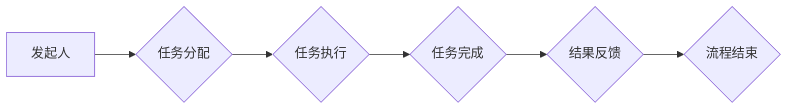

> 智能合约，工作流管理，自动化，去中心化，区块链，可信性，透明性

## 1. 背景介绍

随着数字化转型和业务流程的不断复杂化，高效、灵活、可控的工作流管理成为企业核心竞争力的关键。传统的工作流管理系统通常依赖于中心化的平台和人工干预，存在效率低下、可维护性差、缺乏透明度等问题。

智能合约作为区块链技术的核心应用之一，以其不可篡改、自动执行、透明可信等特性，为工作流管理带来了新的可能性。智能合约可以将工作流程中的规则和逻辑编码成不可更改的合约，自动执行预设的步骤，实现流程的自动化、透明化和可追溯性。

## 2. 核心概念与联系

### 2.1 智能合约

智能合约是一种使用代码实现的自动执行协议，它存储在区块链网络中，一旦满足预设条件，便会自动执行合约中的条款。智能合约具有以下特点：

* **自动化执行:** 智能合约的执行无需人工干预，一旦触发条件，合约会自动执行预设的逻辑。
* **不可篡改:** 智能合约的代码和执行记录存储在区块链网络中，不可被篡改或修改。
* **透明可信:** 智能合约的执行过程是公开透明的，任何人都可以查看合约的代码和执行记录。
* **去中心化:** 智能合约不受任何单一实体控制，由网络节点共同维护和执行。

### 2.2 工作流管理

工作流管理是指对企业内部的业务流程进行规划、设计、执行、监控和优化的一系列活动。工作流管理的目标是提高工作效率、降低成本、增强协作和控制。

### 2.3 智能合约与工作流管理的联系

智能合约可以将工作流程中的规则和逻辑编码成不可更改的合约，自动执行预设的步骤，实现流程的自动化、透明化和可追溯性。

**Mermaid 流程图**



## 3. 核心算法原理 & 具体操作步骤

### 3.1 算法原理概述

智能合约的工作流管理算法基于以下核心原理：

* **状态机:** 智能合约使用状态机模型来表示工作流程的状态和转换规则。
* **事件触发:** 工作流程中的事件（例如任务完成、审批通过等）会触发智能合约的执行。
* **条件判断:** 智能合约根据预设的条件判断执行相应的逻辑。
* **数据存储:** 智能合约可以存储工作流程中的数据，例如任务进度、审批记录等。

### 3.2 算法步骤详解

1. **定义工作流程:** 使用图形化工具或代码定义工作流程的各个步骤、参与者和规则。
2. **编码智能合约:** 将工作流程的规则和逻辑编码成智能合约。
3. **部署智能合约:** 将智能合约部署到区块链网络中。
4. **触发事件:** 当工作流程中的事件发生时，触发智能合约的执行。
5. **执行逻辑:** 智能合约根据预设的条件判断执行相应的逻辑，例如分配任务、审批流程、更新状态等。
6. **记录数据:** 智能合约记录工作流程中的数据，例如任务进度、审批记录等。
7. **完成流程:** 当工作流程完成时，智能合约会自动执行最后的步骤，例如生成报告、通知参与者等。

### 3.3 算法优缺点

**优点:**

* **自动化:** 智能合约可以自动执行工作流程，减少人工干预，提高效率。
* **透明可信:** 智能合约的执行过程是公开透明的，任何人都可以查看合约的代码和执行记录，提高信任度。
* **可追溯性:** 智能合约可以记录工作流程中的所有数据，方便追溯和审计。
* **安全性:** 智能合约存储在区块链网络中，具有不可篡改和安全的特性。

**缺点:**

* **开发成本:** 开发智能合约需要专业的技术人员和时间成本。
* **可维护性:** 当工作流程发生变化时，需要修改智能合约代码，这可能会带来一定的难度。
* **法律风险:** 智能合约的法律效力尚待明确，存在一定的法律风险。

### 3.4 算法应用领域

智能合约在工作流管理领域的应用场景广泛，例如：

* **供应链管理:** 自动化供应链流程，提高效率和透明度。
* **金融服务:** 自动化贷款审批、保险理赔等流程，降低成本和风险。
* **医疗保健:** 自动化病历管理、预约挂号等流程，提高效率和患者体验。
* **政府服务:** 自动化行政审批、公务办理等流程，提高效率和透明度。

## 4. 数学模型和公式 & 详细讲解 & 举例说明

### 4.1 数学模型构建

智能合约的工作流管理可以抽象为一个状态机模型，其中每个状态代表工作流程中的一个阶段，每个状态之间的转换由事件触发和条件判断决定。

**状态机模型:**

```
状态 = {状态1, 状态2, ..., 状态n}
事件 = {事件1, 事件2, ..., 事件m}
条件 = {条件1, 条件2, ..., 条件k}
```

**状态转换规则:**

```
状态i -> 状态j, 当事件e 发生且条件c 成立时
```

### 4.2 公式推导过程

**状态转移概率:**

```
P(状态i -> 状态j | 事件e, 条件c)
```

其中，P(状态i -> 状态j | 事件e, 条件c) 表示在事件e发生且条件c成立的情况下，从状态i转移到状态j的概率。

**期望执行时间:**

```
E(执行时间) = Σ(时间i * P(状态i))
```

其中，时间i 表示状态i的期望执行时间，P(状态i) 表示状态i出现的概率。

### 4.3 案例分析与讲解

**案例:** 

假设一个简单的任务审批流程，包含三个状态：提交、审批、完成。

* **提交:** 任务发起人提交任务申请。
* **审批:** 审批人审批任务申请。
* **完成:** 任务审批通过，任务完成。

**状态转换规则:**

* 提交 -> 审批, 当任务提交成功且审批人存在时。
* 审批 -> 完成, 当审批人审批通过时。

**数学模型分析:**

* 可以使用状态转移概率来分析不同状态的转换概率。
* 可以使用期望执行时间来评估整个流程的平均执行时间。

## 5. 项目实践：代码实例和详细解释说明

### 5.1 开发环境搭建

* 安装 Solidity 编译器
* 安装 Truffle 开发框架
* 连接以太坊测试网络

### 5.2 源代码详细实现

```solidity
pragma solidity ^0.8.0;

contract Workflow {

    // 状态枚举
    enum State { Pending, Approved, Completed }

    // 任务结构体
    struct Task {
        address owner;
        address approver;
        State status;
    }

    // 任务列表
    Task[] public tasks;

    // 添加任务
    function addTask(address approver) public {
        tasks.push(Task(msg.sender, approver, State.Pending));
    }

    // 审批任务
    function approveTask(uint256 taskId) public {
        require(tasks[taskId].approver == msg.sender, "Not authorized");
        tasks[taskId].status = State.Approved;
    }

    // 完成任务
    function completeTask(uint256 taskId) public {
        require(tasks[taskId].owner == msg.sender, "Not authorized");
        require(tasks[taskId].status == State.Approved, "Task not approved");
        tasks[taskId].status = State.Completed;
    }
}
```

### 5.3 代码解读与分析

* **状态枚举:** 定义了任务的状态，包括 Pending、Approved 和 Completed。
* **任务结构体:** 定义了任务的属性，包括任务发起人、审批人、状态等。
* **任务列表:** 存储所有任务的数组。
* **addTask() 函数:** 添加新的任务到任务列表。
* **approveTask() 函数:** 审批任务，将任务状态更新为 Approved。
* **completeTask() 函数:** 完成任务，将任务状态更新为 Completed。

### 5.4 运行结果展示

* 通过 Truffle 开发框架部署智能合约到以太坊测试网络。
* 使用 Remix IDE 或其他工具调用智能合约的函数，模拟任务的添加、审批和完成过程。
* 查看智能合约的执行记录，验证任务状态的更新。

## 6. 实际应用场景

### 6.1 供应链管理

智能合约可以自动执行供应链中的各个环节，例如采购、生产、物流、配送等，提高效率和透明度。

* **采购:** 智能合约可以自动生成采购订单，并根据预设的条件自动支付货款。
* **生产:** 智能合约可以自动跟踪原材料的进出，并根据生产计划自动安排生产任务。
* **物流:** 智能合约可以自动跟踪货物运输过程，并根据预设的条件自动触发物流服务。
* **配送:** 智能合约可以自动生成配送单，并根据预设的条件自动安排配送人员。

### 6.2 金融服务

智能合约可以自动化金融服务中的许多流程，例如贷款审批、保险理赔、证券交易等，降低成本和风险。

* **贷款审批:** 智能合约可以根据预设的条件自动审批贷款申请，减少人工审批时间和成本。
* **保险理赔:** 智能合约可以自动计算保险理赔金额，并自动支付理赔款，提高理赔效率。
* **证券交易:** 智能合约可以自动执行证券交易，减少交易成本和风险。

### 6.3 医疗保健

智能合约可以自动化医疗保健中的许多流程，例如病历管理、预约挂号、药品配送等，提高效率和患者体验。

* **病历管理:** 智能合约可以安全地存储和管理患者病历，方便医生查看和使用。
* **预约挂号:** 智能合约可以自动安排医生和患者的预约挂号，提高挂号效率。
* **药品配送:** 智能合约可以自动跟踪药品配送过程，确保药品安全和有效。

### 6.4 未来应用展望

随着区块链技术的不断发展，智能合约在工作流管理领域的应用场景将更加广泛。未来，智能合约将被应用于更多领域，例如教育、科研、文化娱乐等，为人们的生活和工作带来更多便利。

## 7. 工具和资源推荐

### 7.1 学习资源推荐

* **书籍:**
    * "Mastering Ethereum" by Andreas Antonopoulos
    * "Blockchain Basics" by Daniel Drescher
* **在线课程:**
    * Coursera: Blockchain Specialization
    * Udemy: Solidity and Ethereum Development

### 7.2 开发工具推荐

* **Truffle:** 一个用于开发和部署以太坊智能合约的框架。
* **Remix IDE:** 一个在线智能合约开发环境。
* **Ganache:** 一个用于本地测试以太坊网络的工具。

### 7.3 相关论文推荐

* "Smart Contracts: A New Paradigm for Decentralized Applications" by Nick Szabo
* "Blockchain Technology: Principles and Applications" by Arvind Narayanan

## 8. 总结：未来发展趋势与挑战

### 8.1 研究成果总结

智能合约在工作流管理领域的应用取得了显著的成果，为提高工作效率、降低成本、增强协作和控制提供了新的解决方案。

### 8.2 未来发展趋势

* **更复杂的智能合约:** 未来，智能合约将更加复杂，能够处理更复杂的业务逻辑。
* **更广泛的应用场景:** 智能合约将被应用于更多领域，例如教育、科研、文化娱乐等。
* **更强大的安全性:** 未来，智能合约的安全性将得到进一步提升，能够更好地应对各种攻击。

### 8.3 面临的挑战

* **法律风险:** 智能合约的法律效力尚待明确，存在一定的法律风险。
* **技术复杂性:** 开发智能合约需要专业的技术人员和时间成本。
* **可维护性