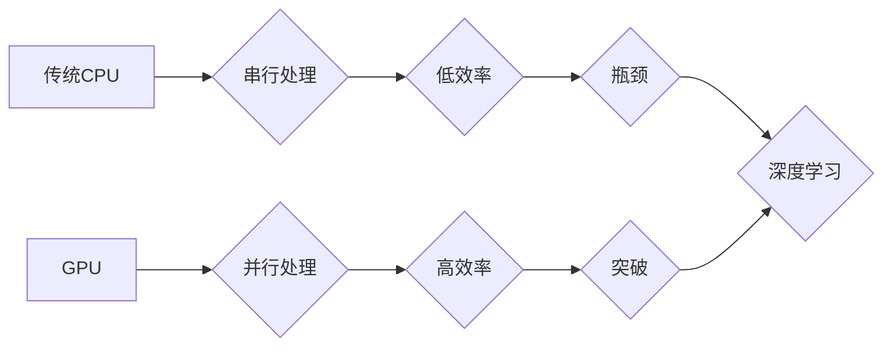

> NVIDIA, GPU, CUDA, 深度学习, 算力, AI, 高性能计算

## 1. 背景介绍

在当今数据爆炸和人工智能蓬勃发展的时代，算力已成为制约科技进步的关键因素。传统CPU架构在处理海量数据和复杂计算任务时面临着瓶颈，而GPU凭借其并行计算能力和高带宽内存，逐渐成为算力提升的主角。NVIDIA作为GPU领域的领军者，通过不断创新和技术突破，为算力提升做出了巨大贡献。

## 2. 核心概念与联系

**2.1 GPU架构与传统CPU架构的对比**

传统CPU采用串行处理架构，每个核心处理一个指令，效率相对较低。而GPU采用并行处理架构，拥有大量并行计算单元，可以同时处理多个指令，在处理海量数据和并行计算任务时具有显著优势。

**2.2 CUDA平台与GPU编程**

NVIDIA开发了CUDA（Compute Unified Device Architecture）平台，为开发者提供了一套完整的GPU编程工具和框架。CUDA允许开发者将程序移植到GPU上，充分利用其并行计算能力。

**2.3 深度学习与GPU加速**

深度学习算法依赖于海量数据和复杂的矩阵运算，GPU的并行计算能力和高带宽内存使其成为深度学习训练的理想平台。NVIDIA推出了专门针对深度学习的GPU和软件库，如TensorRT和 cuDNN，进一步加速了深度学习的训练和推理过程。

**2.4 高性能计算与GPU应用**

除了深度学习，GPU还广泛应用于其他高性能计算领域，如科学计算、金融建模、天气预报等。NVIDIA的GPU加速技术为这些领域提供了强大的计算能力，推动了科学研究和技术创新。

**Mermaid 流程图**



## 3. 核心算法原理 & 具体操作步骤

**3.1 算法原理概述**

GPU加速算法的核心原理是将CPU上的计算任务分解成多个小的并行任务，并分配到GPU的多个计算单元上进行并行处理。通过充分利用GPU的并行计算能力，可以显著提高计算速度。

**3.2 算法步骤详解**

1. **数据并行化:** 将输入数据分解成多个小块，每个小块分配给一个GPU计算单元进行处理。
2. **任务分解:** 将算法的计算任务分解成多个小的并行任务，每个任务分配给一个GPU计算单元执行。
3. **数据传输:** 将数据从CPU传输到GPU内存，并从GPU内存传输到CPU。
4. **并行计算:** GPU计算单元并行执行分配的任务，完成计算。
5. **结果聚合:** 将各个GPU计算单元的计算结果聚合起来，得到最终的计算结果。

**3.3 算法优缺点**

**优点:**

* 显著提高计算速度
* 适用于海量数据和并行计算任务
* 降低计算成本

**缺点:**

* 需要专门的GPU编程知识
* 数据传输过程可能带来性能瓶颈
* GPU资源占用率高

**3.4 算法应用领域**

* 深度学习
* 高性能计算
* 图像处理
* 视频处理
* 科学计算

## 4. 数学模型和公式 & 详细讲解 & 举例说明

**4.1 数学模型构建**

假设我们有一个包含N个数据点的集合，每个数据点包含D个特征。我们想要使用GPU加速训练一个包含M个神经元的深度学习模型。

**4.2 公式推导过程**

* **数据并行化:** 将数据集合划分为K个子集，每个子集包含N/K个数据点。每个GPU计算单元负责处理一个子集。
* **任务分解:** 将模型的训练过程分解成多个小的并行任务，每个任务负责计算一个神经元的权重更新。
* **并行计算:** 每个GPU计算单元并行执行分配的任务，计算每个神经元的权重更新。
* **结果聚合:** 将各个GPU计算单元计算出的权重更新结果聚合起来，得到最终的模型参数更新。

**4.3 案例分析与讲解**

假设我们使用一个包含1000个数据点的集合训练一个包含100个神经元的深度学习模型，并使用4个GPU进行并行计算。

* 数据并行化: 将数据集合划分为4个子集，每个子集包含250个数据点。
* 任务分解: 将模型的训练过程分解成100个并行任务，每个任务负责计算一个神经元的权重更新。
* 并行计算: 每个GPU计算单元负责处理一个子集，并并行执行分配的任务，计算每个神经元的权重更新。
* 结果聚合: 将各个GPU计算单元计算出的权重更新结果聚合起来，得到最终的模型参数更新。

通过并行计算，可以显著缩短模型训练时间。

## 5. 项目实践：代码实例和详细解释说明

**5.1 开发环境搭建**

* 安装CUDA Toolkit
* 安装NVIDIA驱动程序
* 安装Python和深度学习框架（如TensorFlow或PyTorch）

**5.2 源代码详细实现**

```python
import tensorflow as tf

# 定义模型
model = tf.keras.models.Sequential([
    tf.keras.layers.Dense(128, activation='relu', input_shape=(784,)),
    tf.keras.layers.Dense(10, activation='softmax')
])

# 编译模型
model.compile(optimizer='adam',
              loss='sparse_categorical_crossentropy',
              metrics=['accuracy'])

# 加载数据
(x_train, y_train), (x_test, y_test) = tf.keras.datasets.mnist.load_data()

# 数据预处理
x_train = x_train.reshape(-1, 784).astype('float32') / 255
x_test = x_test.reshape(-1, 784).astype('float32') / 255

# 使用GPU训练模型
with tf.device('/GPU:0'):
    model.fit(x_train, y_train, epochs=5)
```

**5.3 代码解读与分析**

* `tf.device('/GPU:0')`语句指定使用GPU进行计算。
* `model.fit()`函数用于训练模型，并使用GPU加速训练过程。

**5.4 运行结果展示**

训练完成后，可以评估模型的性能，并观察训练时间与CPU训练相比的差异。

## 6. 实际应用场景

**6.1 深度学习**

* **图像识别:** NVIDIA GPU加速了图像识别算法的训练和推理，应用于自动驾驶、医疗影像分析等领域。
* **自然语言处理:** GPU加速了自然语言处理算法的训练和推理，应用于机器翻译、语音识别等领域。
* **推荐系统:** GPU加速了推荐系统的训练和推理，应用于电商、社交媒体等领域。

**6.2 高性能计算**

* **科学计算:** GPU加速了科学计算算法的训练和推理，应用于天体物理学、药物发现等领域。
* **金融建模:** GPU加速了金融建模算法的训练和推理，应用于风险管理、投资策略等领域。
* **天气预报:** GPU加速了天气预报算法的训练和推理，提高了天气预报的准确性。

**6.3 其他应用场景**

* **游戏开发:** GPU加速了游戏图形渲染和物理模拟，提升了游戏画面质量和游戏体验。
* **视频编辑:** GPU加速了视频编码和解码，提高了视频编辑效率。

**6.4 未来应用展望**

随着人工智能技术的不断发展，GPU将继续在更多领域发挥重要作用。例如，在元宇宙、边缘计算、量子计算等领域，GPU将成为关键技术。

## 7. 工具和资源推荐

**7.1 学习资源推荐**

* **NVIDIA CUDA官网:** https://developer.nvidia.com/cuda-zone
* **NVIDIA Deep Learning Institute:** https://www.nvidia.com/en-us/deep-learning-ai/
* **TensorFlow官网:** https://www.tensorflow.org/
* **PyTorch官网:** https://pytorch.org/

**7.2 开发工具推荐**

* **CUDA Toolkit:** https://developer.nvidia.com/cuda-toolkit
* **cuDNN:** https://developer.nvidia.com/cudnn
* **TensorFlow:** https://www.tensorflow.org/
* **PyTorch:** https://pytorch.org/

**7.3 相关论文推荐**

* **CUDA Programming Guide:** https://docs.nvidia.com/cuda/cuda-c-programming-guide/index.html
* **Deep Learning with CUDA:** https://developer.nvidia.com/deep-learning-cuda

## 8. 总结：未来发展趋势与挑战

**8.1 研究成果总结**

NVIDIA的GPU加速技术为算力提升做出了巨大贡献，推动了深度学习、高性能计算等领域的快速发展。

**8.2 未来发展趋势**

* **更高效的GPU架构:** 随着摩尔定律的放缓，GPU架构将朝着更高效、更低功耗的方向发展。
* **更强大的AI算法:** 新一代的AI算法将更加复杂、更加智能，对算力需求更高。
* **更广泛的应用场景:** GPU将应用于更多领域，例如元宇宙、边缘计算、量子计算等。

**8.3 面临的挑战**

* **算力需求的爆炸式增长:** AI算法的不断发展，对算力的需求将持续增长。
* **能源消耗问题:** GPU的计算能力强大，但同时也带来较高的能源消耗。
* **人才短缺:** GPU编程和AI算法开发需要专业的技术人才。

**8.4 研究展望**

未来，我们需要继续探索更高效的GPU架构、更强大的AI算法和更广泛的应用场景，以满足不断增长的算力需求。同时，我们需要关注能源消耗问题和人才短缺问题，推动可持续发展。

## 9. 附录：常见问题与解答

**9.1 如何选择合适的GPU？**

选择合适的GPU需要考虑以下因素：

* **算力需求:** 不同的任务对算力的需求不同。
* **内存容量:** 不同的任务对内存容量的需求不同。
* **功耗:** 不同的GPU功耗不同。
* **价格:** 不同的GPU价格不同。

**9.2 如何进行GPU编程？**

GPU编程需要学习CUDA编程语言和CUDA开发工具。

**9.3 如何优化GPU程序性能？**

可以采用以下方法优化GPU程序性能：

* **数据并行化:** 将数据分解成多个小块，并行处理。
* **任务分解:** 将算法的计算任务分解成多个小的并行任务。
* **数据传输优化:** 减少数据传输次数和数据传输量。
* **代码优化:** 使用高效的算法和数据结构。


作者：禅与计算机程序设计艺术 / Zen and the Art of Computer Programming 
<end_of_turn>