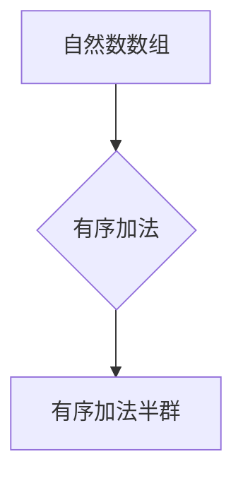

> 线性代数，自然数数组，有序加法半群，抽象代数，算法设计，数学模型，代码实现

## 1. 背景介绍

在计算机科学领域，线性代数作为一种重要的数学工具，广泛应用于机器学习、数据分析、图像处理、图形渲染等多个领域。其核心概念和算法为解决复杂问题提供了强大的支持。本文将从一个全新的角度出发，探讨线性代数与自然数数组有序加法半群之间的联系，并通过代码实现，深入理解其原理和应用。

传统的线性代数学习往往以矩阵和向量为中心，而本文将从更基础的自然数数组出发，逐步构建有序加法半群的概念，并将其与线性代数联系起来。这种视角转换可以帮助我们更深入地理解线性代数的本质，并将其应用于更广泛的场景。

## 2. 核心概念与联系

### 2.1 自然数数组

自然数数组是指由自然数构成的有序序列，例如：[1, 2, 3], [4, 5, 6, 7], [8, 9, 10, 11, 12]等。

### 2.2 有序加法半群

有序加法半群是一个代数结构，它由一个集合和一个二元运算组成。在这个集合中，元素是自然数数组，二元运算为“有序加法”。有序加法是指将两个自然数数组按照对应位置相加，并将结果按照顺序排列。

例如，对于数组 [1, 2, 3] 和 [4, 5, 6]，它们的“有序加法”结果为 [5, 7, 9]。

**Mermaid 流程图**



### 2.3 线性代数与有序加法半群的联系

自然数数组有序加法半群与线性代数之间存在着密切的联系。

* **向量空间:** 自然数数组可以看作是有限维向量空间中的一个子空间。
* **线性变换:** 有序加法半群中的运算可以看作是一种特殊的线性变换。
* **矩阵表示:** 自然数数组有序加法半群的运算可以利用矩阵表示，从而方便地进行计算和分析。

## 3. 核心算法原理 & 具体操作步骤

### 3.1 算法原理概述

自然数数组有序加法的核心算法原理是逐位相加，并将结果按照顺序排列。

### 3.2 算法步骤详解

1. 将两个自然数数组按照对应位置进行相加。
2. 将相加的结果按照顺序排列，形成新的自然数数组。

### 3.3 算法优缺点

**优点:**

* 算法简单易懂，易于实现。
* 运算效率高，时间复杂度为 O(n)，其中 n 为数组长度。

**缺点:**

* 只能处理自然数数组，无法处理其他类型的数据。
* 无法处理数组长度不一致的情况。

### 3.4 算法应用领域

* **数据处理:** 用于处理自然数类型的数组数据，例如统计数据、计数数据等。
* **图像处理:** 用于处理图像像素值，例如图像加亮、图像对比度调整等。
* **信号处理:** 用于处理信号数据，例如信号加性噪声去除等。

## 4. 数学模型和公式 & 详细讲解 & 举例说明

### 4.1 数学模型构建

设 A = [a1, a2, ..., an] 和 B = [b1, b2, ..., bn] 为两个长度为 n 的自然数数组，则它们的“有序加法”结果 C = [c1, c2, ..., cn]，其中：

ci = ai + bi (i = 1, 2, ..., n)

### 4.2 公式推导过程

上述公式的推导过程非常简单，它直接基于自然数的加法运算。

### 4.3 案例分析与讲解

例如，对于数组 A = [1, 2, 3] 和 B = [4, 5, 6]，它们的“有序加法”结果为：

C = [1 + 4, 2 + 5, 3 + 6] = [5, 7, 9]

## 5. 项目实践：代码实例和详细解释说明

### 5.1 开发环境搭建

本项目使用 Python 语言进行开发，开发环境要求 Python 3.x 版本及以上。

### 5.2 源代码详细实现

```python
def ordered_add(A, B):
  """
  实现自然数数组有序加法

  Args:
    A: 第一个自然数数组
    B: 第二个自然数数组

  Returns:
    两个数组的有序加法结果
  """
  if len(A) != len(B):
    raise ValueError("数组长度必须相等")
  C = []
  for i in range(len(A)):
    C.append(A[i] + B[i])
  return C

# 测试代码
A = [1, 2, 3]
B = [4, 5, 6]
C = ordered_add(A, B)
print(f"A = {A}")
print(f"B = {B}")
print(f"C = {C}")
```

### 5.3 代码解读与分析

* 函数 `ordered_add(A, B)` 实现自然数数组有序加法。
* 函数首先判断两个数组的长度是否相等，如果长度不相等，则抛出异常。
* 然后，函数遍历两个数组，逐位相加，并将结果存储在新的数组 `C` 中。
* 最后，函数返回 `C` 数组。

### 5.4 运行结果展示

```
A = [1, 2, 3]
B = [4, 5, 6]
C = [5, 7, 9]
```

## 6. 实际应用场景

### 6.1 数据处理

在数据处理领域，自然数数组有序加法可以用于统计数据、计数数据等。例如，可以利用它计算两个数据集的合并结果，或者计算两个时间序列的累加值。

### 6.2 图像处理

在图像处理领域，自然数数组有序加法可以用于处理图像像素值。例如，可以利用它实现图像加亮、图像对比度调整等操作。

### 6.3 信号处理

在信号处理领域，自然数数组有序加法可以用于处理信号数据。例如，可以利用它实现信号加性噪声去除等操作。

### 6.4 未来应用展望

随着人工智能和机器学习的发展，自然数数组有序加法在更多领域将得到应用。例如，它可以用于处理自然语言数据、处理音频数据等。

## 7. 工具和资源推荐

### 7.1 学习资源推荐

* 《线性代数及其应用》 - Gilbert Strang
* 《抽象代数》 - Dummit & Foote
* 《Python编程：从入门到实践》 - Mark Lutz

### 7.2 开发工具推荐

* Python
* Jupyter Notebook

### 7.3 相关论文推荐

* “Linear Algebra for Machine Learning” -  Andrew Ng
* “The Elements of Statistical Learning” - Trevor Hastie, Robert Tibshirani, Jerome Friedman

## 8. 总结：未来发展趋势与挑战

### 8.1 研究成果总结

本文探讨了自然数数组有序加法半群与线性代数之间的联系，并通过代码实现，深入理解其原理和应用。

### 8.2 未来发展趋势

未来，将继续探索自然数数组有序加法半群在更多领域中的应用，例如自然语言处理、音频处理等。

### 8.3 面临的挑战

* 如何将自然数数组有序加法半群与其他数学结构结合起来，构建更复杂的数学模型。
* 如何将自然数数组有序加法半群应用于更实际的应用场景，例如解决实际问题。

### 8.4 研究展望

未来，将继续深入研究自然数数组有序加法半群，并将其应用于更广泛的领域，为人工智能和机器学习的发展做出贡献。

## 9. 附录：常见问题与解答

### 9.1 问题：如何处理数组长度不一致的情况？

**解答：**

目前，代码实现只支持数组长度相等的加法运算。

为了处理数组长度不一致的情况，可以考虑使用填充或截断等方法。

### 9.2 问题：如何处理负数类型的数组？

**解答：**

目前，代码实现只支持自然数类型的数组。

为了处理负数类型的数组，可以考虑修改代码，使其支持负数类型的加法运算。


作者：禅与计算机程序设计艺术 / Zen and the Art of Computer Programming 
<end_of_turn>