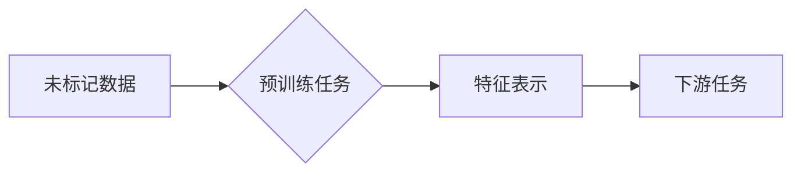

> 自监督学习，无监督学习，预训练模型，迁移学习，深度学习，Transformer

## 1. 背景介绍

在深度学习领域，数据是至关重要的资源。然而，获取高质量、标记数据的成本往往很高，这限制了深度学习模型的训练和应用。为了解决这个问题，自监督学习 (Self-Supervised Learning) 应运而生。

自监督学习是一种特殊的无监督学习方法，它通过设计特殊的预训练任务，利用未标记数据来学习有用的特征表示。这些预训练模型可以进一步用于下游任务，例如图像分类、自然语言处理等，从而提升模型性能。

自监督学习的优势在于：

* **无需人工标注数据：** 可以利用海量未标记数据进行训练，降低数据标注成本。
* **学习更通用的特征表示：** 通过预训练任务，模型可以学习到更抽象、更通用的特征表示，适用于多种下游任务。
* **提升模型性能：** 预训练模型可以作为下游任务的初始化模型，提升模型的训练效率和最终性能。

## 2. 核心概念与联系

自监督学习的核心思想是通过设计一些与目标任务相关的预训练任务，利用未标记数据来学习有用的特征表示。这些预训练任务通常可以分为以下几类：

* **预测任务：** 例如，在图像领域，可以训练模型预测图像中被遮挡的部分，或者预测图像的不同部分之间的关系。
* **生成任务：** 例如，在文本领域，可以训练模型生成文本的下一个词，或者生成文本的摘要。
* **对比任务：** 例如，在图像领域，可以训练模型将相似图像配对，并将不同图像区分开来。

**Mermaid 流程图**



## 3. 核心算法原理 & 具体操作步骤

### 3.1  算法原理概述

自监督学习的核心算法原理是利用预训练任务来学习特征表示。预训练任务的设计需要满足以下几个条件：

* **与目标任务相关：** 预训练任务应该与目标任务有一定的相关性，以便学习到对目标任务有帮助的特征表示。
* **可训练性强：** 预训练任务应该能够用现有的深度学习模型进行训练，并且能够有效地学习到特征表示。
* **数据效率高：** 预训练任务应该能够在较少的训练数据上取得较好的效果。

### 3.2  算法步骤详解

自监督学习的训练过程通常可以分为以下几个步骤：

1. **数据预处理：** 对未标记数据进行预处理，例如图像的裁剪、增强、文本的词嵌入等。
2. **预训练模型构建：** 选择合适的深度学习模型架构，例如CNN、RNN、Transformer等，并根据预训练任务进行调整。
3. **预训练任务设计：** 设计与目标任务相关的预训练任务，并构建相应的损失函数。
4. **模型训练：** 利用预训练任务的损失函数，对预训练模型进行训练，学习到特征表示。
5. **模型微调：** 将预训练模型作为下游任务的初始化模型，利用少量标记数据进行微调，提升模型性能。

### 3.3  算法优缺点

**优点：**

* **无需人工标注数据：** 可以利用海量未标记数据进行训练，降低数据标注成本。
* **学习更通用的特征表示：** 通过预训练任务，模型可以学习到更抽象、更通用的特征表示，适用于多种下游任务。
* **提升模型性能：** 预训练模型可以作为下游任务的初始化模型，提升模型的训练效率和最终性能。

**缺点：**

* **预训练任务设计难度高：** 需要设计与目标任务相关的有效预训练任务，这需要一定的经验和技巧。
* **训练时间长：** 预训练模型的训练时间通常较长，需要大量的计算资源。
* **预训练模型的泛化能力有限：** 预训练模型的泛化能力可能受限于预训练任务的设计和训练数据。

### 3.4  算法应用领域

自监督学习在各个领域都有广泛的应用，例如：

* **计算机视觉：** 图像分类、目标检测、图像分割、图像生成等。
* **自然语言处理：** 文本分类、文本摘要、机器翻译、问答系统等。
* **语音识别：** 语音识别、语音合成、语音情感分析等。
* **推荐系统：** 商品推荐、用户画像、个性化推荐等。

## 4. 数学模型和公式 & 详细讲解 & 举例说明

### 4.1  数学模型构建

自监督学习的数学模型通常基于深度学习框架，例如TensorFlow、PyTorch等。模型的结构可以根据预训练任务的不同而有所变化，例如CNN、RNN、Transformer等。

### 4.2  公式推导过程

自监督学习的损失函数通常是基于预训练任务设计的。例如，在图像领域，如果预训练任务是预测图像中被遮挡的部分，那么损失函数可以是交叉熵损失函数，用于衡量模型预测结果与真实标签之间的差异。

### 4.3  案例分析与讲解

例如，在图像领域，可以使用SimCLR算法进行自监督学习。SimCLR算法通过对图像进行随机增强，生成多个不同的图像版本，然后将这些图像版本作为输入，训练一个对比学习模型。对比学习模型的目标是将相似图像配对，并将不同图像区分开来。

## 5. 项目实践：代码实例和详细解释说明

### 5.1  开发环境搭建

需要安装Python、TensorFlow或PyTorch等深度学习框架，以及必要的库和工具。

### 5.2  源代码详细实现

以下是一个使用PyTorch实现SimCLR算法的简单代码示例：

```python
import torch
import torch.nn as nn
import torch.optim as optim

# 定义网络结构
class ResNet(nn.Module):
    # ...

# 定义对比学习损失函数
def contrastive_loss(output1, output2, target):
    # ...

# 实例化模型和优化器
model = ResNet()
optimizer = optim.Adam(model.parameters())

# 训练循环
for epoch in range(num_epochs):
    for batch in dataloader:
        # ...
        loss = contrastive_loss(output1, output2, target)
        optimizer.zero_grad()
        loss.backward()
        optimizer.step()

```

### 5.3  代码解读与分析

代码示例中定义了ResNet网络结构，以及对比学习损失函数。训练循环中，将图像数据输入模型，计算输出，并使用对比学习损失函数进行训练。

### 5.4  运行结果展示

训练完成后，可以评估模型的性能，例如在图像分类任务上的准确率。

## 6. 实际应用场景

自监督学习在各个领域都有广泛的应用，例如：

* **图像分类：** 使用预训练的图像分类模型，可以提高图像分类的准确率。
* **目标检测：** 使用预训练的目标检测模型，可以提高目标检测的精度和速度。
* **文本生成：** 使用预训练的文本生成模型，可以生成更流畅、更自然的文本。
* **机器翻译：** 使用预训练的机器翻译模型，可以提高机器翻译的准确率和流畅度。

### 6.4  未来应用展望

随着深度学习技术的不断发展，自监督学习的应用场景将会更加广泛。例如：

* **个性化推荐：** 使用自监督学习模型，可以根据用户的行为和偏好，提供更个性化的推荐。
* **医疗诊断：** 使用自监督学习模型，可以辅助医生进行疾病诊断，提高诊断的准确率。
* **自动驾驶：** 使用自监督学习模型，可以帮助自动驾驶系统更好地理解周围环境，提高驾驶安全性。

## 7. 工具和资源推荐

### 7.1  学习资源推荐

* **书籍：**
    * Deep Learning by Ian Goodfellow, Yoshua Bengio, and Aaron Courville
    * Self-Supervised Learning by Pieter Abbeel and David Silver
* **论文：**
    * SimCLR: A Simple Framework for Contrastive Learning of Visual Representations
    * MoCo: Momentum Contrast for Self-Supervised Learning of Visual Representations
* **在线课程：**
    * Coursera: Deep Learning Specialization
    * Udacity: Deep Learning Nanodegree

### 7.2  开发工具推荐

* **深度学习框架：** TensorFlow, PyTorch
* **数据处理工具：** NumPy, Pandas
* **可视化工具：** Matplotlib, Seaborn

### 7.3  相关论文推荐

* SimCLR: A Simple Framework for Contrastive Learning of Visual Representations
* MoCo: Momentum Contrast for Self-Supervised Learning of Visual Representations
* BYOL: Bootstrap Your Own Latent: A Simple Framework for Self-Supervised Learning

## 8. 总结：未来发展趋势与挑战

### 8.1  研究成果总结

自监督学习近年来取得了显著的进展，在图像识别、自然语言处理等领域取得了优异的性能。

### 8.2  未来发展趋势

* **更有效的预训练任务设计：** 探索更有效的预训练任务，例如利用多模态数据进行预训练。
* **更强大的模型架构：** 设计更强大的模型架构，例如基于Transformer的模型。
* **更有效的训练方法：** 探索更有效的训练方法，例如分布式训练、联邦学习等。

### 8.3  面临的挑战

* **预训练任务的通用性：** 预训练任务的通用性仍然是一个挑战，需要设计更通用的预训练任务。
* **模型的解释性：** 自监督学习模型的解释性仍然是一个挑战，需要开发更有效的解释方法。
* **数据安全和隐私：** 自监督学习模型的训练需要大量的未标记数据，数据安全和隐私保护是一个重要的挑战。

### 8.4  研究展望

未来，自监督学习将继续是深度学习研究的热点方向，有望在更多领域取得突破性进展。

## 9. 附录：常见问题与解答

* **什么是自监督学习？**

自监督学习是一种特殊的无监督学习方法，它通过设计一些与目标任务相关的预训练任务，利用未标记数据来学习有用的特征表示。

* **自监督学习的优势是什么？**

自监督学习的优势在于：无需人工标注数据，可以学习更通用的特征表示，提升模型性能。

* **自监督学习有哪些应用场景？**

自监督学习在各个领域都有广泛的应用，例如图像分类、目标检测、文本生成、机器翻译等。


作者：禅与计算机程序设计艺术 / Zen and the Art of Computer Programming 
<end_of_turn>