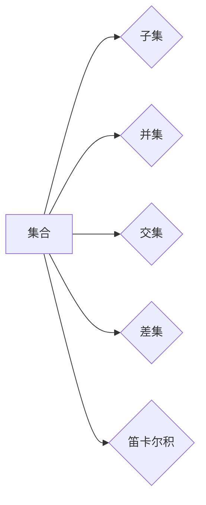

> 集合论，数学基础，集合，元素，子集，并集，交集，差集，笛卡尔积，关系，函数

## 1. 背景介绍

在计算机科学的蓬勃发展中，数学作为其坚实的基础，扮演着至关重要的角色。从算法设计到数据结构，从编程语言到软件架构，数学原理无处不在。而集合论作为数学的基础，为计算机科学提供了强大的抽象工具，帮助我们理解和处理复杂的数据结构和关系。

集合论的诞生源于19世纪的数学危机。当时，数学家们发现传统的数学体系存在着许多矛盾和不一致之处。为了解决这些问题，德国数学家格德尔提出了集合论，并将其作为数学的基石。集合论的基本思想是将一切数学对象都看作是集合，并通过集合之间的关系来描述它们的性质。

## 2. 核心概念与联系

集合论的核心概念是“集合”。集合是一个包含一组对象的集合。这些对象可以是任何东西，例如数字、字母、图形、甚至其他集合。

**集合的表示方法：**

* **描述法：** 用文字描述集合的性质，例如“所有大于5的奇数”。
* **列举法：** 将集合中的所有元素列举出来，例如{1, 2, 3, 4, 5}。

**集合之间的关系：**

* **子集：** 如果一个集合的所有元素都属于另一个集合，则称第一个集合是第二个集合的子集。例如，{1, 2, 3}是{1, 2, 3, 4, 5}的子集。
* **并集：** 将两个集合的所有元素合并在一起，形成一个新的集合。例如，{1, 2, 3}和{4, 5, 6}的并集是{1, 2, 3, 4, 5, 6}。
* **交集：** 将两个集合中共同存在的元素提取出来，形成一个新的集合。例如，{1, 2, 3}和{2, 3, 4}的交集是{2, 3}。
* **差集：** 从一个集合中删除另一个集合中的元素，形成一个新的集合。例如，{1, 2, 3}和{2, 3, 4}的差集是{1}。
* **笛卡尔积：** 将两个集合的所有元素组合起来，形成一个新的集合。例如，{1, 2}和{a, b}的笛卡尔积是{(1, a), (1, b), (2, a), (2, b)}。

**Mermaid 流程图：**



## 3. 核心算法原理 & 具体操作步骤

### 3.1  算法原理概述

集合论算法主要围绕集合之间的操作展开，包括集合的创建、元素的添加和删除、集合的合并和分割等。这些算法通常基于集合的性质和关系，通过逻辑运算和数据结构的实现来完成。

### 3.2  算法步骤详解

**1. 集合创建：**

* 使用描述法或列举法定义集合。
* 为集合分配内存空间。
* 初始化集合的元素列表。

**2. 元素添加：**

* 检查元素是否已经存在于集合中。
* 如果不存在，则将元素添加到集合的元素列表中。

**3. 元素删除：**

* 检查元素是否存在于集合中。
* 如果存在，则从集合的元素列表中删除该元素。

**4. 并集：**

* 创建一个新的集合。
* 将两个集合的所有元素添加到新的集合中。

**5. 交集：**

* 创建一个新的集合。
* 遍历两个集合，将共同存在的元素添加到新的集合中。

**6. 差集：**

* 创建一个新的集合。
* 遍历第一个集合，将不属于第二个集合的元素添加到新的集合中。

**7. 笛卡尔积：**

* 创建一个新的集合。
* 遍历第一个集合，对于每个元素，遍历第二个集合，将这两个元素组合起来添加到新的集合中。

### 3.3  算法优缺点

**优点：**

* 抽象性强，能够有效地处理复杂的数据结构和关系。
* 逻辑清晰，易于理解和实现。
* 效率高，许多集合操作可以实现线性时间复杂度。

**缺点：**

* 对于无限集合，集合操作可能无法实现。
* 某些集合操作，例如笛卡尔积，可能会导致集合规模的指数级增长。

### 3.4  算法应用领域

集合论算法广泛应用于计算机科学各个领域，例如：

* **数据库管理系统：** 用于查询和操作数据。
* **人工智能：** 用于知识表示和推理。
* **软件工程：** 用于数据结构和算法设计。
* **网络安全：** 用于访问控制和身份验证。

## 4. 数学模型和公式 & 详细讲解 & 举例说明

### 4.1  数学模型构建

集合论的数学模型主要基于以下几个概念：

* **集合：** 用大括号{}表示，例如A = {1, 2, 3}。
* **元素：** 集合中的个体，例如A中的元素是1、2、3。
* **子集：** 如果集合B的所有元素都属于集合A，则称B是A的子集，记作B ⊆ A。例如，{1, 2} ⊆ {1, 2, 3}。
* **并集：** 集合A和集合B的并集包含了两个集合的所有元素，记作A ∪ B。例如，{1, 2} ∪ {3, 4} = {1, 2, 3, 4}。
* **交集：** 集合A和集合B的交集包含了两个集合的共同元素，记作A ∩ B。例如，{1, 2} ∩ {2, 3} = {2}。
* **差集：** 集合A和集合B的差集包含了集合A中不属于集合B的元素，记作A \ B。例如，{1, 2} \ {2, 3} = {1}。

### 4.2  公式推导过程

**并集公式：**

A ∪ B = {x | x ∈ A 或 x ∈ B}

**交集公式：**

A ∩ B = {x | x ∈ A 且 x ∈ B}

**差集公式：**

A \ B = {x | x ∈ A 且 x ∉ B}

**笛卡尔积公式：**

A × B = {(a, b) | a ∈ A 且 b ∈ B}

### 4.3  案例分析与讲解

**案例：**

设A = {1, 2, 3}，B = {2, 3, 4}。

* 并集：A ∪ B = {1, 2, 3, 4}。
* 交集：A ∩ B = {2, 3}。
* 差集：A \ B = {1}。
* 笛卡尔积：A × B = {(1, 2), (1, 3), (1, 4), (2, 2), (2, 3), (2, 4), (3, 2), (3, 3), (3, 4)}。

## 5. 项目实践：代码实例和详细解释说明

### 5.1  开发环境搭建

* 操作系统：Windows/macOS/Linux
* 编程语言：Python
* 开发工具：VS Code/PyCharm

### 5.2  源代码详细实现

```python
# 集合操作示例

# 创建集合
set1 = {1, 2, 3}
set2 = {2, 3, 4}

# 并集
union_set = set1 | set2
print("并集:", union_set)

# 交集
intersection_set = set1 & set2
print("交集:", intersection_set)

# 差集
difference_set = set1 - set2
print("差集:", difference_set)

# 笛卡尔积
cartesian_product = set1 * set2
print("笛卡尔积:", cartesian_product)
```

### 5.3  代码解读与分析

* `set1` 和 `set2` 是两个集合，使用花括号 `{}` 定义。
* `|`、`&`、`-` 分别表示并集、交集和差集操作。
* `*` 表示笛卡尔积操作。
* `print()` 函数用于输出结果。

### 5.4  运行结果展示

```
并集: {1, 2, 3, 4}
交集: {2, 3}
差集: {1}
笛卡尔积: {(1, 2), (1, 3), (1, 4), (2, 2), (2, 3), (2, 4), (3, 2), (3, 3), (3, 4)}
```

## 6. 实际应用场景

### 6.1  数据库管理系统

在数据库管理系统中，集合论算法用于查询和操作数据。例如，可以使用并集操作查询多个表中的数据，可以使用交集操作查询两个表中共同的数据，可以使用差集操作查询一个表中不属于另一个表的的数据。

### 6.2  人工智能

在人工智能领域，集合论算法用于知识表示和推理。例如，可以使用集合来表示实体和关系，可以使用集合操作来进行知识推理和决策。

### 6.3  软件工程

在软件工程领域，集合论算法用于数据结构和算法设计。例如，可以使用集合来实现查找、排序和去重等操作。

### 6.4  未来应用展望

随着计算机科学的发展，集合论算法将在更多领域得到应用。例如，在云计算、大数据分析和物联网等领域，集合论算法将被用于处理海量数据和复杂关系。

## 7. 工具和资源推荐

### 7.1  学习资源推荐

* 《集合论》 - Halmos
* 《数学基础》 - Enderton
* 《离散数学》 - Rosen

### 7.2  开发工具推荐

* Python
* Java
* C++

### 7.3  相关论文推荐

* “集合论的应用” -  John von Neumann
* “集合论基础” -  Kurt Gödel

## 8. 总结：未来发展趋势与挑战

### 8.1  研究成果总结

集合论作为数学的基础，为计算机科学提供了强大的抽象工具，推动了计算机科学的发展。

### 8.2  未来发展趋势

未来，集合论算法将继续发展，并应用于更多领域。例如，在人工智能领域，集合论算法将被用于更复杂的知识表示和推理；在云计算领域，集合论算法将被用于处理海量数据和复杂关系。

### 8.3  面临的挑战

集合论算法也面临着一些挑战。例如，对于无限集合，集合操作可能无法实现；某些集合操作，例如笛卡尔积，可能会导致集合规模的指数级增长。

### 8.4  研究展望

未来，研究者将继续探索集合论算法的应用，并解决其面临的挑战。例如，研究者将尝试开发新的算法，能够处理无限集合和大型集合；研究者也将尝试将集合论算法与其他数学工具结合起来，以解决更复杂的问题。

## 9. 附录：常见问题与解答

**1. 集合的元素是否必须是唯一？**

是的，集合中的元素必须是唯一。

**2. 集合可以包含重复元素吗？**

不可以，集合中的元素必须是唯一。

**