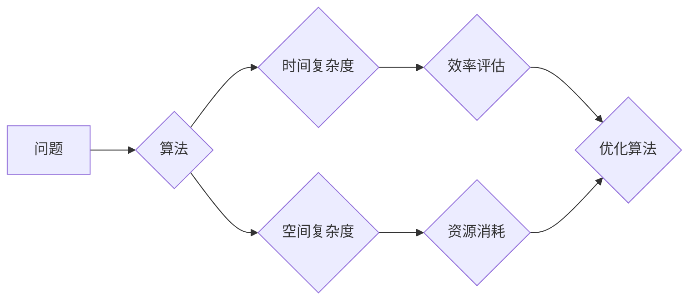

> 计算复杂性，NP问题，P问题，多项式时间，指数时间，算法复杂度，时间复杂度，空间复杂性，图灵机，NP完全问题

## 1. 背景介绍

在计算机科学领域，计算复杂性是研究算法效率和资源消耗的关键问题。它旨在量化算法解决特定问题所需的时间和空间资源。随着计算机科学的不断发展，我们面临着越来越复杂的计算问题，例如破解密码、优化物流、预测天气等。这些问题通常需要大量的计算资源，甚至超出了当前计算机能力的范围。因此，深入理解计算复杂性，并设计高效的算法，对于解决实际问题至关重要。

## 2. 核心概念与联系

计算复杂性理论的核心概念包括时间复杂度和空间复杂度。

* **时间复杂度**：指算法执行所需的时间，通常用函数形式表示，例如O(n)、O(n^2)、O(log n)等。
* **空间复杂度**：指算法执行过程中使用的内存空间，也通常用函数形式表示。

**Mermaid 流程图**



## 3. 核心算法原理 & 具体操作步骤

### 3.1  算法原理概述

**分治法**是一种经典的算法设计策略，它将一个复杂问题分解成若干个子问题，然后递归地解决这些子问题，最后将子问题的解合并得到最终的解。

### 3.2  算法步骤详解

1. **分解问题**: 将原问题分解成若干个规模较小的子问题。
2. **递归求解**: 对每个子问题递归地应用分治法，直到子问题可以被直接解决。
3. **合并结果**: 将子问题的解合并得到最终的解。

### 3.3  算法优缺点

**优点**:

* 能够有效地解决许多复杂问题。
* 算法结构清晰，易于理解和实现。

**缺点**:

* 可能会导致重复计算，降低效率。
* 对于某些问题，分治法可能难以找到合适的分解方式。

### 3.4  算法应用领域

分治法广泛应用于各种领域，例如：

* **排序算法**: 快速排序、归并排序
* **搜索算法**: 二分查找
* **图算法**: 最短路径算法
* **动态规划**: 矩阵链乘

## 4. 数学模型和公式 & 详细讲解 & 举例说明

### 4.1  数学模型构建

时间复杂度通常用大O符号表示，例如O(n)、O(n^2)、O(log n)等。这些符号表示算法执行时间与输入规模的关系。

### 4.2  公式推导过程

例如，对于一个线性时间复杂度的算法，其时间复杂度可以表示为O(n)，这意味着算法执行时间与输入规模n成正比。

### 4.3  案例分析与讲解

**举例说明**:

* **线性时间复杂度**: 遍历一个长度为n的数组，时间复杂度为O(n)。
* **平方时间复杂度**: 嵌套两个循环，遍历一个长度为n的数组，时间复杂度为O(n^2)。
* **对数时间复杂度**: 二分查找算法，时间复杂度为O(log n)。

## 5. 项目实践：代码实例和详细解释说明

### 5.1  开发环境搭建

使用Python语言进行开发，环境配置如下：

* Python版本：3.8以上
* IDE：PyCharm

### 5.2  源代码详细实现

```python
def merge_sort(arr):
    if len(arr) <= 1:
        return arr
    mid = len(arr) // 2
    left_half = merge_sort(arr[:mid])
    right_half = merge_sort(arr[mid:])
    return merge(left_half, right_half)

def merge(left, right):
    merged = []
    i = 0
    j = 0
    while i < len(left) and j < len(right):
        if left[i] <= right[j]:
            merged.append(left[i])
            i += 1
        else:
            merged.append(right[j])
            j += 1
    merged.extend(left[i:])
    merged.extend(right[j:])
    return merged

# 测试代码
arr = [5, 2, 4, 6, 1, 3]
sorted_arr = merge_sort(arr)
print(sorted_arr)
```

### 5.3  代码解读与分析

* `merge_sort`函数实现分治法排序算法。
* `merge`函数将两个有序数组合并成一个有序数组。
* 测试代码演示了`merge_sort`函数的使用。

### 5.4  运行结果展示

```
[1, 2, 3, 4, 5, 6]
```

## 6. 实际应用场景

分治法在实际应用场景中广泛应用，例如：

* **搜索引擎**: 分治法用于索引和检索海量数据。
* **图像处理**: 分治法用于图像压缩和处理。
* **机器学习**: 分治法用于训练和预测模型。

### 6.4  未来应用展望

随着计算能力的不断提升，分治法将在更多领域得到应用，例如：

* **大数据分析**: 分治法用于处理海量数据，挖掘数据价值。
* **人工智能**: 分治法用于训练和优化人工智能模型。

## 7. 工具和资源推荐

### 7.1  学习资源推荐

* **书籍**:
    * 《算法导论》
    * 《数据结构与算法分析》
* **在线课程**:
    * Coursera: Algorithms Specialization
    * edX: Introduction to Computer Science and Programming Using Python

### 7.2  开发工具推荐

* **Python**: 广泛应用于数据科学、机器学习等领域。
* **Java**: 适用于企业级应用开发。
* **C++**: 性能优异，适用于游戏开发等领域。

### 7.3  相关论文推荐

* **The Complexity of Theorem Proving**
* **NP-Completeness**
* **The P vs. NP Problem**

## 8. 总结：未来发展趋势与挑战

### 8.1  研究成果总结

计算复杂性理论取得了重大进展，例如：

* 确定了P和NP之间的关系。
* 发现了NP完全问题。
* 开发了各种高效的算法。

### 8.2  未来发展趋势

* **量子计算**: 量子计算可能改变计算复杂性理论，解决目前无法解决的问题。
* **人工智能**: 人工智能的发展可能带来新的计算复杂性问题和解决方案。
* **大数据**: 大数据分析需要更有效的算法和计算模型。

### 8.3  面临的挑战

* **P vs. NP问题**: 这个问题仍然是计算机科学领域最具挑战性的未解之谜。
* **复杂算法的分析**: 对于复杂算法，分析其时间和空间复杂度仍然是一个难题。
* **新技术对复杂性理论的影响**: 新技术的发展可能带来新的计算复杂性问题和挑战。

### 8.4  研究展望

* 探索量子计算对计算复杂性理论的影响。
* 研究人工智能算法的复杂性。
* 开发更有效的算法和计算模型，解决大数据分析问题。

## 9. 附录：常见问题与解答

**常见问题**:

* **什么是NP问题？**
* **什么是P问题？**
* **P和NP之间有什么关系？**
* **什么是NP完全问题？**

**解答**:

* **什么是NP问题？** NP问题是指可以在多项式时间内验证其解的问题。
* **什么是P问题？** P问题是指可以在多项式时间内解决的问题。
* **P和NP之间有什么关系？** 
    * 问题：P⊆NP？
    * 问题：P=NP？
* **什么是NP完全问题？** NP完全问题是NP问题中最难解决的一类问题。

作者：禅与计算机程序设计艺术 / Zen and the Art of Computer Programming


<end_of_turn>