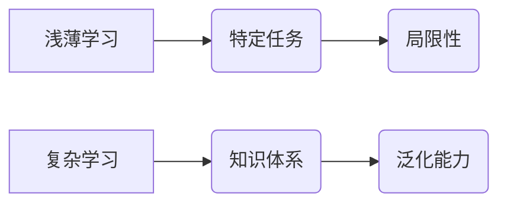

> 认知发展，浅薄学习，复杂学习，神经网络，深度学习，迁移学习，泛化能力

## 1. 背景介绍

在当今数据爆炸的时代，人工智能（AI）正以惊人的速度发展，深度学习算法取得了突破性的进展，在图像识别、自然语言处理等领域展现出强大的能力。然而，我们也注意到，现有的AI模型往往存在着“浅薄学习”的现象，即模型在特定任务上表现出色，但在面对新的、未见过的任务时，却难以泛化，缺乏真正的“智能”。

认知科学研究表明，人类的学习过程并非简单的知识积累，而是通过不断地探索、理解和抽象，逐步构建起复杂而深刻的知识体系。这种“复杂学习”能力是人类智能的核心，也是AI发展面临的重大挑战。

## 2. 核心概念与联系

**2.1 浅薄学习与复杂学习**

* **浅薄学习:** 

   - 侧重于特定任务的模型训练，学习到的知识局限于训练数据，缺乏泛化能力。
   - 类似于人类死记硬背，只能够在熟悉的情况下运用知识，难以应对新的情况。

* **复杂学习:**

   - 旨在构建能够理解和抽象知识的模型，学习到的知识能够迁移到新的任务和领域。
   - 类似于人类的学习过程，通过理解和抽象，建立起知识体系，能够应对新的挑战。

**2.2 核心概念关系图**



**2.3 认知发展与AI发展**

人类的认知发展经历了从简单到复杂的演化过程，AI的发展也遵循着类似的规律。

* **早期AI:** 类似于人类婴儿期，主要关注简单的规则和模式识别。
* **深度学习时代:** 类似于人类儿童期，能够学习更复杂的模式和关系，但仍然局限于特定领域。
* **未来AI:** 期待能够达到人类成年期的认知水平，具备更强的理解、抽象和泛化能力。

## 3. 核心算法原理 & 具体操作步骤

**3.1 算法原理概述**

复杂学习的核心算法之一是**迁移学习**。迁移学习旨在利用已学习到的知识和经验，帮助模型更快、更有效地学习新的任务。

**3.2 算法步骤详解**

1. **源任务训练:** 在一个源任务上训练一个模型，并获得其参数。
2. **特征提取:** 从源任务的模型中提取特征，这些特征能够概括源任务的知识和模式。
3. **目标任务适应:** 将提取的特征作为输入，在目标任务上进行微调，以适应新的任务需求。

**3.3 算法优缺点**

* **优点:**

   - 能够有效利用已有知识，减少训练时间和数据需求。
   - 能够提高模型在目标任务上的泛化能力。

* **缺点:**

   - 源任务和目标任务之间需要有一定的相关性，否则迁移效果不佳。
   - 需要设计合适的特征提取方法，以保证特征的有效性和迁移性。

**3.4 算法应用领域**

迁移学习在许多领域都有广泛的应用，例如：

* **自然语言处理:** 利用预训练语言模型，提高文本分类、机器翻译等任务的性能。
* **计算机视觉:** 利用图像识别模型，提高目标检测、图像分割等任务的性能。
* **医疗诊断:** 利用病历数据，提高疾病诊断的准确率。

## 4. 数学模型和公式 & 详细讲解 & 举例说明

**4.1 数学模型构建**

假设源任务的模型参数为θs，目标任务的模型参数为θt。迁移学习的目标是找到一个θt，使得目标任务的性能最大化。

**4.2 公式推导过程**

目标任务的损失函数为L(θt, D)，其中D是目标任务的数据集。迁移学习的目标是最小化以下损失函数：

```latex
L(θt) = L(θt, D) + λ * D_KL(θt || θs)
```

其中：

* L(θt, D) 是目标任务的损失函数。
* λ 是正则化参数，用于控制迁移学习的程度。
* D_KL(θt || θs) 是源任务模型参数θs和目标任务模型参数θt之间的KL散度。

**4.3 案例分析与讲解**

假设我们有一个图像分类任务，需要训练一个模型来识别不同种类的猫。我们可以利用一个预训练的图像识别模型，作为源任务模型，并将其参数θs作为迁移学习的初始值。然后，我们可以在目标任务上进行微调，以适应猫的识别需求。

通过迁移学习，我们可以利用预训练模型的知识，减少训练时间和数据需求，同时提高模型在目标任务上的性能。

## 5. 项目实践：代码实例和详细解释说明

**5.1 开发环境搭建**

* Python 3.7+
* TensorFlow 2.0+
* PyTorch 1.0+

**5.2 源代码详细实现**

```python
# 迁移学习示例代码

import tensorflow as tf

# 定义源任务模型
source_model = tf.keras.applications.ResNet50(weights='imagenet', include_top=False)

# 定义目标任务模型
target_model = tf.keras.Sequential([
    source_model,
    tf.keras.layers.GlobalAveragePooling2D(),
    tf.keras.layers.Dense(10, activation='softmax')
])

# 冻结源任务模型的权重
for layer in source_model.layers:
    layer.trainable = False

# 编译目标任务模型
target_model.compile(optimizer='adam',
                    loss='sparse_categorical_crossentropy',
                    metrics=['accuracy'])

# 训练目标任务模型
target_model.fit(x_train, y_train, epochs=10)

# 评估目标任务模型
loss, accuracy = target_model.evaluate(x_test, y_test)
print('Loss:', loss)
print('Accuracy:', accuracy)
```

**5.3 代码解读与分析**

* 首先，我们定义了源任务模型和目标任务模型。源任务模型是一个预训练的ResNet50模型，目标任务模型是一个简单的分类模型。
* 然后，我们冻结了源任务模型的权重，只训练目标任务模型的参数。
* 最后，我们训练目标任务模型，并评估其性能。

**5.4 运行结果展示**

通过运行上述代码，我们可以观察到目标任务模型在目标任务上的性能。

## 6. 实际应用场景

**6.1 自然语言处理**

* **文本分类:** 利用预训练语言模型，提高文本分类的准确率，例如垃圾邮件过滤、情感分析等。
* **机器翻译:** 利用预训练语言模型，提高机器翻译的质量，例如将英文翻译成中文。

**6.2 计算机视觉**

* **目标检测:** 利用预训练图像识别模型，提高目标检测的准确率，例如人脸识别、车辆检测等。
* **图像分割:** 利用预训练图像识别模型，提高图像分割的准确率，例如医学图像分割。

**6.3 其他领域**

* **医疗诊断:** 利用病历数据，提高疾病诊断的准确率。
* **金融预测:** 利用股票市场数据，提高股票价格预测的准确率。

**6.4 未来应用展望**

随着深度学习技术的不断发展，迁移学习将在更多领域得到应用，例如：

* **个性化学习:** 根据用户的学习风格和需求，定制个性化的学习路径。
* **自动驾驶:** 利用预训练的驾驶数据，提高自动驾驶系统的安全性。
* **机器人控制:** 利用预训练的运动数据，提高机器人的控制精度。

## 7. 工具和资源推荐

**7.1 学习资源推荐**

* **书籍:**

   * 《深度学习》
   * 《迁移学习》

* **在线课程:**

   * Coursera: 深度学习
   * Udacity: 迁移学习

**7.2 开发工具推荐**

* **TensorFlow:** 开源深度学习框架
* **PyTorch:** 开源深度学习框架
* **Keras:** 高级深度学习API

**7.3 相关论文推荐**

* 《迁移学习: 一种机器学习方法》
* 《深度迁移学习》

## 8. 总结：未来发展趋势与挑战

**8.1 研究成果总结**

迁移学习在人工智能领域取得了显著的进展，能够有效利用已有知识，提高模型的泛化能力。

**8.2 未来发展趋势**

* **更有效的迁移学习算法:** 研究更有效的迁移学习算法，能够更好地利用源任务和目标任务之间的关系。
* **跨模态迁移学习:** 研究跨模态迁移学习，例如将图像识别模型迁移到自然语言处理任务。
* **联邦迁移学习:** 研究联邦迁移学习，能够在保护数据隐私的前提下进行迁移学习。

**8.3 面临的挑战**

* **数据获取和标注:** 迁移学习需要大量的训练数据，获取和标注这些数据成本较高。
* **任务相关性:** 源任务和目标任务之间需要有一定的相关性，否则迁移效果不佳。
* **模型解释性:** 迁移学习模型的内部机制较为复杂，难以解释其决策过程。

**8.4 研究展望**

未来，迁移学习将继续是人工智能领域的重要研究方向，其发展将推动人工智能技术的进步，并应用于更多领域，为人类社会带来更多福祉。

## 9. 附录：常见问题与解答

**9.1 如何选择合适的源任务模型？**

选择源任务模型时，需要考虑源任务和目标任务之间的相关性。

**9.2 如何评估迁移学习的效果？**

可以使用目标任务上的准确率、F1-score等指标来评估迁移学习的效果。

**9.3 如何解决数据获取和标注的问题？**

可以考虑使用公开数据集、数据增强技术等方法来解决数据获取和标注的问题。


作者：禅与计算机程序设计艺术 / Zen and the Art of Computer Programming 
<end_of_turn>