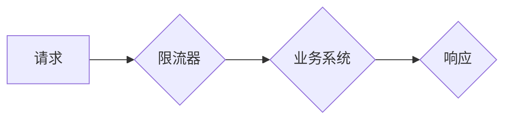

> 限流，DDos攻击，系统过载，流量控制，网络安全，高可用性，算法设计，性能优化

## 1. 背景介绍

在当今互联网时代，网络安全问题日益突出，分布式拒绝服务攻击（DDoS）成为一种常见的网络攻击手段。DDoS攻击是指攻击者利用大量机器发起恶意请求，淹没目标服务器，导致服务器无法正常响应合法请求，从而导致网站或应用服务中断。

系统过载也可能由其他原因引起，例如突发流量高峰、应用程序错误等。无论原因是什么，系统过载都会导致用户体验下降，甚至导致服务不可用。

为了应对这些挑战，限流技术应运而生。限流技术是指通过控制网络流量，防止服务器被过载或遭受攻击。限流技术可以有效地缓解DDoS攻击的影响，提高系统稳定性和可用性。

## 2. 核心概念与联系

限流的核心概念是**流量控制**。流量控制是指通过限制流量的发送速率或数量，来控制网络流量的进入和离开。限流技术通常结合多种算法和策略，实现对流量的精准控制。

**限流架构**



**核心概念关系**

* **请求:** 来自用户的网络请求。
* **限流器:** 负责控制流量的组件。
* **业务系统:** 需要保护的服务器或应用程序。
* **响应:** 业务系统对请求的处理结果。

## 3. 核心算法原理 & 具体操作步骤

### 3.1  算法原理概述

常见的限流算法包括：

* **漏桶算法:** 类似于漏桶，流量被限制在一定速率内通过。
* **令牌桶算法:** 类似于令牌桶，每个请求需要消耗一个令牌，令牌的生成速率限制了请求的速率。
* **滑动窗口算法:** 将时间划分为滑动窗口，在每个窗口内限制请求数量。
* **基于机器学习的限流算法:** 利用机器学习模型识别恶意流量，并进行精准限流。

### 3.2  算法步骤详解

**漏桶算法步骤:**

1. 设置一个桶，桶的容量为 `Q`。
2. 每秒钟向桶中添加 `R` 个单位流量。
3. 当请求到达时，如果桶中流量充足，则允许请求通过；否则，丢弃请求。

**令牌桶算法步骤:**

1. 设置一个令牌桶，桶的容量为 `B`。
2. 每秒钟向令牌桶中添加 `R` 个令牌。
3. 当请求到达时，如果令牌桶中存在令牌，则消耗一个令牌，允许请求通过；否则，丢弃请求。

### 3.3  算法优缺点

| 算法 | 优点 | 缺点 |
|---|---|---|
| 漏桶算法 | 简单易实现，性能高 | 无法精准控制流量峰值 |
| 令牌桶算法 | 可以精准控制流量峰值 | 算法复杂度较高 |
| 滑动窗口算法 | 可以根据流量变化动态调整限流策略 | 需要维护滑动窗口状态，复杂度较高 |
| 基于机器学习的限流算法 | 可以识别恶意流量，精准限流 | 需要训练机器学习模型，复杂度较高 |

### 3.4  算法应用领域

* **网站和应用服务限流:** 防止网站或应用服务被DDoS攻击或突发流量高峰所淹没。
* **API限流:** 控制API调用频率，防止滥用和服务过载。
* **数据库限流:** 控制数据库查询频率，防止数据库压力过大。

## 4. 数学模型和公式 & 详细讲解 & 举例说明

### 4.1  数学模型构建

**漏桶算法数学模型:**

* `Q`: 桶容量
* `R`: 流量添加速率
* `T`: 时间间隔
* `N`: 请求数量

```
流量 = min(N, Q/T)
```

**令牌桶算法数学模型:**

* `B`: 令牌桶容量
* `R`: 令牌生成速率
* `T`: 时间间隔
* `N`: 请求数量

```
令牌数 = min(N, B/T)
```

### 4.2  公式推导过程

**漏桶算法流量计算:**

* 每秒钟添加 `R` 个流量单位，时间间隔 `T` 秒，则添加的流量为 `R * T`。
* 桶容量为 `Q`，则流量限制为 `Q/T`。
* 实际流量为 `min(N, Q/T)`，即请求数量与桶容量的最小值。

**令牌桶算法令牌数计算:**

* 每秒钟生成 `R` 个令牌，时间间隔 `T` 秒，则生成的令牌数为 `R * T`。
* 令牌桶容量为 `B`，则令牌数限制为 `B/T`。
* 实际令牌数为 `min(N, B/T)`，即请求数量与令牌桶容量的最小值。

### 4.3  案例分析与讲解

**案例:**

假设一个网站每天需要处理 100,000 个请求，并且需要限制每秒钟的请求数量为 100 个。

**使用漏桶算法:**

* 桶容量 `Q` = 100 * 1 = 100
* 流量添加速率 `R` = 100

**使用令牌桶算法:**

* 令牌桶容量 `B` = 100 * 1 = 100
* 令牌生成速率 `R` = 100

**分析:**

两种算法都可以满足需求，但令牌桶算法可以更精准地控制流量峰值。

## 5. 项目实践：代码实例和详细解释说明

### 5.1  开发环境搭建

* 操作系统: Linux
* 编程语言: Python
* 框架: Flask

### 5.2  源代码详细实现

```python
from flask import Flask, request, jsonify
import time

app = Flask(__name__)

# 限流器配置
Q = 100  # 桶容量
R = 100  # 流量添加速率
T = 1  # 时间间隔

# 记录流量
last_time = time.time()
current_flow = 0

@app.route('/api', methods=['GET'])
def api():
    global last_time, current_flow

    # 计算当前时间
    current_time = time.time()

    # 计算流量变化
    flow_change = (current_time - last_time) * R

    # 更新流量
    current_flow += flow_change

    # 更新上次时间
    last_time = current_time

    # 限流判断
    if current_flow >= Q:
        return jsonify({'error': '请求过频繁'}), 429
    else:
        current_flow -= flow_change
        return jsonify({'message': '请求成功'})

if __name__ == '__main__':
    app.run(debug=True)
```

### 5.3  代码解读与分析

* **限流器配置:** 设置桶容量 `Q`、流量添加速率 `R` 和时间间隔 `T`。
* **流量记录:** 使用 `last_time` 和 `current_flow` 记录流量变化。
* **限流判断:** 当 `current_flow` 大于等于 `Q` 时，返回 429 错误码，表示请求过频繁。
* **流量更新:** 当请求成功时，更新 `current_flow`。

### 5.4  运行结果展示

运行代码后，访问 `/api` 接口，可以观察到限流效果。

## 6. 实际应用场景

### 6.1  网站和应用服务限流

* **防止DDoS攻击:** 限流可以有效地阻止恶意流量，防止网站或应用服务被攻击。
* **缓解突发流量高峰:** 当网站或应用服务遇到突发流量高峰时，限流可以防止服务器过载，保证服务稳定运行。

### 6.2  API限流

* **防止API滥用:** 限流可以限制API调用频率，防止恶意用户滥用API。
* **保护API服务稳定性:** 限流可以防止API服务被过量请求所淹没，保证API服务稳定运行。

### 6.3  数据库限流

* **防止数据库压力过大:** 限流可以控制数据库查询频率，防止数据库压力过大。
* **提高数据库性能:** 限流可以提高数据库性能，减少数据库查询时间。

### 6.4  未来应用展望

* **基于机器学习的限流算法:** 利用机器学习模型识别恶意流量，并进行精准限流。
* **动态限流策略:** 根据流量变化动态调整限流策略，提高限流效率。
* **边缘计算限流:** 将限流逻辑部署到边缘节点，降低网络延迟，提高限流效率。

## 7. 工具和资源推荐

### 7.1  学习资源推荐

* **书籍:**
    * 《网络安全》
    * 《网络攻击与防御》
* **网站:**
    * OWASP
    * SANS Institute

### 7.2  开发工具推荐

* **Nginx:** 高性能Web服务器，支持限流功能。
* **HAProxy:** 高性能负载均衡器，支持限流功能。
* **Redis:** 高性能内存数据库，可以用于实现令牌桶算法。

### 7.3  相关论文推荐

* **"A Survey of DDoS Attack Detection and Mitigation Techniques"**
* **"Token Bucket Algorithm for Traffic Shaping"**

## 8. 总结：未来发展趋势与挑战

### 8.1  研究成果总结

限流技术已经取得了显著的成果，有效地缓解了DDoS攻击和系统过载的威胁。

### 8.2  未来发展趋势

* **人工智能驱动的限流:** 利用机器学习模型识别恶意流量，并进行精准限流。
* **动态限流策略:** 根据流量变化动态调整限流策略，提高限流效率。
* **边缘计算限流:** 将限流逻辑部署到边缘节点，降低网络延迟，提高限流效率。

### 8.3  面临的挑战

* **恶意攻击的不断升级:** 攻击者不断开发新的攻击手段，限流技术需要不断更新和改进。
* **网络环境的复杂性:** 网络环境复杂多样，限流策略需要能够适应不同的网络环境。
* **资源消耗:** 一些限流算法需要消耗大量的计算资源，需要优化算法，降低资源消耗。

### 8.4  研究展望

未来，限流技术将继续朝着智能化、动态化、高效化的方向发展，为网络安全提供更强大的保障。

## 9. 附录：常见问题与解答

**Q1: 什么是限流？**

**A1:** 限流是指通过控制网络流量，防止服务器被过载或遭受攻击。

**Q2: 限流算法有哪些？**

**A2:** 常见的限流算法包括漏桶算法、令牌桶算法、滑动窗口算法和基于机器学习的限流算法。

**Q3: 如何选择合适的限流算法？**

**A3:** 选择合适的限流算法需要根据实际应用场景和需求进行选择。

**Q4: 限流技术有哪些应用场景？**

**A4:** 限流技术广泛应用于网站和应用服务限流、API限流和数据库限流等场景。


作者：禅与计算机程序设计艺术 / Zen and the Art of Computer Programming 
<end_of_turn>