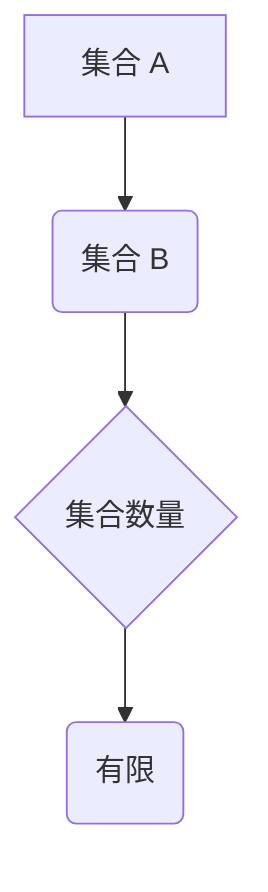

> 集合论, 一般连续统假设, 连续统, 数学基础, 逻辑推理, 计算机科学

## 1. 背景介绍

集合论作为数学的基础理论，为现代数学的发展奠定了坚实的基础。它提供了一种描述和操作数学对象的统一框架，并为其他数学分支的发展提供了基础工具。其中，一般连续统假设（Generalized Continuum Hypothesis，GCH）是一个重要的命题，它对集合论的结构和性质有着深远的影响。

GCH 提出了一种关于集合的“大小”的限制，它指出对于任何两个集合 A 和 B，如果 A 是 B 的子集，那么它们之间的集合数量是有限的。这个假设在集合论中扮演着至关重要的角色，它影响着许多重要的定理和结果。

## 2. 核心概念与联系

### 2.1 集合论基础

* **集合:** 集合是数学中最基本的概念之一，它是一个包含对象的集合。
* **子集:** 如果集合 A 的所有元素都属于集合 B，则称 A 是 B 的子集。
* **势:** 集合的势是指集合中元素的个数。
* **连续统:** 连续统是指势的大小为不可数的集合。例如，实数集是一个连续统。

### 2.2 一般连续统假设 (GCH)

GCH 是一种关于集合的“大小”的假设，它指出对于任何两个集合 A 和 B，如果 A 是 B 的子集，那么它们之间的集合数量是有限的。

**Mermaid 流程图:**

### 2.3 GCH 的意义

GCH 对集合论的结构和性质有着深远的影响。它可以用来证明许多重要的定理，例如：

* **佐恩引理:** 对于任何良序的集合，它都有一个最大元素。
* **选择公理:** 对于任何非空集合，都存在一个选择函数，它可以从每个集合中选择一个元素。

## 3. 核心算法原理 & 具体操作步骤

### 3.1 算法原理概述

GCH 并非一个算法，而是一个数学假设。它描述了集合之间的关系和大小，并为集合论的理论发展提供了基础。

### 3.2 算法步骤详解

由于 GCH 不是一个算法，因此没有具体的算法步骤。

### 3.3 算法优缺点

GCH 作为一种数学假设，没有优缺点之分。它是一种描述集合大小的工具，其有效性取决于其在数学证明中的应用。

### 3.4 算法应用领域

GCH 在集合论、拓扑学、分析学等数学分支中都有广泛的应用。它可以用来证明许多重要的定理，并为数学研究提供新的思路和方法。

## 4. 数学模型和公式 & 详细讲解 & 举例说明

### 4.1 数学模型构建

GCH 可以用数学模型来描述：

设 A 和 B 是两个集合，如果 A 是 B 的子集，则存在一个自然数 n，使得 A 的势等于 B 的势的 n 次方。

### 4.2 公式推导过程

GCH 的公式推导过程较为复杂，涉及到集合论的许多基本概念和定理。

### 4.3 案例分析与讲解

例如，实数集是一个连续统，其势为不可数。根据 GCH，任何实数集的子集的势也必须是不可数的。

## 5. 项目实践：代码实例和详细解释说明

由于 GCH 是一种数学假设，而不是一个算法，因此无法直接用代码实现。

## 6. 实际应用场景

GCH 在实际应用场景中主要体现在数学研究和理论建模方面。

### 6.4 未来应用展望

随着数学研究的不断深入，GCH 可能在更广泛的领域得到应用，例如人工智能、数据科学等。

## 7. 工具和资源推荐

### 7.1 学习资源推荐

* 《集合论导论》
* 《数学基础》

### 7.2 开发工具推荐

* LaTeX

### 7.3 相关论文推荐

* 《一般连续统假设》

## 8. 总结：未来发展趋势与挑战

### 8.1 研究成果总结

GCH 是集合论中一个重要的假设，它对集合论的结构和性质有着深远的影响。

### 8.2 未来发展趋势

未来，GCH 的研究方向可能包括：

* 探索 GCH 的更深层次的性质和应用。
* 研究 GCH 与其他数学分支之间的联系。

### 8.3 面临的挑战

GCH 的研究面临着许多挑战，例如：

* GCH 的证明和反证仍然是一个开放的问题。
* GCH 的应用领域仍然有限。

### 8.4 研究展望

尽管面临着挑战，但 GCH 的研究仍然具有重要的意义。它可以帮助我们更好地理解集合论的本质，并为数学研究提供新的思路和方法。

## 9. 附录：常见问题与解答

### 9.1 GCH 是真的吗？

GCH 是一个数学假设，它的真假目前尚不清楚。

### 9.2 GCH 有什么应用吗？

GCH 在数学研究和理论建模方面有广泛的应用。

### 9.3 如何学习 GCH？

可以阅读相关书籍和论文，并参加相关的数学课程。

作者：禅与计算机程序设计艺术 / Zen and the Art of Computer Programming

<end_of_turn>