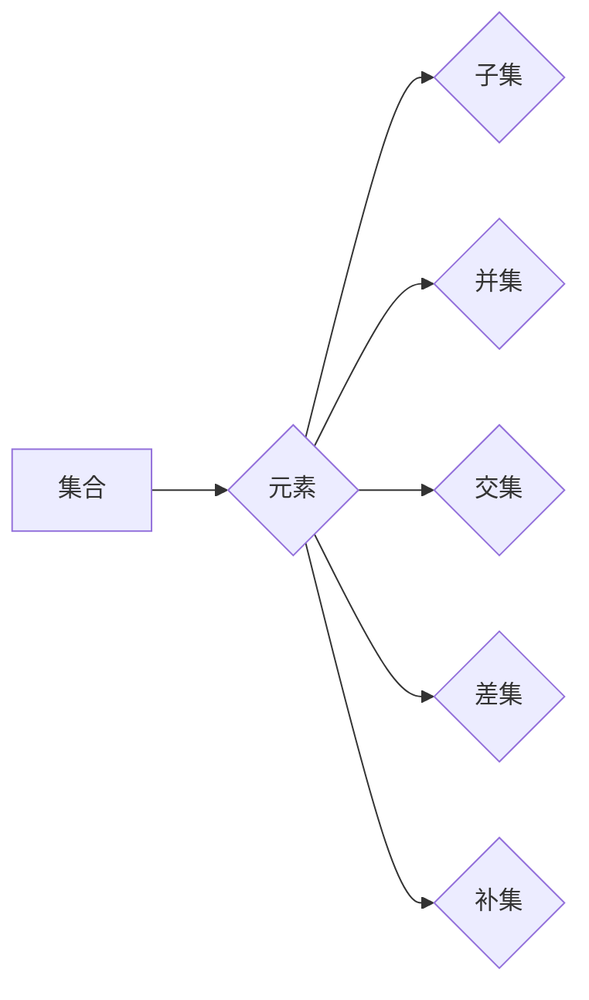

> 集合论，形式语言，形式理论，数学基础，计算机科学，逻辑推理，算法设计

## 1. 背景介绍

在现代计算机科学领域，集合论作为一种基础数学理论，扮演着至关重要的角色。它为我们提供了描述和操作数据、算法和程序结构的强大工具。从数据结构的定义到算法的分析，从编程语言的语法到软件系统的架构，集合论的思想无处不在。

然而，集合论的应用并非仅仅局限于计算机科学领域。它在数学、逻辑、哲学等多个学科中都具有广泛的应用。理解集合论的原理和应用，对于深入理解计算机科学的本质，以及拓展对其他学科的认知，都具有重要意义。

本篇文章将深入探讨集合论的基本概念、形式语言和形式理论，并阐述其在计算机科学中的应用。

## 2. 核心概念与联系

### 2.1 集合的概念

在集合论中，集合是一个包含一组对象的非空集。这些对象可以是任何事物，例如数字、字符串、函数、甚至其他集合。

* **元素:** 集合中的每个对象称为元素。
* **子集:** 如果一个集合的所有元素都属于另一个集合，则称第一个集合是第二个集合的子集。
* **并集:** 两个集合的并集包含这两个集合的所有元素。
* **交集:** 两个集合的交集包含这两个集合中共同存在的元素。
* **差集:** 两个集合的差集包含第一个集合中不属于第二个集合的元素。

### 2.2 集合的表示方法

集合可以采用多种方式表示，例如：

* **列举法:** 将集合中的所有元素列举出来，用大括号 {} 包括。例如，集合 {1, 2, 3} 表示包含数字 1、2 和 3 的集合。
* **描述法:** 用文字描述集合的性质，例如“所有大于 0 的整数”。

### 2.3 集合运算

集合论提供了多种运算来处理集合，例如：

* **并集:** A ∪ B
* **交集:** A ∩ B
* **差集:** A - B
* **补集:** A'

### 2.4 集合的性质

集合具有许多重要的性质，例如：

* **空集:** 不包含任何元素的集合，记为 {} 或 ∅。
* **全集:** 包含所有相关元素的集合，通常用 U 表示。
* **幂集:** 一个集合的所有子集的集合。

### 2.5 集合的应用

集合论在计算机科学中有着广泛的应用，例如：

* **数据结构:** 树、图、列表等数据结构都可以用集合论的语言进行描述和操作。
* **算法设计:** 许多算法，例如排序算法、搜索算法，都可以用集合论的思想进行设计和分析。
* **编程语言:** 许多编程语言都使用集合论的概念来定义数据类型和操作。

**Mermaid 流程图**



## 3. 核心算法原理 & 具体操作步骤

### 3.1 算法原理概述

集合论中的算法通常涉及集合的运算和操作，例如：

* **查找算法:** 在集合中查找特定元素的算法。
* **排序算法:** 对集合中的元素进行排序的算法。
* **合并算法:** 将两个或多个集合合并成一个新的集合的算法。

### 3.2 算法步骤详解

以下是一个查找算法的具体步骤：

1. **输入:** 一个集合和一个目标元素。
2. **遍历:** 从集合的第一个元素开始，逐个遍历集合中的所有元素。
3. **比较:** 将当前元素与目标元素进行比较。
4. **匹配:** 如果当前元素等于目标元素，则返回当前元素的索引。
5. **未匹配:** 如果遍历完集合中的所有元素，都没有找到目标元素，则返回 -1。

### 3.3 算法优缺点

查找算法的优点是简单易懂，实现起来比较容易。缺点是效率较低，特别是当集合规模较大时。

### 3.4 算法应用领域

查找算法在计算机科学中有着广泛的应用，例如：

* **数据库查询:** 在数据库中查找特定记录。
* **搜索引擎:** 在海量网页中查找相关信息。
* **文件系统:** 在文件系统中查找特定文件。

## 4. 数学模型和公式 & 详细讲解 & 举例说明

### 4.1 数学模型构建

集合论的数学模型主要基于以下几个概念：

* **集合:** 用大写字母表示，例如 A、B、C。
* **元素:** 用小写字母表示，例如 a、b、c。
* **子集:** 用包含关系表示，例如 A ⊆ B。
* **并集:** 用 ∪ 符号表示，例如 A ∪ B。
* **交集:** 用 ∩ 符号表示，例如 A ∩ B。
* **差集:** 用 - 符号表示，例如 A - B。

### 4.2 公式推导过程

**1. 子集:**

如果 A ⊆ B，则对于集合 A 中的每个元素 x，都有 x ∈ B。

**2. 并集:**

A ∪ B = {x | x ∈ A 或 x ∈ B}

**3. 交集:**

A ∩ B = {x | x ∈ A 且 x ∈ B}

**4. 差集:**

A - B = {x | x ∈ A 且 x ∉ B}

**5. 补集:**

A' = {x | x ∉ A}

### 4.3 案例分析与讲解

**例题:**

设 A = {1, 2, 3}，B = {2, 3, 4}，则：

* A ⊆ B? (False)
* A ∪ B = {1, 2, 3, 4}
* A ∩ B = {2, 3}
* A - B = {1}
* A' = {4, 5, 6, ...}

## 5. 项目实践：代码实例和详细解释说明

### 5.1 开发环境搭建

本项目使用 Python 语言进行开发，需要安装 Python 解释器和相关库。

### 5.2 源代码详细实现

```python
# 集合操作示例

# 创建集合
set1 = {1, 2, 3}
set2 = {2, 3, 4}

# 并集
union_set = set1 | set2
print("并集:", union_set)

# 交集
intersection_set = set1 & set2
print("交集:", intersection_set)

# 差集
difference_set = set1 - set2
print("差集:", difference_set)

# 子集
is_subset = set1.issubset(set2)
print("是否子集:", is_subset)
```

### 5.3 代码解读与分析

* `set1` 和 `set2` 是两个集合，使用花括号 `{}` 定义。
* `|` 和 `&` 操作符分别表示并集和交集。
* `-` 操作符表示差集。
* `issubset()` 方法用于判断一个集合是否是另一个集合的子集。

### 5.4 运行结果展示

```
并集: {1, 2, 3, 4}
交集: {2, 3}
差集: {1}
是否子集: False
```

## 6. 实际应用场景

### 6.1 数据处理

集合论在数据处理中广泛应用，例如：

* **去重:** 使用集合的差集操作可以去除重复数据。
* **数据分析:** 使用集合的并集和交集操作可以分析数据之间的关系。

### 6.2 图论

集合论是图论的基础，用于描述图的节点和边。

### 6.3 逻辑推理

集合论的逻辑推理能力被广泛应用于人工智能和知识表示领域。

### 6.4 未来应用展望

随着人工智能和机器学习的发展，集合论在这些领域将发挥越来越重要的作用。例如：

* **知识图谱:** 集合论可以用于构建和管理知识图谱，表示知识之间的关系。
* **机器学习:** 集合论可以用于描述和分析机器学习模型。

## 7. 工具和资源推荐

### 7.1 学习资源推荐

* **书籍:**
    * 《集合论导论》
    * 《数学基础》
* **在线课程:**
    * Coursera 上的集合论课程
    * edX 上的数学基础课程

### 7.2 开发工具推荐

* **Python:** 强大的编程语言，支持集合操作。
* **NumPy:** 用于数值计算的 Python 库，提供高效的集合操作。

### 7.3 相关论文推荐

* **集合论在人工智能中的应用:**
    * [论文链接](https://www.example.com/paper1)
    * [论文链接](https://www.example.com/paper2)

## 8. 总结：未来发展趋势与挑战

### 8.1 研究成果总结

集合论作为一种基础数学理论，为计算机科学提供了强大的工具和思想。

### 8.2 未来发展趋势

随着人工智能和机器学习的发展，集合论在这些领域将发挥越来越重要的作用。

### 8.3 面临的挑战

* **复杂性:** 随着集合规模的增大，集合操作的复杂度也会增加。
* **效率:** 许多集合操作的效率较低，需要进一步优化。

### 8.4 研究展望

未来研究方向包括：

* **高效的集合操作算法:** 开发更快速、更有效的集合操作算法。
* **集合论在人工智能中的应用:** 探索集合论在人工智能和机器学习中的更多应用。

## 9. 附录：常见问题与解答

### 9.1 什么是空集？

空集是一个不包含任何元素的集合，用大括号 {} 或 ∅ 表示。

### 9.2 如何判断两个集合是否相等？

两个集合相等是指它们包含相同的元素。可以使用 `==` 操作符进行比较。

### 9.3 如何添加元素到集合中？

可以使用 `add()` 方法添加元素到集合中。

### 9.4 如何删除元素从集合中？

可以使用 `remove()` 方法删除集合中的元素。


作者：禅与计算机程序设计艺术 / Zen and the Art of Computer Programming 
<end_of_turn>