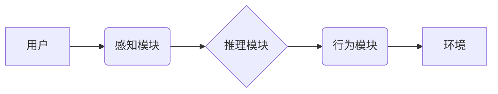

> AI Agent, 情感陪伴, 自然语言处理, 深度学习, 情感识别, 虚拟助手, 人机交互

## 1. 背景介绍

随着科技的飞速发展，人工智能（AI）已经渗透到我们生活的方方面面。其中，AI Agent在情感陪伴领域展现出巨大的潜力。传统的人工智能助手主要侧重于提供信息和完成任务，而情感陪伴型AI Agent则更注重理解和回应用户的情感需求，提供更加人性化的陪伴体验。

近年来，随着深度学习技术的进步，自然语言处理（NLP）和情感识别技术的不断发展，AI Agent在情感陪伴领域的应用越来越广泛。从聊天机器人到虚拟宠物，各种情感陪伴型AI Agent已经开始出现在我们的生活中，为人们提供情感支持、陪伴和娱乐。

## 2. 核心概念与联系

**2.1 情感陪伴**

情感陪伴是指通过与他人建立情感联系，提供情感支持和陪伴，从而满足人们的心理需求。它是一种重要的社交需求，可以帮助人们缓解压力、提升幸福感和获得情感支持。

**2.2 AI Agent**

AI Agent是一种能够感知环境、做出决策并与环境交互的智能系统。它通常由以下几个核心组件组成：

* **感知模块:** 用于接收来自环境的信息，例如文本、语音、图像等。
* **推理模块:** 用于分析和理解接收到的信息，并做出决策。
* **行为模块:** 用于与环境进行交互，例如生成文本、语音或控制物理设备。

**2.3 情感识别技术**

情感识别技术是指通过分析人的语言、表情、语音等信息，识别出人的情感状态的技术。它可以帮助AI Agent理解用户的意图和情感需求，从而提供更加精准和有效的陪伴体验。

**2.4 人机交互**

人机交互是指人与计算机之间进行信息交换和交互的过程。在情感陪伴领域，人机交互需要更加自然、流畅和人性化，才能更好地满足用户的需求。

**2.5 架构图**



## 3. 核心算法原理 & 具体操作步骤

**3.1 算法原理概述**

情感陪伴型AI Agent的核心算法通常基于深度学习技术，包括自然语言处理（NLP）和情感识别技术。

* **自然语言处理（NLP）:** 用于理解和处理人类语言，例如文本分类、情感分析、对话生成等。
* **情感识别技术:** 用于识别用户的语言、表情、语音等信息中的情感状态，例如快乐、悲伤、愤怒等。

**3.2 算法步骤详解**

1. **数据收集和预处理:** 收集大量文本、语音和表情数据，并进行预处理，例如文本清洗、语音转文本等。
2. **模型训练:** 使用深度学习算法，例如循环神经网络（RNN）或Transformer，对收集的数据进行训练，构建情感识别和对话生成模型。
3. **情感识别:** 当用户输入文本、语音或表情信息时，AI Agent会使用训练好的情感识别模型，识别用户的当前情感状态。
4. **对话生成:** 根据用户的输入和情感状态，AI Agent会使用训练好的对话生成模型，生成相应的回复，提供情感支持和陪伴。
5. **交互反馈:** AI Agent会根据用户的反馈，不断调整对话策略，提供更加精准和有效的陪伴体验。

**3.3 算法优缺点**

* **优点:**
    * 可以提供24/7的陪伴和支持。
    * 可以根据用户的需求，提供个性化的陪伴体验。
    * 可以帮助人们缓解压力和提升幸福感。
* **缺点:**
    * 无法完全替代人类的陪伴和支持。
    * 可能会出现误判用户情感状态的情况。
    * 需要大量的训练数据和计算资源。

**3.4 算法应用领域**

* **情感支持:** 为抑郁症患者、孤独老人等提供情感支持和陪伴。
* **心理咨询:** 为用户提供初步的心理咨询服务，帮助他们缓解压力和焦虑。
* **教育辅导:** 为学生提供个性化的学习辅导和陪伴。
* **娱乐休闲:** 为用户提供互动游戏、聊天和故事等娱乐服务。

## 4. 数学模型和公式 & 详细讲解 & 举例说明

**4.1 数学模型构建**

情感识别模型通常采用多层感知机（MLP）或卷积神经网络（CNN）等深度学习模型。

**4.2 公式推导过程**

深度学习模型的训练过程涉及到梯度下降算法和反向传播算法。

* **梯度下降算法:** 用于更新模型参数，使其能够更好地拟合训练数据。
* **反向传播算法:** 用于计算模型参数的梯度，并将其传递回模型，更新模型参数。

**4.3 案例分析与讲解**

例如，可以使用BERT模型进行情感分析。BERT模型是一个基于Transformer架构的预训练语言模型，可以理解上下文信息，并对文本进行情感分类。

**举例说明:**

输入文本： “今天天气真好，心情很愉快！”

BERT模型会分析文本中的词语和上下文信息，并预测文本的情感类别为“正面”。

## 5. 项目实践：代码实例和详细解释说明

**5.1 开发环境搭建**

* 操作系统：Windows/macOS/Linux
* Python版本：3.7+
* 必要的库：TensorFlow/PyTorch、NLTK、spaCy等

**5.2 源代码详细实现**

```python
# 导入必要的库
import tensorflow as tf
from tensorflow.keras.models import Sequential
from tensorflow.keras.layers import Embedding, LSTM, Dense

# 定义情感分类模型
model = Sequential()
model.add(Embedding(input_dim=vocab_size, output_dim=embedding_dim))
model.add(LSTM(units=128))
model.add(Dense(units=num_classes, activation='softmax'))

# 编译模型
model.compile(optimizer='adam', loss='sparse_categorical_crossentropy', metrics=['accuracy'])

# 训练模型
model.fit(x_train, y_train, epochs=10, batch_size=32)

# 评估模型
loss, accuracy = model.evaluate(x_test, y_test)
print('Loss:', loss)
print('Accuracy:', accuracy)
```

**5.3 代码解读与分析**

* **Embedding层:** 将词语映射到低维向量空间，捕捉词语之间的语义关系。
* **LSTM层:** 用于处理序列数据，例如文本，并捕捉文本中的上下文信息。
* **Dense层:** 全连接层，用于将LSTM层的输出映射到情感类别。
* **softmax激活函数:** 将输出值映射到0到1之间，表示每个情感类别的概率。

**5.4 运行结果展示**

训练完成后，可以将模型应用于新的文本数据，预测其情感类别。

## 6. 实际应用场景

**6.1 情感支持聊天机器人**

可以为用户提供情感支持和陪伴，例如帮助用户缓解压力、焦虑和抑郁情绪。

**6.2 虚拟宠物**

可以模拟宠物的行为和情感，为用户提供陪伴和娱乐。

**6.3 个性化教育辅导**

可以根据学生的学习进度和情感状态，提供个性化的学习辅导和陪伴。

**6.4 医疗辅助系统**

可以帮助医生了解患者的情感状态，并提供更加精准的医疗服务。

**6.5 未来应用展望**

* **更加智能化和人性化的AI Agent:** 未来，AI Agent将更加智能化和人性化，能够更好地理解和回应用户的需求。
* **更加广泛的应用场景:** AI Agent将在更多领域得到应用，例如教育、医疗、金融等。
* **更加安全的AI Agent:** 为了确保AI Agent的安全性和可靠性，需要进一步研究和完善相关技术。

## 7. 工具和资源推荐

**7.1 学习资源推荐**

* **书籍:**
    * 《深度学习》
    * 《自然语言处理》
    * 《人工智能》
* **在线课程:**
    * Coursera
    * edX
    * Udacity

**7.2 开发工具推荐**

* **TensorFlow:** 开源深度学习框架
* **PyTorch:** 开源深度学习框架
* **NLTK:** 自然语言处理工具包
* **spaCy:** 自然语言处理工具包

**7.3 相关论文推荐**

* **BERT: Pre-training of Deep Bidirectional Transformers for Language Understanding**
* **GPT-3: Language Models are Few-Shot Learners**
* **XLNet: Generalized Autoregressive Pretraining for Language Understanding**

## 8. 总结：未来发展趋势与挑战

**8.1 研究成果总结**

近年来，在深度学习技术的推动下，AI Agent在情感陪伴领域取得了显著的进展。

* **情感识别技术:** 准确率不断提高，能够识别更加细粒度的情感状态。
* **对话生成技术:** 更加自然流畅，能够与用户进行更加自然的对话。
* **个性化定制:** AI Agent能够根据用户的需求和喜好，提供更加个性化的陪伴体验。

**8.2 未来发展趋势**

* **更加智能化和人性化的AI Agent:** 未来，AI Agent将更加智能化和人性化，能够更好地理解和回应用户的需求。
* **更加广泛的应用场景:** AI Agent将在更多领域得到应用，例如教育、医疗、金融等。
* **更加安全的AI Agent:** 为了确保AI Agent的安全性和可靠性，需要进一步研究和完善相关技术。

**8.3 面临的挑战**

* **数据获取和隐私保护:** 训练情感陪伴型AI Agent需要大量的用户数据，如何获取这些数据并保护用户隐私是一个重要的挑战。
* **算法的解释性和可信度:** 深度学习模型的决策过程往往难以解释，如何提高算法的解释性和可信度是一个重要的研究方向。
* **伦理和社会影响:** AI Agent在情感陪伴领域的应用可能会带来一些伦理和社会问题，例如依赖性、情感操控等，需要进行深入的探讨和研究。

**8.4 研究展望**

未来，我们将继续致力于研究和开发更加智能、人性化和安全的AI Agent，为人们提供更加优质的情感陪伴服务。


## 9. 附录：常见问题与解答

**9.1 AI Agent是否可以完全替代人类的陪伴？**

目前，AI Agent无法完全替代人类的陪伴。虽然AI Agent可以提供情感支持和陪伴，但它仍然缺乏人类的情感和理解能力。

**9.2 AI Agent会收集我的个人信息吗？**

在开发AI Agent时，我们会严格遵守隐私保护政策，不会收集用户的个人信息。

**9.3 如何使用AI Agent？**

您可以通过我们的网站或应用程序访问AI Agent。

**9.4 AI Agent的费用是多少？**

目前，我们提供免费试用服务。

**9.5 我可以联系谁获取更多信息？**

您可以通过我们的网站或电子邮件联系我们。


作者：禅与计算机程序设计艺术 / Zen and the Art of Computer Programming 
<end_of_turn>