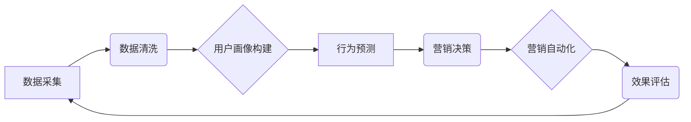

> AI DMP, 数据基建, 数据驱动营销, 营销自动化, 个性化推荐, 深度学习, 算法模型

## 1. 背景介绍

在当今数据爆炸的时代，企业拥有海量用户数据，但如何有效利用这些数据来提升营销效果，成为一个关键问题。传统的营销方式往往依靠经验和直觉，难以精准触达目标用户，导致营销成本高、转化率低。而数据驱动营销则通过数据分析和模型预测，实现精准营销，提升营销效率。

数据管理平台 (DMP) 作为数据驱动营销的核心基础设施，能够收集、存储、清洗、分析和管理用户数据，为营销决策提供数据支持。然而，传统的 DMP 往往依赖于规则引擎和人工干预，难以应对海量数据和复杂场景的挑战。

随着人工智能 (AI) 技术的快速发展，AI DMP 应运而生，它利用机器学习、深度学习等算法，对用户数据进行智能分析和挖掘，能够自动识别用户画像、预测用户行为，并为营销决策提供更精准的建议。

## 2. 核心概念与联系

**2.1 AI DMP 的核心概念**

AI DMP 是基于人工智能技术的下一代数据管理平台，它融合了数据管理、分析、预测和营销自动化等功能，能够实现以下核心功能：

* **数据收集与整合:** 从各种渠道收集用户数据，并进行整合和清洗，构建统一的用户数据池。
* **用户画像构建:** 利用机器学习算法，对用户数据进行分析和挖掘，构建用户画像，包括用户行为、兴趣爱好、消费习惯等。
* **行为预测:** 基于用户画像和历史数据，预测用户的未来行为，例如购买意愿、浏览习惯等。
* **精准营销:** 根据用户画像和行为预测，为用户提供个性化的营销内容和服务，提高营销转化率。
* **营销自动化:** 自动化营销流程，例如发送个性化邮件、推送精准广告等，提高营销效率。

**2.2 AI DMP 与其他技术的联系**

AI DMP 与其他技术密切相关，例如：

* **大数据技术:** AI DMP 需要处理海量用户数据，大数据技术为其提供了数据存储、处理和分析的基础。
* **云计算技术:** AI DMP 可以基于云计算平台部署，实现弹性扩展和资源共享。
* **机器学习技术:** AI DMP 利用机器学习算法进行用户画像构建、行为预测等功能。
* **深度学习技术:** 深度学习技术可以进一步提升 AI DMP 的分析能力和预测精度。

**2.3 AI DMP 架构**



## 3. 核心算法原理 & 具体操作步骤

**3.1 算法原理概述**

AI DMP 中常用的算法包括：

* **聚类算法:** 将用户数据进行分组，构建用户画像。例如 K-Means 聚类算法。
* **推荐算法:** 根据用户历史行为和兴趣爱好，推荐相关产品或服务。例如协同过滤算法、内容过滤算法。
* **分类算法:** 对用户行为进行分类，例如判断用户是否会购买产品。例如逻辑回归算法、支持向量机算法。
* **回归算法:** 对用户行为进行预测，例如预测用户的购买金额。例如线性回归算法、决策树算法。

**3.2 算法步骤详解**

以用户画像构建为例，其具体步骤如下：

1. **数据收集:** 从各种渠道收集用户数据，例如用户行为数据、用户属性数据、用户兴趣数据等。
2. **数据清洗:** 对收集到的数据进行清洗，例如删除重复数据、处理缺失数据等。
3. **特征工程:** 对数据进行特征提取，例如将用户行为数据转换为用户兴趣特征、将用户属性数据转换为用户画像特征等。
4. **模型训练:** 选择合适的聚类算法，对特征工程后的数据进行训练，构建用户画像。
5. **模型评估:** 对训练好的模型进行评估，例如使用准确率、召回率等指标来衡量模型的性能。
6. **模型部署:** 将训练好的模型部署到 AI DMP 平台，用于实时构建用户画像。

**3.3 算法优缺点**

不同的算法具有不同的优缺点，需要根据实际应用场景选择合适的算法。例如，K-Means 聚类算法简单易用，但对数据分布敏感；层次聚类算法可以发现不同层次的用户群体，但计算复杂度较高。

**3.4 算法应用领域**

AI DMP 的算法应用领域广泛，例如：

* **精准营销:** 为用户提供个性化的营销内容和服务。
* **用户画像分析:** 构建用户画像，了解用户需求和行为。
* **产品推荐:** 根据用户兴趣爱好，推荐相关产品或服务。
* **风险控制:** 识别潜在的风险用户，进行风险控制。

## 4. 数学模型和公式 & 详细讲解 & 举例说明

**4.1 数学模型构建**

用户画像构建可以看作是一个无监督学习问题，目标是将用户数据聚类到不同的用户群体中。常用的数学模型包括 K-Means 聚类算法和层次聚类算法。

**4.2 公式推导过程**

**K-Means 聚类算法:**

1. **初始化:** 随机选择 K 个用户作为初始聚类中心。
2. **分配:** 将每个用户分配到距离其最近的聚类中心所属的类别。
3. **更新:** 计算每个聚类中心的新的位置，即所有属于该类别的用户的平均值。
4. **重复:** 重复步骤 2 和 3，直到聚类中心不再变化或达到最大迭代次数。

**4.3 案例分析与讲解**

假设我们有 10 个用户，每个用户有 2 个特征，例如年龄和收入。我们想要将这些用户聚类到 2 个用户群体中。

我们可以使用 K-Means 聚类算法进行聚类。首先，我们随机选择 2 个用户作为初始聚类中心。然后，我们将每个用户分配到距离其最近的聚类中心所属的类别。最后，我们计算每个聚类中心的新的位置，即所有属于该类别的用户的平均值。重复以上步骤，直到聚类中心不再变化。

最终，我们得到 2 个用户群体，例如：

* **群体 1:** 年龄较低，收入较低的用户。
* **群体 2:** 年龄较高，收入较高用户。

## 5. 项目实践：代码实例和详细解释说明

**5.1 开发环境搭建**

* 操作系统: Ubuntu 20.04
* Python 版本: 3.8
* 必要的库: pandas, numpy, scikit-learn

**5.2 源代码详细实现**

```python
import pandas as pd
from sklearn.cluster import KMeans

# 加载用户数据
data = pd.read_csv('user_data.csv')

# 选择特征
features = ['age', 'income']
X = data[features]

# 确定聚类数
n_clusters = 2

# 创建 KMeans 模型
kmeans = KMeans(n_clusters=n_clusters, random_state=42)

# 训练模型
kmeans.fit(X)

# 获取聚类标签
labels = kmeans.labels_

# 将聚类标签添加到数据中
data['cluster'] = labels

# 保存结果
data.to_csv('user_data_clustered.csv', index=False)
```

**5.3 代码解读与分析**

* 首先，我们加载用户数据，并选择需要进行聚类的特征。
* 然后，我们创建 KMeans 模型，并指定聚类数。
* 接着，我们训练模型，并获取聚类标签。
* 最后，我们将聚类标签添加到数据中，并保存结果。

**5.4 运行结果展示**

运行上述代码后，我们将得到一个新的数据文件，其中包含了每个用户的聚类标签。我们可以根据聚类标签，对用户进行分组，并进行进一步的分析和挖掘。

## 6. 实际应用场景

AI DMP 在营销领域有着广泛的应用场景，例如：

* **精准广告投放:** 根据用户画像，精准投放广告，提高广告转化率。
* **个性化推荐:** 根据用户兴趣爱好，推荐相关产品或服务，提升用户体验。
* **客户关系管理:** 通过分析用户行为，识别潜在的客户流失风险，及时采取措施挽留客户。
* **市场调研:** 通过分析用户数据，了解市场趋势和用户需求，为产品开发和市场营销提供数据支持。

**6.4 未来应用展望**

随着人工智能技术的不断发展，AI DMP 将会更加智能化、个性化和自动化。未来，AI DMP 将会应用于更多领域，例如：

* **医疗健康:** 为患者提供个性化的医疗服务。
* **教育培训:** 为学生提供个性化的学习方案。
* **金融保险:** 为客户提供个性化的金融服务。

## 7. 工具和资源推荐

**7.1 学习资源推荐**

* **书籍:**
    * 《深度学习》
    * 《机器学习实战》
    * 《Python数据科学手册》
* **在线课程:**
    * Coursera: 深度学习
    * edX: 机器学习
    * Udacity: 数据科学

**7.2 开发工具推荐**

* **Python:** 作为数据科学和机器学习的常用语言。
* **pandas:** 用于数据分析和处理。
* **scikit-learn:** 用于机器学习算法的实现。
* **TensorFlow:** 用于深度学习模型的开发。
* **PyTorch:** 用于深度学习模型的开发。

**7.3 相关论文推荐**

* 《Attention Is All You Need》
* 《BERT: Pre-training of Deep Bidirectional Transformers for Language Understanding》
* 《Generative Adversarial Networks》

## 8. 总结：未来发展趋势与挑战

**8.1 研究成果总结**

AI DMP 作为数据驱动营销的核心基础设施，在近年来取得了显著的进展。人工智能技术的不断发展，使得 AI DMP 能够更加智能化、个性化和自动化，为企业提供更精准的营销决策支持。

**8.2 未来发展趋势**

未来，AI DMP 将会朝着以下几个方向发展：

* **更强大的数据分析能力:** 利用更先进的机器学习和深度学习算法，对用户数据进行更深入的分析和挖掘。
* **更精准的营销预测:** 利用大数据和人工智能技术，更精准地预测用户的行为和需求。
* **更个性化的营销服务:** 为每个用户提供个性化的营销内容和服务，提升用户体验。
* **更智能的营销自动化:** 自动化更多的营销流程，提高营销效率。

**8.3 面临的挑战**

AI DMP 的发展也面临着一些挑战：

* **数据隐私和安全:** 如何保护用户数据隐私和安全，是 AI DMP 开发和应用面临的重要挑战。
* **算法偏见:** 机器学习算法可能会存在偏见，导致营销决策不公平。
* **解释性问题:** 深度学习模型的决策过程往往难以解释，这可能会导致用户对 AI DMP 的信任度降低。

**8.4 研究展望**

未来，我们需要继续研究如何解决 AI DMP 面临的挑战，例如：

* 开发更加隐私保护的 AI DMP 系统。
* 减少机器学习算法的偏见。
* 提高深度学习模型的解释性。


## 9. 附录：常见问题与解答

**9.1 如何选择合适的聚类算法？**

选择合适的聚类算法需要根据实际应用场景和数据特点进行选择。例如，如果数据分布较为均匀，可以使用 K-Means 聚类算法；如果数据分布较为复杂，可以使用层次聚类算法。

**9.2 如何评估聚类结果？**

常用的聚类结果评估指标包括：

* **Silhouette score:** 衡量每个数据点与其所属聚类相似的程度。
* **Dunn index:** 衡量聚类间距离与聚类内距离的比值。
* **Calinski-Har