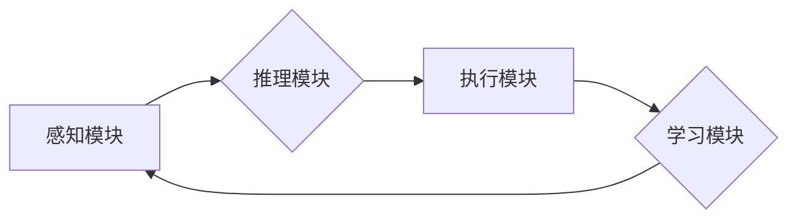

> AI代理，工作流，认知科学，智能自动化，自然语言处理，机器学习，深度学习

## 1. 背景介绍

在当今数据爆炸和智能化浪潮席卷的时代，人工智能（AI）正以惊人的速度发展，深刻地改变着我们生活的方方面面。其中，AI代理作为一种能够自主执行任务、学习和适应环境的智能系统，展现出巨大的潜力，在各个领域都得到了广泛的应用。

传统的AI代理通常基于规则或模板，缺乏灵活性和适应性。随着认知科学的不断发展，将认知科学原理融入AI代理的设计和开发，成为推动AI代理发展的新方向。融合认知科学的AI代理，能够更好地理解人类意图，进行更复杂的决策和推理，并能够自主学习和进化，从而实现更智能、更灵活的自动化。

## 2. 核心概念与联系

**2.1 AI代理的概念**

AI代理是一种能够感知环境、做出决策并执行行动的智能系统。它可以是软件程序、机器人或其他类型的智能实体。AI代理的目标是根据给定的目标和环境信息，自主地完成任务。

**2.2 工作流的概念**

工作流是一种描述业务流程的模型，它定义了任务的顺序、依赖关系和执行规则。工作流可以帮助组织自动化流程，提高效率和准确性。

**2.3 认知科学与AI代理**

认知科学研究人类的思维、学习、记忆和决策等认知过程。将认知科学原理融入AI代理的设计，可以使AI代理更接近人类的认知能力，从而实现更智能的自动化。

**2.4 AI代理工作流的架构**

AI代理工作流的架构通常包括以下几个关键组件：

* **感知模块:** 用于收集环境信息，例如传感器数据、文本数据、图像数据等。
* **推理模块:** 用于分析环境信息，进行决策和推理，例如规划任务路径、识别目标对象等。
* **执行模块:** 用于执行决策，控制机器人或其他设备，例如移动、抓取、操作等。
* **学习模块:** 用于学习和改进代理的行为，例如从经验中学习、更新知识库等。

**2.5 Mermaid 流程图**



## 3. 核心算法原理 & 具体操作步骤

**3.1 算法原理概述**

融合认知科学的AI代理工作流通常采用基于规则、基于机器学习或基于深度学习的算法。

* **基于规则的算法:** 这种算法基于事先定义的规则，将环境信息与规则进行匹配，并根据匹配结果做出决策。
* **基于机器学习的算法:** 这种算法利用机器学习算法，从数据中学习规则，并根据学习到的规则做出决策。
* **基于深度学习的算法:** 这种算法利用深度神经网络，从数据中学习复杂的特征，并根据学习到的特征做出决策。

**3.2 算法步骤详解**

以基于机器学习的算法为例，其具体操作步骤如下：

1. **数据收集:** 收集与任务相关的环境数据，例如传感器数据、文本数据、图像数据等。
2. **数据预处理:** 对收集到的数据进行清洗、转换和特征提取等预处理操作。
3. **模型训练:** 利用机器学习算法，对预处理后的数据进行训练，学习任务相关的规则。
4. **模型评估:** 使用测试数据评估模型的性能，并根据评估结果进行模型调优。
5. **模型部署:** 将训练好的模型部署到实际环境中，用于执行任务。

**3.3 算法优缺点**

* **优点:** 能够学习复杂的规则，适应变化的环境，具有较高的自动化程度。
* **缺点:** 需要大量的训练数据，训练时间较长，对数据质量要求较高。

**3.4 算法应用领域**

* **智能客服:** 自动回答用户问题，提供个性化服务。
* **智能推荐:** 根据用户喜好推荐商品或服务。
* **智能制造:** 自动化生产流程，提高生产效率。
* **医疗诊断:** 辅助医生诊断疾病，提高诊断准确率。

## 4. 数学模型和公式 & 详细讲解 & 举例说明

**4.1 数学模型构建**

融合认知科学的AI代理工作流可以采用状态机模型、决策树模型或贝叶斯网络模型等数学模型进行构建。

**4.2 公式推导过程**

例如，可以使用贝叶斯网络模型来表示AI代理的知识和推理过程。贝叶斯网络是一种概率图模型，它用节点和边来表示变量和变量之间的依赖关系。

**4.3 案例分析与讲解**

假设我们构建一个AI代理来识别水果，可以使用贝叶斯网络模型来表示水果的特征和分类规则。

* 节点：颜色、形状、大小、味道等水果特征。
* 边：特征之间的依赖关系，例如颜色和形状可能相关。

通过训练贝叶斯网络模型，可以学习到水果特征之间的概率关系，并根据输入的水果特征，预测水果的类别。

## 5. 项目实践：代码实例和详细解释说明

**5.1 开发环境搭建**

可以使用Python语言和相关的库来开发AI代理工作流。例如，可以使用TensorFlow或PyTorch库进行深度学习模型的训练，可以使用NLTK库进行自然语言处理，可以使用OpenCV库进行图像处理。

**5.2 源代码详细实现**

```python
# 导入必要的库
import tensorflow as tf

# 定义模型结构
model = tf.keras.models.Sequential([
    tf.keras.layers.Dense(128, activation='relu', input_shape=(784,)),
    tf.keras.layers.Dense(10, activation='softmax')
])

# 编译模型
model.compile(optimizer='adam',
              loss='sparse_categorical_crossentropy',
              metrics=['accuracy'])

# 训练模型
model.fit(x_train, y_train, epochs=10)

# 评估模型
loss, accuracy = model.evaluate(x_test, y_test)
print('Loss:', loss)
print('Accuracy:', accuracy)
```

**5.3 代码解读与分析**

这段代码定义了一个简单的深度学习模型，用于识别手写数字。

* `tf.keras.models.Sequential` 创建了一个顺序模型，即层级结构的模型。
* `tf.keras.layers.Dense` 定义了一个全连接层，连接所有输入节点和输出节点。
* `activation='relu'` 使用ReLU激活函数，引入非线性。
* `input_shape=(784,)` 指定输入数据的形状，这里假设输入数据是784维的向量。
* `optimizer='adam'` 使用Adam优化器进行模型训练。
* `loss='sparse_categorical_crossentropy'` 使用稀疏分类交叉熵损失函数，用于多分类问题。
* `metrics=['accuracy']` 使用准确率作为评估指标。

**5.4 运行结果展示**

训练完成后，可以将模型应用于新的数据，进行预测。

## 6. 实际应用场景

**6.1 智能客服**

AI代理可以作为智能客服，自动回答用户问题，提供个性化服务。例如，可以根据用户的聊天记录，推荐相关的产品或服务。

**6.2 智能推荐**

AI代理可以根据用户的喜好，推荐相关的商品或服务。例如，电商平台可以利用AI代理，推荐用户可能感兴趣的商品。

**6.3 智能制造**

AI代理可以自动化生产流程，提高生产效率。例如，可以利用AI代理，控制机器人进行焊接、组装等操作。

**6.4 未来应用展望**

随着人工智能技术的不断发展，AI代理工作流将在更多领域得到应用，例如：

* **医疗保健:** 辅助医生诊断疾病、制定治疗方案。
* **教育:** 提供个性化学习辅导、自动批改作业。
* **金融:** 自动化金融交易、风险管理。

## 7. 工具和资源推荐

**7.1 学习资源推荐**

* **书籍:**
    * 《人工智能：现代方法》
    * 《深度学习》
* **在线课程:**
    * Coursera上的“机器学习”课程
    * edX上的“人工智能导论”课程

**7.2 开发工具推荐**

* **Python:** 广泛用于人工智能开发的编程语言。
* **TensorFlow:** 开源深度学习框架。
* **PyTorch:** 开源深度学习框架。
* **NLTK:** 自然语言处理库。
* **OpenCV:** 图像处理库。

**7.3 相关论文推荐**

* **《深度强化学习》**
* **《生成对抗网络》**
* **《Transformer网络》**

## 8. 总结：未来发展趋势与挑战

**8.1 研究成果总结**

融合认知科学的AI代理工作流取得了显著的进展，在智能客服、智能推荐、智能制造等领域取得了成功应用。

**8.2 未来发展趋势**

* **更强的认知能力:** AI代理将具备更强的认知能力，例如理解复杂语言、进行更复杂的推理、学习更复杂的知识。
* **更强的适应性:** AI代理将能够更好地适应变化的环境，并自主学习新的知识和技能。
* **更广泛的应用:** AI代理将应用于更多领域，例如医疗保健、教育、金融等。

**8.3 面临的挑战**

* **数据获取和隐私保护:** AI代理需要大量的训练数据，如何获取高质量的数据，并保护用户隐私是一个挑战。
* **算法解释性和可信度:** AI代理的决策过程往往是复杂的，如何解释算法的决策，提高算法的可信度是一个挑战。
* **伦理和社会影响:** AI代理的应用可能会带来伦理和社会问题，例如就业替代、算法偏见等，需要认真思考和解决。

**8.4 研究展望**

未来，将继续研究融合认知科学的AI代理工作流，使其更加智能、更加安全、更加可信，并推动其在更多领域得到应用。

## 9. 附录：常见问题与解答

**9.1 如何选择合适的AI代理工作流框架？**

选择合适的AI代理工作流框架需要根据具体的应用场景和需求进行考虑。例如，如果需要处理大量文本数据，可以选择基于自然语言处理的框架；如果需要控制机器人进行物理操作，可以选择基于机器人控制的框架。

**9.2 如何评估AI代理工作流的性能？**

评估AI代理工作流的性能可以使用多种指标，例如准确率、召回率、F1-score等。还可以根据具体的应用场景，定义相应的评估指标。

**9.3 如何解决AI代理工作流中的数据偏差问题？**

数据偏差是AI代理工作流中常见的问题，可以通过以下方法解决：

* 使用更全面的数据进行训练。
* 使用数据增强技术，增加训练数据的多样性。
* 使用公平性算法，减少算法的偏见。


作者：禅与计算机程序设计艺术 / Zen and the Art of Computer Programming 
<end_of_turn>