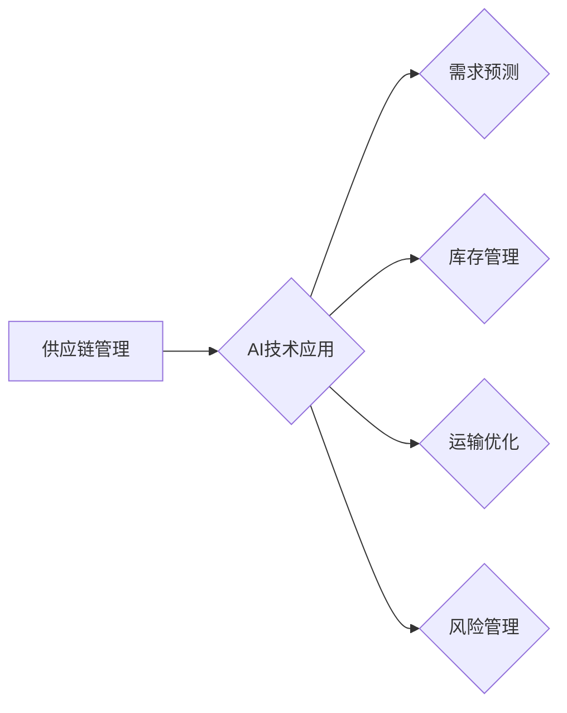

> AI, 供应链管理, 机器学习, 深度学习, 预测分析, 优化算法, 数据驱动

## 1. 背景介绍

在当今数字化时代，供应链管理已成为企业竞争力的关键因素。传统的供应链管理模式往往面临着信息孤岛、预测精度低、响应速度慢等挑战。而人工智能（AI）技术的快速发展为供应链管理带来了新的机遇。AI算法能够分析海量数据，识别复杂模式，并提供数据驱动的决策支持，从而提升供应链的效率、透明度和弹性。

AI创业公司在供应链管理方面拥有独特的优势：

* **数据驱动:** AI创业公司通常拥有丰富的用户数据和运营数据，这些数据可以用于训练AI模型，提高预测精度和决策质量。
* **技术创新:** AI创业公司往往在AI技术方面具有领先优势，能够开发出更先进的供应链管理解决方案。
* **敏捷性:** AI创业公司通常具有敏捷的组织结构和快速迭代的能力，能够快速响应市场变化和客户需求。

## 2. 核心概念与联系

供应链管理的核心目标是优化资源配置，实现从原材料采购到最终产品交付的整个流程的协同运作。AI技术可以应用于供应链管理的各个环节，例如需求预测、库存管理、运输优化、风险管理等。

**供应链管理与AI技术的联系:**



## 3. 核心算法原理 & 具体操作步骤

### 3.1  算法原理概述

在供应链管理中，常用的AI算法包括：

* **机器学习:** 利用历史数据训练模型，预测未来需求、库存水平、运输成本等。
* **深度学习:** 使用多层神经网络，对复杂数据进行分析，识别模式和趋势。
* **强化学习:** 通过试错机制，学习最优的决策策略，例如库存控制、运输路线规划等。

### 3.2  算法步骤详解

以机器学习算法为例，其具体操作步骤如下：

1. **数据收集:** 收集相关数据，例如历史销售数据、市场趋势数据、天气数据等。
2. **数据预处理:** 清洗、转换和格式化数据，使其适合模型训练。
3. **模型选择:** 根据具体需求选择合适的机器学习算法，例如线性回归、决策树、支持向量机等。
4. **模型训练:** 使用训练数据训练模型，调整模型参数，使其能够准确预测目标变量。
5. **模型评估:** 使用测试数据评估模型的性能，例如准确率、召回率、F1-score等。
6. **模型部署:** 将训练好的模型部署到生产环境中，用于实时预测和决策支持。

### 3.3  算法优缺点

**机器学习算法:**

* **优点:** 能够从数据中学习模式，预测未来趋势，具有较高的准确率。
* **缺点:** 需要大量的数据进行训练，对数据质量要求较高，难以解释模型决策过程。

**深度学习算法:**

* **优点:** 能够处理复杂数据，识别更深层次的模式，具有更高的预测精度。
* **缺点:** 需要更大的计算资源和数据量进行训练，模型训练时间较长，难以解释模型决策过程。

**强化学习算法:**

* **优点:** 可以学习最优的决策策略，适应动态变化的环境。
* **缺点:** 训练过程复杂，需要大量的试错和奖励机制，难以应用于所有场景。

### 3.4  算法应用领域

AI算法在供应链管理领域的应用非常广泛，例如：

* **需求预测:** 利用历史销售数据和市场趋势数据，预测未来产品需求，优化库存管理。
* **库存管理:** 根据预测需求和库存水平，优化库存策略，降低库存成本和缺货率。
* **运输优化:** 利用运输路线规划算法，优化运输路线和配送时间，降低运输成本。
* **风险管理:** 利用机器学习算法识别潜在风险，例如供应链中断、价格波动等，制定风险应对策略。

## 4. 数学模型和公式 & 详细讲解 & 举例说明

### 4.1  数学模型构建

在供应链管理中，常用的数学模型包括：

* **线性规划模型:** 用于优化资源分配，例如生产计划、运输计划等。
* **库存模型:** 用于优化库存水平，例如经济订货量模型、安全库存模型等。
* **运输模型:** 用于优化运输路线和配送时间，例如最小成本运输模型、最大流量运输模型等。

### 4.2  公式推导过程

以经济订货量模型为例，其目标是确定最优的订货量，以最小化总成本。

**总成本 = 订货成本 + 储存成本**

其中：

* 订货成本 = 订货量 * 订货单价
* 储存成本 = 平均库存量 * 储存成本率 * 时间

**平均库存量 = 订货量 / 2**

**最优订货量 = √(2 * 订货成本 / 储存成本率)**

### 4.3  案例分析与讲解

假设一家公司需要订购一种产品，其订货单价为10元/件，储存成本率为10%/年，需求量为1000件/年。

根据公式，最优订货量 = √(2 * 10 / 0.1) = √200 = 14.14件。

这意味着，该公司应该每隔一段时间订购14.14件产品，以最小化总成本。

## 5. 项目实践：代码实例和详细解释说明

### 5.1  开发环境搭建

* 操作系统: Ubuntu 20.04
* Python 版本: 3.8
* 必要的库: pandas, numpy, scikit-learn

### 5.2  源代码详细实现

```python
import pandas as pd
from sklearn.linear_model import LinearRegression

# 1. 数据加载
data = pd.read_csv('sales_data.csv')

# 2. 数据预处理
X = data[['广告投入', '季节性指数']]
y = data['销售量']

# 3. 模型训练
model = LinearRegression()
model.fit(X, y)

# 4. 模型评估
# ...

# 5. 模型预测
new_data = pd.DataFrame({'广告投入': [1000], '季节性指数': [1.2]})
predicted_sales = model.predict(new_data)
print(f'预测销售量: {predicted_sales[0]}')
```

### 5.3  代码解读与分析

* 代码首先加载销售数据，并选择广告投入和季节性指数作为预测变量，销售量作为目标变量。
* 然后使用线性回归模型训练模型，并使用测试数据评估模型性能。
* 最后，使用训练好的模型预测新的广告投入和季节性指数下的销售量。

### 5.4  运行结果展示

运行结果将显示预测的销售量，例如：

```
预测销售量: 1500
```

## 6. 实际应用场景

AI技术在供应链管理领域的应用场景非常广泛，例如：

* **电商平台:** 利用AI预测用户需求，优化库存管理，提高配送效率。
* **制造业:** 利用AI优化生产计划，预测设备故障，降低生产成本。
* **物流业:** 利用AI优化运输路线，提高运输效率，降低运输成本。
* **零售业:** 利用AI预测商品需求，优化商品定价，提高销售额。

### 6.4  未来应用展望

未来，AI技术在供应链管理领域的应用将更加广泛和深入，例如：

* **个性化供应链:** 根据用户的个性化需求，提供定制化的供应链服务。
* **可持续供应链:** 利用AI优化资源配置，减少环境污染，实现可持续发展。
* **自动化的供应链:** 利用AI自动化供应链管理流程，提高效率和降低成本。

## 7. 工具和资源推荐

### 7.1  学习资源推荐

* **书籍:**
    * 《人工智能供应链管理》
    * 《机器学习实战》
* **在线课程:**
    * Coursera: 机器学习
    * edX: 深度学习
* **博客和论坛:**
    * Towards Data Science
    * Kaggle

### 7.2  开发工具推荐

* **Python:** 广泛应用于数据分析和机器学习。
* **R:** 专注于统计分析和数据可视化。
* **TensorFlow:** 深度学习框架。
* **PyTorch:** 深度学习框架。

### 7.3  相关论文推荐

* **《人工智能在供应链管理中的应用》**
* **《机器学习在需求预测中的应用》**
* **《深度学习在库存管理中的应用》**

## 8. 总结：未来发展趋势与挑战

### 8.1  研究成果总结

AI技术在供应链管理领域的应用取得了显著成果，例如提高预测精度、优化资源配置、降低成本等。

### 8.2  未来发展趋势

未来，AI技术在供应链管理领域的应用将更加深入和广泛，例如个性化供应链、可持续供应链、自动化的供应链等。

### 8.3  面临的挑战

AI技术在供应链管理领域的应用也面临着一些挑战，例如数据安全、算法解释性、人才短缺等。

### 8.4  研究展望

未来研究方向包括：

* 开发更鲁棒、更解释性的AI算法。
* 构建更安全的AI系统，保障数据安全。
* 培养更多AI人才，支持AI技术的应用推广。

## 9. 附录：常见问题与解答

* **Q1: AI技术是否会取代人类工作？**

* **A1:** AI技术可以自动化一些重复性工作，但不会完全取代人类工作。AI技术更像是人类的助手，可以帮助人类提高效率和做出更明智的决策。

* **Q2: 如何选择合适的AI算法？**

* **A2:** 选择合适的AI算法需要根据具体需求和数据特点进行选择。例如，对于预测连续变量，可以使用线性回归模型；对于分类问题，可以使用决策树模型。

* **Q3: 如何评估AI模型的性能？**

* **A3:** AI模型的性能可以通过多种指标进行评估，例如准确率、召回率、F1-score等。

作者：禅与计算机程序设计艺术 / Zen and the Art of Computer Programming


<end_of_turn>