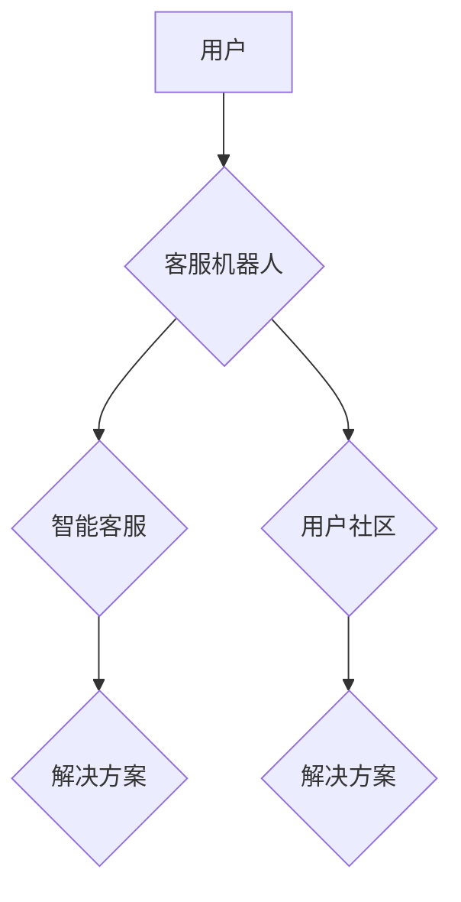

> AI创业公司, 用户服务, 客服机器人, 智能客服, 用户社区, 自然语言处理, 机器学习, 深度学习, 聊天机器人, 知识图谱

## 1. 背景介绍

在当今数字化时代，AI技术正在迅速发展，并广泛应用于各个领域，其中包括用户服务与支持。AI创业公司作为科技创新的先驱，需要提供高效、便捷的用户服务体验来赢得用户信任和市场竞争力。传统的客服模式面临着人力成本高、响应速度慢、服务质量不稳定等问题，而AI技术为用户服务提供了全新的解决方案。

客服机器人、智能客服和用户社区是AI技术在用户服务领域的三大主要应用场景。客服机器人能够自动处理用户常见问题，例如订单查询、物流跟踪、退换货等，减轻人工客服的压力，提高服务效率。智能客服则利用自然语言处理（NLP）和机器学习（ML）技术，能够理解用户复杂的需求，提供更精准、个性化的服务体验。用户社区则为用户提供一个交流平台，用户可以互相帮助、分享经验，构建用户粘性。

## 2. 核心概念与联系

**2.1 客服机器人**

客服机器人是一种基于规则或机器学习的对话系统，能够自动与用户进行文本或语音交互，回答用户常见问题，引导用户完成特定操作。

**2.2 智能客服**

智能客服是基于深度学习技术的对话系统，能够理解用户自然语言，进行更复杂的对话，提供更精准、个性化的服务体验。

**2.3 用户社区**

用户社区是一个为用户提供交流平台的在线社区，用户可以互相帮助、分享经验，构建用户粘性。

**2.4 核心概念联系**

客服机器人、智能客服和用户社区可以相互协作，形成一个完整的用户服务体系。客服机器人可以作为用户服务的第一线，处理用户常见问题，将复杂问题转交给智能客服或用户社区。智能客服可以提供更精准、个性化的服务，并根据用户需求，将用户引导到相关用户社区寻求帮助。用户社区可以为用户提供一个交流平台，解决用户之间的问题，并收集用户反馈，帮助公司改进产品和服务。



## 3. 核心算法原理 & 具体操作步骤

### 3.1  算法原理概述

客服机器人、智能客服和用户社区的背后都离不开一系列先进的算法，例如自然语言处理（NLP）、机器学习（ML）、深度学习（DL）等。

**3.1.1 自然语言处理（NLP）**

NLP是让计算机理解和处理人类语言的技术。在用户服务领域，NLP被用于理解用户输入的文本或语音，识别用户意图，提取关键信息，并生成自然流畅的回复。

**3.1.2 机器学习（ML）**

ML是让计算机从数据中学习，并根据学习到的知识进行预测或决策的技术。在用户服务领域，ML被用于训练客服机器人和智能客服，使其能够理解用户需求，提供更精准的回复。

**3.1.3 深度学习（DL）**

DL是机器学习的一种高级形式，利用多层神经网络来模拟人类大脑的学习过程。DL在用户服务领域被用于训练更智能的客服机器人和智能客服，使其能够理解更复杂的语言，提供更个性化的服务体验。

### 3.2  算法步骤详解

**3.2.1 客服机器人**

1. **数据收集和预处理:** 收集用户常见问题和回复数据，并进行预处理，例如去除停用词、标点符号等。
2. **规则构建:** 根据用户问题和回复数据，构建规则库，用于匹配用户输入和生成回复。
3. **对话流程设计:** 设计客服机器人的对话流程，例如问候语、引导语、结束语等。
4. **测试和优化:** 对客服机器人进行测试，并根据测试结果优化规则库和对话流程。

**3.2.2 智能客服**

1. **数据收集和预处理:** 收集用户对话数据，并进行预处理，例如分词、词性标注、语义分析等。
2. **模型训练:** 利用深度学习算法，训练智能客服模型，使其能够理解用户意图，生成自然流畅的回复。
3. **模型评估和优化:** 对智能客服模型进行评估，并根据评估结果优化模型参数。
4. **部署和维护:** 将训练好的智能客服模型部署到线上环境，并进行持续维护和更新。

**3.2.3 用户社区**

1. **平台搭建:** 搭建用户社区平台，提供用户注册、登录、发布帖子、评论等功能。
2. **内容管理:** 管理用户社区内容，例如审核帖子、删除垃圾内容等。
3. **用户互动:** 鼓励用户互动，例如发起话题讨论、举办线上活动等。
4. **数据分析:** 分析用户社区数据，例如用户活跃度、帖子热度等，以便改进平台功能和服务。

### 3.3  算法优缺点

**3.3.1 客服机器人**

* **优点:** 
    * 24小时在线，提高服务效率。
    * 降低人工客服成本。
    * 处理重复性问题，解放人工客服。
* **缺点:** 
    * 无法处理复杂问题。
    * 缺乏情感理解能力。
    * 容易出现错误回复。

**3.3.2 智能客服**

* **优点:** 
    * 能够理解复杂问题。
    * 具备情感理解能力。
    * 提供个性化服务体验。
* **缺点:** 
    * 训练成本高。
    * 需要大量数据进行训练。
    * 仍然存在一些错误回复。

**3.3.3 用户社区**

* **优点:** 
    * 用户可以互相帮助，解决问题。
    * 构建用户粘性，提高用户忠诚度。
    * 收集用户反馈，改进产品和服务。
* **缺点:** 
    * 需要投入人力进行管理。
    * 存在信息质量问题。
    * 难以控制用户行为。

### 3.4  算法应用领域

* **电商:** 客服机器人可以处理订单查询、物流跟踪、退换货等问题。智能客服可以提供个性化商品推荐和售后服务。
* **金融:** 客服机器人可以处理账户查询、转账、理财咨询等问题。智能客服可以提供个性化理财建议和风险评估。
* **医疗:** 客服机器人可以提供预约挂号、查询病历、药品信息等服务。智能客服可以提供个性化健康咨询和疾病诊断辅助。
* **教育:** 客服机器人可以提供课程咨询、学习资源推荐、作业辅导等服务。智能客服可以提供个性化学习计划和知识讲解。

## 4. 数学模型和公式 & 详细讲解 & 举例说明

### 4.1  数学模型构建

在智能客服领域，常用的数学模型包括：

* **词嵌入模型:** 将单词映射到向量空间，捕捉单词之间的语义关系。例如Word2Vec、GloVe等。
* **循环神经网络（RNN）:** 用于处理序列数据，例如文本对话。例如LSTM、GRU等。
* **Transformer:** 基于注意力机制的序列模型，能够处理更长的文本序列，并捕捉更复杂的语义关系。例如BERT、GPT等。

### 4.2  公式推导过程

**4.2.1 词嵌入模型**

词嵌入模型的目标是将每个单词映射到一个低维向量空间，使得语义相似的单词在向量空间中距离较近。

假设有一个词典V，包含N个单词，每个单词对应一个向量w，维度为d。词嵌入模型的目标函数是：

$$
J(\theta) = \sum_{i=1}^{N} \sum_{j=1}^{N} \text{sim}(w_i, w_j) \cdot \text{label}(i, j)
$$

其中：

* $\theta$ 是模型参数。
* $\text{sim}(w_i, w_j)$ 是单词$w_i$和$w_j$之间的相似度。
* $\text{label}(i, j)$ 是单词$w_i$和$w_j$是否为同义词的标签，为1表示同义词，为0表示非同义词。

**4.2.2 循环神经网络（RNN）**

RNN是一种能够处理序列数据的网络结构，其核心是隐藏状态，隐藏状态在每个时间步都会更新，并传递给下一个时间步。

RNN的输出为：

$$
h_t = f(W_{hh}h_{t-1} + W_{xh}x_t + b_h)
$$

其中：

* $h_t$ 是时间步t的隐藏状态。
* $f$ 是激活函数。
* $W_{hh}$ 是隐藏状态之间的权重矩阵。
* $W_{xh}$ 是输入与隐藏状态之间的权重矩阵。
* $x_t$ 是时间步t的输入。
* $b_h$ 是隐藏状态的偏置项。

### 4.3  案例分析与讲解

**4.3.1 词嵌入模型案例**

Word2Vec模型可以将单词映射到向量空间，例如“国王”和“女王”的向量距离较近，因为它们语义上相似。

**4.3.2 循环神经网络（RNN）案例**

RNN可以用于机器翻译，将一个语言的句子翻译成另一个语言的句子。RNN会将源语言的句子逐个单词地输入，并根据隐藏状态生成目标语言的句子。

## 5. 项目实践：代码实例和详细解释说明

### 5.1  开发环境搭建

* **操作系统:** Ubuntu 18.04
* **编程语言:** Python 3.6
* **深度学习框架:** TensorFlow 2.0
* **其他工具:** Git, Jupyter Notebook

### 5.2  源代码详细实现

```python
import tensorflow as tf

# 定义模型结构
model = tf.keras.Sequential([
    tf.keras.layers.Embedding(input_dim=10000, output_dim=128),
    tf.keras.layers.LSTM(units=64),
    tf.keras.layers.Dense(units=10000, activation='softmax')
])

# 编译模型
model.compile(optimizer='adam',
              loss='sparse_categorical_crossentropy',
              metrics=['accuracy'])

# 训练模型
model.fit(x_train, y_train, epochs=10)

# 评估模型
loss, accuracy = model.evaluate(x_test, y_test)
print('Loss:', loss)
print('Accuracy:', accuracy)
```

### 5.3  代码解读与分析

* **Embedding层:** 将单词映射到向量空间。
* **LSTM层:** 处理文本序列，捕捉文本中的语义关系。
* **Dense层:** 将隐藏状态映射到输出层，预测下一个单词。
* **Adam优化器:** 用于优化模型参数。
* **Sparse categorical crossentropy损失函数:** 用于计算模型预测结果与真实结果之间的差异。
* **Accuracy指标:** 用于评估模型的预测准确率。

### 5.4  运行结果展示

训练完成后，可以将模型应用于实际场景，例如文本生成、机器翻译等。

## 6. 实际应用场景

### 6.1  电商客服机器人

电商平台可以部署客服机器人，自动处理用户常见问题，例如订单查询、物流跟踪、退换货等，提高服务效率，降低人工客服成本。

### 6.2  金融智能客服

金融机构可以利用智能客服，提供个性化金融咨询和风险评估，帮助用户进行理财决策。

### 6.3  医疗在线问诊

医疗机构可以利用智能客服，提供在线问诊服务，帮助用户了解疾病信息，预约挂号，查询病历等。

### 6.4  未来应用展望

AI技术在用户服务领域的应用前景广