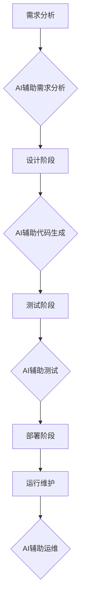

>  人工智能、软件智能化、机器学习、深度学习、自然语言处理、代码生成、软件开发

## 1. 背景介绍

软件产业正处于一个前所未有的变革时期。人工智能（AI）技术的飞速发展，正在深刻地改变着软件开发、运维和应用的方式。从代码生成到软件测试，从用户体验优化到安全保障，AI正在逐步渗透到软件产业的各个环节，并以其强大的智能化能力，推动着软件产业的智能化转型。

传统的软件开发模式依赖于人类程序员的经验和技能，需要耗费大量的时间和人力成本。而AI技术的介入，则可以大幅度提高软件开发效率，降低开发成本，并赋予软件更强大的智能化功能。

## 2. 核心概念与联系

**2.1 软件智能化**

软件智能化是指将人工智能技术融入软件开发、运维和应用过程中，赋予软件以类似人类智能的能力，例如学习、推理、决策、理解自然语言等。

**2.2 AI技术在软件产业中的应用**

AI技术在软件产业中的应用涵盖多个领域，包括：

* **代码生成:** 利用机器学习算法，从自然语言描述或代码示例中自动生成代码，提高开发效率。
* **软件测试:** 利用AI算法自动生成测试用例，提高测试覆盖率和效率。
* **缺陷检测:** 利用机器学习算法识别代码中的潜在缺陷，提高软件质量。
* **用户体验优化:** 利用AI算法分析用户行为数据，优化软件界面和功能，提升用户体验。
* **安全保障:** 利用AI算法识别和防御软件中的安全威胁，提高软件安全性。

**2.3 AI技术与软件开发流程的融合**

AI技术正在改变传统的软件开发流程，将软件开发从一个高度依赖人工的流程，转变为一个更加智能化、自动化和协作的流程。



## 3. 核心算法原理 & 具体操作步骤

**3.1 算法原理概述**

在AI驱动的软件智能化中，机器学习算法扮演着核心角色。机器学习算法通过学习从数据中提取的模式和规律，从而实现对软件开发、运维和应用的智能化控制。常见的机器学习算法包括：

* **监督学习:** 利用标记数据训练模型，预测未知数据。例如，在代码缺陷检测中，利用已标记的缺陷代码训练模型，识别新的缺陷代码。
* **无监督学习:** 利用未标记数据发现数据中的潜在结构和模式。例如，在用户行为分析中，利用用户行为数据发现用户群体和行为模式。
* **强化学习:** 通过试错学习，在环境中获得最大奖励。例如，在软件测试中，利用强化学习算法自动生成测试用例，并根据测试结果调整测试策略。

**3.2 算法步骤详解**

以代码生成为例，详细说明机器学习算法在软件智能化中的具体操作步骤：

1. **数据收集:** 收集大量代码示例和对应的自然语言描述。
2. **数据预处理:** 对收集到的数据进行清洗、格式化和转换，使其适合机器学习算法的训练。
3. **模型选择:** 选择合适的机器学习算法，例如循环神经网络（RNN）或 transformers。
4. **模型训练:** 利用训练数据训练模型，使模型能够从代码示例和自然语言描述中学习代码生成规律。
5. **模型评估:** 利用测试数据评估模型的性能，例如代码生成质量和准确率。
6. **模型部署:** 将训练好的模型部署到实际应用环境中，用于自动生成代码。

**3.3 算法优缺点**

* **优点:**

    * 自动化代码生成，提高开发效率。
    * 降低开发成本。
    * 提升代码质量。

* **缺点:**

    * 依赖于高质量的训练数据。
    * 生成的代码可能存在逻辑错误或安全漏洞。
    * 难以处理复杂和非结构化的代码需求。

**3.4 算法应用领域**

* 代码生成工具
* 软件测试自动化
* 代码缺陷检测
* 软件文档自动生成

## 4. 数学模型和公式 & 详细讲解 & 举例说明

**4.1 数学模型构建**

在代码生成领域，可以使用序列到序列（seq2seq）模型来构建数学模型。seq2seq模型由编码器和解码器两部分组成。编码器将自然语言描述编码成一个向量表示，解码器则根据编码后的向量表示生成代码。

**4.2 公式推导过程**

编码器和解码器通常使用循环神经网络（RNN）或 transformers 作为其基本单元。RNN 通过循环机制处理序列数据，而 transformers 利用注意力机制捕捉序列中的长距离依赖关系。

**4.3 案例分析与讲解**

例如，在使用 transformers 模型进行代码生成时，可以利用注意力机制，让模型更加关注自然语言描述中与代码相关的关键信息，从而生成更准确和符合语义的代码。

## 5. 项目实践：代码实例和详细解释说明

**5.1 开发环境搭建**

使用 Python 语言和 TensorFlow 或 PyTorch 深度学习框架进行代码实现。

**5.2 源代码详细实现**

```python
# 使用 transformers 库加载预训练模型
from transformers import AutoModelForSeq2SeqLM, AutoTokenizer

# 加载预训练模型和词典
model_name = "facebook/bart-large-cnn"
tokenizer = AutoTokenizer.from_pretrained(model_name)
model = AutoModelForSeq2SeqLM.from_pretrained(model_name)

# 输入自然语言描述
input_text = "编写一个函数，计算两个整数的和。"

# 对输入文本进行编码
input_ids = tokenizer.encode(input_text, return_tensors="pt")

# 使用模型生成代码
output = model.generate(input_ids)

# 将生成的代码解码
generated_code = tokenizer.decode(output[0], skip_special_tokens=True)

# 打印生成的代码
print(generated_code)
```

**5.3 代码解读与分析**

这段代码首先加载预训练的 BART 模型和词典。然后，将自然语言描述编码成模型可以理解的格式。最后，使用模型生成代码，并解码成可读的文本格式。

**5.4 运行结果展示**

运行这段代码后，将输出一个计算两个整数和的 Python 函数代码。

## 6. 实际应用场景

**6.1 代码生成工具**

AI驱动的代码生成工具可以帮助程序员快速生成代码模板、函数定义和代码片段，提高开发效率。例如，GitHub Copilot 是一个基于 OpenAI Codex 的代码生成工具，可以根据程序员的自然语言描述自动生成代码。

**6.2 软件测试自动化**

AI算法可以自动生成测试用例，提高软件测试的效率和覆盖率。例如，Google 的 TensorFlow 测试框架可以使用 AI 算法自动生成测试用例，并根据测试结果调整测试策略。

**6.3 代码缺陷检测**

AI算法可以识别代码中的潜在缺陷，提高软件质量。例如，DeepCode 是一个基于机器学习的代码缺陷检测工具，可以识别代码中的安全漏洞、逻辑错误和性能问题。

**6.4 未来应用展望**

随着 AI 技术的不断发展，其在软件产业中的应用场景将更加广泛。例如，AI 可以用于自动生成软件文档、优化软件架构、预测软件故障等。

## 7. 工具和资源推荐

**7.1 学习资源推荐**

* **书籍:**
    * 《深度学习》
    * 《机器学习实战》
    * 《自然语言处理》
* **在线课程:**
    * Coursera: 深度学习
    * Udacity: 机器学习工程师
    * edX: 自然语言处理

**7.2 开发工具推荐**

* **Python:** 
    * TensorFlow
    * PyTorch
    * scikit-learn
* **代码生成工具:**
    * GitHub Copilot
    * Tabnine
* **代码缺陷检测工具:**
    * DeepCode
    * SonarQube

**7.3 相关论文推荐**

* Attention Is All You Need
* BERT: Pre-training of Deep Bidirectional Transformers for Language Understanding
* GPT-3: Language Models are Few-Shot Learners

## 8. 总结：未来发展趋势与挑战

**8.1 研究成果总结**

AI技术在软件产业的应用取得了显著成果，例如代码生成、软件测试自动化、代码缺陷检测等领域取得了突破性进展。

**8.2 未来发展趋势**

* **更强大的 AI 模型:** 未来将出现更强大的 AI 模型，能够处理更复杂和更具挑战性的软件开发任务。
* **更广泛的应用场景:** AI 将应用于更多软件开发环节，例如软件架构设计、软件文档自动生成等。
* **更智能化的软件:** AI 将赋予软件更强大的智能化功能，例如自动学习用户需求、自动修复软件缺陷等。

**8.3 面临的挑战**

* **数据质量:** AI 模型的性能依赖于高质量的训练数据，而高质量的训练数据往往难以获取。
* **模型解释性:** 许多 AI 模型是黑盒模型，难以解释其决策过程，这对于软件开发中的安全性和可靠性至关重要。
* **伦理问题:** AI 技术的应用可能引发一些伦理问题，例如算法偏见、数据隐私等。

**8.4 研究展望**

未来研究将集中在解决上述挑战，例如开发更强大的 AI 模型、提高模型解释性、解决 AI 伦理问题等。


## 9. 附录：常见问题与解答

**9.1 如何选择合适的 AI 模型？**

选择合适的 AI 模型取决于具体的应用场景和数据特点。例如，对于代码生成任务，可以使用 transformers 模型；对于代码缺陷检测任务，可以使用 CNN 或 RNN 模型。

**9.2 如何获取高质量的训练数据？**

高质量的训练数据是 AI 模型训练的关键。可以从开源代码库、软件项目文档等渠道获取训练数据，并进行清洗、格式化和标注。

**9.3 如何解决 AI 模型的解释性问题？**

可以使用可解释 AI (XAI) 技术来提高 AI 模型的解释性。例如，可以使用注意力机制来分析模型对输入数据的关注点，或者使用决策树来解释模型的决策过程。


作者：禅与计算机程序设计艺术 / Zen and the Art of Computer Programming 
<end_of_turn>