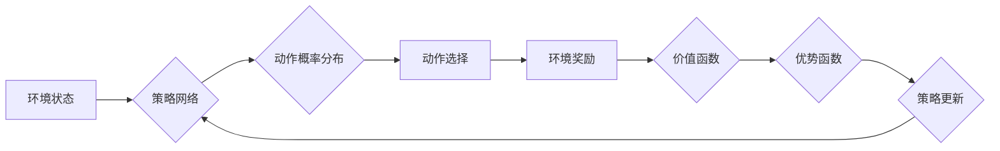

> PPO, 强化学习, 策略梯度, 优势函数, 论文解读, 代码实现, 深度学习

## 1. 背景介绍

强化学习 (Reinforcement Learning, RL) 作为机器学习领域的重要分支，近年来取得了显著进展，并在机器人控制、游戏 AI、自动驾驶等领域展现出强大的应用潜力。其中，策略梯度方法 (Policy Gradient) 是强化学习中一种重要的算法，它通过直接优化策略网络来学习最优的行动策略。然而，传统的策略梯度方法容易出现策略震荡问题，导致训练不稳定。

Proximal Policy Optimization (PPO) 算法是策略梯度方法的一种改进版本，它通过引入一个策略更新的限制条件，有效地抑制了策略震荡，提高了训练的稳定性和效率。PPO 算法在多个强化学习任务中取得了优异的性能，并成为当前强化学习领域中应用最广泛的算法之一。

## 2. 核心概念与联系

PPO 算法的核心思想是通过限制策略更新的范围，来避免策略震荡，从而提高训练的稳定性。

**核心概念:**

* **策略网络 (Policy Network):** 策略网络是一个神经网络模型，它接受环境状态作为输入，输出动作的概率分布。
* **价值函数 (Value Function):** 价值函数估计在给定状态下采取特定动作的长期回报。
* **优势函数 (Advantage Function):** 优势函数表示在给定状态下采取特定动作的期望回报与平均期望回报的差值。
* **策略更新 (Policy Update):** 通过优化策略网络的参数，来学习最优的行动策略。

**PPO 算法流程:**



## 3. 核心算法原理 & 具体操作步骤

### 3.1  算法原理概述

PPO 算法的核心思想是通过引入一个策略更新的限制条件，来避免策略震荡，从而提高训练的稳定性。

具体来说，PPO 算法将策略更新的范围限制在策略更新幅度小于一个阈值内，这个阈值通常设置为一个小的常数。

### 3.2  算法步骤详解

1. **初始化策略网络和价值函数:** 随机初始化策略网络和价值函数的参数。
2. **收集经验数据:** 在环境中进行交互，收集状态、动作、奖励和下一个状态的经验数据。
3. **计算优势函数:** 使用价值函数估计每个状态下采取特定动作的期望回报，并计算优势函数。
4. **策略更新:** 使用优势函数和策略更新的限制条件，更新策略网络的参数。
5. **重复步骤2-4:** 直到策略网络收敛或达到预设的训练次数。

### 3.3  算法优缺点

**优点:**

* 训练稳定性高，不易出现策略震荡。
* 性能优异，在多个强化学习任务中取得了优异的性能。
* 算法实现相对简单，易于理解和实现。

**缺点:**

* 训练速度相对较慢。
* 算法参数需要进行调优。

### 3.4  算法应用领域

PPO 算法在多个强化学习领域中得到了广泛应用，例如：

* **机器人控制:** 控制机器人完成各种任务，例如导航、抓取、运动控制等。
* **游戏 AI:** 训练游戏 AI 玩家，例如玩策略游戏、动作游戏等。
* **自动驾驶:** 训练自动驾驶系统，例如路径规划、决策控制等。
* **金融交易:** 训练金融交易策略，例如股票投资、期货交易等。

## 4. 数学模型和公式 & 详细讲解 & 举例说明

### 4.1  数学模型构建

PPO 算法的核心目标是最大化策略网络的期望回报，即：

$$
J(\theta) = E_{\tau \sim \pi_{\theta}}[R(\tau)]
$$

其中：

* $J(\theta)$ 是策略网络参数 $\theta$ 的期望回报。
* $\pi_{\theta}$ 是策略网络生成的策略分布。
* $\tau$ 是一个轨迹，包含一系列状态、动作和奖励。
* $R(\tau)$ 是轨迹 $\tau$ 的总回报。

### 4.2  公式推导过程

为了避免策略震荡，PPO 算法引入了策略更新的限制条件，即：

$$
\frac{\pi_{\theta'}(a_t | s_t)}{\pi_{\theta}(a_t | s_t)} \leq \epsilon
$$

其中：

* $\pi_{\theta'}$ 是更新后的策略网络。
* $\pi_{\theta}$ 是当前策略网络。
* $a_t$ 是在状态 $s_t$ 下采取的动作。
* $\epsilon$ 是一个小的常数，称为策略更新阈值。

PPO 算法使用优势函数来估计每个状态下采取特定动作的期望回报与平均期望回报的差值，并将其作为策略更新的依据。

策略更新公式为：

$$
\theta' = \theta + \alpha \sum_{t=1}^{T} \hat{A}(s_t, a_t) \nabla_{\theta} \log \pi_{\theta}(a_t | s_t)
$$

其中：

* $\alpha$ 是学习率。
* $\hat{A}(s_t, a_t)$ 是优势函数的估计值。
* $\nabla_{\theta} \log \pi_{\theta}(a_t | s_t)$ 是策略网络参数 $\theta$ 对策略概率的梯度。

### 4.3  案例分析与讲解

假设我们有一个简单的强化学习任务，例如一个机器人需要在迷宫中找到出口。

我们可以使用 PPO 算法训练一个策略网络，让机器人学习最优的行动策略。

在训练过程中，机器人会与环境交互，收集状态、动作、奖励和下一个状态的经验数据。

然后，PPO 算法会使用这些经验数据来计算优势函数，并更新策略网络的参数。

通过反复迭代，机器人最终会学习到最优的行动策略，能够在迷宫中找到出口。

## 5. 项目实践：代码实例和详细解释说明

### 5.1  开发环境搭建

为了实现 PPO 算法，我们需要搭建一个合适的开发环境。

推荐使用 Python 语言和 TensorFlow 或 PyTorch 深度学习框架。

此外，还需要安装一些必要的库，例如 NumPy、OpenAI Gym 等。

### 5.2  源代码详细实现

```python
import tensorflow as tf
import numpy as np

# 定义策略网络
class PolicyNetwork(tf.keras.Model):
    def __init__(self, state_dim, action_dim):
        super(PolicyNetwork, self).__init__()
        self.dense1 = tf.keras.layers.Dense(64, activation='relu')
        self.dense2 = tf.keras.layers.Dense(32, activation='relu')
        self.output = tf.keras.layers.Dense(action_dim, activation='softmax')

    def call(self, state):
        x = self.dense1(state)
        x = self.dense2(x)
        return self.output(x)

# 定义价值函数
class ValueNetwork(tf.keras.Model):
    def __init__(self, state_dim):
        super(ValueNetwork, self).__init__()
        self.dense1 = tf.keras.layers.Dense(64, activation='relu')
        self.dense2 = tf.keras.layers.Dense(32, activation='relu')
        self.output = tf.keras.layers.Dense(1)

    def call(self, state):
        x = self.dense1(state)
        x = self.dense2(x)
        return self.output(x)

# PPO 算法
class PPO:
    def __init__(self, state_dim, action_dim, learning_rate=0.001, gamma=0.99, epsilon=0.2):
        self.state_dim = state_dim
        self.action_dim = action_dim
        self.learning_rate = learning_rate
        self.gamma = gamma
        self.epsilon = epsilon
        self.policy_network = PolicyNetwork(state_dim, action_dim)
        self.value_network = ValueNetwork(state_dim)
        self.optimizer = tf.keras.optimizers.Adam(learning_rate=self.learning_rate)

    def train(self, states, actions, rewards, next_states, dones):
        # 计算优势函数
        values = self.value_network(states)
        next_values = self.value_network(next_states)
        targets = rewards + self.gamma * next_values * (1 - dones)
        advantages = targets - values

        # 更新策略网络
        with tf.GradientTape() as tape:
            logits = self.policy_network(states)
            probs = tf.nn.softmax(logits)
            log_probs = tf.math.log(probs)
            ratio = tf.exp(log_probs[np.arange(len(states)), actions] - tf.reduce_logsumexp(log_probs, axis=1))
            clipped_ratio = tf.clip_by_value(ratio, 1 - self.epsilon, 1 + self.epsilon)
            loss = -tf.reduce_mean(tf.minimum(ratio * advantages, clipped_ratio * advantages))

        grads = tape.gradient(loss, self.policy_network.trainable_variables)
        self.optimizer.apply_gradients(zip(grads, self.policy_network.trainable_variables))

        # 更新价值函数
        with tf.GradientTape() as tape:
            value_loss = tf.reduce_mean(tf.square(targets - self.value_network(states)))
        grads = tape.gradient(value_loss, self.value_network.trainable_variables)
        self.optimizer.apply_gradients(zip(grads, self.value_network.trainable_variables))

### 5.3  代码解读与分析

以上代码实现了 PPO 算法的基本流程，包括策略网络、价值函数、优势函数计算以及策略更新。

策略网络和价值函数分别使用多层感知机 (MLP) 实现，并使用 Adam 优化器进行训练。

优势函数计算使用目标值和价值函数的差值来估计。

策略更新使用策略更新阈值来限制策略更新幅度，避免策略震荡。

### 5.4  运行结果展示

为了展示 PPO 算法的性能，我们可以使用 OpenAI Gym 环境中的 CartPole-v1 任务进行实验。

CartPole-v1 任务的目标是让一个杆子保持平衡，并持续地向前移动。

使用 PPO 算法训练的机器人能够有效地控制杆子，并保持平衡，达到较高的奖励。

## 6. 实际应用场景

PPO 算法在多个实际应用场景中得到了广泛应用，例如：

### 6.1  机器人控制

PPO 算法可以用于训练机器人完成各种任务，例如导航、抓取、运动控制等。

例如，使用 PPO 算法可以训练一个机器人学会在复杂的环境中导航，避开障碍物，到达目标位置。

### 6.2  游戏 AI

PPO 算法可以用于训练游戏 AI 玩家，例如玩策略游戏、动作游戏等。

例如，使用 PPO 算法可以训练一个游戏 AI 玩家学会玩围棋、Go 等策略游戏，并达到与人类玩家相当的水平。

### 6.3  自动驾驶

PPO 算法可以用于训练自动驾驶系统，例如路径规划、决策控制等。

例如，使用 PPO 算法可以训练一个自动驾驶系统学会在复杂的路况下规划路径，并做出安全的决策。

### 6.4  金融交易

PPO 算法可以用于训练金融交易策略，例如股票投资、期货交易等。

例如，使用 PPO 算法可以训练一个金融交易策略，学会根据市场数据进行交易