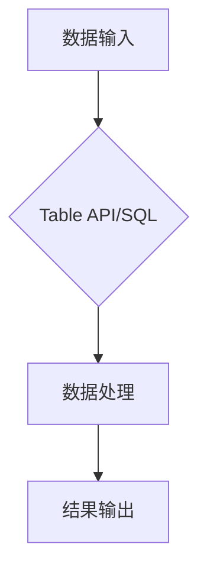

> Table API, SQL, 数据处理, 流式计算, 批处理, Apache Flink, Spark, 数据分析

## 1. 背景介绍

在当今数据爆炸的时代，高效地处理和分析海量数据成为了各行各业的关键挑战。为了应对这一挑战，各种数据处理框架和工具应运而生，其中Table API和SQL作为两种流行的数据处理方式，凭借其简洁易用、可读性强和强大的功能，逐渐成为数据工程师和数据科学家首选的工具。

Table API和SQL都提供了类似于关系数据库的编程模型，允许用户使用熟悉的SQL语法或Table API的API进行数据操作。它们可以处理各种类型的流式和批处理数据，并支持丰富的函数库和操作符，满足各种数据处理需求。

## 2. 核心概念与联系

**2.1 Table API**

Table API是一种基于表的编程模型，它将数据抽象为表，并提供一系列操作表的方法，例如过滤、聚合、连接等。用户可以使用这些方法来对数据进行操作，并生成新的表。

**2.2 SQL**

SQL（Structured Query Language）是一种标准化的数据库查询语言，用于与关系数据库进行交互。它提供了一系列语句来查询、插入、更新和删除数据。

**2.3 联系**

Table API和SQL本质上是两种不同的实现方式，但它们都基于相同的表式编程模型。Table API提供了一种更灵活的编程方式，允许用户使用更丰富的操作符和函数，而SQL则更侧重于查询和数据检索。

**2.4  流程图**



## 3. 核心算法原理 & 具体操作步骤

**3.1 算法原理概述**

Table API和SQL的底层实现都依赖于一系列的算法，例如：

* **数据分区和并行处理:** 将数据划分为多个分区，并行处理每个分区，提高数据处理效率。
* **数据交换和合并:** 将处理结果交换到不同的节点，并合并成最终结果。
* **数据过滤和聚合:** 使用高效的算法对数据进行过滤和聚合，减少数据量，提高处理速度。

**3.2 算法步骤详解**

1. **数据加载:** 将数据从外部存储系统加载到内存中。
2. **数据分区:** 将数据根据一定的规则划分为多个分区。
3. **数据处理:** 对每个分区的数据进行处理，例如过滤、聚合、连接等。
4. **数据交换:** 将处理结果交换到不同的节点。
5. **数据合并:** 将来自不同节点的处理结果合并成最终结果。
6. **结果输出:** 将最终结果输出到外部存储系统。

**3.3 算法优缺点**

**优点:**

* 高效的并行处理能力
* 灵活的编程模型
* 支持丰富的函数库和操作符

**缺点:**

* 复杂的数据处理逻辑可能难以实现
* 需要对数据分区和并行处理机制有深入了解

**3.4 算法应用领域**

Table API和SQL广泛应用于以下领域:

* 数据分析和挖掘
* 流式数据处理
* 批处理数据处理
* 数据仓库建设

## 4. 数学模型和公式 & 详细讲解 & 举例说明

**4.1 数学模型构建**

Table API和SQL的数学模型可以抽象为一个关系数据库模型，其中数据被存储在表中，表由行和列组成。每个行代表一个数据记录，每个列代表一个数据属性。

**4.2 公式推导过程**

Table API和SQL的查询操作可以表示为一系列的数学公式，例如：

* **过滤:**  A ∩ B，其中A和B是两个表，表示过滤出满足条件的数据。
* **连接:** A ⋈ B，其中A和B是两个表，表示连接两个表，根据指定的条件匹配数据。
* **聚合:** ΣA，其中A是一个表，表示对表中的数据进行聚合操作，例如求和、平均值等。

**4.3 案例分析与讲解**

例如，假设有一个表名为"学生"，包含学生姓名、年龄和成绩等信息。

* **过滤:** 查询所有年龄大于18岁的学生，可以使用以下SQL语句：

```sql
SELECT * FROM 学生 WHERE 年龄 > 18;
```

* **连接:** 查询学生姓名和对应的课程名称，可以使用以下SQL语句：

```sql
SELECT 学生.姓名, 课程.名称
FROM 学生
JOIN 课程 ON 学生.课程ID = 课程.ID;
```

* **聚合:** 查询每个课程的平均成绩，可以使用以下SQL语句：

```sql
SELECT 课程.名称, AVG(学生.成绩) AS 平均成绩
FROM 学生
JOIN 课程 ON 学生.课程ID = 课程.ID
GROUP BY 课程.名称;
```

## 5. 项目实践：代码实例和详细解释说明

**5.1 开发环境搭建**

本示例使用Apache Flink作为运行环境，需要安装Flink和相关依赖。

**5.2 源代码详细实现**

```java
import org.apache.flink.api.java.DataSet;
import org.apache.flink.api.java.ExecutionEnvironment;

public class TableAPIDemo {

    public static void main(String[] args) throws Exception {
        // 创建执行环境
        ExecutionEnvironment env = ExecutionEnvironment.getExecutionEnvironment();

        // 从本地文件读取数据
        DataSet<String> data = env.readTextFile("data.txt");

        // 使用Table API进行数据处理
        DataSet<String> result = data.flatMap(new Tokenizer())
                .filter(new Filter())
                .groupBy(0)
                .sum(1);

        // 打印结果
        result.print();
    }
}
```

**5.3 代码解读与分析**

* `ExecutionEnvironment.getExecutionEnvironment()`：获取执行环境。
* `readTextFile("data.txt")`：从本地文件读取数据。
* `flatMap(new Tokenizer())`：使用Tokenizer类将数据进行分词。
* `filter(new Filter())`：使用Filter类过滤数据。
* `groupBy(0)`：根据第一列进行分组。
* `sum(1)`：对第二列进行求和。
* `print()`：打印结果。

**5.4 运行结果展示**

运行代码后，将输出处理后的数据结果。

## 6. 实际应用场景

Table API和SQL在实际应用场景中具有广泛的应用，例如：

* **实时数据分析:** 使用Table API和SQL处理流式数据，实时监控系统状态和用户行为。
* **批处理数据分析:** 使用Table API和SQL处理大规模批处理数据，进行数据挖掘和分析。
* **数据仓库建设:** 使用Table API和SQL构建数据仓库，存储和管理企业数据。

**6.4 未来应用展望**

随着数据量的不断增长和计算能力的提升，Table API和SQL将继续在数据处理领域发挥重要作用。未来，Table API和SQL将更加智能化、自动化和可扩展，能够处理更加复杂的数据处理任务。

## 7. 工具和资源推荐

**7.1 学习资源推荐**

* Apache Flink 文档：https://flink.apache.org/docs/stable/
* Apache Spark 文档：https://spark.apache.org/docs/latest/
* Table API 和 SQL 教程：https://www.tutorialspoint.com/flink/flink_table_api.htm

**7.2 开发工具推荐**

* IntelliJ IDEA
* Eclipse

**7.3 相关论文推荐**

* Apache Flink: A Unified Engine for Batch and Stream Processing
* Apache Spark: A Unified Engine for Large-Scale Data Processing

## 8. 总结：未来发展趋势与挑战

**8.1 研究成果总结**

Table API和SQL已经成为数据处理领域的重要工具，为数据分析和处理提供了高效、灵活和可扩展的解决方案。

**8.2 未来发展趋势**

* **更智能化的数据处理:** 利用机器学习和人工智能技术，实现更智能的数据处理，例如自动数据清洗、自动数据分析等。
* **更强大的功能支持:** 支持更多的数据类型和操作符，满足更复杂的业务需求。
* **更易于使用的界面:** 提供更直观、易于使用的界面，降低用户学习门槛。

**8.3 面临的挑战**

* **数据复杂性:** 随着数据量的不断增长和复杂度的提升，如何高效处理复杂数据仍然是一个挑战。
* **性能优化:** 如何进一步提高Table API和SQL的性能，满足对实时性和吞吐量的需求。
* **生态系统建设:** 完善Table API和SQL的生态系统，提供更多工具和资源，促进其应用和发展。

**8.4 研究展望**

未来，Table API和SQL将继续朝着更智能化、自动化和可扩展的方向发展，为数据处理领域带来更多创新和突破。


## 9. 附录：常见问题与解答

**9.1 如何选择Table API还是SQL？**

选择Table API还是SQL取决于具体的应用场景和个人喜好。

* 如果需要更灵活的编程方式，可以使用Table API。
* 如果需要更简洁的语法和更丰富的查询功能，可以使用SQL。

**9.2 如何优化Table API和SQL的性能？**

* 优化数据分区策略
* 使用合适的索引
* 避免不必要的计算
* 使用并行处理机制

**9.3 如何学习Table API和SQL？**

可以参考官方文档、教程和书籍，并通过实践项目来加深理解。


作者：禅与计算机程序设计艺术 / Zen and the Art of Computer Programming 
<end_of_turn>