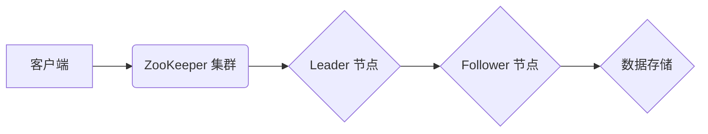

> Zookeeper,分布式系统,一致性,协调,配置管理,服务发现,状态管理,Paxos,Leader选举,代码实例

## 1. 背景介绍

在现代分布式系统中，协调服务、管理状态和提供一致性数据是至关重要的挑战。ZooKeeper 作为一款开源的分布式协调服务，凭借其高可用性、一致性以及易用性，在构建可靠的分布式系统中扮演着关键角色。

ZooKeeper 的出现是为了解决分布式系统中常见的挑战，例如：

* **服务发现:**  分布式系统中，服务节点的地址和状态可能随时变化，需要一种机制来动态发现和注册服务。
* **配置管理:**  分布式系统中的配置信息可能需要频繁更新，需要一种机制来高效地管理和同步配置。
* **状态管理:**  分布式系统中的状态信息需要被一致地维护和更新，需要一种机制来保证状态的一致性。
* **协调机制:**  分布式系统中需要协调多个节点之间的操作，例如选举 leader、同步数据等。

ZooKeeper 提供了以上功能，并通过其独特的 ZNode（节点）结构和基于 Paxos 协议的强一致性机制，为分布式系统提供了可靠的协调服务。

## 2. 核心概念与联系

ZooKeeper 的核心概念包括：

* **ZNode（节点）：** ZooKeeper 中的基本数据单元，类似于文件系统中的文件或目录。每个 ZNode 都有一个唯一的路径，可以包含数据和子节点。
* **连接（Connection）：**  客户端与 ZooKeeper 集群的连接。
* **会话（Session）：**  客户端与 ZooKeeper 集群之间建立的会话，会话具有唯一的 ID。
* **会话超时（Session Timeout）：**  会话的有效时间，超过此时间会话将被关闭。
* **ACL（访问控制列表）：**  用于控制对 ZNode 的访问权限。
* **Leader 选举：**  ZooKeeper 集群中，每个节点都可能成为 Leader，负责处理大部分请求。
* **Paxos 协议：**  ZooKeeper 使用 Paxos 协议来保证数据的一致性。

ZooKeeper 的架构可以概括为：



## 3. 核心算法原理 & 具体操作步骤

### 3.1  算法原理概述

ZooKeeper 的核心算法是 Paxos 协议，它是一种分布式一致性算法，用于解决多个节点之间达成一致的难题。Paxos 协议通过一系列的提案、投票和确认步骤，确保所有节点最终都同意相同的状态。

### 3.2  算法步骤详解

Paxos 协议的步骤可以概括为：

1. **提案（Proposal）：**  一个节点提出一个提案，例如更新一个 ZNode 的数据。
2. **投票（Vote）：**  提案被发送到集群中的所有节点，每个节点投票是否同意该提案。
3. **确认（Accept）：**  如果提案获得集群中大多数节点的同意，则该提案被接受。
4. **执行（Execute）：**  接受的提案被执行，例如更新 ZNode 的数据。

### 3.3  算法优缺点

**优点：**

* **强一致性：**  Paxos 协议保证了数据的一致性，即使节点发生故障或网络出现问题。
* **容错性：**  Paxos 协议能够容忍部分节点的故障，仍然能够保证系统正常运行。
* **安全性：**  Paxos 协议通过投票机制，防止恶意节点篡改数据。

**缺点：**

* **复杂性：**  Paxos 协议的实现比较复杂，需要深入理解其原理。
* **性能：**  Paxos 协议的性能相对较低，因为需要进行大量的投票和确认操作。

### 3.4  算法应用领域

Paxos 协议广泛应用于分布式系统中，例如：

* **分布式数据库:**  保证数据的一致性。
* **分布式文件系统:**  协调文件访问和更新。
* **分布式缓存:**  管理缓存数据的一致性。
* **分布式锁:**  实现分布式资源的互斥访问。

## 4. 数学模型和公式 & 详细讲解 & 举例说明

### 4.1  数学模型构建

Paxos 协议的数学模型可以抽象为一个状态机，每个状态机代表一个节点。状态机可以处于以下状态：

* **Prepare:**  节点准备接受一个提案。
* **Promise:**  节点承诺只接受一个提案。
* **Accept:**  节点接受了一个提案。
* **Learn:**  节点学习到一个提案已经被接受。

### 4.2  公式推导过程

Paxos 协议的实现涉及到大量的通信和状态转换，其核心逻辑可以通过以下公式来描述：

* **提案接受条件:**  一个提案被接受的条件是，它获得了集群中大多数节点的同意。
* **状态转换规则:**  每个节点的状态转换规则取决于它收到的消息和当前的状态。

### 4.3  案例分析与讲解

假设一个 ZooKeeper 集群中有三个节点，A、B、C。节点 A 提出一个提案，更新 ZNode 的数据。

1. 节点 A 发送 Prepare 消息给节点 B 和 C。
2. 节点 B 和 C 响应 Prepare 消息，承诺只接受一个提案。
3. 节点 A 发送 Accept 消息给节点 B 和 C，包含提案的内容。
4. 节点 B 和 C 响应 Accept 消息，接受了提案。
5. 节点 A 进入 Learn 状态，并执行提案，更新 ZNode 的数据。

## 5. 项目实践：代码实例和详细解释说明

### 5.1  开发环境搭建

为了演示 ZooKeeper 的使用，我们需要搭建一个开发环境。

* **安装 ZooKeeper:**  从 ZooKeeper 官方网站下载并安装 ZooKeeper。
* **配置 ZooKeeper:**  修改 ZooKeeper 的配置文件，例如 zoo.cfg，设置集群信息和端口号。
* **启动 ZooKeeper:**  启动 ZooKeeper 集群。

### 5.2  源代码详细实现

以下是一个简单的 ZooKeeper 代码实例，演示如何创建和删除 ZNode：

```java
import org.apache.zookeeper.CreateMode;
import org.apache.zookeeper.ZooDefs;
import org.apache.zookeeper.ZooKeeper;
import org.apache.zookeeper.data.ACL;
import org.apache.zookeeper.data.Stat;

import java.io.IOException;
import java.util.List;

public class ZookeeperExample {

    private static final String ZOOKEEPER_ADDRESS = "localhost:2181";
    private static ZooKeeper zooKeeper;

    public static void main(String[] args) throws IOException, InterruptedException {
        // 连接 ZooKeeper 集群
        zooKeeper = new ZooKeeper(ZOOKEEPER_ADDRESS, 3000, new Watcher() {
            @Override
            public void process(WatchedEvent event) {
                System.out.println("Event: " + event);
            }
        });

        // 创建 ZNode
        createNode("/myNode", "Hello, ZooKeeper!".getBytes());

        // 获取 ZNode 的数据
        String data = getData("/myNode");
        System.out.println("Data: " + data);

        // 删除 ZNode
        deleteNode("/myNode");
    }

    private static void createNode(String path, byte[] data) throws InterruptedException {
        Stat stat = zooKeeper.exists(path, false);
        if (stat == null) {
            // 创建 ZNode
            zooKeeper.create(path, data, ZooDefs.Ids.OPEN_ACL_UNSAFE, CreateMode.PERSISTENT);
            System.out.println("Created node: " + path);
        } else {
            System.out.println("Node already exists: " + path);
        }
    }

    private static String getData(String path) throws InterruptedException {
        byte[] data = zooKeeper.getData(path, false, null);
        return new String(data);
    }

    private static void deleteNode(String path) throws InterruptedException {
        zooKeeper.delete(path, -1);
        System.out.println("Deleted node: " + path);
    }
}
```

### 5.3  代码解读与分析

这段代码演示了如何使用 ZooKeeper API 创建、获取和删除 ZNode。

* **连接 ZooKeeper 集群:**  使用 `ZooKeeper` 类连接 ZooKeeper 集群，并设置连接超时时间。
* **创建 ZNode:**  使用 `create()` 方法创建 ZNode，指定路径、数据、访问控制列表和创建模式。
* **获取 ZNode 的数据:**  使用 `getData()` 方法获取 ZNode 的数据。
* **删除 ZNode:**  使用 `delete()` 方法删除 ZNode。

### 5.4  运行结果展示

运行这段代码后，将会在 ZooKeeper 集群中创建一个名为 `/myNode` 的 ZNode，并写入数据 "Hello, ZooKeeper!". 然后代码会获取该 ZNode 的数据并打印出来，最后删除该 ZNode。

## 6. 实际应用场景

ZooKeeper 在实际应用场景中广泛应用于：

### 6.1  配置管理

ZooKeeper 可以用于存储和管理分布式系统的配置信息，例如服务地址、端口号、数据库连接信息等。

### 6.2  服务发现

ZooKeeper 可以用于实现服务发现，例如注册和发现服务节点的地址和状态。

### 6.3  状态管理

ZooKeeper 可以用于管理分布式系统的状态信息，例如任务进度、节点状态等。

### 6.4  协调机制

ZooKeeper 可以用于协调分布式系统的操作，例如选举 leader、同步数据等。

## 7. 工具和资源推荐

### 7.1  学习资源推荐

* **ZooKeeper 官方文档:** https://zookeeper.apache.org/doc/r3.6.3/
* **ZooKeeper 中文文档:** http://zookeeper.apache.org/zh-cn/
* **ZooKeeper 入门教程:** https://www.cnblogs.com/dolphin0520/p/5497933.html

### 7.2  开发工具推荐

* **Apache ZooKeeper:** https://zookeeper.apache.org/download.html
* **Curator:** https://curator.apache.org/
* **Zookeeper Java Client:** https://github.com/apache/zookeeper/tree/master/java

### 7.3  相关论文推荐

* **The Paxos Algorithm:** https://dl.acm.org/doi/10.1145/324373.324402
* **ZooKeeper: A Distributed Coordination Service for Large-Scale Distributed Systems:** https://www.usenix.org/system/files/conference/osdi08/osdi08-paper-choudhary.pdf

## 8. 总结：未来发展趋势与挑战

### 8.1  研究成果总结

ZooKeeper 作为一种成熟的分布式协调服务，已经广泛应用于各种分布式系统中。其强一致性、容错性和安全性使其成为构建可靠分布式系统的首选工具之一。

### 8.2  未来发展趋势

* **性能优化:**  ZooKeeper 的性能仍然是一个挑战，未来可能会采用新的算法和架构来提高其性能。
* **支持更多数据类型:**  ZooKeeper 目前主要支持字符串和二进制数据，未来可能会支持更多数据类型，例如 JSON 和 XML。
* **更丰富的功能:**  ZooKeeper 未来可能会提供更多丰富的功能，例如分布式事务和消息队列。

### 8.3  面临的挑战

* **复杂性:**  ZooKeeper 的实现比较复杂，需要深入理解其原理。
* **性能瓶颈:**  ZooKeeper 的性能瓶颈主要来自 Paxos 协议的复杂性，需要不断优化算法和架构。
* **安全问题:**  ZooKeeper 的安全性需要不断加强，防止恶意攻击。

### 8.4  研究展望

未来，ZooKeeper 的研究方向将集中在性能优化、功能扩展和安全性提升等方面。


## 9. 附录：