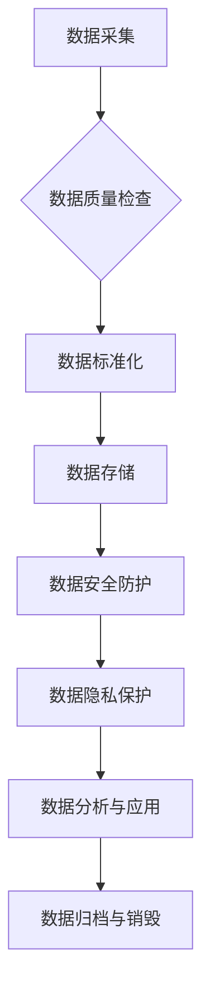

> 数据治理，数据质量，数据标准化，数据安全，数据隐私，数据可信，数据生命周期

## 1. 背景介绍

在当今数据爆炸的时代，数据已成为企业最重要的资产之一。然而，海量数据的价值难以挖掘，甚至可能带来风险，例如数据质量问题、数据安全隐患、数据隐私泄露等。因此，数据治理的重要性日益凸显。

数据治理是指对数据生命周期进行全面的管理，包括数据定义、数据质量、数据安全、数据隐私、数据标准化等方面。其目标是确保数据准确、完整、一致、安全、可信，从而为企业决策提供可靠的支撑。

## 2. 核心概念与联系

数据治理是一个复杂的系统工程，涉及多个核心概念和环节。

**2.1 数据质量**

数据质量是指数据的准确性、完整性、一致性、时效性和可用性等方面的度量。高质量的数据是数据治理的基础，也是数据价值的保障。

**2.2 数据标准化**

数据标准化是指对数据的格式、结构、定义等方面进行统一规范，以确保数据的一致性和可交换性。数据标准化可以提高数据管理效率，降低数据整合成本。

**2.3 数据安全**

数据安全是指保护数据免受未经授权的访问、使用、修改或销毁。数据安全是数据治理的关键环节，需要采取相应的技术措施和管理制度来保障数据安全。

**2.4 数据隐私**

数据隐私是指个人信息在收集、使用、存储和处理过程中受到保护的权利。数据隐私是数据治理的重要议题，需要遵守相关法律法规和行业标准。

**2.5 数据生命周期**

数据生命周期是指数据从创建到销毁的全过程，包括数据采集、数据存储、数据处理、数据分析、数据共享、数据归档和数据销毁等阶段。数据治理需要贯穿整个数据生命周期，确保数据在各个阶段都得到有效管理。

**2.6 数据治理架构**

数据治理架构是指数据治理的组织结构、职责分工、流程规范和技术支撑等方面的框架。数据治理架构需要根据企业的实际情况进行设计，以确保数据治理的有效实施。



## 3. 核心算法原理 & 具体操作步骤

### 3.1  算法原理概述

数据治理涉及多种算法和技术，例如数据清洗算法、数据匹配算法、数据加密算法等。这些算法的原理和实现方式各有不同，但都旨在解决数据治理中的特定问题。

### 3.2  算法步骤详解

以数据清洗算法为例，其步骤通常包括：

1. 数据识别：识别需要清洗的数据。
2. 数据清洗规则定义：根据数据质量要求，定义清洗规则。
3. 数据清洗操作：根据清洗规则，对数据进行清洗操作，例如删除重复数据、修复错误数据、填充缺失数据等。
4. 数据验证：验证清洗结果，确保数据质量达到预期要求。

### 3.3  算法优缺点

不同的数据治理算法各有优缺点，需要根据实际情况选择合适的算法。例如，数据匹配算法可以提高数据一致性，但计算复杂度较高；数据加密算法可以保障数据安全，但可能会影响数据查询效率。

### 3.4  算法应用领域

数据治理算法广泛应用于各个领域，例如金融、医疗、电商等。例如，在金融领域，数据治理算法可以用于识别欺诈交易、评估客户风险、优化投资策略等。

## 4. 数学模型和公式 & 详细讲解 & 举例说明

### 4.1  数学模型构建

数据治理涉及多种数学模型，例如数据质量评估模型、数据关联度模型、数据安全风险模型等。这些模型可以量化数据质量、数据关联度、数据安全风险等指标，为数据治理决策提供依据。

### 4.2  公式推导过程

以数据质量评估模型为例，其公式可以根据数据质量指标进行构建。例如，数据准确度可以定义为正确数据条数除以总数据条数，数据完整度可以定义为非缺失数据条数除以总数据条数。

### 4.3  案例分析与讲解

通过对实际案例进行分析，可以验证数学模型的有效性，并进一步完善模型。例如，可以分析不同行业、不同数据类型的特点，构建更精准的数据质量评估模型。

## 5. 项目实践：代码实例和详细解释说明

### 5.1  开发环境搭建

数据治理项目开发环境通常包括操作系统、数据库、编程语言、开发工具等。例如，可以使用Linux操作系统、MySQL数据库、Python编程语言、PyCharm开发工具等。

### 5.2  源代码详细实现

以下是一个简单的Python代码实例，用于实现数据清洗操作：

```python
import pandas as pd

# 读取数据
data = pd.read_csv('data.csv')

# 删除重复数据
data.drop_duplicates(inplace=True)

# 修复错误数据
data['age'].replace([None, ' '], pd.NA, inplace=True)

# 填充缺失数据
data['age'].fillna(data['age'].mean(), inplace=True)

# 保存数据
data.to_csv('cleaned_data.csv', index=False)
```

### 5.3  代码解读与分析

这段代码首先使用Pandas库读取数据，然后使用`drop_duplicates()`方法删除重复数据，使用`replace()`方法修复错误数据，使用`fillna()`方法填充缺失数据，最后使用`to_csv()`方法保存清洗后的数据。

### 5.4  运行结果展示

运行这段代码后，将生成一个名为`cleaned_data.csv`的文件，其中包含清洗后的数据。

## 6. 实际应用场景

数据治理在各个行业都有广泛的应用场景，例如：

### 6.1 金融行业

在金融行业，数据治理可以用于识别欺诈交易、评估客户风险、优化投资策略等。例如，银行可以使用数据治理技术识别信用卡欺诈行为，保险公司可以使用数据治理技术评估客户的风险等级，投资公司可以使用数据治理技术优化投资组合。

### 6.2 医疗行业

在医疗行业，数据治理可以用于提高医疗质量、降低医疗成本、促进医疗研究等。例如，医院可以使用数据治理技术分析患者的病历数据，识别潜在的健康风险，并提供个性化的医疗建议；药企可以使用数据治理技术分析临床试验数据，加速新药研发。

### 6.3 电商行业

在电商行业，数据治理可以用于提高客户体验、优化营销策略、降低运营成本等。例如，电商平台可以使用数据治理技术分析用户的购买行为，推荐个性化的商品；电商平台可以使用数据治理技术分析用户的评价数据，改进产品的质量；电商平台可以使用数据治理技术分析用户的浏览数据，优化网站的布局。

### 6.4 未来应用展望

随着数据量的不断增长和数据价值的不断提升，数据治理将成为越来越重要的议题。未来，数据治理技术将更加智能化、自动化、个性化，并与人工智能、云计算等新兴技术深度融合，为企业提供更全面的数据管理解决方案。

## 7. 工具和资源推荐

### 7.1  学习资源推荐

* **书籍:**
    * 《数据治理：从概念到实践》
    * 《数据质量管理》
    * 《数据安全与隐私保护》
* **在线课程:**
    * Coursera: Data Governance
    * Udemy: Data Governance Fundamentals
    * edX: Data Management and Governance

### 7.2  开发工具推荐

* **数据质量工具:**
    * Talend Data Quality
    * Informatica PowerCenter
    * IBM InfoSphere DataStage
* **数据标准化工具:**
    * Apache Camel
    * MuleSoft Anypoint Platform
    * TIBCO BusinessWorks
* **数据安全工具:**
    * Splunk
    * Palo Alto Networks
    * Fortinet

### 7.3  相关论文推荐

* **数据治理:**
    * Data Governance: A Comprehensive Framework
    * Data Governance for Big Data
* **数据质量:**
    * Data Quality: Concepts, Methodologies, Tools, and Applications
    * A Survey of Data Quality Assessment Techniques
* **数据安全:**
    * Data Security: Principles and Practices
    * A Survey of Data Security Techniques

## 8. 总结：未来发展趋势与挑战

### 8.1  研究成果总结

数据治理是一个不断发展和完善的领域，近年来取得了显著的成果。例如，数据治理工具和技术不断成熟，数据治理框架和标准不断完善，数据治理的实践经验不断积累。

### 8.2  未来发展趋势

未来，数据治理将朝着以下几个方向发展：

* **智能化:** 利用人工智能技术，实现数据治理的自动化和智能化。
* **自动化:** 利用自动化技术，简化数据治理流程，提高效率。
* **个性化:** 根据不同用户的需求，提供个性化的数据治理解决方案。
* **云化:** 将数据治理服务迁移到云平台，实现数据治理的弹性和可扩展性。

### 8.3  面临的挑战

数据治理也面临着一些挑战，例如：

* **数据孤岛:** 数据分散在不同的系统和平台，难以进行统一管理。
* **数据质量问题:** 数据质量参差不齐，难以保证数据的可靠性和准确性。
* **数据安全风险:** 数据泄露和数据篡改等安全风险日益突出。
* **人才短缺:** 数据治理领域人才短缺，缺乏经验丰富的专业人员。

### 8.4  研究展望

未来，需要进一步研究和探索数据治理的理论和实践，解决数据治理面临的挑战，推动数据治理的健康发展。

## 9. 附录：常见问题与解答

### 9.1  什么是数据治理？

数据治理是指对数据生命周期进行全面的管理，包括数据定义、数据质量、数据安全、数据隐私、数据标准化等方面。

### 9.2  数据治理的目的是什么？

数据治理的目标是确保数据准确、完整、一致、安全、可信，从而为企业决策提供可靠的支撑。

### 9.3  数据治理有哪些重要原则？

数据治理的重要原则包括：

* 数据所有权和责任
* 数据标准化和一致性
* 数据安全和隐私保护
* 数据质量管理
* 数据生命周期管理

### 9.4  数据治理有哪些常见工具？

数据治理工具包括数据质量工具、数据标准化工具、数据安全工具等。

### 9.5  数据治理的未来发展趋势是什么？

未来，数据治理将朝着智能化、自动化、个性化、云化等方向发展。


作者：禅与计算机程序设计艺术 / Zen and the Art of Computer Programming 
<end_of_turn>