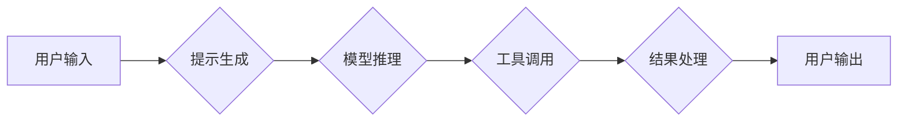

# 【LangChain编程：从入门到实践】自定义代理工具

> 关键词：

> LangChain, 代理工具, 自定义, 编程, AI, 自然语言处理, 应用场景

## 1. 背景介绍

近年来，大型语言模型（LLM）在自然语言处理（NLP）领域取得了显著进展，展现出强大的文本生成、理解和对话能力。然而，LLM的局限性也逐渐显现，例如缺乏对外部信息的访问能力、难以执行复杂的任务以及容易受到恶意输入的影响。

为了克服这些限制，代理工具应运而生。代理工具可以帮助LLM连接外部世界，获取所需信息、执行指令并完成更复杂的任务。LangChain是一个强大的开源框架，专门用于构建和管理代理工具。它提供了一系列组件和工具，使开发者能够轻松地创建自定义代理工具，并将其应用于各种场景。

## 2. 核心概念与联系

### 2.1  LangChain 核心概念

LangChain 主要由以下几个核心概念组成：

* **模型 (Model):** 指的是用于处理文本的语言模型，例如 GPT-3、BERT 等。
* **提示 (Prompt):** 指的是给语言模型输入的文本指令或问题。
* **链 (Chain):** 指的是将多个组件串联在一起，形成一个完整的任务流程。
* **工具 (Tool):** 指的是能够执行特定任务的外部程序或服务，例如搜索引擎、数据库、API 等。
* **内存 (Memory):** 指的是存储代理工具执行过程中产生的信息，例如对话历史、任务状态等。

### 2.2  代理工具架构

代理工具的架构通常包括以下几个部分：

* **用户输入:** 用户向代理工具提出问题或指令。
* **提示生成:** 代理工具根据用户输入生成相应的提示，并将其传递给语言模型。
* **模型推理:** 语言模型根据提示进行推理，并生成相应的文本输出。
* **工具调用:** 如果需要，代理工具会调用外部工具获取信息或执行任务。
* **结果处理:** 代理工具处理模型输出和工具返回的结果，并将其呈现给用户。



## 3. 核心算法原理 & 具体操作步骤

### 3.1  算法原理概述

代理工具的核心算法原理是基于**循环推理**和**状态管理**。

* **循环推理:** 代理工具会根据用户输入和模型输出，不断地生成新的提示，并进行模型推理，直到达到预设的目标或用户满意为止。
* **状态管理:** 代理工具需要维护一个状态变量，记录执行过程中产生的信息，例如对话历史、任务进度等。

### 3.2  算法步骤详解

1. **初始化:** 创建代理工具实例，并设置初始状态。
2. **接收用户输入:** 获取用户提出的问题或指令。
3. **生成提示:** 根据用户输入和当前状态，生成相应的提示，并将其传递给语言模型。
4. **模型推理:** 语言模型根据提示进行推理，并生成相应的文本输出。
5. **工具调用:** 如果模型输出需要调用外部工具，则调用相应的工具获取信息或执行任务。
6. **结果处理:** 处理模型输出和工具返回的结果，并将其格式化成用户可理解的形式。
7. **更新状态:** 更新代理工具的状态变量，记录执行过程中产生的信息。
8. **循环执行:** 重复步骤3-7，直到达到预设的目标或用户满意为止。

### 3.3  算法优缺点

**优点:**

* **灵活性和可扩展性:** 代理工具可以根据不同的任务需求，灵活地组合不同的组件和工具。
* **增强能力:** 代理工具可以帮助LLM连接外部世界，获取更多信息和执行更多任务。
* **安全性:** 代理工具可以帮助LLM避免直接访问危险的外部信息，提高安全性。

**缺点:**

* **复杂性:** 设计和开发代理工具相对复杂，需要对LLM、工具调用和状态管理等方面有深入的了解。
* **性能:** 代理工具的性能取决于语言模型和工具的性能，以及数据传输和处理速度。
* **可解释性:** 代理工具的决策过程可能难以解释，这可能会影响用户对代理工具的信任。

### 3.4  算法应用领域

代理工具在以下领域具有广泛的应用前景:

* **客服机器人:** 代理工具可以帮助客服机器人更智能地回答用户问题，并提供更个性化的服务。
* **搜索引擎:** 代理工具可以帮助搜索引擎更准确地理解用户意图，并提供更相关的搜索结果。
* **教育辅助:** 代理工具可以帮助学生学习新知识，并完成作业。
* **代码生成:** 代理工具可以帮助程序员生成代码，并提高开发效率。

## 4. 数学模型和公式 & 详细讲解 & 举例说明

### 4.1  数学模型构建

代理工具的决策过程可以抽象为一个状态转移模型，其中状态表示代理工具执行过程中的信息，动作表示代理工具可以执行的操作，奖励函数表示代理工具执行动作后的收益。

状态空间 S：包含代理工具执行过程中产生的所有信息，例如对话历史、任务进度、工具状态等。

动作空间 A：包含代理工具可以执行的所有操作，例如生成提示、调用工具、更新状态等。

奖励函数 R(s, a)：根据当前状态 s 和执行的动作 a，计算代理工具获得的奖励。

状态转移函数 P(s', a | s)：表示执行动作 a 在状态 s 下，转移到状态 s' 的概率。

### 4.2  公式推导过程

代理工具的目标是最大化累积奖励，可以使用动态规划或强化学习算法来解决这个问题。

动态规划算法：

* 计算每个状态下所有可能的行动的价值函数。
* 选择价值函数最大的行动。

强化学习算法：

* 使用策略梯度算法或值函数估计算法，学习一个策略，使得代理工具在执行过程中获得最大的累积奖励。

### 4.3  案例分析与讲解

例如，一个代理工具用于回答用户关于天气预报的问题。

* 状态空间 S：包含用户提出的问题、对话历史、当前时间、地理位置等信息。
* 动作空间 A：包含查询天气预报 API、生成天气预报文本、更新对话历史等操作。
* 奖励函数 R(s, a)：根据用户对天气预报的满意度进行评分。

代理工具可以使用强化学习算法学习一个策略，使得在回答用户问题时获得最高的满意度评分。

## 5. 项目实践：代码实例和详细解释说明

### 5.1  开发环境搭建

* Python 3.7+
* LangChain 0.0.20+
* OpenAI API key

### 5.2  源代码详细实现

```python
from langchain.agents import initialize_agent
from langchain.tools import Tool
from langchain.llms import OpenAI

# 定义工具
class SearchTool(Tool):
    def __init__(self, api_key):
        self.api_key = api_key

    def run(self, query):
        # 使用 OpenAI API 查询信息
        # ...
        return results

# 创建工具实例
search_tool = SearchTool(api_key="YOUR_API_KEY")

# 创建语言模型实例
llm = OpenAI(temperature=0)

# 初始化代理工具
agent = initialize_agent(
    tools=[search_tool],
    llm=llm,
    agent="zero-shot-react-description",
)

# 用户输入
user_input = "今天的天气怎么样？"

# 代理工具响应
response = agent.run(user_input)

# 打印响应
print(response)
```

### 5.3  代码解读与分析

* 代码首先定义了一个 `SearchTool` 类，用于调用 OpenAI API 查询信息。
* 然后创建了 `SearchTool` 实例和 `OpenAI` 语言模型实例。
* 使用 `initialize_agent` 函数初始化代理工具，指定工具列表、语言模型和代理策略。
* 用户输入问题后，代理工具会调用 `run` 方法，执行相应的任务并返回结果。

### 5.4  运行结果展示

代理工具会根据用户输入，调用 `SearchTool` 查询天气预报信息，并生成相应的文本响应。

## 6. 实际应用场景

### 6.1  客服机器人

代理工具可以帮助客服机器人更智能地回答用户问题，并提供更个性化的服务。例如，代理工具可以调用外部数据库查询用户历史订单信息，并根据用户需求提供相应的服务。

### 6.2  搜索引擎

代理工具可以帮助搜索引擎更准确地理解用户意图，并提供更相关的搜索结果。例如，代理工具可以调用外部知识库查询相关信息，并根据用户搜索历史生成个性化推荐。

### 6.3  教育辅助

代理工具可以帮助学生学习新知识，并完成作业。例如，代理工具可以调用外部学习平台获取学习资源，并根据学生的学习进度提供个性化的辅导。

### 6.4  未来应用展望

随着人工智能技术的不断发展，代理工具将在更多领域得到应用，例如医疗诊断、法律咨询、金融分析等。

## 7. 工具和资源推荐

### 7.1  学习资源推荐

* **LangChain 官方文档:** https://python.langchain.com/docs/
* **LangChain GitHub 仓库:** https://github.com/langchain-ai/langchain
* **OpenAI API 文档:** https://platform.openai.com/docs/api-reference

### 7.2  开发工具推荐

* **Python:** https://www.python.org/
* **VS Code:** https://code.visualstudio.com/

### 7.3  相关论文推荐

* **LangChain: Towards General-Purpose AI Agents:** https://arxiv.org/abs/2204.08777

## 8. 总结：未来发展趋势与挑战

### 8.1  研究成果总结

LangChain 框架为构建代理工具提供了强大的工具和组件，使得开发者能够更轻松地创建自定义代理工具，并将其应用于各种场景。

### 8.2  未来发展趋势

* **更强大的代理工具:** 未来代理工具将更加智能、灵活和强大，能够执行更复杂的任务，并更好地理解用户意图。
* **更广泛的应用场景:** 代理工具将在更多领域得到应用，例如医疗诊断、法律咨询、金融分析等。
* **更安全的代理工具:** 未来代理工具将更加安全可靠，能够有效防止恶意攻击和数据泄露。

### 8.3  面临的挑战

* **数据安全和隐私保护:** 代理工具需要访问用户数据，因此需要确保数据安全和隐私保护。
* **可解释性和透明度:** 代理工具的决策过程可能难以解释，这可能会影响用户对代理工具的信任。
* **伦理问题:** 代理工具的应用可能会带来一些伦理问题，例如算法偏见、责任归属等。

### 8.4  研究展望

未来研究将集中在以下几个方面:

* **开发更智能、更灵活的代理工具算法。**
* **提高代理工具的可解释性和透明度。**
* **解决代理工具带来的伦理问题。**


## 9. 附录：常见问题与解答

### 9.1  Q: 如何选择合适的代理策略？

A: 选择合适的代理策略取决于具体的应用场景和任务需求。LangChain 提供了多种代理策略，例如 zero-shot-react-description、few-shot-react-description、chain-of-thought 等。

### 9.2  Q: 如何训练自定义工具？

A: 自定义工具的训练方法取决于工具的类型和功能。一些工具可以利用预训练模型进行微调，而另一些工具则需要从头开始训练。

### 9.3  Q: 如何确保代理工具的安全性和可靠性？

A: 确保代理工具的安全性和可靠性需要从多个方面考虑，例如数据安全、模型安全性、工具可靠性等。

### 9.4  Q: 如何解决代理工具带来的伦理问题？

A: 代理工具的伦理问题是一个复杂的问题，需要多方共同努力解决。