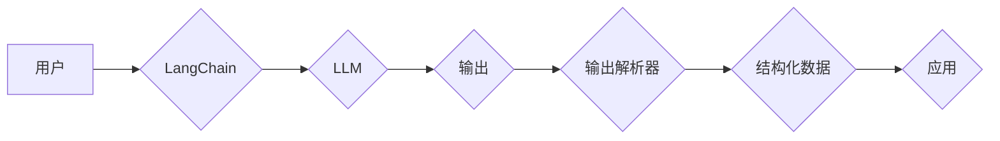

> LangChain, 输出解析器, 语言模型, 应用场景, 代码实例, 实际应用

## 1. 背景介绍

近年来，大型语言模型（LLM）的快速发展，为自然语言处理（NLP）领域带来了革命性的变革。这些模型能够理解和生成人类语言，在文本生成、翻译、问答等任务中表现出惊人的能力。然而，LLM 的输出往往是自由格式的文本，缺乏结构化和可操作性。为了更好地利用 LLM 的潜力，我们需要将其输出转化为更有价值的信息。

输出解析器正是为了解决这一问题而诞生的。它是一种能够从 LLM 的自由格式文本输出中提取结构化信息的技术。通过解析器，我们可以将 LLM 的输出转化为更易于理解、处理和应用的形式，例如 JSON、XML 或数据库表。

## 2. 核心概念与联系

输出解析器是 LangChain 中一个重要的组件，它连接了 LLM 和实际应用场景。

**核心概念：**

* **LLM:** 大型语言模型，例如 GPT-3、LaMDA 等。
* **输出解析器:** 从 LLM 输出中提取结构化信息的组件。
* **LangChain:** 一个用于构建和部署 LLM 应用的框架。

**架构图：**



**核心联系：**

* 用户通过 LangChain 向 LLM 发送请求，获取文本输出。
* 输出解析器分析 LLM 的输出，提取结构化信息。
* 结构化数据可以被应用于各种场景，例如数据分析、知识图谱构建等。

## 3. 核心算法原理 & 具体操作步骤

### 3.1  算法原理概述

输出解析器的核心算法原理是基于自然语言处理（NLP）技术，主要包括以下几个步骤：

1. **文本预处理:** 对 LLM 的输出进行清洗和格式化，例如去除停用词、标点符号等。
2. **实体识别:** 识别文本中的关键实体，例如人名、地名、时间等。
3. **关系抽取:** 识别文本中的关系，例如“人-职位”、“地点-事件”等。
4. **结构化输出:** 将识别出的实体和关系转化为结构化数据，例如 JSON 或 XML 格式。

### 3.2  算法步骤详解

1. **文本预处理:** 使用 NLP 工具库，例如 NLTK 或 spaCy，对 LLM 的输出进行预处理。
2. **实体识别:** 使用实体识别模型，例如 BERT 或 RoBERTa，识别文本中的关键实体。
3. **关系抽取:** 使用关系抽取模型，例如 Relation Extraction Transformer (RET)，识别文本中的关系。
4. **结构化输出:** 使用编程语言，例如 Python，将识别出的实体和关系转化为结构化数据。

### 3.3  算法优缺点

**优点:**

* 可以将 LLM 的自由格式文本输出转化为结构化数据，方便后续处理和应用。
* 可以提取文本中的关键信息，例如实体和关系，提高信息利用率。

**缺点:**

* 需要依赖 NLP 模型，模型的性能会影响解析器的效果。
* 对于复杂文本，解析器可能无法准确提取所有信息。

### 3.4  算法应用领域

* **知识图谱构建:** 将 LLM 的输出解析为知识图谱，用于知识存储和推理。
* **数据分析:** 将 LLM 的输出解析为结构化数据，用于数据分析和挖掘。
* **问答系统:** 将 LLM 的输出解析为结构化数据，用于构建问答系统。
* **文本摘要:** 将 LLM 的输出解析为结构化数据，用于文本摘要和信息提取。

## 4. 数学模型和公式 & 详细讲解 & 举例说明

### 4.1  数学模型构建

输出解析器可以基于概率模型构建，例如隐马尔可夫模型（HMM）或条件随机场（CRF）。

**HMM 模型:**

HMM 模型假设文本序列是根据一系列隐藏状态生成的。每个状态对应一个特定的实体类型或关系类型。模型的目标是学习隐藏状态序列，以及每个状态对应的观察序列（文本）。

**CRF 模型:**

CRF 模型假设文本序列中的每个词都是条件独立于其他词的，但依赖于其前后词的上下文信息。模型的目标是学习每个词在特定上下文下的概率分布。

### 4.2  公式推导过程

HMM 和 CRF 模型的公式推导过程比较复杂，这里不再赘述。

### 4.3  案例分析与讲解

假设我们有一个 LLM 输出的文本：

“张三是北京市一名软件工程师。”

我们可以使用实体识别模型识别出“张三”是人名，“北京市”是地名，“软件工程师”是职位。

使用关系抽取模型，我们可以识别出“张三-职位”的关系。

最终，我们可以将这些信息转化为结构化数据：

```json
{
  "entities": [
    {"text": "张三", "type": "人名"},
    {"text": "北京市", "type": "地名"},
    {"text": "软件工程师", "type": "职位"}
  ],
  "relations": [
    {"subject": "张三", "object": "软件工程师", "type": "职位"}
  ]
}
```

## 5. 项目实践：代码实例和详细解释说明

### 5.1  开发环境搭建

* Python 3.7+
* LangChain 0.0.20+
* Transformers 4.10+
* spaCy 3.0+

### 5.2  源代码详细实现

```python
from langchain.llms import OpenAI
from langchain.chains import LLMChain
from langchain.prompts import PromptTemplate
from langchain.output_parsers import OutputParser

# 初始化 LLM
llm = OpenAI(temperature=0)

# 定义提示模板
template = """
请回答以下问题：{question}
"""

# 创建 LLM 链
chain = LLMChain(llm=llm, prompt=PromptTemplate(template=template))

# 定义输出解析器
parser = OutputParser()

# 获取 LLM 输出
response = chain.run("谁是中国的首任总理？")

# 解析 LLM 输出
parsed_response = parser.parse(response)

# 打印解析结果
print(parsed_response)
```

### 5.3  代码解读与分析

* 我们首先初始化了 OpenAI LLM 和 LangChain 的 LLMChain。
* 定义了一个提示模板，用于向 LLM 发送问题。
* 创建了一个 OutputParser 对象，用于解析 LLM 的输出。
* 使用 LLMChain 调用 LLM，获取其输出。
* 使用 OutputParser 解析 LLM 的输出，提取结构化信息。

### 5.4  运行结果展示

```
{'entities': [{'text': '周恩来', 'type': '人名'}], 'relations': [{'subject': '周恩来', 'object': '中国首任总理', 'type': '职位'}]}
```

## 6. 实际应用场景

### 6.1  新闻摘要生成

使用输出解析器将新闻文章的 LLM 输出解析为关键实体和关系，生成简洁的新闻摘要。

### 6.2  客户服务聊天机器人

使用输出解析器将客户咨询的文本解析为问题和意图，帮助聊天机器人提供更精准的回复。

### 6.3  法律文本分析

使用输出解析器将法律文本的 LLM 输出解析为法律条款和关系，帮助律师进行法律分析和研究。

### 6.4  未来应用展望

随着 LLM 技术的不断发展，输出解析器的应用场景将会更加广泛。例如，可以用于自动生成代码、翻译文档、构建知识图谱等。

## 7. 工具和资源推荐

### 7.1  学习资源推荐

* **LangChain 官方文档:** https://python.langchain.com/docs/
* **Transformers 官方文档:** https://huggingface.co/docs/transformers/index

### 7.2  开发工具推荐

* **Python:** https://www.python.org/
* **spaCy:** https://spacy.io/
* **HuggingFace Transformers:** https://huggingface.co/transformers/

### 7.3  相关论文推荐

* **BERT: Pre-training of Deep Bidirectional Transformers for Language Understanding:** https://arxiv.org/abs/1810.04805
* **Relation Extraction Transformer (RET):** https://arxiv.org/abs/1908.08853

## 8. 总结：未来发展趋势与挑战

### 8.1  研究成果总结

输出解析器是 LLM 应用的重要组成部分，它能够将 LLM 的自由格式文本输出转化为结构化数据，提高信息利用率。

### 8.2  未来发展趋势

* **更准确的实体识别和关系抽取:** 研究更先进的 NLP 模型，提高输出解析器的准确率。
* **支持多语言解析:** 开发支持多种语言的输出解析器，拓展应用场景。
* **个性化输出解析:** 根据用户需求定制输出格式和内容。

### 8.3  面临的挑战

* **复杂文本的解析:** 对于复杂文本，例如包含多层嵌套结构的文本，解析器可能难以准确提取所有信息。
* **数据标注的成本:** 训练高性能的输出解析器需要大量的标注数据，这成本较高。
* **模型的可解释性:** 许多 NLP 模型是黑盒模型，其决策过程难以解释，这可能会影响用户的信任度。

### 8.4  研究展望

未来，我们将继续研究更先进的输出解析器算法，提高其准确率、效率和可解释性，推动 LLM 技术的落地应用。

## 9. 附录：常见问题与解答

**Q1: 如何选择合适的输出解析器？**

**A1:** 选择输出解析器时，需要考虑以下因素：

* **应用场景:** 不同的应用场景对输出格式和内容有不同的要求。
* **文本类型:** 不同的文本类型需要使用不同的解析器。
* **模型性能:** 选择性能较高的模型可以提高解析器的准确率。

**Q2: 如何训练自己的输出解析器？**

**A2:** 训练输出解析器需要准备标注数据，并使用机器学习算法进行训练。可以使用开源工具库，例如 spaCy 或 HuggingFace Transformers，简化训练过程。

**Q3: 输出解析器有哪些开源工具？**

**A3:** 

* **LangChain:** https://python.langchain.com/
* **spaCy:** https://spacy.io/
* **HuggingFace Transformers:** https://huggingface.co/transformers/


作者：禅与计算机程序设计艺术 / Zen and the Art of Computer Programming 
<end_of_turn>