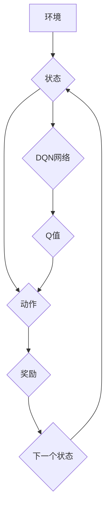

> 深度强化学习，DQN，交通规划，智能交通，城市规划，交通拥堵，效率优化

## 1. 背景介绍

随着全球人口的快速增长和城市化的进程不断加速，交通拥堵已成为许多城市面临的严峻挑战。传统的交通管理方式难以有效应对日益复杂的交通流量和需求变化。智能交通系统 (ITS) 应运而生，旨在通过先进的传感器、通信技术和数据分析手段，实现交通流量的智能化管理和优化。

深度强化学习 (Deep Reinforcement Learning，DRL) 作为一种新兴的机器学习方法，在解决复杂决策问题方面展现出强大的潜力。它能够通过与环境的交互学习最优策略，并不断优化决策过程。在智能交通领域，DRL被广泛应用于交通信号控制、路径规划、车辆调度等多个方面，取得了显著的成果。

本文将深入探讨深度强化学习算法DQN (Deep Q-Network) 在交通规划中的应用，分析其原理、优势、挑战以及未来发展趋势。

## 2. 核心概念与联系

**2.1 交通规划概述**

交通规划是指通过科学的规划和设计，合理安排交通设施和交通流量，以满足人们的出行需求，提高交通效率和安全性。交通规划涉及多个方面，包括道路网络规划、交通信号控制、公共交通系统规划、停车管理等。

**2.2 深度强化学习概述**

深度强化学习 (DRL) 是一种基于马尔可夫决策过程 (MDP) 的机器学习方法，它通过强化信号来训练智能体学习最优策略。DRL算法的核心是 Q 函数，它评估在特定状态下采取特定动作的价值。

**2.3 DQN算法原理**

DQN算法将深度神经网络与 Q 学习算法相结合，能够学习复杂环境下的最优策略。其核心思想是：

* 使用深度神经网络逼近 Q 函数，能够处理高维输入数据。
* 使用经验回放机制，从历史经验中随机采样数据进行训练，提高训练效率和稳定性。
* 使用目标网络，将训练好的网络参数复制到目标网络中，用于评估 Q 值，避免过拟合。

**2.4 DQN在交通规划中的应用**

DQN算法可以应用于交通规划中的多个方面，例如：

* **交通信号控制:** DQN可以学习最优的信号控制策略，以减少交通拥堵和提高交通流量。
* **路径规划:** DQN可以帮助车辆规划最优的路径，避免拥堵路段和提高行驶效率。
* **车辆调度:** DQN可以优化车辆调度策略，提高车辆利用率和服务效率。

**2.5 DQN流程图**



## 3. 核心算法原理 & 具体操作步骤

### 3.1  算法原理概述

DQN算法的核心是学习一个 Q 函数，该函数能够评估在特定状态下采取特定动作的价值。DQN算法使用深度神经网络来逼近 Q 函数，并通过强化学习的原理进行训练。

**3.1.1 马尔可夫决策过程 (MDP)**

DQN算法基于马尔可夫决策过程 (MDP) 模型，MDP 模型描述了一个智能体与环境交互的过程。MDP 包含以下几个关键要素：

* **状态 (State):** 环境的当前状态。
* **动作 (Action):** 智能体可以采取的动作。
* **奖励 (Reward):** 智能体在采取特定动作后获得的奖励。
* **转移概率 (Transition Probability):** 从一个状态到另一个状态的概率。

**3.1.2 Q 函数**

Q 函数评估在特定状态下采取特定动作的价值。Q 函数的定义如下：

$$Q(s, a) = E[\sum_{t=0}^{\infty} \gamma^t r_{t+1} | s_t = s, a_t = a]$$

其中：

* $s$ 是当前状态。
* $a$ 是采取的动作。
* $r_{t+1}$ 是在下一个时间步获得的奖励。
* $\gamma$ 是折扣因子，控制未来奖励的权重。

**3.1.3 深度神经网络**

DQN算法使用深度神经网络来逼近 Q 函数。深度神经网络能够处理高维输入数据，并学习复杂的非线性关系。

### 3.2  算法步骤详解

DQN算法的训练过程可以概括为以下步骤：

1. **初始化:** 初始化深度神经网络的权重。
2. **收集经验:** 智能体与环境交互，收集状态、动作、奖励和下一个状态的经验数据。
3. **存储经验:** 将收集到的经验数据存储在经验回放缓冲池中。
4. **训练网络:** 从经验回放缓冲池中随机采样数据，使用 Q 学习算法更新深度神经网络的权重。
5. **评估策略:** 使用训练好的网络评估策略，并根据评估结果进行调整。
6. **重复步骤 2-5:** 直到达到预设的训练目标。

### 3.3  算法优缺点

**优点:**

* 能够学习复杂环境下的最优策略。
* 使用经验回放机制，提高训练效率和稳定性。
* 使用目标网络，避免过拟合。

**缺点:**

* 训练过程可能需要大量的时间和计算资源。
* 算法的性能依赖于网络结构和超参数的设置。
* 难以处理连续动作空间的问题。

### 3.4  算法应用领域

DQN算法在多个领域都有广泛的应用，例如：

* **游戏:** DQN算法在 Atari 游戏中取得了显著的成绩，证明了其在学习复杂游戏策略的能力。
* **机器人:** DQN算法可以用于机器人控制，例如路径规划和抓取任务。
* **金融:** DQN算法可以用于金融交易策略的优化。
* **医疗:** DQN算法可以用于医疗诊断和治疗方案的优化。

## 4. 数学模型和公式 & 详细讲解 & 举例说明

### 4.1  数学模型构建

DQN算法的核心是 Q 函数，它评估在特定状态下采取特定动作的价值。Q 函数可以表示为：

$$Q(s, a) = E[\sum_{t=0}^{\infty} \gamma^t r_{t+1} | s_t = s, a_t = a]$$

其中：

* $s$ 是当前状态。
* $a$ 是采取的动作。
* $r_{t+1}$ 是在下一个时间步获得的奖励。
* $\gamma$ 是折扣因子，控制未来奖励的权重。

### 4.2  公式推导过程

DQN算法使用 Q 学习算法来更新 Q 函数。Q 学习算法的目标是最大化 Q 函数的期望值，即最大化奖励的总和。

Q 学习算法的更新规则如下：

$$Q(s, a) \leftarrow Q(s, a) + \alpha [r + \gamma \max_{a'} Q(s', a') - Q(s, a)]$$

其中：

* $\alpha$ 是学习率，控制学习速度。
* $s'$ 是下一个状态。
* $a'$ 是在下一个状态采取的动作。

### 4.3  案例分析与讲解

假设一个智能体在玩一个简单的游戏，游戏状态可以表示为玩家的位置和游戏目标的位置。智能体可以采取两种动作：向左移动或向右移动。

在某个状态下，智能体采取向左移动的动作，获得了奖励 1，并进入下一个状态。在下一个状态下，智能体采取向右移动的动作，获得了奖励 10，并到达游戏目标。

使用 Q 学习算法，我们可以更新智能体的 Q 函数：

$$Q(s, \text{向左移动}) \leftarrow Q(s, \text{向左移动}) + \alpha [1 + \gamma \max_{a'} Q(s', a') - Q(s, \text{向左移动})]$$

其中：

* $s$ 是当前状态。
* $a$ 是采取的动作。
* $r$ 是获得的奖励。
* $\gamma$ 是折扣因子。
* $s'$ 是下一个状态。
* $a'$ 是在下一个状态采取的动作。

通过不断地更新 Q 函数，智能体可以学习到最优的策略，即在每个状态下采取最能获得高奖励的动作。

## 5. 项目实践：代码实例和详细解释说明

### 5.1  开发环境搭建

* **操作系统:** Ubuntu 20.04 LTS
* **Python 版本:** 3.8
* **库依赖:** TensorFlow, NumPy, Matplotlib

### 5.2  源代码详细实现

```python
import tensorflow as tf
import numpy as np

# 定义 DQN 网络结构
class DQN(tf.keras.Model):
    def __init__(self, state_size, action_size):
        super(DQN, self).__init__()
        self.dense1 = tf.keras.layers.Dense(64, activation='relu')
        self.dense2 = tf.keras.layers.Dense(32, activation='relu')
        self.output = tf.keras.layers.Dense(action_size)

    def call(self, state):
        x = self.dense1(state)
        x = self.dense2(x)
        return self.output(x)

# 定义 DQN 算法
class DQNAgent:
    def __init__(self, state_size, action_size, learning_rate=0.001, discount_factor=0.99, epsilon=1.0, epsilon_decay=0.995, epsilon_min=0.01):
        self.state_size = state_size
        self.action_size = action_size
        self.learning_rate = learning_rate
        self.discount_factor = discount_factor
        self.epsilon = epsilon
        self.epsilon_decay = epsilon_decay
        self.epsilon_min = epsilon_min
        self.model = DQN(state_size, action_size)
        self.target_model = DQN(state_size, action_size)
        self.optimizer = tf.keras.optimizers.Adam(learning_rate=self.learning_rate)

    def choose_action(self, state):
        if np.random.rand() < self.epsilon:
            return np.random.randint(self.action_size)
        else:
            q_values = self.model(state)
            return np.argmax(q_values[0])

    def train(self, state, action, reward, next_state, done):
        with tf.GradientTape() as tape:
            target_q_values = self.target_model(next_state)
            max_next_q = tf.reduce_max(target_q_values, axis=1)
            target = reward + self.discount_factor * max_next_q * (1 - done)
            q_values = self.model(state)
            loss = tf.keras.losses.mean_squared_error(target, q_values[0][action])
        gradients = tape.gradient(loss, self.model.trainable_variables)
        self.optimizer.apply_gradients(zip(gradients, self.model.trainable_variables))

    def update_target_model(self):
        self.target_model.set_weights(self.model.get_weights())

# ... (其他代码)
```

### 5.3  代码解读与分析

* **DQN 网络结构:** 代码中定义了一个 DQN 网络结构，它包含两层全连接层和一层输出层。
* **DQN 算法:** 代码中定义了一个 DQNAgent 类，它包含了 DQN 算法的核心逻辑，包括选择动作、训练模型和更新目标模型。
* **训练